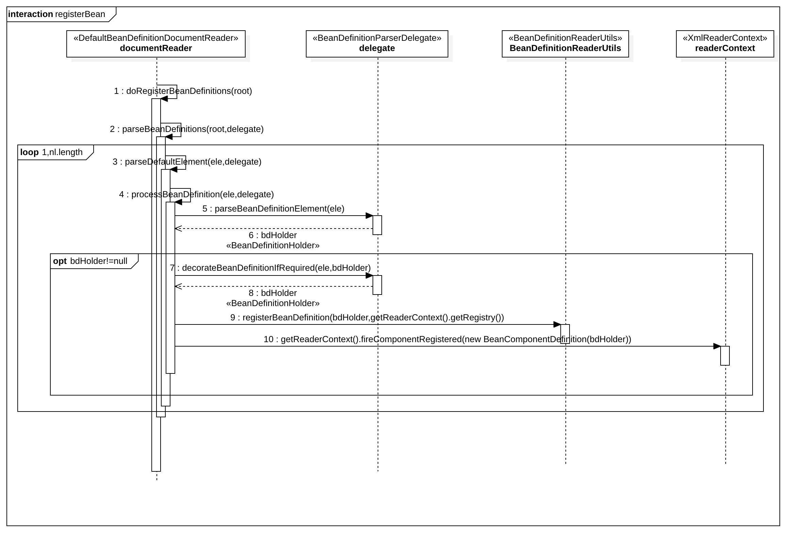

<!-- @import "[TOC]" {cmd="toc" depthFrom=1 depthTo=6 orderedList=false} -->

<!-- code_chunk_output -->

- [1 Spring容器基本实现](#1-spring容器基本实现)
  - [1.1  核心类介绍](#11-核心类介绍)
    - [1.1.1 DefaultListableBeanFactory](#111-defaultlistablebeanfactory)
    - [1.1.2 XmlBeanDefinitionReader](#112-xmlbeandefinitionreader)
  - [1.2 容器基础 BeanFactory](#12-容器基础-beanfactory)
    - [1.2.1 配置文件的封装](#121-配置文件的封装)
      - [后续做相关完善相关内容](#后续做相关完善相关内容)
    - [1.2.2 加载Bean](#122-加载bean)
  - [1.3 获取XML的验证模式](#13-获取xml的验证模式)
    - [1.3.1 DTD与XSD的区别（后续做相关知识补充）](#131-dtd与xsd的区别后续做相关知识补充)
    - [1.3.2 验证模式的读取](#132-验证模式的读取)
  - [1.4 获取Document](#14-获取document)
    - [1.4.1 EntityResolver 用法](#141-entityresolver-用法)
  - [1.5 解析及注册BeanDefinitions](#15-解析及注册beandefinitions)
    - [1.5.1 profile 属性的使用](#151-profile-属性的使用)
    - [1.5.2 解析并注册BeanDefinition](#152-解析并注册beandefinition)
  - [1.6 默认标签的解析](#16-默认标签的解析)
    - [1.6.1 bean 标签的解析及注册](#161-bean-标签的解析及注册)
    - [1.6.2 解析BeanDefinition](#162-解析beandefinition)
      - [1.6.2.1 创建用于属性承载的BeanDefinition](#1621-创建用于属性承载的beandefinition)
      - [1.6.2.2 解析各种属性](#1622-解析各种属性)
      - [1.6.2.3 解析子元素meta](#1623-解析子元素meta)
      - [1.6.2.4 解析子元素 lookup-method](#1624-解析子元素-lookup-method)
      - [1.6.2.5 解析子元素 replaced-method](#1625-解析子元素-replaced-method)
      - [1.6.2.7 解析子元素 property](#1627-解析子元素-property)

<!-- /code_chunk_output -->


# 1 Spring容器基本实现
## 1.1  核心类介绍
### 1.1.1 DefaultListableBeanFactory
&emsp;&emsp; `DefaulListableBeanFactory` 是整个bean加载的核心部分，是Spring注册及加载bean的默认实现， `DefaultListableBeanFactory` 继承了 `AbstractAutowireCapableBeanFacotry` 并实现了 `ConfigurableListableBeanFactory` 以及 `BeanDefinitionRegistry` 接口。下图是相关关系类图：


* `AliasRegistry` : 定义alias(别名)的简单增删改等操作。
*  `SimpleAliasRegistry` : 主要使用map作为alias的缓存， 并对接口 `SimpleAliasRegistry` 进行实现。
* `SingletonBeanRegistry` : 定义对单例的注册及实现。通过 `BeanFactory` 实现单例，以便统一的公开它们的单例管理功能。
* `BeanFactory` : 用于访问 spring bean 容器的跟接口，定义获取 bean 及 bean的各种属性。
* `DefaultSingletonBeanRegistry` : 针对接口 `SingletonBeanRegistry` 的实现，同时继承 `SimpleAliasRegistry`。
* `HierarchicalBeanFactory` : 继承 `BeanFactory`,也就是在 BeanFactory 定义的功能的基础上增加了对 *parentFactory* 的支持。
* `BeanDefinitionRegistry` : 继承 `AliasRegistry` ,定义对 *BeanDefinition* 的各种增删改操作。
* `FactoryBeanRegistrySupport` : 在 `DefaultSingletonBeanRegistry` 基础上增加了对 *FactoryBean* 的特殊处理。
* `ConfigurableBeanFactory` : 继承 `HierarchicalBeanFactory` 和  `SingletonBeanRegistry`, 提供配置BeanFactory方法。
* `ListableBeanFactory` : 根据各种条件获取 bean 的配置清单。
* `AbstractBeanFactory` : 抽象类， 综合 `FactoryBeanRegistrySupport` 和 `FactoryBeanRegistrySupport` 的功能
* `AutowireCapableBeanFactory` : 提供创建 bean 、自动注入、初始化以及应用bean的后处理器。
* `AbstractAutowireCapableBeanFactory` : 综合 `AbstractBeanFactory` 并对接口 `AutowireCapableBeanFactory` 进行实现
* `ConfigurableListableBeanFactory` : BeanFacotry 配置清淡，制定忽略类型及接口。
* `DefaultListableBeanFactory` : 综合上面所有功能，主要是对 bean 注册后的处理。

###1.1.2 XmlBeanDefinitionReader
&emsp;&emsp; XML配置文件的读取是Spring中重要的功能（虽然因为现在用spring-boot用得比较少），因为Spring大部分的功能都是以配置作为切入点，那么我们可以从 `XmlBeanDefinitionReader` 中梳理一下资源文件读取、解析及注册的大致脉络，首先我们看看各个类的功能。下图为相关类关系图：

* `ResourceLoader` : 定义资源加载器，主要应用于根据给定的资源文件地址返回对应的Resource。
* `BeanDefinitionReader` : 主要定义资源文件读取并转换为BeanDefinition的各个功能。
* `EnvironmentCapable` : 定义获取Environment方法。
* `DocumentLoader` : 定义从资源文件加载到转换为Document的功能。
* `AbstractBeanDefinitionReader` : 对 EnvironmentCapable 、 BeanDefinitionReader 类定义的功能进行实现。
* `BeanDefinitionDcoumentReader` : 定义读取 Document 并注册 BeanDefinition 功能。
* `BeanDefinitionParserDelegate` : 定义解析 Element 的各种方法。
  
  
  
## 1.2 容器基础 BeanFactory
&emsp;&emsp;这里我们通过XmlBeanFactory来做主要介绍。我们通过分析以下功能的代码实现：
```java
    BeanFactory bf = new XmlBeanFactory(new ClassPathResource("beanFactoryTest.xml"));
```
### 1.2.1 配置文件的封装
####后续做相关完善相关内容
&emsp;&emsp;XmlBeanFactory的初始化过程，这里分析使用Resource实例作为构造函数参数的方法，代码如下：

    XmlBeanFactory.java

 ```java
	/**
	 * Create a new XmlBeanFactory with the given resource,
	 * which must be parsable using DOM.
	 * @param resource the XML resource to load bean definitions from
	 * @throws BeansException in case of loading or parsing errors
	 */
	public XmlBeanFactory(Resource resource) throws BeansException {
		this(resource, null);
	}

	/**
	 * Create a new XmlBeanFactory with the given input stream,
	 * which must be parsable using DOM.
	 * @param resource the XML resource to load bean definitions from
	 * @param parentBeanFactory parent bean factory
	 * @throws BeansException in case of loading or parsing errors
	 */
	public XmlBeanFactory(Resource resource, BeanFactory parentBeanFactory) throws BeansException {
		super(parentBeanFactory);
		this.reader.loadBeanDefinitions(resource);
	}
 ```
 跟踪代码到 AbstractAutowireCapableBeanFactory 构造函数当中
 ```java
 public AbstractAutowireCapableBeanFactory() {
		super();
		ignoreDependencyInterface(BeanNameAware.class);
		ignoreDependencyInterface(BeanFactoryAware.class);
		ignoreDependencyInterface(BeanClassLoaderAware.class);
	}
 ```
 构造函数中调用了几个 ignoreDependencyInterface 方法。我们再看下 ignoreDependencyInterface 方法和注释：
 ```java
 /**
	 * Ignore the given dependency interface for autowiring.
	 * <p>This will typically be used by application contexts to register
	 * dependencies that are resolved in other ways, like BeanFactory through
	 * BeanFactoryAware or ApplicationContext through ApplicationContextAware.
	 * <p>By default, only the BeanFactoryAware interface is ignored.
	 * For further types to ignore, invoke this method for each type.
	 * @see org.springframework.beans.factory.BeanFactoryAware
	 * @see org.springframework.context.ApplicationContextAware
	 */
	public void ignoreDependencyInterface(Class<?> ifc) {
		this.ignoredDependencyInterfaces.add(ifc);
	}
 ```
 该方法，用于忽略给定的自动装配依赖接口。

###1.2.2 加载Bean
&emsp;&emsp;之前提到的 XmlBeanFactory 构造函数中，调用了 XmlBeanDefinitionReader 类型的 reader 提供的方法loadBeanDefinitions(resource),而这句代码是整个资源加载的切入点，我们先来看看这个方法的时许图，如图1-1.2.2-1所示

<center>图1.2.2-1 loadBeanDefinitions 函数执行时序图</center> <br/>

&emsp;&emsp;我们一起来分析以下这里究竟在干什么？  

1.  封装资源文件。当进入 XmlBeanDefinitionReader 后，首先对参数 Resource 使用EncodedResource 类进行封装
2.  获取输入流。从 Resource 中获取对应的 InputStream 并构造 InputSource
3.  通过构造的 InputSoure 实例和 Resource 实例继续调用函数 doLoadBeanDefinitions。

我们来看下loadBeanDefinitions函数的实现过程。

 ```java
public int loadBeanDefinitions(Resource resource) throws BeanDefinitionStoreException {
    return loadBeanDefinitions(new EncodedResource(resource));
}
 ```
&emsp;&emsp; EncodeResource 的作用是什么呢？ 通过名字Encode，我们大概可以猜出是用于做相关编码的。 我们进入后看看相关代码，其主要逻辑是为了读取该资源时，将设置字符集或编码，作为输入流的编码。
 ```java
/**
    * Open a {@code java.io.Reader} for the specified resource, using the specified
    * {@link #getCharset() Charset} or {@linkplain #getEncoding() encoding}
    * (if any).
    * @throws IOException if opening the Reader failed
    * @see #requiresReader()
    * @see #getInputStream()
    */
public Reader getReader() throws IOException {
    if (this.charset != null) {
        return new InputStreamReader(this.resource.getInputStream(), this.charset);
    }
    else if (this.encoding != null) {
        return new InputStreamReader(this.resource.getInputStream(), this.encoding);
    }
    else {
        return new InputStreamReader(this.resource.getInputStream());
    }
}
 ``` 
&emsp;&emsp;上面的代码构造了一个有编码(encoding)的InpustreamReader。 当构造好encodedResource对象后，再次转入重载的服用方法loadBeanDefinitions(new EncodedResource(resource))。
&emsp;&emsp;**这个方法内部才是真正的准备数据阶段**
```java
public int loadBeanDefinitions(EncodedResource encodedResource) throws BeanDefinitionStoreException {
		Assert.notNull(encodedResource, "EncodedResource must not be null");
		if (logger.isTraceEnabled()) {
			logger.trace("Loading XML bean definitions from " + encodedResource);
		}
        //resourcesCurrentlyBeingLoaded为一个ThreadLocal<Set<EncodedResource>>,
        //用于记录当前以加载的资源
		Set<EncodedResource> currentResources = this.resourcesCurrentlyBeingLoaded.get();
		if (currentResources == null) {
			currentResources = new HashSet<>(4);
			this.resourcesCurrentlyBeingLoaded.set(currentResources);
		}
		if (!currentResources.add(encodedResource)) {
			throw new BeanDefinitionStoreException(
					"Detected cyclic loading of " + encodedResource + " - check your import definitions!");
		}
		try {
            //从encodeResource中已经封装的resource对象中获取到其中的inputStream
			InputStream inputStream = encodedResource.getResource().getInputStream();
			try {
                //InputSource是org.xml.sax下的类，用于xml相关解析操作
				InputSource inputSource = new InputSource(inputStream);
				if (encodedResource.getEncoding() != null) {
					inputSource.setEncoding(encodedResource.getEncoding());
				}
                //进入真正的加载Bean的逻辑核心阶段
				return doLoadBeanDefinitions(inputSource, encodedResource.getResource());
			}
			finally {
                //关闭输入流
				inputStream.close();
			}
		}
		catch (IOException ex) {
			throw new BeanDefinitionStoreException(
					"IOException parsing XML document from " + encodedResource.getResource(), ex);
		}
		finally {
			currentResources.remove(encodedResource);
			if (currentResources.isEmpty()) {
				this.resourcesCurrentlyBeingLoaded.remove();
			}
		}
	}
```
再次整理数据准备阶段的逻辑，首先对传入的 resource 参数做封装，目的是考虑到Resource可能存在编码要求的情况，其次，通过SAX读取Xml文件的方式来准备InputSource对象，最后将准备的数据通过参数传入**真正的核心处理部分 doLoadBeanDefinitions(inputSource, encodedResource.getResource()) ，这个方法才是真正加载 bean 的方法。**

    那么我们来具体看看 doLoadBeanDefinitions 方法

 ```java
 /**
* Actually load bean definitions from the specified XML file.
* @param inputSource the SAX InputSource to read from
* @param resource the resource descriptor for the XML file
* @return the number of bean definitions found
* @throws BeanDefinitionStoreException in case of loading or parsing errors
* @see #doLoadDocument
* @see #registerBeanDefinitions
*/
protected int doLoadBeanDefinitions(InputSource inputSource, Resource resource)
            throws BeanDefinitionStoreException {

    try {
        Document doc = doLoadDocument(inputSource, resource);
        int count = registerBeanDefinitions(doc, resource);
        if (logger.isDebugEnabled()) {
            logger.debug("Loaded " + count + " bean definitions from " + resource);
        }
        return count;
    }
    catch (BeanDefinitionStoreException ex) {
        throw ex;
    }
    catch (SAXParseException ex) {
        throw new XmlBeanDefinitionStoreException(resource.getDescription(),
                "Line " + ex.getLineNumber() + " in XML document from " + resource + " is invalid", ex);
    }
    catch (SAXException ex) {
        throw new XmlBeanDefinitionStoreException(resource.getDescription(),
                "XML document from " + resource + " is invalid", ex);
    }
    catch (ParserConfigurationException ex) {
        throw new BeanDefinitionStoreException(resource.getDescription(),
                "Parser configuration exception parsing XML from " + resource, ex);
    }
    catch (IOException ex) {
        throw new BeanDefinitionStoreException(resource.getDescription(),
                "IOException parsing XML document from " + resource, ex);
    }
    catch (Throwable ex) {
        throw new BeanDefinitionStoreException(resource.getDescription(),
                "Unexpected exception parsing XML document from " + resource, ex);
    }
}
 ```
可以看到该代码有很多异常，但实际上，只做了2件事
1. 加载XML文件，并得到对应Document。
2. 根据返回的 Document 注册 bean 信息。

而在 Spring Framework 分支 5.0.x 上, doLoadBeanDefinitions 却做在这2步之前还做了件事,获取了XML文件的验证模式, 那么 5.1.x 这个分支上,为什么去掉了?  其实没有,而是把相关方法放到了第1步 doLoadDocument 中,我们再跟进 doLoadDocument 方法中来看看。

 ```java
/**
* Actually load the specified document using the configured DocumentLoader.
* @param inputSource the SAX InputSource to read from
* @param resource the resource descriptor for the XML file
* @return the DOM Document
* @throws Exception when thrown from the DocumentLoader
* @see #setDocumentLoader
* @see DocumentLoader#loadDocument
*/
protected Document doLoadDocument(InputSource inputSource, Resource resource) throws Exception {
    return this.documentLoader.loadDocument(inputSource, getEntityResolver(), this.errorHandler,
            getValidationModeForResource(resource), isNamespaceAware());
}
 ```
 可以看到在调用 this.documentLoader.loadDocument 中，有多个参数是调用其他方法来得到的返回值 
 其中 getValidationModeForResource 就是获取XML文件的验证模式。
 
## 1.3 获取XML的验证模式
&emsp;&emsp;了解XML的都应该知道XML文件的验证模式保证了XML文件的正确性，而比较常见的验证模式有两种，DTD和XSD。 它们之间有什么区别呢？
### 1.3.1 DTD与XSD的区别（后续做相关知识补充）
	该相关资料，后续统一学习相关XML的知识。
### 1.3.2 验证模式的读取
&emsp;&emsp;了解了 DTD 与 XSD 的区别后，我们再继续分析 Spring 对验证模式的提取就更容易理解了。之前我们已经锁定了 Spring 通过 getValidationModeForResource 方法来获取对应的资源的验证模式。
 ```java
 /**
	 * Determine the validation mode for the specified {@link Resource}.
	 * If no explicit validation mode has been configured, then the validation
	 * mode gets {@link #detectValidationMode detected} from the given resource.
	 * <p>Override this method if you would like full control over the validation
	 * mode, even when something other than {@link #VALIDATION_AUTO} was set.
	 * @see #detectValidationMode
	 */
	protected int getValidationModeForResource(Resource resource) {
		//获取已经设置好的验证模式。默认值为 VALIDATION_AUTO
		int validationModeToUse = getValidationMode();
		//如果在加载过程中，手动指定了验证模式，则使用指定的验证模式
		if (validationModeToUse != VALIDATION_AUTO) {
			return validationModeToUse;
		}
		//如果未指定，则使用自动检测。
		int detectedMode = detectValidationMode(resource);
		if (detectedMode != VALIDATION_AUTO) {
			return detectedMode;
		}
		// Hmm, we didn't get a clear indication... Let's assume XSD,
		// since apparently no DTD declaration has been found up until
		// detection stopped (before finding the document's root tag).
		return VALIDATION_XSD;
	}
 ```
&emsp;&emsp;这个方法的的逻辑其实很简单，若有指定的验证模式，则使用指定的(可以通过调用XmlBeanDefinitionReader.setValidationMode 方法来设定)，否则使用自动检测的方式。自动检测的方法是通过 detectValidationMode 实现的，而 detectValidationMode 又将自动检测验证模式的工作委托给了专门处理类 XmlValidationModeDetector ，调用了 validationModeDetector.detectValidationMode(inputStream) ，具体代码如下：
 ```java
 /**
	 * Detect which kind of validation to perform on the XML file identified
	 * by the supplied {@link Resource}. If the file has a {@code DOCTYPE}
	 * definition then DTD validation is used otherwise XSD validation is assumed.
	 * <p>Override this method if you would like to customize resolution
	 * of the {@link #VALIDATION_AUTO} mode.
	 */
	protected int detectValidationMode(Resource resource) {
		if (resource.isOpen()) {
			throw new BeanDefinitionStoreException(
					"Passed-in Resource [" + resource + "] contains an open stream: " +
					"cannot determine validation mode automatically. Either pass in a Resource " +
					"that is able to create fresh streams, or explicitly specify the validationMode " +
					"on your XmlBeanDefinitionReader instance.");
		}

		InputStream inputStream;
		try {
			inputStream = resource.getInputStream();
		}
		catch (IOException ex) {
			throw new BeanDefinitionStoreException(
					"Unable to determine validation mode for [" + resource + "]: cannot open InputStream. " +
					"Did you attempt to load directly from a SAX InputSource without specifying the " +
					"validationMode on your XmlBeanDefinitionReader instance?", ex);
		}

		try {
			return this.validationModeDetector.detectValidationMode(inputStream);
		}
		catch (IOException ex) {
			throw new BeanDefinitionStoreException("Unable to determine validation mode for [" +
					resource + "]: an error occurred whilst reading from the InputStream.", ex);
		}
	}
 ```
	ValidationModeDetector.java
 ```java
 /**
	 * Detect the validation mode for the XML document in the supplied {@link InputStream}.
	 * Note that the supplied {@link InputStream} is closed by this method before returning.
	 * @param inputStream the InputStream to parse
	 * @throws IOException in case of I/O failure
	 * @see #VALIDATION_DTD
	 * @see #VALIDATION_XSD
	 */
	public int detectValidationMode(InputStream inputStream) throws IOException {
		// Peek into the file to look for DOCTYPE.
		BufferedReader reader = new BufferedReader(new InputStreamReader(inputStream));
		try {
			boolean isDtdValidated = false;
			String content;
			while ((content = reader.readLine()) != null) {
				content = consumeCommentTokens(content);
				//如果读到行是空，或者注释则略过。
				if (this.inComment || !StringUtils.hasText(content)) {
					continue;
				}
				//判断是否含有 DOCTYPE 若有则为 DTD ，否则就是 XSD
				if (hasDoctype(content)) {
					isDtdValidated = true;
					break;
				}
				if (hasOpeningTag(content)) {
					// End of meaningful data...
					break;
				}
			}
			return (isDtdValidated ? VALIDATION_DTD : VALIDATION_XSD);
		}
		catch (CharConversionException ex) {
			// Choked on some character encoding...
			// Leave the decision up to the caller.
			return VALIDATION_AUTO;
		}
		finally {
			reader.close();
		}
	}
 ```
 &emsp;&emsp;上面的代码，其实很简单，Spring 检测验证模式的办法就是判断是否包含 DOCTYPE 有则为 DTD ，否则就是 XSD。

## 1.4 获取Document
&emsp;&emsp;经过了获取、封装 XML 资源， 验证了相关模式后就可以准备 Document 的加载了，同样 XmlBeanFactoryReader 类对文档读取并没有亲历亲为， 而是委托给了 DocumentLoader 去执行， 这里的 DocumentLoader 是个接口， 而真正调用的是 DefaultDocumentLoader， 解析代码:  

      DefaultDocumentLoader

 ```java
	/**
	 * Load the {@link Document} at the supplied {@link InputSource} using the standard JAXP-configured
	 * XML parser.
	 */
	@Override
	public Document loadDocument(InputSource inputSource, EntityResolver entityResolver,
			ErrorHandler errorHandler, int validationMode, boolean namespaceAware) throws Exception {

		DocumentBuilderFactory factory = createDocumentBuilderFactory(validationMode, namespaceAware);
		if (logger.isTraceEnabled()) {
			logger.trace("Using JAXP provider [" + factory.getClass().getName() + "]");
		}
		DocumentBuilder builder = createDocumentBuilder(factory, entityResolver, errorHandler);
		return builder.parse(inputSource);
	}
 ```
 &emsp;&emsp;对于这部分代码其实主要就是SAX解析XMl文档的套路差不多，对此有兴趣的可以在网上获取更多的资料。这里需要提及一下 EntityResolve ，对于参数 entityResolver ， 传入的是通过 getEntityResolver() 函数获取的返回值， 代码如下：
  ```java
	/**
	 * Return the EntityResolver to use, building a default resolver
	 * if none specified.
	 */
	protected EntityResolver getEntityResolver() {
		if (this.entityResolver == null) {
			// Determine default EntityResolver to use.
			ResourceLoader resourceLoader = getResourceLoader();
			if (resourceLoader != null) {
				this.entityResolver = new ResourceEntityResolver(resourceLoader);
			}
			else {
				this.entityResolver = new DelegatingEntityResolver(getBeanClassLoader());
			}
		}
		return this.entityResolver;
	}
  ```
### 1.4.1 EntityResolver 用法
&emsp;&emsp;在 loadDocument 方法中涉及一个参数 EntityResolver ，何为 EntityResolver ？ 官网这样解释：如果 SAX 应用程序需要实现自定义处理外部实体，则必须实现此接口并使用 setEntityResolver 方法，向SAX驱动注册一个实例。也就是说，对于解析一个XML，SAX首先读取该XML文档上的声明，根据声明去寻找相应的DTD定义，以便对文档进行一个验证。默认的寻找规则，即通过网络（实际上就是声明 DTD 的 URI 地址）来下载相应的DTD声明，并进行验证。下载的过程是一个漫长的过程，而且当网络中断或不可用时，这里会报错，就是因为相应的DTD声明没有被找到的原因。
&emsp;&emsp;EntityResolver 的作用是项目本身就可以提供一个如何寻找DTD声明的方法，即由程序来实现寻找 DTD 声明的过程，比如我们将 DTD 文件放到项目中某处，在实现时直接将此文档读取并返回给 SAX 即可。这样就避免你了通过网络来寻找相应的声明。
&emsp;&emsp;EntityResolver 的接口方法声明：
 ```java
  public abstract InputSource resolveEntity (String publicId, String systemId) throws SAXException, IOException;
 ```
&emsp;&emsp;这里，它接受两个参数 publicId 和 systemId ，并返回一个 InputSource 对象。这里的详细解读，可以网上查查 SAX 相关代码。

## 1.5 解析及注册BeanDefinitions
&emsp;&emsp;当把文件转换为 Document 后，接下来的提取及注册 bean 就是我们的重头戏。继续上面的分析， 当程序已经拥有了 XML 的 Document 实例对象时，就会被引入下面这个方法。

    XmlBeanDefintionReader.java 

 ```java
 
	/**
	 * Register the bean definitions contained in the given DOM document.
	 * Called by {@code loadBeanDefinitions}.
	 * <p>Creates a new instance of the parser class and invokes
	 * {@code registerBeanDefinitions} on it.
	 * @param doc the DOM document
	 * @param resource the resource descriptor (for context information)
	 * @return the number of bean definitions found
	 * @throws BeanDefinitionStoreException in case of parsing errors
	 * @see #loadBeanDefinitions
	 * @see #setDocumentReaderClass
	 * @see BeanDefinitionDocumentReader#registerBeanDefinitions
	 */
	public int registerBeanDefinitions(Document doc, Resource resource) throws BeanDefinitionStoreException {
		//使用DefaultBeanDefinitionDocumentReader 实例化 BeanDefinitionDocumentReader
		BeanDefinitionDocumentReader documentReader = createBeanDefinitionDocumentReader();
		// 记录统计前 BeanDefinition 的加载个数
		int countBefore = getRegistry().getBeanDefinitionCount();
		// 加载 并 注册 bean
		documentReader.registerBeanDefinitions(doc, createReaderContext(resource));
		return getRegistry().getBeanDefinitionCount() - countBefore;
	}
 ```

&emsp;&emsp; getRegistry 获取的是 BeanDefinitionRegistry 而 BeanDefinitionRegistry 又是什么时候注入到 XMlBeanDefinintionReader 中的呢？

	AbstractBeanDefinitionReader 构造函数

 ```java
	protected AbstractBeanDefinitionReader(BeanDefinitionRegistry registry) {
		Assert.notNull(registry, "BeanDefinitionRegistry must not be null");
		this.registry = registry;

		// Determine ResourceLoader to use.
		// 决定 ResourceLoader 的使用
		if (this.registry instanceof ResourceLoader) {
			this.resourceLoader = (ResourceLoader) this.registry;
		}
		else {
			this.resourceLoader = new PathMatchingResourcePatternResolver();
		}

		// Inherit Environment if possible
		// 如果可能的化，继承环境
		if (this.registry instanceof EnvironmentCapable) {
			this.environment = ((EnvironmentCapable) this.registry).getEnvironment();
		}
		else {
			this.environment = new StandardEnvironment();
		}
	}
 ```

 我们都知道 XmlBeanDefintionReader 是继承了 AbstractBeanDefinitionReader 因此在实例化 XmlBeanDefintionReader 的时候就注入了 BeanDefinitionRegistry 。 

&emsp;&emsp; createReaderContext(resource) 又是干什么的呢？我们先看下这个方法的源码。
 ```java
	/**
	 * Create the {@link XmlReaderContext} to pass over to the document reader.
	 */
	public XmlReaderContext createReaderContext(Resource resource) {
		return new XmlReaderContext(resource, this.problemReporter, this.eventListener,
				this.sourceExtractor, this, getNamespaceHandlerResolver());
	}

	/**
	 * Lazily create a default NamespaceHandlerResolver, if not set before.
	 * @see #createDefaultNamespaceHandlerResolver()
	 */
	public NamespaceHandlerResolver getNamespaceHandlerResolver() {
		if (this.namespaceHandlerResolver == null) {
			this.namespaceHandlerResolver = createDefaultNamespaceHandlerResolver();
		}
		return this.namespaceHandlerResolver;
	}
 ``` 
&emsp;&emsp;该方法创建了并返回了一个 XmlReaderContext 这个对象可以从名字上看出来，它是 Xml文件读取的上下文。我们看看其构造方法参数：
 ```java

    /**
	 * Construct a new {@code XmlReaderContext}.
	 * @param resource the XML bean definition resource
	 * @param problemReporter the problem reporter in use
	 * @param eventListener the event listener in use
	 * @param sourceExtractor the source extractor in use
	 * @param reader the XML bean definition reader in use
	 * @param namespaceHandlerResolver the XML namespace resolver
	 */
	public XmlReaderContext(
			Resource resource, ProblemReporter problemReporter,
			ReaderEventListener eventListener, SourceExtractor sourceExtractor,
			XmlBeanDefinitionReader reader, NamespaceHandlerResolver namespaceHandlerResolver) {

		super(resource, problemReporter, eventListener, sourceExtractor);
		this.reader = reader;
		this.namespaceHandlerResolver = namespaceHandlerResolver;
	}
 ```
&emsp;&emsp;可以看到其构造参数分别问:bean第一的资源，错误报告，事件监听器，资源提取器，资源读取对象，xml的命名空间解析对象。

**后续详细的解释，后面再慢慢补充**


&emsp;&emsp;我们再回头，看下 registerBeanDefinitions 这个方法，它很好的应用了面向对象中单一职责的原则，将逻辑处理委托给单一的类进行处理，而这个逻辑处理类就是 BeanDefinitionDocumentReader 。 BeanDefinitionDocumentReader 是一个接口，具体的实例化的工作是在 createBeanDefinitionDocumentReader() 中完成的，也就是说 Document 具体的逻辑处理，实际上在DefaultBeanDefinitionDocumentReader 中完成。
>单一职责的原则
>&emsp;&emsp;单一职责原则的英文名称是Single Responsibility Principle，缩写是SRP。它的定义是：就一个类而言，应该仅有一个引起它变化的原因。简单来说，一个类应该是一组相关性非常高的函数、数据的封装。
>&emsp;&emsp;就以BeanDefintionReader 与 BeanDefinitionDocumentReader 为例，在上诉的阅读过程中，我们可以发现， BeanDefinitionReader 主要处理的是 Resource ， 将资源文件封装，检验资源文件类型等等，最终将资源文件验证，并获取到 Document 对象， 然后将 Document 对象交给 BeanDefinitionDocumentReader 来处理， 相应的 Document 的解析，各种标签的解析都交给了它，由它在把一些标签的解析委托给其他相关对象。将资源文件与文档的读取区分开。   
  
我们进入 DefaultBeanDefinitionDocumentReader 的 registerBeanDefinitions 方法
 ```java
     /**
	 * This implementation parses bean definitions according to the "spring-beans" XSD
	 * (or DTD, historically).
	 * <p>Opens a DOM Document; then initializes the default settings
	 * specified at the {@code <beans/>} level; then parses the contained bean definitions.
	 */
	@Override
	public void registerBeanDefinitions(Document doc, XmlReaderContext readerContext) {
		this.readerContext = readerContext;
		doRegisterBeanDefinitions(doc.getDocumentElement());
	}
 ```
 现在我们终于找到了核心逻辑的底部 doRegisterBeanDefinitions(doc.getDocumentElement()) ；
 如果说之前一直是 XML 加载解析的准备阶段，那么 doRegisterBeanDefinitions 算是真正的开始解析，现在我们来看看解析的核心部分：
 ```java
 /**
	 * Register each bean definition within the given root {@code <beans/>} element.
	 */
	@SuppressWarnings("deprecation")  // for Environment.acceptsProfiles(String...)
	protected void doRegisterBeanDefinitions(Element root) {
		// Any nested <beans> elements will cause recursion in this method. In
		// order to propagate and preserve <beans> default-* attributes correctly,
		// keep track of the current (parent) delegate, which may be null. Create
		// the new (child) delegate with a reference to the parent for fallback purposes,
		// then ultimately reset this.delegate back to its original (parent) reference.
		// this behavior emulates a stack of delegates without actually necessitating one.
		//设置 父bean定义解析委托
		BeanDefinitionParserDelegate parent = this.delegate;
		//创建一个 bean定义解析委托
		this.delegate = createDelegate(getReaderContext(), root, parent);
		//判断默认的命名空间是否为 http://www.springframework.org/schema/beans
		if (this.delegate.isDefaultNamespace(root)) {
			//处理profile属性
			String profileSpec = root.getAttribute(PROFILE_ATTRIBUTE);
			if (StringUtils.hasText(profileSpec)) {
				String[] specifiedProfiles = StringUtils.tokenizeToStringArray(
						profileSpec, BeanDefinitionParserDelegate.MULTI_VALUE_ATTRIBUTE_DELIMITERS);
				// We cannot use Profiles.of(...) since profile expressions are not supported
				// in XML config. See SPR-12458 for details.
				if (!getReaderContext().getEnvironment().acceptsProfiles(specifiedProfiles)) {
					if (logger.isDebugEnabled()) {
						logger.debug("Skipped XML bean definition file due to specified profiles [" + profileSpec +
								"] not matching: " + getReaderContext().getResource());
					}
					return;
				}
			}
		}
		//解析前处理，留给子类实现
		preProcessXml(root);
		//解析操作
		parseBeanDefinitions(root, this.delegate);
		//解析后处理，留给子类实现
		postProcessXml(root);

		this.delegate = parent;
	}
 ```
&emsp;&emsp;通过以上代码我们可以看到整个的处理流程，首先是创建解析委托器，然后是对profile的处理，然后开始进行解析，可以当我们跟进到 preProcessXml(root) 和 postProcessXml(root) 时发现其代码都是空的，既然是空的那为什么又要写着呢？就像面向对象设计方法学常说的一句话，一个类要么是面向继承设计，要么就用final修饰。这两个方法证实为了子类而设计，如果读者了解过设计模式，可以很快地反映出这是模板方法模式，如果继承自 DefaultBeanDefinitionDocumentReader 的子类需要在 Bean 解析前后做一些处理的化，那么只需要重写这两个方法就可以了。

### 1.5.1 profile 属性的使用
&emsp;&emsp;我们注意到在注册Bean的最开始是对 PROFILE_ATTRIBUTE 属性的解析， 可能对于我们来说， profile 属性并不是很常用。 让我们先了解一下这个属性。
&emsp;&emsp;分析 profile 前我们先了解一下 profile 的用法，官方实例代码片段如下：
 ```xml
<?xml version="1.0" encoding="UTF-8"?>
<beans xmlns="http://www.springframework.org/schema/beans"
	xmlns:xsi="http://www.w3.org/2001/XMLSchema-instance"
	xsi:schemaLocation="http://www.springframework.org/schema/beans
		https://www.springframework.org/schema/beans/spring-beans-3.1.xsd">

	<beans profile="default">
		<bean id="foo" class="java.lang.String"/>
	</beans>
	<beans profile="other">
		<!-- does not contain bean 'foo' -->
	</beans>
</beans>
 ```
&emsp;&emsp;集成到 Web 环境中时，在 web.xml 中加入以下代码：
 ```xml
 <context-param>
	<param-name>Spring.profiles.active</param-name>
	<param-value>default</param-value>
 </context-param>
 ```
 &emsp;&emsp;有了这个特性我们就可以同时在配置文件中部署两套配置来适用于生产环境和开发环境，这样可以方便的进行切换开发、部署环境，最常用的就是更换不同的数据库。
 &emsp;&emsp;了解了 profile 的使用再来分析代码会清晰得多，首先程序会获取 beans 节点是否定义了 profile 属性，如果定义了则会需要到环境变量中去寻找， 所以这里首先断言 environement
 
### 1.5.2 解析并注册BeanDefinition

&emsp;&emsp;处理了 profile 后就可以进行 XML 的读取了，跟踪代码进入 parseBeanDefintions(root, this.delegate)。
 ```java
	/**
	 * Parse the elements at the root level in the document:
	 * "import", "alias", "bean".
	 * @param root the DOM root element of the document
	 */
	protected void parseBeanDefinitions(Element root, BeanDefinitionParserDelegate delegate) {
		if (delegate.isDefaultNamespace(root)) {
			NodeList nl = root.getChildNodes();
			for (int i = 0; i < nl.getLength(); i++) {
				Node node = nl.item(i);
				if (node instanceof Element) {
					Element ele = (Element) node;
					if (delegate.isDefaultNamespace(ele)) {
						parseDefaultElement(ele, delegate);
					}
					else {
						delegate.parseCustomElement(ele);
					}
				}
			}
		}
		else {
			delegate.parseCustomElement(root);
		}
	}
 ```
&emsp;&emsp;上面的代码其实还是蛮清晰的，因为在 Spring 的 XML 配置里面有两大 Bean 声明，一个是默认的，如：
 ```xml
   <bean class="test.TestBean"></bean>
 ```
&emsp;&emsp;另一种就是自定义的，如：
 ```xml
	<tx:annotation-driver/>
 ```
&emsp;&emsp;而两种方式的读取及解析差别是非常大的，如果采用 Spring 默认的配置， Spring 当然知道该怎么做， 但是如果是自定义的，那么久需要用户实现一些接口及配置爱了。对于根节点或者是子节点如果是默认命名空间的话则采用 parseDefaultElement 方法进行解析，否则使用 delegate.parseCustomElement 方法进行解析。而判断是否默认命名空间还是自定义命名空间的办法其实是使用 node.getNamespaceURI() 获取命名空间，并与 Spring 中固定的命名空间 http://www.springframework.org/schema/beans 进行对比。如果一致则认为是默认，否则就认为是自定义。 而对于默认标签解析与自定义标签解析我们将会在下面讨论。

## 1.6 默认标签的解析

&emsp;&emsp;上文中我们提到了 Spring 中的标签包括默认标签和自定义标签两种，而两种标签的用法以及解析方式存在很大的不同，这里我们将详细分析默认标签的解析过程。
&emsp;&emsp;默认标签的解析是在 parseDefaultElement 函数中进行的，函数中的功能逻辑一目了然，分别对4中不同标签(import、 alias、 bean 和 beans)做了不同的处理。
 ```java
 private void parseDefaultElement(Element ele, BeanDefinitionParserDelegate delegate) {
	 	//处理 import 标签
		if (delegate.nodeNameEquals(ele, IMPORT_ELEMENT)) {
			importBeanDefinitionResource(ele);
		}
		//处理 alias 标签
		else if (delegate.nodeNameEquals(ele, ALIAS_ELEMENT)) {
			processAliasRegistration(ele);
		}
		//处理 bean 标签
		else if (delegate.nodeNameEquals(ele, BEAN_ELEMENT)) {
			processBeanDefinition(ele, delegate);
		}
		//处理 beans 标签
		else if (delegate.nodeNameEquals(ele, NESTED_BEANS_ELEMENT)) {
			// recurse
			doRegisterBeanDefinitions(ele);
		}
	}
 ```

### 1.6.1 bean 标签的解析及注册
&emsp;&emsp;在4中标签中 bean 标签的解析最为复杂也最为重要，所以我们从此标签开始深入分析，如果能理解此标签的解析过程，其他标签的解析自然会迎刃而解。首先我们进入函数 processBeanDefinition(ele, delegate)。
 ```java
 protected void processBeanDefinition(Element ele, BeanDefinitionParserDelegate delegate) {
		BeanDefinitionHolder bdHolder = delegate.parseBeanDefinitionElement(ele);
		if (bdHolder != null) {
			bdHolder = delegate.decorateBeanDefinitionIfRequired(ele, bdHolder);
			try {
				// Register the final decorated instance.
				BeanDefinitionReaderUtils.registerBeanDefinition(bdHolder, getReaderContext().getRegistry());
			}
			catch (BeanDefinitionStoreException ex) {
				getReaderContext().error("Failed to register bean definition with name '" +
						bdHolder.getBeanName() + "'", ele, ex);
			}
			// Send registration event.
			getReaderContext().fireComponentRegistered(new BeanComponentDefinition(bdHolder));
		}
	}
 ```
&emsp;&emsp;该函数主要做的事情如下：
1. 首先委托 BeanDefinitionParserDelegate 类的 parseBeanDefinitionElement 方法进行解析，返回 BeanDefinitionHolder 类型的实例 bdHolder ，经过这个方法后， bdHolder 实例已经包含了我们配置文件中配置的各种属性了， 例如 class、 name、 id、 alias 之类的属性。
2. 当返回的 bdHolder 不为空的情况下，若存在默认标签的子节点下再有自定义属性，还需要再次对自定义标签进行解析。
3. 解析完成后，需要对解析后的 bdHolder 进行注册，同样的，注册操作委托给了 BeanDefinitionReaderUtils.registerBeanDefinition(bdHolder, getReaderContext().getRegistry()) 方法。
4. 最后发出相应事件，通知相关的监听器，这个 bean 已经加载完成。
&emsp;&emsp;配合时序图我们1-1.6.1-1再来看，可能更能理解：

<center>图1-1.6.1-1 processBeanDefinition执行序列图</center>

### 1.6.2 解析BeanDefinition
&emsp;&emsp;下面我们就针对各个操作具体分析。首先我们从元素解析及信息提取开始，也就是 delegate.parseBeanDefinitionElement(ele), 进入 BeanDefinitionDelegate 类的parseBeanDefinitionElement方法。
>BeanDefinitionDelegate
 ```java
	/**
	 * Parses the supplied {@code <bean>} element. May return {@code null}
	 * if there were errors during parse. Errors are reported to the
	 * {@link org.springframework.beans.factory.parsing.ProblemReporter}.
	 */
	@Nullable
	public BeanDefinitionHolder parseBeanDefinitionElement(Element ele) {
		return parseBeanDefinitionElement(ele, null);
	}

	/**
	 * Parses the supplied {@code <bean>} element. May return {@code null}
	 * if there were errors during parse. Errors are reported to the
	 * {@link org.springframework.beans.factory.parsing.ProblemReporter}.
	 */
	@Nullable
	public BeanDefinitionHolder parseBeanDefinitionElement(Element ele, @Nullable BeanDefinition containingBean) {
		//获取 属性id
		String id = ele.getAttribute(ID_ATTRIBUTE);
		//获取 属性name
		String nameAttr = ele.getAttribute(NAME_ATTRIBUTE);
		//分割name属性（按照,;分割）
		List<String> aliases = new ArrayList<>();
		if (StringUtils.hasLength(nameAttr)) {
			//该相关方法，可自行了解其实现和原理（涉及 java 字符，unioncode等相关知识）
			String[] nameArr = StringUtils.tokenizeToStringArray(nameAttr, MULTI_VALUE_ATTRIBUTE_DELIMITERS);
			aliases.addAll(Arrays.asList(nameArr));
		}

		//判断如果没有 id 属性 或者 并且 name 属性不为空，则将第一个name属性当做beanName处理
		String beanName = id;
		if (!StringUtils.hasText(beanName) && !aliases.isEmpty()) {
			beanName = aliases.remove(0);
			if (logger.isTraceEnabled()) {
				logger.trace("No XML 'id' specified - using '" + beanName +
						"' as bean name and " + aliases + " as aliases");
			}
		}

		if (containingBean == null) {
			checkNameUniqueness(beanName, aliases, ele);
		}

		//解析并返回 beanDefinition
		AbstractBeanDefinition beanDefinition = parseBeanDefinitionElement(ele, beanName, containingBean);
		if (beanDefinition != null) {
			//如果不存在 beanName name根据 Spring 中提供的命名规则为当前 bean 生成对应的beanName
			if (!StringUtils.hasText(beanName)) {
				try {
					//设置默认的规则
					if (containingBean != null) {
						beanName = BeanDefinitionReaderUtils.generateBeanName(
								beanDefinition, this.readerContext.getRegistry(), true);
					}
					else {
						beanName = this.readerContext.generateBeanName(beanDefinition);
						// Register an alias for the plain bean class name, if still possible,
						// if the generator returned the class name plus a suffix.
						// This is expected for Spring 1.2/2.0 backwards compatibility.
						String beanClassName = beanDefinition.getBeanClassName();
						if (beanClassName != null &&
								beanName.startsWith(beanClassName) && beanName.length() > beanClassName.length() &&
								!this.readerContext.getRegistry().isBeanNameInUse(beanClassName)) {
							aliases.add(beanClassName);
						}
					}
					if (logger.isTraceEnabled()) {
						logger.trace("Neither XML 'id' nor 'name' specified - " +
								"using generated bean name [" + beanName + "]");
					}
				}
				catch (Exception ex) {
					error(ex.getMessage(), ele);
					return null;
				}
			}
			String[] aliasesArray = StringUtils.toStringArray(aliases);
			return new BeanDefinitionHolder(beanDefinition, beanName, aliasesArray);
		}

		return null;
	}
 ```
&emsp;&emsp;以上便是对默认标签解析的全过程了。当然，对 Spring 的解析犹如洋葱剥皮一样，一层一层的进行，尽管现在只能看到对属性 id 以及 name 的解析，但是很庆幸，思路我们已经了解了。在开始对属性展开全面解析前， Spring 在外层又做了一个当前层的功能架构，在当前层完成的主要工作包括如下内容。
1. 提取元素中的 id 以及 name 属性。
2. 进一步解析其他所有属性并统一封装至 GenericBeanDefinition 类型的实例中。
3. 如果检测到 bean 没有指定 beanName， 那么使用默认规则为此 Bean 生成 beanName.
 > 默认的规则为：
 根据 className 如果有父类，则 beaName 命名为 "父类$child",如果有bean工厂，则是"bean工程&created"，然后以内部类区分命名：
 1.不是内部类时， 然后检查 BeanDefinitionRegister 中是否存在相同的 beanName 的数量 counter，当只存在不存在的时候 counter = 0 ，最终命名为 beanName+"#counter"
 2.如果是内部类，则 beanName + “#” + 以十六进制表示的 beanDefinition 的 hashCode。
4. 将获取到的信息封装到 BeanDefinitionHolder 实例中。  
  
&emsp;&emsp;我们再进一步分析一下步骤2中对标签其他属性的解析过程。
 ```java
 /**
	 * Parse the bean definition itself, without regard to name or aliases. May return
	 * {@code null} if problems occurred during the parsing of the bean definition.
	 */
	@Nullable
	public AbstractBeanDefinition parseBeanDefinitionElement(
			Element ele, String beanName, @Nullable BeanDefinition containingBean) {

		this.parseState.push(new BeanEntry(beanName));

		String className = null;
		//解析 class 属性
		if (ele.hasAttribute(CLASS_ATTRIBUTE)) {
			className = ele.getAttribute(CLASS_ATTRIBUTE).trim();
		}
		//解析 parent 属性
		String parent = null;
		if (ele.hasAttribute(PARENT_ATTRIBUTE)) {
			parent = ele.getAttribute(PARENT_ATTRIBUTE);
		}

		try {
			//创建用于承载属性的 AbstractBeanDefinition 类型的 GenericBeanDefinition
			AbstractBeanDefinition bd = createBeanDefinition(className, parent);

			//硬编码解析默认的 bean 的各种属性
			parseBeanDefinitionAttributes(ele, beanName, containingBean, bd);
			//提取description
			bd.setDescription(DomUtils.getChildElementValueByTagName(ele, DESCRIPTION_ELEMENT));

			//解析元数据
			parseMetaElements(ele, bd);
			//解析 lookup-method 属性
			parseLookupOverrideSubElements(ele, bd.getMethodOverrides());
			//解析 replaced-method 属性
			parseReplacedMethodSubElements(ele, bd.getMethodOverrides());

			//解析构造函数参数
			parseConstructorArgElements(ele, bd);
			//解析 property 子元素
			parsePropertyElements(ele, bd);
			//解析 qualifier 子元素
			parseQualifierElements(ele, bd);

			bd.setResource(this.readerContext.getResource());
			bd.setSource(extractSource(ele));

			return bd;
		}
		catch (ClassNotFoundException ex) {
			error("Bean class [" + className + "] not found", ele, ex);
		}
		catch (NoClassDefFoundError err) {
			error("Class that bean class [" + className + "] depends on not found", ele, err);
		}
		catch (Throwable ex) {
			error("Unexpected failure during bean definition parsing", ele, ex);
		}
		finally {
			this.parseState.pop();
		}

		return null;
	}
 ``` 
&emsp;&emsp;终于我们看到了所有的 bean 标签属性解析，后面我们将进一步继续一些复杂的标签属性解析。

#### 1.6.2.1 创建用于属性承载的BeanDefinition
&emsp;&emsp; BeanDefinition 是一个接口，在 Spring 中存在三种实现： RootBeanDefinition 、 ChildBeanDefinition 以及 GenericBeanDefinition 。 三种实现均继承了 AbstractBeanDefinition ，其中 BeanDefinition 是配置文件 \<bean> 标签元素在容器中的内部表示形式。 \<bean> 元素标签拥有 class 、 scope 、 lazy-init 等配置属性， BeanDefinition 则提供了相应的 beanClass 、 scope 、 lazyInit 属性， BeanDefinition 和 \<bean> 中的属性是一一对应的。其中 RootBeanDefinition 是最常用的实现类， 它对应一般性质的\<bean>元素标签， GenericBeanDefinition 是自2.5版本以后新加入的bean文件配置属性定义类，是一站式服务类。
&emsp;&emsp;在配置文件中可以定义父\<bean>和子\<bean>，父\<bean>用 RootBeanDefinition 表示，而子\<bean>用 ChildBeanDefinition 表示，而没有父、<bean>的\<bean>就使用 RootBeanDefinition 表示。 AbstractBeanDefinition 对两则共同的类信息进行抽象。
&emsp;&emsp; Spring 通过BeanDefinition 将配置文件中的\<bean>配置信息转换为容器的内部表示，并将这些 BeanDefinition 注册到 BeanDefinitionRegistry 中。 Spring 容器的 BeanDefinitionRegistry 就像是 Spring 配置信息的内存数据库， 主要以 map 的形式保存，后续操作直接从 BeanDefinitionRegistry 中读取配置信息。它们之间的关系如果图1-1.6.2.1-1所示。

<center>图1-1.6.2.1-1 BeanDefinition及其实现类</center>
&emsp;&emsp;由此可知，要解析属性首先要创建用于承载属性的实例，也就是创建 GenericBeanDefinition 类型的实例。而代码 createBeanDefinition(className, parent)的左右就是实现此功能。

 ```java
	protected AbstractBeanDefinition createBeanDefinition(@Nullable String className, @Nullable String parentName)
			throws ClassNotFoundException {

		return BeanDefinitionReaderUtils.createBeanDefinition(
				parentName, className, this.readerContext.getBeanClassLoader());
	}
 ```
>BeanDefinitionReaderUtils
 ```java
 public static AbstractBeanDefinition createBeanDefinition(
			@Nullable String parentName, @Nullable String className, @Nullable ClassLoader classLoader) throws ClassNotFoundException {

		GenericBeanDefinition bd = new GenericBeanDefinition();
		//parentName 可能为空
		bd.setParentName(parentName);
		if (className != null) {
			if (classLoader != null) {
				//如果 classLoader 不为空，则使用传入的 classLoader 同一虚拟机加载类的对象，
				//否则只记录className
				bd.setBeanClass(ClassUtils.forName(className, classLoader));
			}
			else {
				bd.setBeanClassName(className);
			}
		}
		return bd;
	}
 ```
#### 1.6.2.2 解析各种属性
&emsp;&emsp;当我们创建了 bean 信息的承载实例后，便可以进行 bean 信息的各种属性解析了，首先我们进入 parseBeanDefinitionAttributes 方法。 parseBeanDefinitionAttributes 方法是对 element 所有元素属性进行解析：
 ```java
 public AbstractBeanDefinition parseBeanDefinitionAttributes(Element ele, String beanName,
			@Nullable BeanDefinition containingBean, AbstractBeanDefinition bd) {

		//解析 singleton 在 1.x 后 使用 scope 
		if (ele.hasAttribute(SINGLETON_ATTRIBUTE)) {
			error("Old 1.x 'singleton' attribute in use - upgrade to 'scope' declaration", ele);
		}
		//解析 scope 属性
		else if (ele.hasAttribute(SCOPE_ATTRIBUTE)) {
			bd.setScope(ele.getAttribute(SCOPE_ATTRIBUTE));
		}
		//在嵌入 beanDefinition 情况下且没有单独制定 scope 属性，则使用父类默认的属性
		else if (containingBean != null) {
			// Take default from containing bean in case of an inner bean definition.
			bd.setScope(containingBean.getScope());
		}
		//解析 abstract 属性
		if (ele.hasAttribute(ABSTRACT_ATTRIBUTE)) {
			bd.setAbstract(TRUE_VALUE.equals(ele.getAttribute(ABSTRACT_ATTRIBUTE)));
		}

		//解析 lazy-init 属性
		String lazyInit = ele.getAttribute(LAZY_INIT_ATTRIBUTE);
		if (isDefaultValue(lazyInit)) {
			lazyInit = this.defaults.getLazyInit();
		}
		//没有设置或设置成其他字符都会被设置成 false
		bd.setLazyInit(TRUE_VALUE.equals(lazyInit));

		//解析 autowire 属性
		String autowire = ele.getAttribute(AUTOWIRE_ATTRIBUTE);
		bd.setAutowireMode(getAutowireMode(autowire));

		//解析 depends-on 属性
		if (ele.hasAttribute(DEPENDS_ON_ATTRIBUTE)) {
			String dependsOn = ele.getAttribute(DEPENDS_ON_ATTRIBUTE);
			bd.setDependsOn(StringUtils.tokenizeToStringArray(dependsOn, MULTI_VALUE_ATTRIBUTE_DELIMITERS));
		}

		//解析 autowire-candidate 属性
		String autowireCandidate = ele.getAttribute(AUTOWIRE_CANDIDATE_ATTRIBUTE);
		if (isDefaultValue(autowireCandidate)) {
			String candidatePattern = this.defaults.getAutowireCandidates();
			if (candidatePattern != null) {
				String[] patterns = StringUtils.commaDelimitedListToStringArray(candidatePattern);
				bd.setAutowireCandidate(PatternMatchUtils.simpleMatch(patterns, beanName));
			}
		}
		else {
			bd.setAutowireCandidate(TRUE_VALUE.equals(autowireCandidate));
		}

		//解析 primary 属性
		if (ele.hasAttribute(PRIMARY_ATTRIBUTE)) {
			bd.setPrimary(TRUE_VALUE.equals(ele.getAttribute(PRIMARY_ATTRIBUTE)));
		}

		//解析 init-method 属性
		if (ele.hasAttribute(INIT_METHOD_ATTRIBUTE)) {
			String initMethodName = ele.getAttribute(INIT_METHOD_ATTRIBUTE);
			bd.setInitMethodName(initMethodName);
		}
		else if (this.defaults.getInitMethod() != null) {
			bd.setInitMethodName(this.defaults.getInitMethod());
			bd.setEnforceInitMethod(false);
		}

		//解析 destroy-method 属性
		if (ele.hasAttribute(DESTROY_METHOD_ATTRIBUTE)) {
			String destroyMethodName = ele.getAttribute(DESTROY_METHOD_ATTRIBUTE);
			bd.setDestroyMethodName(destroyMethodName);
		}
		else if (this.defaults.getDestroyMethod() != null) {
			bd.setDestroyMethodName(this.defaults.getDestroyMethod());
			bd.setEnforceDestroyMethod(false);
		}

		//解析 factory-method 属性
		if (ele.hasAttribute(FACTORY_METHOD_ATTRIBUTE)) {
			bd.setFactoryMethodName(ele.getAttribute(FACTORY_METHOD_ATTRIBUTE));
		}
		//解析 factory-bean 属性
		if (ele.hasAttribute(FACTORY_BEAN_ATTRIBUTE)) {
			bd.setFactoryBeanName(ele.getAttribute(FACTORY_BEAN_ATTRIBUTE));
		}

		return bd;
	}
 ```
&emsp;&emsp;我们可以清楚地看到 Spring 完成了对所有 bean 属性的解析，这些属性中有很多事我们经常使用的，同时我相信也一定会有或多或少的属性是不熟悉或者没有使用过的，有兴趣的可以查阅相关资料了解每个属性。
#### 1.6.2.3 解析子元素meta
&emsp;&emsp;在解析元数据的分析前，我们先回顾一下元数据 meta 属性的使用。
 ```xml
 <bean id="myTestBean" class="bean.MyTestBean">
	<meta key="testStr" value="aaaa"/>
 </bean>
 ```
&emsp;&emsp;对 meta 属性的解析代码如下：
 ```java
 public void parseMetaElements(Element ele, BeanMetadataAttributeAccessor attributeAccessor) {
	    //获取所有子节点
		NodeList nl = ele.getChildNodes();
		for (int i = 0; i < nl.getLength(); i++) {
			Node node = nl.item(i);
			//提取meta
			if (isCandidateElement(node) && nodeNameEquals(node, META_ELEMENT)) {
				Element metaElement = (Element) node;
				String key = metaElement.getAttribute(KEY_ATTRIBUTE);
				String value = metaElement.getAttribute(VALUE_ATTRIBUTE);
				//使用 key、value 构造 BeanMetadataAttribute
				BeanMetadataAttribute attribute = new BeanMetadataAttribute(key, value);
				attribute.setSource(extractSource(metaElement));
				//记录信息
				attributeAccessor.addMetadataAttribute(attribute);
			}
		}
	}
 ```
#### 1.6.2.4 解析子元素 lookup-method
&emsp;&emsp;同样，子元素 lookup-method 视乎并不是很常用，但是在某些时候它的确是非常有用的属性，通常我们称它为获取器注入。引用 Spring in Action 中的一句话：获取器注入是一种特殊的方法注入，它是把一个方法声明为返回某种类型的 bean ，但实际要返回的 bean 是在配置文件里面配置的， 此方法可用在设计有些可插拔的功能上，解除程序以来。我们看看具体的应用。
我们以 Spring 单元测试的例子来看下。
1. 首先我们看下一下单利测试类
 ```java
	public class LookupMethodTests {

	private DefaultListableBeanFactory beanFactory;

	//初始化 beanFactory
	@Before
	public void setUp() {
		beanFactory = new DefaultListableBeanFactory();
		XmlBeanDefinitionReader reader = new XmlBeanDefinitionReader(beanFactory);
		reader.loadBeanDefinitions(new ClassPathResource("lookupMethodTests.xml", getClass()));
	}

	//获取 abstractBean 执行 get 方法，对比获取到的对象是否是TestBean.class;
	@Test
	public void testWithoutConstructorArg() {
		AbstractBean bean = (AbstractBean) beanFactory.getBean("abstractBean");
		assertNotNull(bean);
		Object expected = bean.get();
		assertEquals(TestBean.class, expected.getClass());
	}

	//执行带参数的方法。
	@Test
	public void testWithOverloadedArg() {
		AbstractBean bean = (AbstractBean) beanFactory.getBean("abstractBean");
		assertNotNull(bean);
		TestBean expected = bean.get("haha");
		assertEquals(TestBean.class, expected.getClass());
		assertEquals("haha", expected.getName());
	}

	@Test
	public void testWithOneConstructorArg() {
		AbstractBean bean = (AbstractBean) beanFactory.getBean("abstractBean");
		assertNotNull(bean);
		TestBean expected = bean.getOneArgument("haha");
		assertEquals(TestBean.class, expected.getClass());
		assertEquals("haha", expected.getName());
	}

	@Test
	public void testWithTwoConstructorArg() {
		AbstractBean bean = (AbstractBean) beanFactory.getBean("abstractBean");
		assertNotNull(bean);
		TestBean expected = bean.getTwoArguments("haha", 72);
		assertEquals(TestBean.class, expected.getClass());
		assertEquals("haha", expected.getName());
		assertEquals(72, expected.getAge());
	}

	@Test
	public void testWithThreeArgsShouldFail() {
		AbstractBean bean = (AbstractBean) beanFactory.getBean("abstractBean");
		assertNotNull(bean);
		try {
			bean.getThreeArguments("name", 1, 2);
			fail("TestBean does not have a three arg constructor so this should not have worked");
		}
		catch (AbstractMethodError ex) {
		}
	}

	@Test
	public void testWithOverriddenLookupMethod() {
		AbstractBean bean = (AbstractBean) beanFactory.getBean("extendedBean");
		assertNotNull(bean);
		TestBean expected = bean.getOneArgument("haha");
		assertEquals(TestBean.class, expected.getClass());
		assertEquals("haha", expected.getName());
		assertTrue(expected.isJedi());
	}

	// 定义一个抽象的类，并创建调用方法。
	public static abstract class AbstractBean {

		public abstract TestBean get();

		public abstract TestBean get(String name);  // overloaded

		public abstract TestBean getOneArgument(String name);

		public abstract TestBean getTwoArguments(String name, int age);

		public abstract TestBean getThreeArguments(String name, int age, int anotherArg);
	}

}
 ```
 
 &emsp;&emsp;上面的单元测试，我们可以看到有多个，这里就简单的说明一下第一个单元测试方法即可。如果对 lookup-mehod 相关更深入的了解，请再去查阅相关资料。

&emsp;&emsp;单元测试 执行结果 testWithoutConstructorArg 通过，整个测试方法就完成了，那么这里的一个疑问就是 AbstractBean 是一个抽象类，它是如何被实现的呢，怎么可以直接调用？答案就是 Spring 为我们提供的获取器中，我们来看看是怎么配置的。
 ```xml
 <?xml version="1.0" encoding="UTF-8"?>
<beans xmlns="http://www.springframework.org/schema/beans"
	xmlns:xsi="http://www.w3.org/2001/XMLSchema-instance"
	xsi:schemaLocation="http://www.springframework.org/schema/beans https://www.springframework.org/schema/beans/spring-beans-4.1.xsd">

	<bean id="abstractBean" class="org.springframework.beans.factory.support.LookupMethodTests$AbstractBean">
		<!-- 等同于 <looup-method name="get" bean="testBean"/> -->
		<lookup-method name="get"/>  <!-- applying to overloaded methods, and based on return type since no bean name is given -->
		<lookup-method name="getOneArgument" bean="testBean"/>
		<lookup-method name="getTwoArguments" bean="testBean"/>
	</bean>

	<bean id="extendedBean" parent="abstractBean">
		<lookup-method name="getOneArgument" bean="jedi"/>
	</bean>

	<bean id="testBean" class="org.springframework.tests.sample.beans.TestBean" scope="prototype"/>

	<bean id="jedi" class="org.springframework.tests.sample.beans.TestBean" scope="prototype" autowire-candidate="false">
		<property name="jedi" value="true"/>
	</bean>

</beans>
 ```
&emsp;&emsp;在配置文件中，我们可以看到 lookup-method 子元素，这个配置动态的将 testBean 作为 get 的返回值，运行测试方法。其中我们可以看到我们这里并没有指定 bean 属性，这里 spring 会自动给我们配置，这里的规则，后续我们再来看看。
>根据测试，我们将 testBean , jedi 这两个 bean 的 scope 属性改为 singleton 时:
>1. get 方法获取到的bean 和 我们定义个 testBean 是相同的。
>1. 如果我们将 testBean 去掉，那么 get 方法获取到的 bean 和 jedi 定义个这个bean 是相同的。

&emsp;&emsp;那么根据这个特性，我们就可以做一些相关的插拔功能了。如定义一个接口，相关的实现，我们就可以通过 lookup-method 来做替换。
&emsp;&emsp; 至此，我们已经初步了解了 lookup-method 标签的基本用法，相信这时再去看她的属性提取源码会觉得更有针对性。
 ```java
 /**
	 * Parse lookup-override sub-elements of the given bean element.
	 */
	public void parseLookupOverrideSubElements(Element beanEle, MethodOverrides overrides) {
		NodeList nl = beanEle.getChildNodes();
		for (int i = 0; i < nl.getLength(); i++) {
			Node node = nl.item(i);
			//仅当是 spring 默认的 bean 子元素下（及xml的命名空间，xmlns） 且为 lookup-method  标签时有效
			if (isCandidateElement(node) && nodeNameEquals(node, LOOKUP_METHOD_ELEMENT)) {
				Element ele = (Element) node;
				//获取 lookup-method 的name 及需要修饰的方法名称
				String methodName = ele.getAttribute(NAME_ATTRIBUTE);
				//获取配置返回的bean
				String beanRef = ele.getAttribute(BEAN_ELEMENT);
				LookupOverride override = new LookupOverride(methodName, beanRef);
				override.setSource(extractSource(ele));
				overrides.addOverride(override);
			}
		}
	}
 ```
&emsp;&emsp;可以看到的是这段代码和 parseMetaElements 的代码大同小异，最大的区别就是在if判断这里改为了 LOOKUP_METHOD_ELEMENT。还有，在数据的存储上使用了 LookUpOverride 类型来记录并记录在 AbstractBeanDefinition 的 MethodOverrides 属性中。

#### 1.6.2.5 解析子元素 replaced-method
&emsp;&emsp;这个方法主要是对 bean 中 replaced-method 子元素的提取，在开始提取分析之前我们还是预先介绍下这个元素的用法。
&emsp;&emsp;方法替换：可以在运行时使用新的方法替换现在的方法。在之前的 look-up 不同的是， replaced-method 不但可以动态地替换返回实体 bean ，而且还能动态地更改原有方法的逻辑。我们来看看使用示例。
1. 在 changeMe 中完成某个业务逻辑。
 ```java
 public class TestChangeMethod{
	 
	 public void changeMe(){
		 System.out.println("changeMe");
	 }
 }
 ```
2. 在运营一段时间后需要改变原有的业务逻辑。
 ```java
 public class TestMethodReplacer implements MethodReplacer{

	 @Override
	 public Object reimplement(Object obj, Method method, Object[] args) throws Throwable {
		 System.out.println("我替换了原有的方法");
		 return null;
	 }
 }
 ```
3. 使替换后的类婶那生效。
 ```xml
 <?xml version="1.0" encoding="UTF-8"?>
<beans xmlns="http://www.springframework.org/schema/beans"
	xmlns:xsi="http://www.w3.org/2001/XMLSchema-instance"
	xsi:schemaLocation="http://www.springframework.org/schema/beans https://www.springframework.org/schema/beans/spring-beans-4.1.xsd">


	<bean id="testChangeMethod" class="test.replacemethod.TestChangeMethod">
		<replaced-method name="changeMe" replacer="replacer" />
	</bean>

	<bean id="replacer" class="test.replacemethod.TestMethodReplacer"/>
 ```
4. 测试。
 ```java
 public static void main(String[] args) {
	 ApplicationContext bf = new ClassPathXmlApplicationContext("test/replacemethod/replaceMethodTest.xml");
	 TestChangeMethod = (TestChangeMethod) bf.getBean("testChangeMethod");
	 test.changeMe();
 }
 ```
&emsp;&emsp;好了，运行测试类就可以看到预期的结果了，控制台成功打印出“我替换了原有的方法”，也就是说我们做到了动态替换原有方法，知道了这个元素的用法，我们再来看元素的提取过程：
 ```java
	public void parseReplacedMethodSubElements(Element beanEle, MethodOverrides overrides) {
		NodeList nl = beanEle.getChildNodes();
		for (int i = 0; i < nl.getLength(); i++) {
			Node node = nl.item(i);
			//仅在 spring 默认标签下 且是 replaced-method 标签时有效
			if (isCandidateElement(node) && nodeNameEquals(node, REPLACED_METHOD_ELEMENT)) {
				Element replacedMethodEle = (Element) node;
				//提取 被替换的 旧方法
				String name = replacedMethodEle.getAttribute(NAME_ATTRIBUTE);
				//提取对应的 替换 新方法
				String callback = replacedMethodEle.getAttribute(REPLACER_ATTRIBUTE);
				ReplaceOverride replaceOverride = new ReplaceOverride(name, callback);
				// Look for arg-type match elements.
				List<Element> argTypeEles = DomUtils.getChildElementsByTagName(replacedMethodEle, ARG_TYPE_ELEMENT);
				for (Element argTypeEle : argTypeEles) {
					//记录参数
					String match = argTypeEle.getAttribute(ARG_TYPE_MATCH_ATTRIBUTE);
					match = (StringUtils.hasText(match) ? match : DomUtils.getTextValue(argTypeEle));
					if (StringUtils.hasText(match)) {
						replaceOverride.addTypeIdentifier(match);
					}
				}
				replaceOverride.setSource(extractSource(replacedMethodEle));
				overrides.addOverride(replaceOverride);
			}
		}
	}
 ```
&emsp;&emsp;我们可以看到无论是 lookup-method 还是 replaced-method 都是构造了一个 MethodOverrides， 区别在于 lookup-method 向 MethodOverrides 的 override 属性 添加的是一个 LookUpOverride ，而 replaced-method 添加的是一个 ReplaceOverride， LookUpOverride 和ReplaceOverride 都继承 MethodOverride 。  并最终记录在 AbstractBeanDefinition 中的 methodOverrides 属性中。 而这个属性如何使用以及完成它所提供的功能后续再详细介绍。

#### 1.6.2.6 解析子元素 constructor-arg
&emsp;&emsp;对构造函数的解析是非常有用的，同时也是非常复杂的，也相信大家对构造函数的配置都不陌生，举个简单的小例子：
 ```xml
 <beans>
	<bean id="helloBean" class="com.HelloBean">
		<constructor-arg index="0">
			<value>李</value>
		</constructor-arg>
		<constructor-arg index="1">
			<value>你好</value>
		</constructor-arg>
	</bean>
 </beans>
 ```
&emsp;&emsp;在上面的配置是 Spring 构造函数配置中最基础的配置，实现的功能就是对 HelloBean 自动寻找对应的构造函数，并在初始化的时候将设置的参数传递进去。那么让我们来看看具体的 XML 解析过程。
&emsp;&emsp;对于 constructor-arg 子元素的解析， Spring 是通过 parseConstructorArgElements(ele, bd) 函数来实现的，具体的代码如下：
 ```java
 public void parseConstructorArgElements(Element beanEle, BeanDefinition bd) {
		NodeList nl = beanEle.getChildNodes();
		for (int i = 0; i < nl.getLength(); i++) {
			Node node = nl.item(i);
			if (isCandidateElement(node) && nodeNameEquals(node, CONSTRUCTOR_ARG_ELEMENT)) {
				//解析 construct-arg
				parseConstructorArgElement((Element) node, bd);
			}
		}
	}
 ```
&emsp;&emsp;这个结构视乎我们可以想象得到，遍历所有的子元素，也就是提取所有的 constructor-arg，然后进行解析，但是具体的解析确保放在另一个函数 parseConstructorArgElement 中，具体代码如下：
 ```java
 public void parseConstructorArgElement(Element ele, BeanDefinition bd) {
	 	//获取 index 属性
		String indexAttr = ele.getAttribute(INDEX_ATTRIBUTE);
		//获取 type 属性
		String typeAttr = ele.getAttribute(TYPE_ATTRIBUTE);
		//获取 name 属性
		String nameAttr = ele.getAttribute(NAME_ATTRIBUTE);
		if (StringUtils.hasLength(indexAttr)) {
			try {
				int index = Integer.parseInt(indexAttr);
				if (index < 0) {
					error("'index' cannot be lower than 0", ele);
				}
				else {
					try {
						this.parseState.push(new ConstructorArgumentEntry(index));
						//解析 ele 对应的元素
						Object value = parsePropertyValue(ele, bd, null);
						ConstructorArgumentValues.ValueHolder valueHolder = new ConstructorArgumentValues.ValueHolder(value);
						if (StringUtils.hasLength(typeAttr)) {
							valueHolder.setType(typeAttr);
						}
						if (StringUtils.hasLength(nameAttr)) {
							valueHolder.setName(nameAttr);
						}
						valueHolder.setSource(extractSource(ele));
						//不允许重复指定相同下标的参数
						if (bd.getConstructorArgumentValues().hasIndexedArgumentValue(index)) {
							error("Ambiguous constructor-arg entries for index " + index, ele);
						}
						else {
							//将获取到的参数添加到 constructorArgumentValues 中
							bd.getConstructorArgumentValues().addIndexedArgumentValue(index, valueHolder);
						}
					}
					finally {
						this.parseState.pop();
					}
				}
			}
			catch (NumberFormatException ex) {
				error("Attribute 'index' of tag 'constructor-arg' must be an integer", ele);
			}
		}
		else {
			//没有 index 属性则忽略，自动寻找
			try {
				this.parseState.push(new ConstructorArgumentEntry());
				Object value = parsePropertyValue(ele, bd, null);
				ConstructorArgumentValues.ValueHolder valueHolder = new ConstructorArgumentValues.ValueHolder(value);
				if (StringUtils.hasLength(typeAttr)) {
					valueHolder.setType(typeAttr);
				}
				if (StringUtils.hasLength(nameAttr)) {
					valueHolder.setName(nameAttr);
				}
				valueHolder.setSource(extractSource(ele));
				//将获取到的参数添加到 constructorArgumentValues 中 并根据顺序自动添加index属性
				bd.getConstructorArgumentValues().addGenericArgumentValue(valueHolder);
			}
			finally {
				this.parseState.pop();
			}
		}
	}
 ```
&emsp;&emsp;我们来整理一下，代码逻辑：
* 操作步骤如下：
	1. 解析 constructor-arg 子元素
	1. 使用 ConstructorArgumentValues.ValueHolder 类型来封装解析出来的元素 （具体的参数值，引用之类）
	1. 将 type 、 name 和 index 属性一并封装到 ConstructorArgumentValues.ValueHolder 类型中，并添加至当前的 BeanDefinition 的 constructorArgumentValues 的 indexedArgumentValues 或 genericArgumentValues 属性中，区别在于：
		* 指定了 index 属性， 添加到 indexedArgumentValues 属性中。
		* 未指定 index 属性， 添加到 genericArgumentValues 属性中。

&emsp;&emsp;那么了解了整个流程后，我们舱室进一步了解解析构造函数配置中子元素的过程，进入 parsePropertyValue ：
 ```java
 	/**
	 * Get the value of a property element. May be a list etc.
	 * Also used for constructor arguments, "propertyName" being null in this case.
	 */
	@Nullable
	public Object parsePropertyValue(Element ele, BeanDefinition bd, @Nullable String propertyName) {
		String elementName = (propertyName != null ?
				"<property> element for property '" + propertyName + "'" :
				"<constructor-arg> element");

		// Should only have one child element: ref, value, list, etc.
		NodeList nl = ele.getChildNodes();
		Element subElement = null;
		for (int i = 0; i < nl.getLength(); i++) {
			Node node = nl.item(i);
			// description 和 meta 标签不处理。
			if (node instanceof Element && !nodeNameEquals(node, DESCRIPTION_ELEMENT) &&
					!nodeNameEquals(node, META_ELEMENT)) {
				// Child element is what we're looking for.
				if (subElement != null) {
					error(elementName + " must not contain more than one sub-element", ele);
				}
				else {
					subElement = (Element) node;
				}
			}
		}
		//解析 constructor-arg 上的 ref 属性
		boolean hasRefAttribute = ele.hasAttribute(REF_ATTRIBUTE);
		//解析 constructor-arg 上的 value 属性
		boolean hasValueAttribute = ele.hasAttribute(VALUE_ATTRIBUTE);
		if ((hasRefAttribute && hasValueAttribute) ||
				((hasRefAttribute || hasValueAttribute) && subElement != null)) {
			/*
			 * 在 constructor-args 上不存在
			 *   1. 同时存在 ref 属性 又有 value 属性
			 *   2. 存在 ref 属性 或者 value 属性 又有子元素
			 */
			error(elementName +
					" is only allowed to contain either 'ref' attribute OR 'value' attribute OR sub-element", ele);
		}

		if (hasRefAttribute) {
			// ref 属性的处理， 使用 RuntimeBeanReference 封装对应的 ref 名称 
			String refName = ele.getAttribute(REF_ATTRIBUTE);
			if (!StringUtils.hasText(refName)) {
				error(elementName + " contains empty 'ref' attribute", ele);
			}
			RuntimeBeanReference ref = new RuntimeBeanReference(refName);
			ref.setSource(extractSource(ele));
			return ref;
		}
		else if (hasValueAttribute) {
			// value 属性的处理， 使用 TypedStringValue 封装
			TypedStringValue valueHolder = new TypedStringValue(ele.getAttribute(VALUE_ATTRIBUTE));
			valueHolder.setSource(extractSource(ele));
			return valueHolder;
		}
		else if (subElement != null) {
			//解析子元素
			return parsePropertySubElement(subElement, bd);
		}
		else {
			// Neither child element nor "ref" or "value" attribute found.
			error(elementName + " must specify a ref or value", ele);
			return null;
		}
	}
 ```
&emsp;&emsp;从代码上来看，对构造函数中的属性元素的解析，经历了以下几个过程。
1. 忽略 description 和 meta。
2. 提取 constructor-arg 上的 ref 和 value 属性， 以便于根据规则验证正确性，其规则为在 constructor-args 上不存在以下情况。
	* 同时存在 ref 属性 又有 value 属性
	* 存在 ref 属性 或者 value 属性 又有子元素
3. ref 属性的处理。使用 RuntimeBeanReference 封装对应的 ref 名称， 如：
 ```xml
 <constructor-args ref="a"/>
 ```
4. value 属性的处理。使用 TypedStringValue 封装，如：
```xml
 <constructor-args ref="a"/>
 ```
5. 子元素的处理，如：
```xml
 <constructor-args>
	<map>
		<entry key="key" value="value" />
	</map>
 </constructor-args>
 ```
&emsp;&emsp;而对于子元素的处理，例如这里提到的在构造函数中又嵌入了子元素 map 是怎么实现的呢？ parsePropertySubElement 中实现了对各种子元素的分类处理。
 ```java
 	@Nullable
	public Object parsePropertySubElement(Element ele, @Nullable BeanDefinition bd) {
		return parsePropertySubElement(ele, bd, null);
	}
	/**
	 * Parse a value, ref or collection sub-element of a property or
	 * constructor-arg element.
	 * @param ele subelement of property element; we don't know which yet
	 * @param defaultValueType the default type (class name) for any
	 * {@code <value>} tag that might be created
	 */
	/**
	 * Parse a value, ref or collection sub-element of a property or
	 * constructor-arg element.
	 * @param ele subelement of property element; we don't know which yet
	 * @param defaultValueType the default type (class name) for any
	 * {@code <value>} tag that might be created
	 */
	@Nullable
	public Object parsePropertySubElement(Element ele, @Nullable BeanDefinition bd, @Nullable String defaultValueType) {
		if (!isDefaultNamespace(ele)) {
			return parseNestedCustomElement(ele, bd);
		}
		else if (nodeNameEquals(ele, BEAN_ELEMENT)) {
			BeanDefinitionHolder nestedBd = parseBeanDefinitionElement(ele, bd);
			if (nestedBd != null) {
				nestedBd = decorateBeanDefinitionIfRequired(ele, nestedBd, bd);
			}
			return nestedBd;
		}
		else if (nodeNameEquals(ele, REF_ELEMENT)) {
			// A generic reference to any name of any bean.
			String refName = ele.getAttribute(BEAN_REF_ATTRIBUTE);
			boolean toParent = false;
			if (!StringUtils.hasLength(refName)) {
				// A reference to the id of another bean in a parent context.
				// 解析 parent
				refName = ele.getAttribute(PARENT_REF_ATTRIBUTE);
				toParent = true;
				if (!StringUtils.hasLength(refName)) {
					error("'bean' or 'parent' is required for <ref> element", ele);
					return null;
				}
			}
			if (!StringUtils.hasText(refName)) {
				error("<ref> element contains empty target attribute", ele);
				return null;
			}
			RuntimeBeanReference ref = new RuntimeBeanReference(refName, toParent);
			ref.setSource(extractSource(ele));
			return ref;
		}
		//对 idref 子元素的解析
		else if (nodeNameEquals(ele, IDREF_ELEMENT)) {
			return parseIdRefElement(ele);
		}
		// 对 value 子元素的解析
		else if (nodeNameEquals(ele, VALUE_ELEMENT)) {
			return parseValueElement(ele, defaultValueType);
		}
		//对 null 子元素的解析
		else if (nodeNameEquals(ele, NULL_ELEMENT)) {
			// It's a distinguished null value. Let's wrap it in a TypedStringValue
			// object in order to preserve the source location.
			TypedStringValue nullHolder = new TypedStringValue(null);
			nullHolder.setSource(extractSource(ele));
			return nullHolder;
		}
		//对 array 子元素的解析
		else if (nodeNameEquals(ele, ARRAY_ELEMENT)) {
			return parseArrayElement(ele, bd);
		}
		//对 list 子元素的解析
		else if (nodeNameEquals(ele, LIST_ELEMENT)) {
			return parseListElement(ele, bd);
		}
		//对 set 子元素的解析
		else if (nodeNameEquals(ele, SET_ELEMENT)) {
			return parseSetElement(ele, bd);
		}
		//对 map 子元素的解析
		else if (nodeNameEquals(ele, MAP_ELEMENT)) {
			return parseMapElement(ele, bd);
		}
		//对 props 子元素的解析
		else if (nodeNameEquals(ele, PROPS_ELEMENT)) {
			return parsePropsElement(ele);
		}
		else {
			error("Unknown property sub-element: [" + ele.getNodeName() + "]", ele);
			return null;
		}
	}
 ```
&emsp;&emsp;上面的函数实现了所有可支持的子类的分类处理，到这里，我们已经大致理清了构造函数的解析流程，至于更深入的解析可以自己探索。

#### 1.6.2.7 解析子元素 property
&emsp;&emsp; parsePropertyElements 函数完成了对 property 属性的提取， property 使用烦那个是如下：
 ```xml

 ```