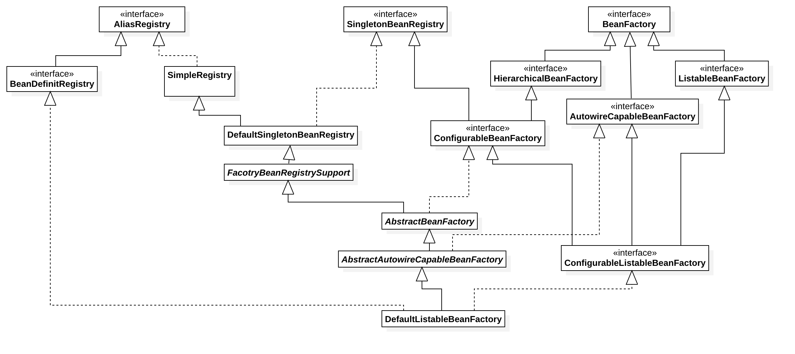

<!-- @import "[TOC]" {cmd="toc" depthFrom=1 depthTo=6 orderedList=false} -->

<!-- code_chunk_output -->

- [1 Spring容器基本实现](#1-spring容器基本实现)
  - [1.1  核心类介绍](#11-核心类介绍)
    - [1.1.1 DefaultListableBeanFactory](#111-defaultlistablebeanfactory)
    - [1.1.2 XmlBeanDefinitionReader](#112-xmlbeandefinitionreader)
  - [1.2 容器基础 BeanFactory](#12-容器基础-beanfactory)
    - [1.2.1 配置文件的封装](#121-配置文件的封装)
      - [后续做相关完善相关内容](#后续做相关完善相关内容)
    - [1.2.2 加载Bean](#122-加载bean)
  - [1.3 获取XML的验证模式](#13-获取xml的验证模式)
    - [1.3.1 DTD与XSD的区别（后续做相关知识补充）](#131-dtd与xsd的区别后续做相关知识补充)
    - [1.3.2 验证模式的读取](#132-验证模式的读取)
  - [1.4 获取Document](#14-获取document)
    - [1.4.1 EntityResolver 用法](#141-entityresolver-用法)
  - [1.5 解析及注册BeanDefinitions](#15-解析及注册beandefinitions)

<!-- /code_chunk_output -->

#1 Spring容器基本实现
##1.1  核心类介绍
###1.1.1 DefaultListableBeanFactory
&emsp;&emsp; `DefaulListableBeanFactory` 是整个bean加载的核心部分，是Spring注册及加载bean的默认实现， `DefaultListableBeanFactory` 继承了 `AbstractAutowireCapableBeanFacotry` 并实现了 `ConfigurableListableBeanFactory` 以及 `BeanDefinitionRegistry` 接口。下图是相关关系类图：


* `AliasRegistry` : 定义alias(别名)的简单增删改等操作。
*  `SimpleAliasRegistry` : 主要使用map作为alias的缓存， 并对接口 `SimpleAliasRegistry` 进行实现。
* `SingletonBeanRegistry` : 定义对单例的注册及实现。通过 `BeanFactory` 实现单例，以便统一的公开它们的单例管理功能。
* `BeanFactory` : 用于访问 spring bean容器的跟接口，定义获取 bean 及 bean的各种属性。
* `DefaultSingletonBeanRegistry` : 针对接口 `SingletonBeanRegistry` 的实现，同时继承 `SimpleAliasRegistry`。
* `HierarchicalBeanFactory` : 继承 `BeanFactory`,也就是咋BeanFactory定义的功能的基础上增加了对 *parentFactory* 的支持。
* `BeanDefinitionRegistry` : 继承 `AliasRegistry` ,定义对 *BeanDefinition* 的各种增删改操作。
* `FactoryBeanRegistrySupport` : 在 `DefaultSingletonBeanRegistry` 基础上增加了对 *FactoryBean* 的特殊处理。
* `ConfigurableBeanFactory` : 继承 `HierarchicalBeanFactory` 和  `SingletonBeanRegistry`, 提供配置BeanFactory方法。
* `ListableBeanFactory` : 根据各种条件获取 bean 的配置清单。
* `AbstractBeanFactory` : 抽象类， 综合 `FactoryBeanRegistrySupport` 和 `FactoryBeanRegistrySupport` 的功能
* `AutowireCapableBeanFactory` : 提供创建 bean 、自动注入、初始化以及应用bean的后处理器。
* `AbstractAutowireCapableBeanFactory` : 综合 `AbstractBeanFactory` 并对接口 `AutowireCapableBeanFactory` 进行实现
* `ConfigurableListableBeanFactory` : BeanFacotry 配置清淡，制定忽略类型及接口。
* `DefaultListableBeanFactory` : 综合上面所有功能，主要是对 bean 注册后的处理。

###1.1.2 XmlBeanDefinitionReader
&emsp;&emsp; XML配置文件的读取是Spring中重要的功能（虽然因为现在用spring-boot用得比较少），因为Spring大部分的功能都是以配置作为切入点，那么我们可以从 `XmlBeanDefinitionReader` 中梳理一下资源文件读取、解析及注册的大致脉络，首先我们看看各个类的功能。下图为相关类关系图：

* `ResourceLoader` : 定义资源加载器，主要应用于根据给定的资源文件地址返回对应的Resource。
* `BeanDefinitionReader` : 主要定义资源文件读取并转换为BeanDefinition的各个功能。
* `EnvironmentCapable` : 定义获取Environment方法。
* `DocumentLoader` : 定义从资源文件加载到转换为Document的功能。
* `AbstractBeanDefinitionReader` : 对 EnvironmentCapable 、 BeanDefinitionReader 类定义的功能进行实现。
* `BeanDefinitionDcoumentReader` : 定义读取 Document 并注册 BeanDefinition 功能。
* `BeanDefinitionParserDelegate` : 定义解析 Element 的各种方法。
  
  
  
##1.2 容器基础 BeanFactory
&emsp;&emsp;这里我们通过XmlBeanFactory来做主要介绍。我们通过分析以下功能的代码实现：
```java
    BeanFactory bf = new XmlBeanFactory(new ClassPathResource("beanFactoryTest.xml"));
```
###1.2.1 配置文件的封装
####后续做相关完善相关内容
&emsp;&emsp;XmlBeanFactory的初始化过程，这里分析使用Resource实例作为构造函数参数的方法，代码如下：

    XmlBeanFactory.java

 ```java
	/**
	 * Create a new XmlBeanFactory with the given resource,
	 * which must be parsable using DOM.
	 * @param resource the XML resource to load bean definitions from
	 * @throws BeansException in case of loading or parsing errors
	 */
	public XmlBeanFactory(Resource resource) throws BeansException {
		this(resource, null);
	}

	/**
	 * Create a new XmlBeanFactory with the given input stream,
	 * which must be parsable using DOM.
	 * @param resource the XML resource to load bean definitions from
	 * @param parentBeanFactory parent bean factory
	 * @throws BeansException in case of loading or parsing errors
	 */
	public XmlBeanFactory(Resource resource, BeanFactory parentBeanFactory) throws BeansException {
		super(parentBeanFactory);
		this.reader.loadBeanDefinitions(resource);
	}
 ```
 跟踪代码到 AbstractAutowireCapableBeanFactory 构造函数当中
 ```java
 public AbstractAutowireCapableBeanFactory() {
		super();
		ignoreDependencyInterface(BeanNameAware.class);
		ignoreDependencyInterface(BeanFactoryAware.class);
		ignoreDependencyInterface(BeanClassLoaderAware.class);
	}
 ```
 构造函数中调用了几个 ignoreDependencyInterface 方法。我们再看下 ignoreDependencyInterface 方法和注释：
 ```java
 /**
	 * Ignore the given dependency interface for autowiring.
	 * <p>This will typically be used by application contexts to register
	 * dependencies that are resolved in other ways, like BeanFactory through
	 * BeanFactoryAware or ApplicationContext through ApplicationContextAware.
	 * <p>By default, only the BeanFactoryAware interface is ignored.
	 * For further types to ignore, invoke this method for each type.
	 * @see org.springframework.beans.factory.BeanFactoryAware
	 * @see org.springframework.context.ApplicationContextAware
	 */
	public void ignoreDependencyInterface(Class<?> ifc) {
		this.ignoredDependencyInterfaces.add(ifc);
	}
 ```
 该方法，用于忽略给定的自动装配依赖接口。

###1.2.2 加载Bean
&emsp;&emsp;之前提到的 XmlBeanFactory 构造函数中，调用了 XmlBeanDefinitionReader 类型的 reader 提供的方法loadBeanDefinitions(resource),而这句代码是整个资源加载的切入点，我们先来看看这个方法的时许图，如图1-1.2.2-1所示

<center>图1.2.2-1 loadBeanDefinitions 函数执行时序图</center> <br/>

&emsp;&emsp;我们一起来分析以下这里究竟在干什么？  

1.  封装资源文件。当进入 XmlBeanDefinitionReader 后，首先对参数 Resource 使用EncodedResource 类进行封装
2.  获取输入流。从 Resource 中获取对应的 InputStream 并构造 InputSource
3.  通过构造的 InputSoure 实例和 Resource 实例继续调用函数 doLoadBeanDefinitions。

我们来看下loadBeanDefinitions函数的实现过程。

 ```java
public int loadBeanDefinitions(Resource resource) throws BeanDefinitionStoreException {
    return loadBeanDefinitions(new EncodedResource(resource));
}
 ```
&emsp;&emsp; EncodeResource 的作用是什么呢？ 通过名字Encode，我们大概可以猜出是用于做相关编码的。 我们进入后看看相关代码，其主要逻辑是为了读取该资源时，将设置字符集或编码，作为输入流的编码。
 ```java
/**
    * Open a {@code java.io.Reader} for the specified resource, using the specified
    * {@link #getCharset() Charset} or {@linkplain #getEncoding() encoding}
    * (if any).
    * @throws IOException if opening the Reader failed
    * @see #requiresReader()
    * @see #getInputStream()
    */
public Reader getReader() throws IOException {
    if (this.charset != null) {
        return new InputStreamReader(this.resource.getInputStream(), this.charset);
    }
    else if (this.encoding != null) {
        return new InputStreamReader(this.resource.getInputStream(), this.encoding);
    }
    else {
        return new InputStreamReader(this.resource.getInputStream());
    }
}
 ``` 
&emsp;&emsp;上面的代码构造了一个有编码(encoding)的InpustreamReader。 当构造好encodedResource对象后，再次转入重载的服用方法loadBeanDefinitions(new EncodedResource(resource))。
&emsp;&emsp;**这个方法内部才是真正的准备数据阶段**
```java
public int loadBeanDefinitions(EncodedResource encodedResource) throws BeanDefinitionStoreException {
		Assert.notNull(encodedResource, "EncodedResource must not be null");
		if (logger.isTraceEnabled()) {
			logger.trace("Loading XML bean definitions from " + encodedResource);
		}
        //resourcesCurrentlyBeingLoaded为一个ThreadLocal<Set<EncodedResource>>,
        //用于记录当前以加载的资源
		Set<EncodedResource> currentResources = this.resourcesCurrentlyBeingLoaded.get();
		if (currentResources == null) {
			currentResources = new HashSet<>(4);
			this.resourcesCurrentlyBeingLoaded.set(currentResources);
		}
		if (!currentResources.add(encodedResource)) {
			throw new BeanDefinitionStoreException(
					"Detected cyclic loading of " + encodedResource + " - check your import definitions!");
		}
		try {
            //从encodeResource中已经封装的resource对象中获取到其中的inputStream
			InputStream inputStream = encodedResource.getResource().getInputStream();
			try {
                //InputSource是org.xml.sax下的类，用于xml相关解析操作
				InputSource inputSource = new InputSource(inputStream);
				if (encodedResource.getEncoding() != null) {
					inputSource.setEncoding(encodedResource.getEncoding());
				}
                //进入真正的加载Bean的逻辑核心阶段
				return doLoadBeanDefinitions(inputSource, encodedResource.getResource());
			}
			finally {
                //关闭输入流
				inputStream.close();
			}
		}
		catch (IOException ex) {
			throw new BeanDefinitionStoreException(
					"IOException parsing XML document from " + encodedResource.getResource(), ex);
		}
		finally {
			currentResources.remove(encodedResource);
			if (currentResources.isEmpty()) {
				this.resourcesCurrentlyBeingLoaded.remove();
			}
		}
	}
```
再次整理数据准备阶段的逻辑，首先对传入的 resource 参数做封装，目的是考虑到Resource可能存在编码要求的情况，其次，通过SAX读取Xml文件的方式来准备InputSource对象，最后将准备的数据通过参数传入**真正的核心处理部分 doLoadBeanDefinitions(inputSource, encodedResource.getResource()) ，这个方法才是真正加载 bean 的方法。**

    那么我们来具体看看 doLoadBeanDefinitions 方法

 ```java
 /**
* Actually load bean definitions from the specified XML file.
* @param inputSource the SAX InputSource to read from
* @param resource the resource descriptor for the XML file
* @return the number of bean definitions found
* @throws BeanDefinitionStoreException in case of loading or parsing errors
* @see #doLoadDocument
* @see #registerBeanDefinitions
*/
protected int doLoadBeanDefinitions(InputSource inputSource, Resource resource)
            throws BeanDefinitionStoreException {

    try {
        Document doc = doLoadDocument(inputSource, resource);
        int count = registerBeanDefinitions(doc, resource);
        if (logger.isDebugEnabled()) {
            logger.debug("Loaded " + count + " bean definitions from " + resource);
        }
        return count;
    }
    catch (BeanDefinitionStoreException ex) {
        throw ex;
    }
    catch (SAXParseException ex) {
        throw new XmlBeanDefinitionStoreException(resource.getDescription(),
                "Line " + ex.getLineNumber() + " in XML document from " + resource + " is invalid", ex);
    }
    catch (SAXException ex) {
        throw new XmlBeanDefinitionStoreException(resource.getDescription(),
                "XML document from " + resource + " is invalid", ex);
    }
    catch (ParserConfigurationException ex) {
        throw new BeanDefinitionStoreException(resource.getDescription(),
                "Parser configuration exception parsing XML from " + resource, ex);
    }
    catch (IOException ex) {
        throw new BeanDefinitionStoreException(resource.getDescription(),
                "IOException parsing XML document from " + resource, ex);
    }
    catch (Throwable ex) {
        throw new BeanDefinitionStoreException(resource.getDescription(),
                "Unexpected exception parsing XML document from " + resource, ex);
    }
}
 ```
 可以看到该代码有很多异常，但实际上，只做了2件事
1. 加载XML文件，并得到对应Document。
2. 根据返回的 Document 注册 bean 信息。

而在 Spring Framework 分支 5.0.x 上, doLoadBeanDefinitions 却做在这2步之前还做了件事,获取了XML文件的验证模式, 那么 5.1.x 这个分支上,为什么去掉了?  其实没有,而是把相关方法放到了第1步 doLoadDocument 中,我们再跟进 doLoadDocument 方法中来看看。

 ```java
/**
* Actually load the specified document using the configured DocumentLoader.
* @param inputSource the SAX InputSource to read from
* @param resource the resource descriptor for the XML file
* @return the DOM Document
* @throws Exception when thrown from the DocumentLoader
* @see #setDocumentLoader
* @see DocumentLoader#loadDocument
*/
protected Document doLoadDocument(InputSource inputSource, Resource resource) throws Exception {
    return this.documentLoader.loadDocument(inputSource, getEntityResolver(), this.errorHandler,
            getValidationModeForResource(resource), isNamespaceAware());
}
 ```
 可以看到在调用 this.documentLoader.loadDocument 中，有多个参数是调用其他方法来得到的返回值 
 其中 getValidationModeForResource 就是获取XML文件的验证模式。
 
##1.3 获取XML的验证模式
&emsp;&emsp;了解XML的都应该知道XML文件的验证模式保证了XML文件的正确性，而比较常见的验证模式有两种，DTD和XSD。 它们之间有什么区别呢？
###1.3.1 DTD与XSD的区别（后续做相关知识补充）
	该相关资料，后续统一学习相关XML的知识。
###1.3.2 验证模式的读取
&emsp;&emsp;了解了 DTD 与 XSD 的区别后，我们再继续分析 Spring 对验证模式的提取就更容易理解了。之前我们已经锁定了 Spring 通过 getValidationModeForResource 方法来获取对应的资源的验证模式。
 ```java
 /**
	 * Determine the validation mode for the specified {@link Resource}.
	 * If no explicit validation mode has been configured, then the validation
	 * mode gets {@link #detectValidationMode detected} from the given resource.
	 * <p>Override this method if you would like full control over the validation
	 * mode, even when something other than {@link #VALIDATION_AUTO} was set.
	 * @see #detectValidationMode
	 */
	protected int getValidationModeForResource(Resource resource) {
		//获取已经设置好的验证模式。默认值为 VALIDATION_AUTO
		int validationModeToUse = getValidationMode();
		//如果在加载过程中，手动指定了验证模式，则使用指定的验证模式
		if (validationModeToUse != VALIDATION_AUTO) {
			return validationModeToUse;
		}
		//如果未指定，则使用自动检测。
		int detectedMode = detectValidationMode(resource);
		if (detectedMode != VALIDATION_AUTO) {
			return detectedMode;
		}
		// Hmm, we didn't get a clear indication... Let's assume XSD,
		// since apparently no DTD declaration has been found up until
		// detection stopped (before finding the document's root tag).
		return VALIDATION_XSD;
	}
 ```
&emsp;&emsp;这个方法的的逻辑其实很简单，若有指定的验证模式，则使用指定的(可以通过调用XmlBeanDefinitionReader.setValidationMode 方法来设定)，否则使用自动检测的方式。自动检测的方法是通过 detectValidationMode 实现的，而 detectValidationMode 又将自动检测验证模式的工作委托给了专门处理类 XmlValidationModeDetector ，调用了 validationModeDetector.detectValidationMode(inputStream) ，具体代码如下：
 ```java
 /**
	 * Detect which kind of validation to perform on the XML file identified
	 * by the supplied {@link Resource}. If the file has a {@code DOCTYPE}
	 * definition then DTD validation is used otherwise XSD validation is assumed.
	 * <p>Override this method if you would like to customize resolution
	 * of the {@link #VALIDATION_AUTO} mode.
	 */
	protected int detectValidationMode(Resource resource) {
		if (resource.isOpen()) {
			throw new BeanDefinitionStoreException(
					"Passed-in Resource [" + resource + "] contains an open stream: " +
					"cannot determine validation mode automatically. Either pass in a Resource " +
					"that is able to create fresh streams, or explicitly specify the validationMode " +
					"on your XmlBeanDefinitionReader instance.");
		}

		InputStream inputStream;
		try {
			inputStream = resource.getInputStream();
		}
		catch (IOException ex) {
			throw new BeanDefinitionStoreException(
					"Unable to determine validation mode for [" + resource + "]: cannot open InputStream. " +
					"Did you attempt to load directly from a SAX InputSource without specifying the " +
					"validationMode on your XmlBeanDefinitionReader instance?", ex);
		}

		try {
			return this.validationModeDetector.detectValidationMode(inputStream);
		}
		catch (IOException ex) {
			throw new BeanDefinitionStoreException("Unable to determine validation mode for [" +
					resource + "]: an error occurred whilst reading from the InputStream.", ex);
		}
	}
 ```
	ValidationModeDetector.java
 ```java
 /**
	 * Detect the validation mode for the XML document in the supplied {@link InputStream}.
	 * Note that the supplied {@link InputStream} is closed by this method before returning.
	 * @param inputStream the InputStream to parse
	 * @throws IOException in case of I/O failure
	 * @see #VALIDATION_DTD
	 * @see #VALIDATION_XSD
	 */
	public int detectValidationMode(InputStream inputStream) throws IOException {
		// Peek into the file to look for DOCTYPE.
		BufferedReader reader = new BufferedReader(new InputStreamReader(inputStream));
		try {
			boolean isDtdValidated = false;
			String content;
			while ((content = reader.readLine()) != null) {
				content = consumeCommentTokens(content);
				//如果读到行是空，或者注释则略过。
				if (this.inComment || !StringUtils.hasText(content)) {
					continue;
				}
				//判断是否含有 DOCTYPE 若有则为 DTD ，否则就是 XSD
				if (hasDoctype(content)) {
					isDtdValidated = true;
					break;
				}
				if (hasOpeningTag(content)) {
					// End of meaningful data...
					break;
				}
			}
			return (isDtdValidated ? VALIDATION_DTD : VALIDATION_XSD);
		}
		catch (CharConversionException ex) {
			// Choked on some character encoding...
			// Leave the decision up to the caller.
			return VALIDATION_AUTO;
		}
		finally {
			reader.close();
		}
	}
 ```
 &emsp;&emsp;上面的代码，其实很简单，Spring 检测验证模式的办法就是判断是否包含 DOCTYPE 有则为 DTD ，否则就是 XSD。

##1.4 获取Document
&emsp;&emsp;经过了获取、封装 XML 资源， 验证了相关模式后就可以准备 Document 的加载了，同样 XmlBeanFactoryReader 类对文档读取并没有亲历亲为， 而是委托给了 DocumentLoader 去执行， 这里的 DocumentLoader 是个接口， 而真正调用的是 DefaultDocumentLoader， 解析代码:  

      DefaultDocumentLoader

 ```java
	/**
	 * Load the {@link Document} at the supplied {@link InputSource} using the standard JAXP-configured
	 * XML parser.
	 */
	@Override
	public Document loadDocument(InputSource inputSource, EntityResolver entityResolver,
			ErrorHandler errorHandler, int validationMode, boolean namespaceAware) throws Exception {

		DocumentBuilderFactory factory = createDocumentBuilderFactory(validationMode, namespaceAware);
		if (logger.isTraceEnabled()) {
			logger.trace("Using JAXP provider [" + factory.getClass().getName() + "]");
		}
		DocumentBuilder builder = createDocumentBuilder(factory, entityResolver, errorHandler);
		return builder.parse(inputSource);
	}
 ```
 &emsp;&emsp;对于这部分代码其实主要就是SAX解析XMl文档的套路差不多，对此有兴趣的可以在网上获取更多的资料。这里需要提及一下 EntityResolve ，对于参数 entityResolver ， 传入的是通过 getEntityResolver() 函数获取的返回值， 代码如下：
  ```java
	/**
	 * Return the EntityResolver to use, building a default resolver
	 * if none specified.
	 */
	protected EntityResolver getEntityResolver() {
		if (this.entityResolver == null) {
			// Determine default EntityResolver to use.
			ResourceLoader resourceLoader = getResourceLoader();
			if (resourceLoader != null) {
				this.entityResolver = new ResourceEntityResolver(resourceLoader);
			}
			else {
				this.entityResolver = new DelegatingEntityResolver(getBeanClassLoader());
			}
		}
		return this.entityResolver;
	}
  ```
###1.4.1 EntityResolver 用法
&emsp;&emsp;在 loadDocument 方法中涉及一个参数 EntityResolver ，何为 EntityResolver ？ 官网这样解释：如果 SAX 应用程序需要实现自定义处理外部实体，则必须实现此接口并使用 setEntityResolver 方法，向SAX驱动注册一个实例。也就是说，对于解析一个XML，SAX首先读取该XML文档上的声明，根据声明去寻找相应的DTD定义，以便对文档进行一个验证。默认的寻找规则，即通过网络（实际上就是声明 DTD 的 URI 地址）来下载相应的DTD声明，并进行验证。下载的过程是一个漫长的过程，而且当网络中断或不可用时，这里会报错，就是因为相应的DTD声明没有被找到的原因。
&emsp;&emsp;EntityResolver 的作用是项目本身就可以提供一个如何寻找DTD声明的方法，即由程序来实现寻找 DTD 声明的过程，比如我们将 DTD 文件放到项目中某处，在实现时直接将此文档读取并返回给 SAX 即可。这样就避免你了通过网络来寻找相应的声明。
&emsp;&emsp;EntityResolver 的接口方法声明：
 ```java
  public abstract InputSource resolveEntity (String publicId, String systemId) throws SAXException, IOException;
 ```
&emsp;&emsp;这里，它接受两个参数 publicId 和 systemId ，并返回一个 InputSource 对象。这里的详细解读，可以网上查查 SAX 相关代码。

##1.5 解析及注册BeanDefinitions
&emsp;&emsp;当把文件转换为 Document 后，接下来的提取及注册 bean 就是我们的重头戏。继续上面的分析， 当程序已经拥有了 XML 的 Document 实例对象时，就会被引入下面这个方法。

    XmlBeanDefintionReader.java 

 ```java
 
	/**
	 * Register the bean definitions contained in the given DOM document.
	 * Called by {@code loadBeanDefinitions}.
	 * <p>Creates a new instance of the parser class and invokes
	 * {@code registerBeanDefinitions} on it.
	 * @param doc the DOM document
	 * @param resource the resource descriptor (for context information)
	 * @return the number of bean definitions found
	 * @throws BeanDefinitionStoreException in case of parsing errors
	 * @see #loadBeanDefinitions
	 * @see #setDocumentReaderClass
	 * @see BeanDefinitionDocumentReader#registerBeanDefinitions
	 */
	public int registerBeanDefinitions(Document doc, Resource resource) throws BeanDefinitionStoreException {
		//使用DefaultBeanDefinitionDocumentReader 实例化 BeanDefinitionDocumentReader
		BeanDefinitionDocumentReader documentReader = createBeanDefinitionDocumentReader();
		// 记录统计前 BeanDefinition 的加载个数
		int countBefore = getRegistry().getBeanDefinitionCount();
		// 加载 并 注册 bean
		documentReader.registerBeanDefinitions(doc, createReaderContext(resource));
		return getRegistry().getBeanDefinitionCount() - countBefore;
	}
 ```

&emsp;&emsp; getRegistry 获取的是 BeanDefinitionRegistry 而 BeanDefinitionRegistry 又是什么时候注入到 XMlBeanDefinintionReader 中的呢？

	AbstractBeanDefinitionReader 构造函数

 ```java
	protected AbstractBeanDefinitionReader(BeanDefinitionRegistry registry) {
		Assert.notNull(registry, "BeanDefinitionRegistry must not be null");
		this.registry = registry;

		// Determine ResourceLoader to use.
		// 决定 ResourceLoader 的使用
		if (this.registry instanceof ResourceLoader) {
			this.resourceLoader = (ResourceLoader) this.registry;
		}
		else {
			this.resourceLoader = new PathMatchingResourcePatternResolver();
		}

		// Inherit Environment if possible
		// 如果可能的化，继承环境
		if (this.registry instanceof EnvironmentCapable) {
			this.environment = ((EnvironmentCapable) this.registry).getEnvironment();
		}
		else {
			this.environment = new StandardEnvironment();
		}
	}
 ```

 我们都知道 XmlBeanDefintionReader 是继承了 AbstractBeanDefinitionReader 因此在实例化 XmlBeanDefintionReader 的时候就注入了 BeanDefinitionRegistry 。 

&emsp;&emsp; createReaderContext(resource) 又是干什么的呢？我们先看下这个方法的源码。
 ```java
	/**
	 * Create the {@link XmlReaderContext} to pass over to the document reader.
	 */
	public XmlReaderContext createReaderContext(Resource resource) {
		return new XmlReaderContext(resource, this.problemReporter, this.eventListener,
				this.sourceExtractor, this, getNamespaceHandlerResolver());
	}

	/**
	 * Lazily create a default NamespaceHandlerResolver, if not set before.
	 * @see #createDefaultNamespaceHandlerResolver()
	 */
	public NamespaceHandlerResolver getNamespaceHandlerResolver() {
		if (this.namespaceHandlerResolver == null) {
			this.namespaceHandlerResolver = createDefaultNamespaceHandlerResolver();
		}
		return this.namespaceHandlerResolver;
	}
 ``` 
&emsp;&emsp;该方法创建了并返回了一个 XmlReaderContext 这个对象可以从名字上看出来，它是 Xml文件读取的上下文。我们看看其构造方法参数：
 ```java

    /**
	 * Construct a new {@code XmlReaderContext}.
	 * @param resource the XML bean definition resource
	 * @param problemReporter the problem reporter in use
	 * @param eventListener the event listener in use
	 * @param sourceExtractor the source extractor in use
	 * @param reader the XML bean definition reader in use
	 * @param namespaceHandlerResolver the XML namespace resolver
	 */
	public XmlReaderContext(
			Resource resource, ProblemReporter problemReporter,
			ReaderEventListener eventListener, SourceExtractor sourceExtractor,
			XmlBeanDefinitionReader reader, NamespaceHandlerResolver namespaceHandlerResolver) {

		super(resource, problemReporter, eventListener, sourceExtractor);
		this.reader = reader;
		this.namespaceHandlerResolver = namespaceHandlerResolver;
	}
 ```
&emsp;&emsp;可以看到其构造参数分别问:bean第一的资源，错误报告，事件监听器，资源提取器，资源读取对象，xml的命名空间解析对象。
**后续详细的解释，后面再慢慢补充**


&emsp;&emsp;我们再回头，看下 registerBeanDefinitions 这个方法，它很好的应用了面向对象中单一职责的原则，将逻辑处理委托给单一的类进行处理，而这个逻辑处理类就是 BeanDefinitionDocumentReader 。 BeanDefinitionDocumentReader 是一个接口，具体的实例化的工作是在 createBeanDefinitionDocumentReader() 中完成的，也就是说 Document 具体的逻辑处理，实际上在DefaultBeanDefinitionDocumentReader 中完成。
>单一职责的原则
>&emsp;&emsp;单一职责原则的英文名称是Single Responsibility Principle，缩写是SRP。它的定义是：就一个类而言，应该仅有一个引起它变化的原因。简单来说，一个类应该是一组相关性非常高的函数、数据的封装。
>&emsp;&emsp;就以BeanDefintionReader 与 BeanDefinitionDocumentReader 为例，在上诉的阅读过程中，我们可以发现， BeanDefinitionReader 主要处理的是 Resource ， 将资源文件封装，检验资源文件类型等等，最终将资源文件验证，并获取到 Document 对象， 然后将 Document 对象交给 BeanDefinitionDocumentReader 来处理， 相应的 Document 的解析，各种标签的解析都交给了它，由它在把一些标签的解析委托给其他相关对象。将资源文件与文档的读取区分开。   
  
我们进入 DefaultBeanDefinitionDocumentReader 的 registerBeanDefinitions 方法
 ```java
     /**
	 * This implementation parses bean definitions according to the "spring-beans" XSD
	 * (or DTD, historically).
	 * <p>Opens a DOM Document; then initializes the default settings
	 * specified at the {@code <beans/>} level; then parses the contained bean definitions.
	 */
	@Override
	public void registerBeanDefinitions(Document doc, XmlReaderContext readerContext) {
		this.readerContext = readerContext;
		doRegisterBeanDefinitions(doc.getDocumentElement());
	}
 ```
 现在我们终于找到了核心逻辑的底部 doRegisterBeanDefinitions(root) ；
 如果说之前一直是 XML 加载解析的准备阶段，那么 doRegisterBeanDefinitions 算是真正的开始解析，现在我们来看看解析的核心部分：

 


