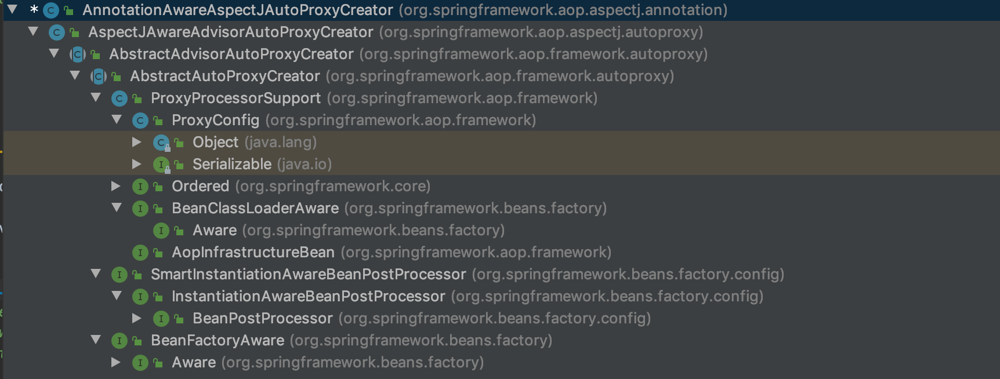

<!-- @import "[TOC]" {cmd="toc" depthFrom=1 depthTo=6 orderedList=false} -->

<!-- code_chunk_output -->

- [7 AOP](#7-aop)
  - [7.1 动态 AOP 使用示例](#71-动态-aop-使用示例)
  - [7.2 动态AOP自定义标签](#72-动态aop自定义标签)
    - [7.2.1 注册 AnnotationAwareAspectJAutoProxyCreator](#721-注册-annotationawareaspectjautoproxycreator)
      - [1.注册或升级 AnnotationAwareAspectJAutoProxyCreator](#1注册或升级-annotationawareaspectjautoproxycreator)
      - [2.处理 proxy-target-class 以及 expose-proxy 属性](#2处理-proxy-target-class-以及-expose-proxy-属性)
  - [7.3 创建 AOP 代理](#73-创建-aop-代理)
    - [7.3.1 获取增强器](#731-获取增强器)
      - [1 普通增强器的获取](#1-普通增强器的获取)
      - [2](#2)

<!-- /code_chunk_output -->

# 7 AOP
&emsp;&emsp;我们知道，面向对象变成(OOP)有一些弊端，当需要为多个不同有继承关系的对象引入同一个公共行为时，例如日志、安全监测等，我们只能在每个对象里应用公共行为，这样程序中就产生了大量的重复代码，程序就不便于维护了，所以就有了一个对面向对象编程的补充，即面向切面编程(AOP)，AOP说关注的方向是横向的，不同于OOP的纵向。
&emsp;&emsp;Spring 中提供了 AOP 的实现，但是在低版本 Spring 中定义一个切面是比较麻烦的，需要实现特定的接口，并进行写较为复杂的配置。低版本 Spring AOP 的配置是被批评最多的地方。 Spring 听取了这方面的批评声音，并下定决心彻底改变这一现状。在 Spring 2.0 中，Spring AOP 已经焕然一新，你可使用 @AspectJ 注解对 POJO 进行标注，从而定义一个包含切点信息和增强横切逻辑的切面。Spring 2.0 可以将这个切面织入到匹配的目标bean中。@AspectJ 注解使用 AspectJ 切面表达式语法进行切面定义，可以通过切点函数、运算符、通配符等高级功能进行切面定义，拥有强大的连续点描述能力。我们先来直观的浏览一下Spring中 AOP 实现。
## 7.1 动态 AOP 使用示例
1. 创建用于创建拦截的 bean
&emsp;&emsp;在实际工作中，此 bean 可能可能是满足业务需要的核心逻辑，例如test方法中可能会封装这某个核心业务，但是，如果我们想在test前后加日志来追踪调试，如果直接修改源码并不符合面向对象的设计方法，而且随意改动原有代码也会造成一定的风险，还好接下来的Spring帮我们做到了这一点。
 ```java
    public class TestBean {
        private String testStr = "testStr";

        public String getTestStr() {
            return testStr;
        }

        public void setTestStr(String testStr) {
            this.testStr = testStr;
        }

        public void test(){
            System.out.println("test");
        }
    }
 ```
2. 创建 Advisor
&emsp;&emsp;Spring 中摒弃了最原始的繁杂配置方式而采用 @AspectJ 注解对POJO进行标注，使AOP的工作大大简化，例如，在 AspectJTest 类中，我们要做的就是在所有类的test方法执行前在控制台打印 beforeTest，而在所有类的test方法执行后打印 afterTest，同时又使用环绕的方式在所有内的方法执行前后再次分别打印 before1 和 after1
 ```java
 @Aspect
    public class AspectJTest {

        @Pointcut("execution(* *.test(..))")
        public void test(){
        }

        @Before("test()")
        public void beforeTest(){
            System.out.println("beforeTest");
        }

        @After("test()")
        public void afterTest(){
            System.out.println("afterTest");
        }


        @Around("test()")
        public Object aroundTest(ProceedingJoinPoint p){
            System.out.println("before1");
            Object o = null;
            try{
                o = p.proceed();
            } catch (Throwable throwable) {
                throwable.printStackTrace();
            }
            System.out.println("after1");
            return o;
        }
    }
 ```
3. 创建配置文件
&emsp;&emsp;XML 是 Spring 的基础。尽管 Spring 一再简化配置，但无论如何，至少现在 XML 还是 Spring 的基础(Spring Boot 出来后，这句话可能就需要考量下了)。要在 Spring 中开启 AOP 功能，还需要在配置文件中做如下声明：
 ```xml
<?xml version="1.0" encoding="UTF-8"?>
<beans xmlns="http://www.springframework.org/schema/beans"
       xmlns:xsi="http://www.w3.org/2001/XMLSchema-instance"
       xmlns:aop="http://www.springframework.org/schema/aop"
       xmlns:context="http://www.springframework.org/schema/context"

       xsi:schemaLocation="http://www.springframework.org/schema/beans
                        http://www.springframework.org/schema/beans/spring-beans.xsd
                        http://www.springframework.org/schema/aop
                        http://www.springframework.org/schema/aop/spring-aop-4.3.xsd
                        http://www.springframework.org/schema/context
                        http://www.springframework.org/schema/context/spring-context-3.0.xsd">

    <aop:aspectj-autoproxy/>
    <bean id="test" class="info.tonylee.studio.spring.aop.TestBean"/>
    <bean class="info.tonylee.studio.spring.aop.AspectJTest"/>
</beans>
 ```
4. 测试
&emsp;&emsp;接下来我们就可以验证 Spring 的 AOP 为我们提供的神奇效果了。
 ```java
    public static void main(String[] args) {
        ApplicationContext bf = new ClassPathXmlApplicationContext("/META-INF/aop/test-aop.xml");
        TestBean testBean = bf.getBean(TestBean.class);
        testBean.test();
    }
 ```
不出意外，我们会看到控制台打印了如下代码:
>before1
beforeTest
test
afterTest
after1

&emsp;&emsp;Spring 实现了对所有类的test方法进行增强，使辅助功能可以独立于核心业务之外，方便与程序的扩展和解耦。
&emsp;&emsp;那么，Spring究竟是如何实现 AOP 的呢？ 首先我们知道，Spring是否支持注解的AOP是由一个配置文件控制的，也就是<aop:aspect-autoproxy />,当在配置文件中声明了这句配置的时候，Spring就会支持注解的AOP，那么我们的分析就从这句注解开始。

## 7.2 动态AOP自定义标签
&emsp;&emsp;之前讲过 Spring 中的自定义注解，如果声明了自定义的注解，那么就一定会在程序中的某个地方注册了对应的解析器。我们搜索整个代码，尝试找到注册的地方，全局搜索后我们发现了在 AopNamespaceHandler 中对应着这样一段函数：
 ```java
    @Override
	public void init() {
		// In 2.0 XSD as well as in 2.1 XSD.
		registerBeanDefinitionParser("config", new ConfigBeanDefinitionParser());
		registerBeanDefinitionParser("aspectj-autoproxy", new AspectJAutoProxyBeanDefinitionParser());
		registerBeanDefinitionDecorator("scoped-proxy", new ScopedProxyBeanDefinitionDecorator());

		// Only in 2.0 XSD: moved to context namespace as of 2.1
		registerBeanDefinitionParser("spring-configured", new SpringConfiguredBeanDefinitionParser());
	}
 ```
&emsp;&emsp;我们可以得知，在解析自定义配置的时候，一旦遇到 aspectj-autoproxy 注解时，就会使用解析器 AspectJAutoProxyBeanDefinitionParser 进行解析，那么我们来看看 AspectJAutoProxyBeanDefinitionParser 的内部实现。
### 7.2.1 注册 AnnotationAwareAspectJAutoProxyCreator
&emsp;&emsp;所有解析器，因为是对 BeanDefinitionParser 接口的统一实现，入口都是从 parse 函数开始的， AspectJAutoProxyBeanDefinitionParse 的 parse 函数如下：
 ```java
    @Override
	@Nullable
	public BeanDefinition parse(Element element, ParserContext parserContext) {
		//注册 AnnotationAwareAspectJAutoProxyCreator
		AopNamespaceUtils.registerAspectJAnnotationAutoProxyCreatorIfNecessary(parserContext, element);
		//主注解中子类的处理
		extendBeanDefinition(element, parserContext);
		return null;
	}
 ```
&emsp;&emsp;其中 registerAspectJAnnotationAutoProxyCreatorIfNecessary 函数是我们比较关心的，也是关键逻辑的实现。
 ```java
    /**
	 * 注册 AnnotationAwareAspectJAutoProxyCreator
	 * @param parserContext
	 * @param sourceElement
	 */
	public static void registerAspectJAnnotationAutoProxyCreatorIfNecessary(
			ParserContext parserContext, Element sourceElement) {

		//注册或升级 AutoProxyCreator 定义 beanName 为 org.spring.framework.aop.config.internalAutoProxyCreator 的 BeanDefinition
		BeanDefinition beanDefinition = AopConfigUtils.registerAspectJAnnotationAutoProxyCreatorIfNecessary(
				parserContext.getRegistry(), parserContext.extractSource(sourceElement));
		//对于 proxy-target-class 以及 expose-proxy 属性的处理
		useClassProxyingIfNecessary(parserContext.getRegistry(), sourceElement);
		//注册组件并通知，便于监听器做进一步处理
		registerComponentIfNecessary(beanDefinition, parserContext);
	}
 ```
 &emsp;&emsp;在 registerAspectJAnnotationAutoProxyCreatorIfNecessary 方法中主要完成了3件事情，基本上每行代码就是一个完整的逻辑。
#### 1.注册或升级 AnnotationAwareAspectJAutoProxyCreator
&emsp;&emsp;对于 AOP 的实现，基本上都是靠 AnnotationAwareAspectJAutoProxyCreator 去完成，它可以根据 @Point 注解定义的切点来自动代理相匹配的bean。但是为了配置简便，Spring 使用了自定义配置来帮助我们自动注册 AnnotationAwareAspectJAutoProxyCreator，其注册过程就是在这里实现的。
 ```java
    @Nullable
	public static BeanDefinition registerAspectJAnnotationAutoProxyCreatorIfNecessary(
			BeanDefinitionRegistry registry, @Nullable Object source) {

		return registerOrEscalateApcAsRequired(AnnotationAwareAspectJAutoProxyCreator.class, registry, source);
	}
    @Nullable
	private static BeanDefinition registerOrEscalateApcAsRequired(
			Class<?> cls, BeanDefinitionRegistry registry, @Nullable Object source) {

		Assert.notNull(registry, "BeanDefinitionRegistry must not be null");
		//如果已经存在了自动代理创建器且存在的自动代理创建器与现在的不一样，那么根据优先级来判断到底使用谁
		//AUTO_PROXY_CREATOR_BEAN_NAME = "org.springframework.aop.config.internalAutoProxyCreator"
		if (registry.containsBeanDefinition(AUTO_PROXY_CREATOR_BEAN_NAME)) {
			BeanDefinition apcDefinition = registry.getBeanDefinition(AUTO_PROXY_CREATOR_BEAN_NAME);
			if (!cls.getName().equals(apcDefinition.getBeanClassName())) {
				int currentPriority = findPriorityForClass(apcDefinition.getBeanClassName());
				int requiredPriority = findPriorityForClass(cls);
				if (currentPriority < requiredPriority) {
					//改变 bean 最重要的就是改变 bean 所对应的 className 属性
					apcDefinition.setBeanClassName(cls.getName());
				}
			}
			//如果已经存在自动代理器且与将要创建的一致，那么无须再次创建
			return null;
		}

		RootBeanDefinition beanDefinition = new RootBeanDefinition(cls);
		beanDefinition.setSource(source);
		beanDefinition.getPropertyValues().add("order", Ordered.HIGHEST_PRECEDENCE);
		beanDefinition.setRole(BeanDefinition.ROLE_INFRASTRUCTURE);
		registry.registerBeanDefinition(AUTO_PROXY_CREATOR_BEAN_NAME, beanDefinition);
		return beanDefinition;
	}
 ```
&emsp;&emsp;以上代码中实现了自动注册 AnnotationAwareAspectJAutoProxyCreator 类的功能，同时这里还涉及了一个优先级的问题，如果已经存在了自动代理创建器，而且存在的自动代理创建器与现在的不一致，那么需要根据优先级来判断到底需要使用哪个。
#### 2.处理 proxy-target-class 以及 expose-proxy 属性
&emsp;&emsp;useClassProxyingIfNecessary 实现了 proxy-target-class 属性以及 expose-proxy 属性的处理。
 ```java
    private static void useClassProxyingIfNecessary(BeanDefinitionRegistry registry, @Nullable Element sourceElement) {
		if (sourceElement != null) {
			//对于 proxy-target-class 属性的处理
			boolean proxyTargetClass = Boolean.parseBoolean(sourceElement.getAttribute(PROXY_TARGET_CLASS_ATTRIBUTE));
			if (proxyTargetClass) {
				AopConfigUtils.forceAutoProxyCreatorToUseClassProxying(registry);
			}
			// 对于 expose-proxy 属性的处理
			boolean exposeProxy = Boolean.parseBoolean(sourceElement.getAttribute(EXPOSE_PROXY_ATTRIBUTE));
			if (exposeProxy) {
				AopConfigUtils.forceAutoProxyCreatorToExposeProxy(registry);
			}
		}
	}
 ```
> AopConfigUtils
 ```java
    //强制使用的过程中其实也是一个属性设置的过程
    public static void forceAutoProxyCreatorToUseClassProxying(BeanDefinitionRegistry registry) {
		if (registry.containsBeanDefinition(AUTO_PROXY_CREATOR_BEAN_NAME)) {
			BeanDefinition definition = registry.getBeanDefinition(AUTO_PROXY_CREATOR_BEAN_NAME);
			definition.getPropertyValues().add("proxyTargetClass", Boolean.TRUE);
		}
	}
    public static void forceAutoProxyCreatorToExposeProxy(BeanDefinitionRegistry registry) {
		if (registry.containsBeanDefinition(AUTO_PROXY_CREATOR_BEAN_NAME)) {
			BeanDefinition definition = registry.getBeanDefinition(AUTO_PROXY_CREATOR_BEAN_NAME);
			definition.getPropertyValues().add("exposeProxy", Boolean.TRUE);
		}
	}
 ```
* proxy-target-class:Spring AOP 部分使用JDK动态代理或者CGLIB来为目标对象创建代理(建议尽量使用JDK动态代理)。如果被代理的目标对象实现了至少一个借口，则会使用JDK动态代理。所有该目标类型实现的接口都将被代理。若该目标对象没有实现任何接口，则创建一个CGLIB代理。如果你希望强制使用CGLIB代理(例如希望代理目标对象的所有方法，而不只是实现自接口的方法)，那也可以。但需要考虑一下两个问题。
1. 无法通知(advise)Final方法，因为它们不能被覆盖。
1. 你需要将CGLIB二进制发型包放在classpath下面。
与之相比，JDK本身就提供了动态代理，强制使用CGLIB代理需要将<aop:config>的proxy-target-class属性设置为true：
 ```xml
 <aop:config proxy-target-class="true">...</aop:config>
 ```
&emsp;&emsp;当然使用CGLIB代理啊和@AspectJ自动代理支持，可以按照一下方式设置<aop:aspectj-autoproxy>的proxy-target-class属性：
 ```xml
 <aop:aspectj-autoproxy proxy-target-class="true" />
 ```
&emsp;&emsp;而实际使用的过程中才会发现细节问题的差别，The devil is in the details。
* JDK动态代理：期待你对象必须是某个接口的实现，它是通过在运行期间创建一个接口的实现类来完成对目标对象的代理。
* CGLIB代理：实现原理类似JDK动态代理，只是它在运行期间生成的代理对象是针对目标类扩展的之类。CGLIB是高效的代码生成包，底层是依靠ASM(开源的Java字节码编辑类库)操作字节码实现的，性能比JDK强。
* expose-proxy：有时候目标对象内部的自我调用将无法实施切面中的增强，如下示例：
 ```java
 public interface AService{
     public void a();
     public void b();
 }
 @Service()
 public class AServiceImpl implements AService{
     @Transactional(propagation = Propagation.REQUIRED)
     public void a(){
         this.b();
     }
     @Transactional(propagation = Propagation.REQUIRED_NEW)
     public void b(){
     }
 }
 ```
&emsp;&emsp;此处的this指向目标对象，因此调用this.b()将不会执行b事务切面，即不会执行事务增强，因此b方法的事务定义 "@Transactional(propagation = Propagation.REQUIRED_NEW)" 将不会实施，为了解决这个问题，我们可以这样做：
 ```xml
 <aop:aspectj-autoproxy expose-proxy="true"/>
 ```
&emsp;&emsp;然后将以上代码中的 "this.b()" 修改为 "((AService)AopContext.currentProxy()).b();"即可。通过以上代码的修改便可以完成对a和b方法的同时增强。
&emsp;&emsp;最后注册组件并通知，便于监听器做进一处理。

## 7.3 创建 AOP 代理
&emsp;&emsp;之前说明了通过自定义配置完成了对 AnnotationAwareAspectJAutoProxyCreator 类型的自动注册，那么这个类到底做了什么工作来完成 AOP 的操作呢？ 首先我们看看 AnnotationAwareAspectJAutoProxyCreator 类的层次结构，如下图：

&emsp;&emsp;从类的层级中，我们看到 AnnotationAwareAspectJAutoProxyCreator 实现了 InstantiationAwareBeanPostProcessor 接口，而实现 InstantiationAwareBeanPostProcessor 后，当 Spring 加载这个 Bean 时会在实例化之前调用 postProcessBeforeInstantiation，当 这个bean初始化之前调用 postProcessAfterInitialization 方法，而我们对于 AOP 逻辑的分析也由此开始。
&emsp;&emsp;在父类 AbstractAutoProxyCreator 实现了 postProcessBeforeInstantiation 和  postProcessAfterInitialization。
 ```java
    @Override
	public Object postProcessBeforeInstantiation(Class<?> beanClass, String beanName) {
		Object cacheKey = getCacheKey(beanClass, beanName);

		if (!StringUtils.hasLength(beanName) || !this.targetSourcedBeans.contains(beanName)) {
			if (this.advisedBeans.containsKey(cacheKey)) {
				return null;
			}
			//判断bean类是否代表一个基础设施，或者配置了bean不需要自动代理
			if (isInfrastructureClass(beanClass) || shouldSkip(beanClass, beanName)) {
				this.advisedBeans.put(cacheKey, Boolean.FALSE);
				return null;
			}
		}

		// Create proxy here if we have a custom TargetSource.
		// Suppresses unnecessary default instantiation of the target bean:
		// The TargetSource will handle target instances in a custom fashion.
		// 如果我们有自定义的TargetSource ，就在这里创建代理
		// 抑制目标bean不必要的默认话实例化，TargetSource 将以自定义方式处理目标实例；
		TargetSource targetSource = getCustomTargetSource(beanClass, beanName);
		if (targetSource != null) {
			if (StringUtils.hasLength(beanName)) {
				this.targetSourcedBeans.add(beanName);
			}
			// 获取增强方法
			Object[] specificInterceptors = getAdvicesAndAdvisorsForBean(beanClass, beanName, targetSource);
			// 创建代理
			Object proxy = createProxy(beanClass, beanName, specificInterceptors, targetSource);
			//缓存代理类型
			this.proxyTypes.put(cacheKey, proxy.getClass());
			return proxy;
		}

		return null;
	}

    @Override
	public Object postProcessAfterInitialization(@Nullable Object bean, String beanName) {
		if (bean != null) {
			//根据给定的bean的class 和name 构建出一个key，格式：beanClassName_beanName
			Object cacheKey = getCacheKey(bean.getClass(), beanName);
			if (this.earlyProxyReferences.remove(cacheKey) != bean) {
				//如果它适合被代理，这需要封装状指定bean
				return wrapIfNecessary(bean, beanName, cacheKey);
			}
		}
		return bean;
	}

    protected Object wrapIfNecessary(Object bean, String beanName, Object cacheKey) {
		//判断该beanName是否已经处理过
		if (StringUtils.hasLength(beanName) && this.targetSourcedBeans.contains(beanName)) {
			return bean;
		}
		//无需增强
		if (Boolean.FALSE.equals(this.advisedBeans.get(cacheKey))) {
			return bean;
		}
		//判断bean类是否代表一个基础设施，或者配置了bean不需要自动代理
		if (isInfrastructureClass(bean.getClass()) || shouldSkip(bean.getClass(), beanName)) {
			this.advisedBeans.put(cacheKey, Boolean.FALSE);
			return bean;
		}

		// Create proxy if we have advice.
		// 获取增强的方法
		Object[] specificInterceptors = getAdvicesAndAdvisorsForBean(bean.getClass(), beanName, null);
		if (specificInterceptors != DO_NOT_PROXY) {
			this.advisedBeans.put(cacheKey, Boolean.TRUE);
			//创建代理
			Object proxy = createProxy(
					bean.getClass(), beanName, specificInterceptors, new SingletonTargetSource(bean));
			this.proxyTypes.put(cacheKey, proxy.getClass());
			return proxy;
		}

		this.advisedBeans.put(cacheKey, Boolean.FALSE);
		return bean;
	}
 ```
&emsp;&emsp;从以上两个函数中，我们可以看到代理创建的雏形。因为 AnnotationAwareAspectJAutoProxyCreator 实现了 继承至 BeaPostProcessor 的 InstantiationAwareBeanPostProcessor 接口 接口。因此在bean实例化之前会触发 postProcessBeforeInstantiation 方法中，在这里会去判断是否创建代理，其中多了一个 获取自定义 TargetSource 的方法，并通过 TargetSource 来创建代理。根据 创建bean 实例化过程，在 bean 调用 initializeBean 方法，初始化bean 后会触发 postProcessAfterInitialization。
&emsp;&emsp;当然真正开始之前还需要经过一些判断，比如是否已经处理过或者是否需要跳过的bean，而真正创建代理的代码是从 getAdvicesAndAdvisorsForBean 开始的。目前我们先不考虑 TargetSource 的的处理，先看看bean初始化后 调用 postProcessAfterInitialization，去创建代理的逻辑。
&emsp;&emsp;创建代理主要包含两个步骤。
1. 获取增强方法或者增强器。
2. 根据获取的增强进行代理。
&emsp;&emsp;接下来我们看下 getAdvicesAndAdvisorsForBean 方法
 ```java
    @Override
	@Nullable
	protected Object[] getAdvicesAndAdvisorsForBean(
			Class<?> beanClass, String beanName, @Nullable TargetSource targetSource) {
        //查看合格的 advisor
		List<Advisor> advisors = findEligibleAdvisors(beanClass, beanName);
		if (advisors.isEmpty()) {
			return DO_NOT_PROXY;
		}
		return advisors.toArray();
	}

    protected List<Advisor> findEligibleAdvisors(Class<?> beanClass, String beanName) {
		List<Advisor> candidateAdvisors = findCandidateAdvisors();
		List<Advisor> eligibleAdvisors = findAdvisorsThatCanApply(candidateAdvisors, beanClass, beanName);
		extendAdvisors(eligibleAdvisors);
		if (!eligibleAdvisors.isEmpty()) {
			eligibleAdvisors = sortAdvisors(eligibleAdvisors);
		}
		return eligibleAdvisors;
	}
 ```
&emsp;&emsp;对于 指定 bean 的增强方法获取一定是包含两个步骤的，获取所有的增强以及寻找所有增强中适用于 bean 的增强并应用，那么 findCandidateAdvisors 与 findAdvisorsThatCanApply 便是做了这两件事情。当然，如果无法找到对应的增强器便返回 DO_NOT_PROXY，其中 DO_NOT_PROXY = null。

### 7.3.1 获取增强器
&emsp;&emsp;由于我们分析的是使用注解进行 AOP，所以对于 findCandidateAdvisors 的实现其实是有 AnnotationAwareAspectJAutoProxyCreator 类完成的，我们继续跟踪 AnnotationAwareAspectJAutoProxyCreator 的 findCandidateAdvisors 方法。
 ```java
    @Override
	protected List<Advisor> findCandidateAdvisors() {
		// Add all the Spring advisors found according to superclass rules.
		// 当这里使用注解方式配置 AOP 的时候并不是丢弃了XML配置的支持，这里调用户内的方法加载配置文件中的AOP的声明
		List<Advisor> advisors = super.findCandidateAdvisors();
		// Build Advisors for all AspectJ aspects in the bean factory.
		if (this.aspectJAdvisorsBuilder != null) {
			advisors.addAll(this.aspectJAdvisorsBuilder.buildAspectJAdvisors());
		}
		return advisors;
	}
 ```
&emsp;&emsp;AnnotationAwareAspectJAutoProxyCreator 间接继承了 AbstractAdvisorAutoProxyCreator，在实现获取增强的方法中除了保留了父类的获取配置文件中定义的增强外，同时添加了获取 Bean 的注解增强的功能，那么其实现正是由 this.aspectJAdvisorsBuilder.buildAspectJAdvisors() 来实现。
&emsp;&emsp;在真正研究代码之前我们可以自己尝试去想象一下解析思路，看看自己的实现与Spring是否有差别呢？
1. 获取所有 beanName，这一步骤中所有在 beanFactory 中注册的bean 都会被提取出来。
2. 遍历所有 beanName，并找出声明 AspectJ 注解的类，进行进一步的处理。
3. 对标记为 AspectJ 注解的类进行增强器的提取。
4. 将提取结果加入缓存。
&emsp;&emsp;
现在我们来看看函数实现，对Spring中所有的类进行分析，提取 Advisor。
>BeanFactoryAspectJAdvisorsBuilder
 ```java
    public List<Advisor> buildAspectJAdvisors() {
		List<String> aspectNames = this.aspectBeanNames;

		if (aspectNames == null) {
			synchronized (this) {
				aspectNames = this.aspectBeanNames;
				if (aspectNames == null) {
					List<Advisor> advisors = new ArrayList<>();
					aspectNames = new ArrayList<>();
					//获取所有的 beanName
					String[] beanNames = BeanFactoryUtils.beanNamesForTypeIncludingAncestors(
							this.beanFactory, Object.class, true, false);
					//循环所有的 beanName 找出对应的增强方法
					for (String beanName : beanNames) {
						//不合法的 bean 则略过，由子类自定义规则，默认返回 true
						if (!isEligibleBean(beanName)) {
							continue;
						}
						// We must be careful not to instantiate beans eagerly as in this case they
						// would be cached by the Spring container but would not have been weaved.
						//获取对应的bean的类型
						Class<?> beanType = this.beanFactory.getType(beanName);
						if (beanType == null) {
							continue;
						}
						//如果存在 Aspect 注解
						if (this.advisorFactory.isAspect(beanType)) {
							aspectNames.add(beanName);
							AspectMetadata amd = new AspectMetadata(beanType, beanName);
							if (amd.getAjType().getPerClause().getKind() == PerClauseKind.SINGLETON) {
								MetadataAwareAspectInstanceFactory factory =
										new BeanFactoryAspectInstanceFactory(this.beanFactory, beanName);
								//解析标记 AspectJ 注解中的增强方法
								List<Advisor> classAdvisors = this.advisorFactory.getAdvisors(factory);
								if (this.beanFactory.isSingleton(beanName)) {
									this.advisorsCache.put(beanName, classAdvisors);
								}
								else {
									this.aspectFactoryCache.put(beanName, factory);
								}
								advisors.addAll(classAdvisors);
							}
							else {
								// Per target or per this.
								if (this.beanFactory.isSingleton(beanName)) {
									throw new IllegalArgumentException("Bean with name '" + beanName +
											"' is a singleton, but aspect instantiation model is not singleton");
								}
								MetadataAwareAspectInstanceFactory factory =
										new PrototypeAspectInstanceFactory(this.beanFactory, beanName);
								this.aspectFactoryCache.put(beanName, factory);
								advisors.addAll(this.advisorFactory.getAdvisors(factory));
							}
						}
					}
					this.aspectBeanNames = aspectNames;
					return advisors;
				}
			}
		}

		if (aspectNames.isEmpty()) {
			return Collections.emptyList();
		}
		//记录在缓存中
		List<Advisor> advisors = new ArrayList<>();
		for (String aspectName : aspectNames) {
			List<Advisor> cachedAdvisors = this.advisorsCache.get(aspectName);
			if (cachedAdvisors != null) {
				advisors.addAll(cachedAdvisors);
			}
			else {
				MetadataAwareAspectInstanceFactory factory = this.aspectFactoryCache.get(aspectName);
				advisors.addAll(this.advisorFactory.getAdvisors(factory));
			}
		}
		return advisors;
	}
 ```
&emsp;&emsp;这样我们就已经完成了Advisor的提取，在上面的步骤中最为重要的也是最为繁琐的就是增强器的获取。而这一功能委托给了 getAdvisors 方法去实现(this.advisorFactory.getAdvisors(factory）。
 ```java
    @Override
	public List<Advisor> getAdvisors(MetadataAwareAspectInstanceFactory aspectInstanceFactory) {
		//获取标记 AspectJ 的类
		Class<?> aspectClass = aspectInstanceFactory.getAspectMetadata().getAspectClass();
		//获取标记为 AspectJ 的 name
		String aspectName = aspectInstanceFactory.getAspectMetadata().getAspectName();
		//验证
		validate(aspectClass);

		// We need to wrap the MetadataAwareAspectInstanceFactory with a decorator
		// so that it will only instantiate once.
		MetadataAwareAspectInstanceFactory lazySingletonAspectInstanceFactory =
				new LazySingletonAspectInstanceFactoryDecorator(aspectInstanceFactory);

		List<Advisor> advisors = new ArrayList<>();
		//声明 Pointcut 的方法不处理
		for (Method method : getAdvisorMethods(aspectClass)) {
			Advisor advisor = getAdvisor(method, lazySingletonAspectInstanceFactory, advisors.size(), aspectName);
			if (advisor != null) {
				advisors.add(advisor);
			}
		}

		// If it's a per target aspect, emit the dummy instantiating aspect.
		// 如果寻找的增强器不为空而且又配置了增强延迟初始化，那么需要在首位加入同步实例化增强器
		if (!advisors.isEmpty() && lazySingletonAspectInstanceFactory.getAspectMetadata().isLazilyInstantiated()) {
			Advisor instantiationAdvisor = new SyntheticInstantiationAdvisor(lazySingletonAspectInstanceFactory);
			advisors.add(0, instantiationAdvisor);
		}

		// Find introduction fields.
		// 获取 DeclareParents 注解
		for (Field field : aspectClass.getDeclaredFields()) {
			Advisor advisor = getDeclareParentsAdvisor(field);
			if (advisor != null) {
				advisors.add(advisor);
			}
		}

		return advisors;
	}
 ```
&emsp;&emsp;函数中首先完成了对增强器的获取，包括获取注解以及根据注解生成增强器的步骤，然后考虑到配置中可能会将增强配置成延迟初始化，那么需要在首位加入同步实例化增强器以保证增强使用前的实例化，最后是对 DeclareParents 注解的获取，下面将详细介绍一下每个步骤。
#### 1 普通增强器的获取
&emsp;&emsp;普通增强器的获取逻辑通过 getAdvisor 方法实现，实现步骤包括对切面的注解的获取以及根据注解信息生成增强。
 ```java
    public Advisor getAdvisor(Method candidateAdviceMethod, MetadataAwareAspectInstanceFactory aspectInstanceFactory,
			int declarationOrderInAspect, String aspectName) {

		validate(aspectInstanceFactory.getAspectMetadata().getAspectClass());
		//切点信息的获取
		AspectJExpressionPointcut expressionPointcut = getPointcut(
				candidateAdviceMethod, aspectInstanceFactory.getAspectMetadata().getAspectClass());
		if (expressionPointcut == null) {
			return null;
		}
		//根据切点信息生成增强器
		return new InstantiationModelAwarePointcutAdvisorImpl(expressionPointcut, candidateAdviceMethod,
				this, aspectInstanceFactory, declarationOrderInAspect, aspectName);
	}
 ```
1. 切点信息的获取。所谓获取切点信息就是制定注解的表达式信息的获取，如@Before("test()")。
 ```java
    @Nullable
	private AspectJExpressionPointcut getPointcut(Method candidateAdviceMethod, Class<?> candidateAspectClass) {
		//获取该方法的注解
		AspectJAnnotation<?> aspectJAnnotation =
				AbstractAspectJAdvisorFactory.findAspectJAnnotationOnMethod(candidateAdviceMethod);
		if (aspectJAnnotation == null) {
			return null;
		}

		AspectJExpressionPointcut ajexp =
				new AspectJExpressionPointcut(candidateAspectClass, new String[0], new Class<?>[0]);
		ajexp.setExpression(aspectJAnnotation.getPointcutExpression());
		if (this.beanFactory != null) {
			ajexp.setBeanFactory(this.beanFactory);
		}
		return ajexp;
	}

    // AbstractAspectJAdvisorFactory
    @Nullable
	protected static AspectJAnnotation<?> findAspectJAnnotationOnMethod(Method method) {
		/**
		 * private static final Class<?>[] ASPECTJ_ANNOTATION_CLASSES = new Class<?>[] {
		 * 			Pointcut.class, Around.class, Before.class, After.class, AfterReturning.class, AfterThrowing.class};
		 */
		for (Class<?> clazz : ASPECTJ_ANNOTATION_CLASSES) {
			AspectJAnnotation<?> foundAnnotation = findAnnotation(method, (Class<Annotation>) clazz);
			if (foundAnnotation != null) {
				return foundAnnotation;
			}
		}
		return null;
	}

	//获取制定方法上的注解并使用 AspectJAnnotation 封装
	@Nullable
	private static <A extends Annotation> AspectJAnnotation<A> findAnnotation(Method method, Class<A> toLookFor) {
		A result = AnnotationUtils.findAnnotation(method, toLookFor);
		if (result != null) {
			return new AspectJAnnotation<>(result);
		}
		else {
			return null;
		}
	}
 ```
2. 根据切点信息生成增强器。 所有的增强都有 Advisor 的实现类 InstantiationModelAwarePointcutAdvisorImpl 统一封装。
&emsp;&emsp;在封装过程中只是简单地将信息封装在类的实例中，所有的信息单独地赋值，在实例初始化的过程中还完成了对增强器的初始化。因为不同的增强说体现的逻辑是不同的，比如 @Before("test()") 和 @After("test()")标签的不同就是增强器增强的位置不同，所以就需要不同的增强器来完成不同的逻辑，而根据注解中的信息初始化对应的增强器就是在 instantiateAdvice 函数中实现的。
> InstantiationModelAwarePointcutAdvisorImpl
 ```java
 	private Advice instantiateAdvice(AspectJExpressionPointcut pointcut) {
		Advice advice = this.aspectJAdvisorFactory.getAdvice(this.aspectJAdviceMethod, pointcut,
				this.aspectInstanceFactory, this.declarationOrder, this.aspectName);
		return (advice != null ? advice : EMPTY_ADVICE);
	}
 ```
> ReflectiveAspectJAdvisorFactory
 ```java
 	@Override
	@Nullable
	public Advice getAdvice(Method candidateAdviceMethod, AspectJExpressionPointcut expressionPointcut,
			MetadataAwareAspectInstanceFactory aspectInstanceFactory, int declarationOrder, String aspectName) {

		// 获取  AspectJ 的类型
		Class<?> candidateAspectClass = aspectInstanceFactory.getAspectMetadata().getAspectClass();
		// 验证
		validate(candidateAspectClass);

		AspectJAnnotation<?> aspectJAnnotation =
				AbstractAspectJAdvisorFactory.findAspectJAnnotationOnMethod(candidateAdviceMethod);
		if (aspectJAnnotation == null) {
			return null;
		}

		// If we get here, we know we have an AspectJ method.
		// Check that it's an AspectJ-annotated class
		if (!isAspect(candidateAspectClass)) {
			throw new AopConfigException("Advice must be declared inside an aspect type: " +
					"Offending method '" + candidateAdviceMethod + "' in class [" +
					candidateAspectClass.getName() + "]");
		}

		if (logger.isDebugEnabled()) {
			logger.debug("Found AspectJ method: " + candidateAdviceMethod);
		}

		AbstractAspectJAdvice springAdvice;

		//根据不同的注解类型封装不同的增强器
		switch (aspectJAnnotation.getAnnotationType()) {
			case AtPointcut:
				if (logger.isDebugEnabled()) {
					logger.debug("Processing pointcut '" + candidateAdviceMethod.getName() + "'");
				}
				return null;
			case AtAround:
				springAdvice = new AspectJAroundAdvice(
						candidateAdviceMethod, expressionPointcut, aspectInstanceFactory);
				break;
			case AtBefore:
				springAdvice = new AspectJMethodBeforeAdvice(
						candidateAdviceMethod, expressionPointcut, aspectInstanceFactory);
				break;
			case AtAfter:
				springAdvice = new AspectJAfterAdvice(
						candidateAdviceMethod, expressionPointcut, aspectInstanceFactory);
				break;
			case AtAfterReturning:
				springAdvice = new AspectJAfterReturningAdvice(
						candidateAdviceMethod, expressionPointcut, aspectInstanceFactory);
				AfterReturning afterReturningAnnotation = (AfterReturning) aspectJAnnotation.getAnnotation();
				if (StringUtils.hasText(afterReturningAnnotation.returning())) {
					springAdvice.setReturningName(afterReturningAnnotation.returning());
				}
				break;
			case AtAfterThrowing:
				springAdvice = new AspectJAfterThrowingAdvice(
						candidateAdviceMethod, expressionPointcut, aspectInstanceFactory);
				AfterThrowing afterThrowingAnnotation = (AfterThrowing) aspectJAnnotation.getAnnotation();
				if (StringUtils.hasText(afterThrowingAnnotation.throwing())) {
					springAdvice.setThrowingName(afterThrowingAnnotation.throwing());
				}
				break;
			default:
				throw new UnsupportedOperationException(
						"Unsupported advice type on method: " + candidateAdviceMethod);
		}

		// Now to configure the advice...
		springAdvice.setAspectName(aspectName);
		springAdvice.setDeclarationOrder(declarationOrder);
		String[] argNames = this.parameterNameDiscoverer.getParameterNames(candidateAdviceMethod);
		if (argNames != null) {
			springAdvice.setArgumentNamesFromStringArray(argNames);
		}
		springAdvice.calculateArgumentBindings();

		return springAdvice;
	}
 ```
&emsp;&emsp;从函数中可以看到， Spring 会根据不同的注解生成不同的增强器，例如 AtBefore 会对应 AspectJMethodBeforeAdvice ，而在 AspectJMethodBeforeAdvice 中完成了增强方法的逻辑。我们尝试分析几个常用的增强器实现。
* MethodBeforeAdviceInterceptor 
&emsp;&emsp;我们首先查看 MethodBeforeAdviceInterceptor 类的内部实现。
 ```java
public class MethodBeforeAdviceInterceptor implements MethodInterceptor, BeforeAdvice, Serializable {

	private final MethodBeforeAdvice advice;


	/**
	 * Create a new MethodBeforeAdviceInterceptor for the given advice.
	 * @param advice the MethodBeforeAdvice to wrap
	 */
	public MethodBeforeAdviceInterceptor(MethodBeforeAdvice advice) {
		Assert.notNull(advice, "Advice must not be null");
		this.advice = advice;
	}


	@Override
	public Object invoke(MethodInvocation mi) throws Throwable {
		this.advice.before(mi.getMethod(), mi.getArguments(), mi.getThis());
		return mi.proceed();
	}

}
 ```
&emsp;&emsp; 其中的属性 MethodBeforeAdvice 代表着前置增强器的 AspectJMethodBeforeAdvice ，跟踪 before 方法：
 ```java
 	@Override
	public void before(Method method, Object[] args, @Nullable Object target) throws Throwable {
		invokeAdviceMethod(getJoinPointMatch(), null, null);
	}

	protected Object invokeAdviceMethod(JoinPoint jp, @Nullable JoinPointMatch jpMatch,
			@Nullable Object returnValue, @Nullable Throwable t) throws Throwable {

		return invokeAdviceMethodWithGivenArgs(argBinding(jp, jpMatch, returnValue, t));
	}

	protected Object invokeAdviceMethodWithGivenArgs(Object[] args) throws Throwable {
		Object[] actualArgs = args;
		if (this.aspectJAdviceMethod.getParameterCount() == 0) {
			actualArgs = null;
		}
		try {
			// 激活增强方法
			ReflectionUtils.makeAccessible(this.aspectJAdviceMethod);
			// TODO AopUtils.invokeJoinpointUsingReflection
			return this.aspectJAdviceMethod.invoke(this.aspectInstanceFactory.getAspectInstance(), actualArgs);
		}
		catch (IllegalArgumentException ex) {
			throw new AopInvocationException("Mismatch on arguments to advice method [" +
					this.aspectJAdviceMethod + "]; pointcut expression [" +
					this.pointcut.getPointcutExpression() + "]", ex);
		}
		catch (InvocationTargetException ex) {
			throw ex.getTargetException();
		}
	}
 ```
&emsp;&emsp; invokeAdviceMethodWithGivenArgs 方法中的 aspectJAdviceMethod 正式对前置增强的方法，在这里实现了调用。
* AspectJAfterAdvice
&emsp;&emsp;后置增强器与前置增强器有稍许不一致的地方。回顾之前讲解的前置增强器，大致的结构是在拦截器链中放置 MethodBeforeAdviceInterceptor， 而 MethodBeforeAdviceInterceptor 中又放置了 AspectJMethodBeforeAdvice ，并在调用 invoke 时首先串联调用。但是在后置增强器的时候却不一样，没有提供中间的类，而是直接在拦截器链中使用了中间的 AspectJAfterAdvice。
 ```java
 public class AspectJAfterAdvice extends AbstractAspectJAdvice
		implements MethodInterceptor, AfterAdvice, Serializable {

	public AspectJAfterAdvice(
			Method aspectJBeforeAdviceMethod, AspectJExpressionPointcut pointcut, AspectInstanceFactory aif) {

		super(aspectJBeforeAdviceMethod, pointcut, aif);
	}


	@Override
	public Object invoke(MethodInvocation mi) throws Throwable {
		try {
			return mi.proceed();
		}
		finally {
			// 激活增强方法
			invokeAdviceMethod(getJoinPointMatch(), null, null);
		}
	}

	@Override
	public boolean isBeforeAdvice() {
		return false;
	}

	@Override
	public boolean isAfterAdvice() {
		return true;
	}

}
 ```
#### 2 增加同步实例化增强器
&emsp;&emsp;如果寻找的增强器不为空而且又配置了增强延迟初始化，那么久需要在首位加入同步实例化增强器。同步实例化增强器 SyntheticInstantiationAdvisor 如下：
 ```java
 	protected static class SyntheticInstantiationAdvisor extends DefaultPointcutAdvisor {

		public SyntheticInstantiationAdvisor(final MetadataAwareAspectInstanceFactory aif) {
			super(aif.getAspectMetadata().getPerClausePointcut(), (MethodBeforeAdvice)
					(method, args, target) -> aif.getAspectInstance());
		}
	}
 ```
### 3 获取 DeclareParents 注解
&emsp;&emsp; DeclareParents 主要用于引介增强的注解形式的方式，而其实现方式与普通增强很类似，只不过使用 DeclareParentsAdvisor 对功能进行封装。
 ```java
 	@Nullable
	private Advisor getDeclareParentsAdvisor(Field introductionField) {
		DeclareParents declareParents = introductionField.getAnnotation(DeclareParents.class);
		if (declareParents == null) {
			// Not an introduction field
			return null;
		}

		if (DeclareParents.class == declareParents.defaultImpl()) {
			throw new IllegalStateException("'defaultImpl' attribute must be set on DeclareParents");
		}

		return new DeclareParentsAdvisor(
				introductionField.getType(), declareParents.value(), declareParents.defaultImpl());
	}
 ```

### 7.3.2 寻找匹配的增强器
&emsp;&emsp;前面的函数中已经完成了所有增强器的解析，但是对于所有增强器来讲，不一定都适合用于当前的Bean，还要挑选出适合的增强器，也就是满足我们配置的通配符的增强器。具体实现在 findAdvisorsThatCanApply 中。
 ```java
 	protected List<Advisor> findAdvisorsThatCanApply(
			List<Advisor> candidateAdvisors, Class<?> beanClass, String beanName) {

		ProxyCreationContext.setCurrentProxiedBeanName(beanName);
		try {
			//过滤已经得到的 advisors
			return AopUtils.findAdvisorsThatCanApply(candidateAdvisors, beanClass);
		}
		finally {
			ProxyCreationContext.setCurrentProxiedBeanName(null);
		}
	}

	public static List<Advisor> findAdvisorsThatCanApply(List<Advisor> candidateAdvisors, Class<?> clazz) {
		if (candidateAdvisors.isEmpty()) {
			return candidateAdvisors;
		}
		List<Advisor> eligibleAdvisors = new ArrayList<>();
		//首先处理 引介 增强
		for (Advisor candidate : candidateAdvisors) {
			if (candidate instanceof IntroductionAdvisor && canApply(candidate, clazz)) {
				eligibleAdvisors.add(candidate);
			}
		}
		boolean hasIntroductions = !eligibleAdvisors.isEmpty();
		for (Advisor candidate : candidateAdvisors) {
			//引介增强已处理
			if (candidate instanceof IntroductionAdvisor) {
				// already processed
				continue;
			}
			//对于普通bean的处理
			if (canApply(candidate, clazz, hasIntroductions)) {
				eligibleAdvisors.add(candidate);
			}
		}
		return eligibleAdvisors;
	}
 ```
&emsp;&emsp; findAdvisorsThatCanApply 函数的主要功能是寻找所有增强器中适用于当前 class 的增强器。引介增强器与普通的增强器处理时不一样的，所以分开处理。而对于真正的匹配在 canApply 中实现。
 ```java
 	public static boolean canApply(Advisor advisor, Class<?> targetClass) {
		return canApply(advisor, targetClass, false);
	}

	public static boolean canApply(Advisor advisor, Class<?> targetClass, boolean hasIntroductions) {
		if (advisor instanceof IntroductionAdvisor) {
			return ((IntroductionAdvisor) advisor).getClassFilter().matches(targetClass);
		}
		else if (advisor instanceof PointcutAdvisor) {
			PointcutAdvisor pca = (PointcutAdvisor) advisor;
			return canApply(pca.getPointcut(), targetClass, hasIntroductions);
		}
		else {
			// It doesn't have a pointcut so we assume it applies.
			return true;
		}
	}

	public static boolean canApply(Pointcut pc, Class<?> targetClass, boolean hasIntroductions) {
		Assert.notNull(pc, "Pointcut must not be null");
		if (!pc.getClassFilter().matches(targetClass)) {
			return false;
		}

		MethodMatcher methodMatcher = pc.getMethodMatcher();
		if (methodMatcher == MethodMatcher.TRUE) {
			// No need to iterate the methods if we're matching any method anyway...
			return true;
		}

		IntroductionAwareMethodMatcher introductionAwareMethodMatcher = null;
		if (methodMatcher instanceof IntroductionAwareMethodMatcher) {
			introductionAwareMethodMatcher = (IntroductionAwareMethodMatcher) methodMatcher;
		}

		Set<Class<?>> classes = new LinkedHashSet<>();
		if (!Proxy.isProxyClass(targetClass)) {
			classes.add(ClassUtils.getUserClass(targetClass));
		}
		classes.addAll(ClassUtils.getAllInterfacesForClassAsSet(targetClass));

		for (Class<?> clazz : classes) {
			Method[] methods = ReflectionUtils.getAllDeclaredMethods(clazz);
			for (Method method : methods) {
				if (introductionAwareMethodMatcher != null ?
						introductionAwareMethodMatcher.matches(method, targetClass, hasIntroductions) :
						methodMatcher.matches(method, targetClass)) {
					return true;
				}
			}
		}

		return false;
	}
 ```

### 7.3.3 创建代理
&emsp;&emsp;在获取了所有对应 bean 的增强器后，便可以进行代理的创建了。
 ```java
 	protected Object createProxy(Class<?> beanClass, @Nullable String beanName,
			@Nullable Object[] specificInterceptors, TargetSource targetSource) {

		if (this.beanFactory instanceof ConfigurableListableBeanFactory) {
			AutoProxyUtils.exposeTargetClass((ConfigurableListableBeanFactory) this.beanFactory, beanName, beanClass);
		}

		//获取当前类中的相关属性
		ProxyFactory proxyFactory = new ProxyFactory();
		proxyFactory.copyFrom(this);

		//检查当前类中的配置是是否直接代理目标类，一般默认为false
		if (!proxyFactory.isProxyTargetClass()) {
			//决定对于给定的 bean 是否应该使用 targetClass 而不是它的接口代理
			//检查preserveTargetClass 属性
			if (shouldProxyTargetClass(beanClass, beanName)) {
				proxyFactory.setProxyTargetClass(true);
			}
			else {
				//处理代理接口
				evaluateProxyInterfaces(beanClass, proxyFactory);
			}
		}

		//确定给定的 beanName 的增强方法
		Advisor[] advisors = buildAdvisors(beanName, specificInterceptors);
		proxyFactory.addAdvisors(advisors);
		//设置代理类
		proxyFactory.setTargetSource(targetSource);
		//定制代理
		customizeProxyFactory(proxyFactory);
		//控制代理工厂在配置过后，是否还允许修改
		//缺省值为false(即在代理被配置之后，不允许修改代理的配置）
		proxyFactory.setFrozen(this.freezeProxy);
		if (advisorsPreFiltered()) {
			proxyFactory.setPreFiltered(true);
		}

		return proxyFactory.getProxy(getProxyClassLoader());
	}
 ```
&emsp;&emsp;对于代理类的创建及处理，Spring委托给了ProxyFactory去处理，而在吃次番薯中主要是对 ProxyFactory 的初始化操作，进而对真正的创建代理做准备，这些初始化操作包括以下内容。
1. 获取当前类中的属性。
2. 添加代理接口。
3. 封装 Advisor 并加入到 ProxyFactory 中。
4. 设置要代理的类。
5. 当然在 Spring 中还为子类提供了定制的函数 customizeProxyFactory，子类可以在此函数中进行对 ProxyFactory 的进一步封装。
6. 进行获取代理操作。
&emsp;&emsp;其中，封装 Advisor 并加入到 ProxyFacotry 中以及创建代理是两个相对繁琐的过程，可以通过 ProxyFactory 提供的 addAdvisor 方法直接将增强器置入代理创建工厂中，但是将拦截器封装为增强器还是需要一定的逻辑的。
 ```java
 	protected Advisor[] buildAdvisors(@Nullable String beanName, @Nullable Object[] specificInterceptors) {
		// Handle prototypes correctly...
		// 解析注册的所有 interceptor
		Advisor[] commonInterceptors = resolveInterceptorNames();

		List<Object> allInterceptors = new ArrayList<>();
		if (specificInterceptors != null) {
			//加入拦截器
			allInterceptors.addAll(Arrays.asList(specificInterceptors));
			if (commonInterceptors.length > 0) {
				if (this.applyCommonInterceptorsFirst) {
					allInterceptors.addAll(0, Arrays.asList(commonInterceptors));
				}
				else {
					allInterceptors.addAll(Arrays.asList(commonInterceptors));
				}
			}
		}
		if (logger.isTraceEnabled()) {
			int nrOfCommonInterceptors = commonInterceptors.length;
			int nrOfSpecificInterceptors = (specificInterceptors != null ? specificInterceptors.length : 0);
			logger.trace("Creating implicit proxy for bean '" + beanName + "' with " + nrOfCommonInterceptors +
					" common interceptors and " + nrOfSpecificInterceptors + " specific interceptors");
		}

		Advisor[] advisors = new Advisor[allInterceptors.size()];
		for (int i = 0; i < allInterceptors.size(); i++) {
			//拦截器进行封装转换为 Advisor
			advisors[i] = this.advisorAdapterRegistry.wrap(allInterceptors.get(i));
		}
		return advisors;
	}
 ```
> DefaultAdvisorAdapterRegistry
 ```java
 	public Advisor wrap(Object adviceObject) throws UnknownAdviceTypeException {
		// 如果要封装的对象本来就是 Advisor 对象无须处理
		if (adviceObject instanceof Advisor) {
			return (Advisor) adviceObject;
		}
		// 如果不是 Advice 则不能封装，因此此封装值针对 Advisor 与 Advice 两种类型的数据有效。
		if (!(adviceObject instanceof Advice)) {
			throw new UnknownAdviceTypeException(adviceObject);
		}
		Advice advice = (Advice) adviceObject;
		if (advice instanceof MethodInterceptor) {
			// So well-known it doesn't even need an adapter.
			//如果是 MethodInterceptor 类型则使用 DefaultPointcutAdvisor 封装
			return new DefaultPointcutAdvisor(advice);
		}
		// 如果存在 advisor 适配器那么也同样需要进行封装
		// 默认注册的有 MethodBeforeAdviceAdapter、AfterReturningAdviceAdapter、ThrowsAdviceAdapter
		for (AdvisorAdapter adapter : this.adapters) {
			// Check that it is supported.
			if (adapter.supportsAdvice(advice)) {
				return new DefaultPointcutAdvisor(advice);
			}
		}
		throw new UnknownAdviceTypeException(advice);
	}
 ```
&emsp;&emsp;由于 Spring 中涉及过多的拦截器、增强器、增强方法等方式来对逻辑进行增强，所以非常有必要统一封装成 Adisor 来进行代理的创建，完成了增强的封装过程，那么解析最重要的一步就是代理的创建于获取了。
 ```java
 	public Object getProxy(@Nullable ClassLoader classLoader) {
		return createAopProxy().getProxy(classLoader);
	}
 ```
#### 1. 创建代理
 ```java
 	protected final synchronized AopProxy createAopProxy() {
		if (!this.active) {
			activate();
		}
		//创建代理
		return getAopProxyFactory().createAopProxy(this);
	}
 ```
> DefaultAopProxyFactory
 ```java
 	public AopProxy createAopProxy(AdvisedSupport config) throws AopConfigException {
		if (config.isOptimize() || config.isProxyTargetClass() || hasNoUserSuppliedProxyInterfaces(config)) {
			Class<?> targetClass = config.getTargetClass();
			if (targetClass == null) {
				throw new AopConfigException("TargetSource cannot determine target class: " +
						"Either an interface or a target is required for proxy creation.");
			}
			if (targetClass.isInterface() || Proxy.isProxyClass(targetClass)) {
				return new JdkDynamicAopProxy(config);
			}
			return new ObjenesisCglibAopProxy(config);
		}
		else {
			return new JdkDynamicAopProxy(config);
		}
	}
 ```
&emsp;&emsp;到此已经完成了代理的创建，不管我们之前是否阅读过 Spring 的源代码，但是都或多或少也听说过对于 Spring 代理中 JDKProxy 的实现和 CglibProxy 的实现。Spring是如何选择的呢？网上的介绍有很多，现在我们就从源代码的角度分析，看看到底 Spring 是如何选择代理方式的。
&emsp;&emsp;从 if 中的判断条件可以看到3方面影响着 Spring 的判断。
* optimize：用来控制 CGLIB 创建的代理是否使用激进的优化策略。除非完全了解 AOP 代理如何处理优化，否则不推荐用户使用这个配置。目前这个属性仅适用于 CGLIB 代理，对JDK动态代理(默认代理)无效。
* proxyTargetClass：这个属性为 true 时，目标类本身被代理而不是目标类的接口。如果这个属性设置为true，CGLIB 代理将被创建，设置方式<aop:aspectj-autoproxy proxy-target-class="true"/>
* hasNoUserSuppliedProxyInterfaces : 是否存在代理接口。
&emsp;&emsp;下面是对JDK与Cglib方式的总结。
* 如果目标对象实现了接口，默认情况下会采用 JDK动态代理实现AOP。
* 如果目标对象实现了接口，可以强制使用 CGLIB 实现 AOP。
* 如果目标对象没有实现接口，必须采用CGLIB库，Spring会自动在JDK动态代理和CGLIB之间转换。
&emsp;&emsp;如何强制使用CGLIB发现 AOP？
* 添加CGLIB库，Spring_HOME/cglib/*.jar。
* 在Spring配置文件中加入 <aop:aspectj-autoproxy proxy-target-class="true">。
&emsp;&emsp;JDK动态代理与CGLIB直接代码生成的区别？
* JDK 动态代理只能实现了接口的类生成代理，而不能针对类。
* CGLIB是针对类实现代理，主要是对指定的类生成一个子类，覆盖其中的方法，因为是继承，所以该类或方法最好不要声明成final。

#### 2. 获取代理
&emsp;&emsp;确认了使用哪种代理方式后便可以进行代理的创建了，但是创建之前有必要回顾一下两种方式的使用方法。
1. JDK代理使用示例。
&emsp;&emsp;创建业务接口，业务对外提供的接口，包含着业务可以对外提供的功能。
 ```java
 public interface UserService {
    void add();
 }
 ```
&emsp;&emsp;创建业务接口类型。
 ```java
 public class UserServiceImpl implements UserService {
    public void add() {
        System.out.println("——————add——————");
    }
 }
 ```
&emsp;&emsp;自定义InvocationHandler，用于对接口提供的方法进行增强。
 ```java
public class MyInvocationHandler implements InvocationHandler {
    private Object target;

    public MyInvocationHandler(Object target){
        super();
        this.target = target;
    }

    public Object invoke(Object proxy, Method method, Object[] args) throws Throwable {
        System.out.println("——————before——————");
        Object result = method.invoke(target, args);
        System.out.println("——————after——————");
        return result;
    }

    public Object getProxy() {
        return Proxy.newProxyInstance(Thread.currentThread().getContextClassLoader(), target.getClass().getInterfaces(), this);
    }
 }
 ```
&emsp;&emsp;测试
 ```java
  public static void main(String[] args) {
        UserService userService = new UserServiceImpl();
        MyInvocationHandler invocationHandler = new MyInvocationHandler(userService);
        UserService proxy = (UserService) invocationHandler.getProxy();
        proxy.add();
    }
 ```
>执行结果如下：
——————before——————
——————add——————
——————after——————
&emsp;&emsp;用起来很简单，其实这基本就是AOP的一个简单实现了，在目标对象的方法执行之前和执行之后进行增强。Spring 的AOP实现其实也是用 Proxy 和 InvocationHandler 这两个东西。
&emsp;&emsp;我们再回顾一下使用JDK代理的方式，在整个创建过程中，对于 InvocationHandler 的创建时最为核心的，在自定义InvocationHandler中需要重写3个函数。
* 构造函数，将代理的对象传入。
* invoke 方法，此方法中实现了AOP增强的所有逻辑。
* getProxy 方法，此方法千篇一律，但是必不可少。
&emsp;&emsp;那么，我们看看Spring中的JDK代理实现是不是也是这么做的呢？继续之前的跟踪，到达JDKDynamicAopProxy的getProxy。
 ```java
 	public Object getProxy() {
		return getProxy(ClassUtils.getDefaultClassLoader());
	}
	public Object getProxy(@Nullable ClassLoader classLoader) {
		if (logger.isTraceEnabled()) {
			logger.trace("Creating JDK dynamic proxy: " + this.advised.getTargetSource());
		}
		Class<?>[] proxiedInterfaces = AopProxyUtils.completeProxiedInterfaces(this.advised, true);
		findDefinedEqualsAndHashCodeMethods(proxiedInterfaces);
		return Proxy.newProxyInstance(classLoader, proxiedInterfaces, this);
	}
 ```
&emsp;&emsp;通过之前的示例我们知道，JDKProxy 的使用关键是创建自定义的 InvocationHandler，而InvocationHanlder 中包含了需要覆盖的函数 getProxy，而当前的方法正式完成了这个操作。再次确认 JdkDynamicAopProxy 中一定会有一个invoke函数，并且 JdkDynamicAopProxy 会把AOP的核心逻辑写在其中。查看代码，果然有这样一个函数：
 ```java
 	public Object invoke(Object proxy, Method method, Object[] args) throws Throwable {
		Object oldProxy = null;
		boolean setProxyContext = false;

		TargetSource targetSource = this.advised.targetSource;
		Object target = null;

		try {
			//equals 方法的处理
			if (!this.equalsDefined && AopUtils.isEqualsMethod(method)) {
				// The target does not implement the equals(Object) method itself.
				return equals(args[0]);
			}
			// hascode 方法的处理
			else if (!this.hashCodeDefined && AopUtils.isHashCodeMethod(method)) {
				// The target does not implement the hashCode() method itself.
				return hashCode();
			}
			else if (method.getDeclaringClass() == DecoratingProxy.class) {
				// There is only getDecoratedClass() declared -> dispatch to proxy config.
				return AopProxyUtils.ultimateTargetClass(this.advised);
			}
			/*
			 * Class 类的 isAssignableFrom(Class clas) 方法：
			 * 如果调用这个方法的 class 或接口与参数 clas 表示的类或接口相同，
			 * 或者是参数 clas 表示的类或接口的父类，则返回true
			 */
			else if (!this.advised.opaque && method.getDeclaringClass().isInterface() &&
					method.getDeclaringClass().isAssignableFrom(Advised.class)) {
				// Service invocations on ProxyConfig with the proxy config...
				return AopUtils.invokeJoinpointUsingReflection(this.advised, method, args);
			}

			Object retVal;

			//有时候目标对象内部的自我调用将无法实施切面中的增强则需要通过此属性暴露代理
			if (this.advised.exposeProxy) {
				// Make invocation available if necessary.
				oldProxy = AopContext.setCurrentProxy(proxy);
				setProxyContext = true;
			}

			// Get as late as possible to minimize the time we "own" the target,
			// in case it comes from a pool.
			target = targetSource.getTarget();
			Class<?> targetClass = (target != null ? target.getClass() : null);

			// Get the interception chain for this method.
			// 获取当前方法的拦截器
			List<Object> chain = this.advised.getInterceptorsAndDynamicInterceptionAdvice(method, targetClass);

			// Check whether we have any advice. If we don't, we can fallback on direct
			// reflective invocation of the target, and avoid creating a MethodInvocation.
			if (chain.isEmpty()) {
				// We can skip creating a MethodInvocation: just invoke the target directly
				// Note that the final invoker must be an InvokerInterceptor so we know it does
				// nothing but a reflective operation on the target, and no hot swapping or fancy proxying.
				//如果没有发现任何拦截器那么直接调用切点方法
				Object[] argsToUse = AopProxyUtils.adaptArgumentsIfNecessary(method, args);
				retVal = AopUtils.invokeJoinpointUsingReflection(target, method, argsToUse);
			}
			else {
				// We need to create a method invocation...
				// 将拦截器封装在 ReflectiveMethodInvocation，以便于使用其proceed进行链接表用拦截器
				MethodInvocation invocation =
						new ReflectiveMethodInvocation(proxy, target, method, args, targetClass, chain);
				// Proceed to the joinpoint through the interceptor chain.
				// 执行拦截器链
				retVal = invocation.proceed();
			}

			// Massage return value if necessary.
			// 返回结果
			Class<?> returnType = method.getReturnType();
			if (retVal != null && retVal == target &&
					returnType != Object.class && returnType.isInstance(proxy) &&
					!RawTargetAccess.class.isAssignableFrom(method.getDeclaringClass())) {
				// Special case: it returned "this" and the return type of the method
				// is type-compatible. Note that we can't help if the target sets
				// a reference to itself in another returned object.
				retVal = proxy;
			}
			else if (retVal == null && returnType != Void.TYPE && returnType.isPrimitive()) {
				throw new AopInvocationException(
						"Null return value from advice does not match primitive return type for: " + method);
			}
			return retVal;
		}
		finally {
			if (target != null && !targetSource.isStatic()) {
				// Must have come from TargetSource.
				targetSource.releaseTarget(target);
			}
			if (setProxyContext) {
				// Restore old proxy.
				AopContext.setCurrentProxy(oldProxy);
			}
		}
	}
 ```
&emsp;&emsp;上面的函数中最主要的工作就是创建了一个拦截器链，并使用 ReflectiveMethodInvocation 类进行了链的封装，而在 ReflectiveMethodInvocation 类的 proceed 方法中实现了拦截器的逐一调用，那么我们继续来探究，在 proceed 方法中时怎么实现前置增强在目标方法调用前调用、后置增强在目标方法后调用的逻辑呢？
 ```java
 	public Object proceed() throws Throwable {
		// We start with an index of -1 and increment early.
		// 执行完所有增强后执行切点方法
		if (this.currentInterceptorIndex == this.interceptorsAndDynamicMethodMatchers.size() - 1) {
			return invokeJoinpoint();
		}

		// 获取下一个要执行的拦截器
		Object interceptorOrInterceptionAdvice =
				this.interceptorsAndDynamicMethodMatchers.get(++this.currentInterceptorIndex);
		if (interceptorOrInterceptionAdvice instanceof InterceptorAndDynamicMethodMatcher) {
			// Evaluate dynamic method matcher here: static part will already have
			// been evaluated and found to match.
			//动态匹配
			InterceptorAndDynamicMethodMatcher dm =
					(InterceptorAndDynamicMethodMatcher) interceptorOrInterceptionAdvice;
			Class<?> targetClass = (this.targetClass != null ? this.targetClass : this.method.getDeclaringClass());
			if (dm.methodMatcher.matches(this.method, targetClass, this.arguments)) {
				return dm.interceptor.invoke(this);
			}
			else {
				// Dynamic matching failed.
				// Skip this interceptor and invoke the next in the chain.
				// 不匹配则跳过当前拦截器，执行下一个
				return proceed();
			}
		}
		else {
			// It's an interceptor, so we just invoke it: The pointcut will have
			// been evaluated statically before this object was constructed.
			/* 普通拦截器，直接调用拦截器，比如：
			 * ExposeInvocationInterceptor、
			 * DelegatePerTargetObjectIntroductionInterceptor、
			 * MethodBeforeAdviceInterceptor、
			 * AspectJAroundAdvice
			 * AspectJAfterAdvice
			 */
			return ((MethodInterceptor) interceptorOrInterceptionAdvice).invoke(this);
		}
	}
 ```
&emsp;&emsp;在 proceed 方法中，或许代码逻辑并没有我们想象的那么复杂，ReflectiveMethodInvocation 中的主要职责是维护链接调用的计数器，记录着当前调用调用链的位置，以便链可以有序地进行下去，那么在这个方法中并没有我们之前设想的维护各种增强的顺序，而是将池工作委托给了各个增强器，使各个增强器在内部进行逻辑实现。

#### 2. CGLIB使用示例。
&emsp;&emsp;CGLIB是一个强大的高性能的代码生成包。它广泛地被许多AOP的框架使用，例如 Spring AOP 和 dynaop ，为它们提供方法的 Interception(拦截)。最流行的 OR Mapping 工具 Hibernate 也使用CGLIB 来代理单端 single-ended(多对一和一对一)关联(对集合的延迟抓取是采用其他机制实现)。EasyMock 和 jMock 是通过使用模范 (moke) 对象来测试Java代码的包。它们都通过CGLIB来为哪些没有借口的类创建模仿(moke)对象。
&emsp;&emsp;CGLIB包的底层通过使用一个小而块的字节码处理框架 ASM，来转换字节码并生成新的类。除了CGLIB包，脚本语言例如 Groovy 和 BaseShell，也是使用ASM来生成Java的字节码。当然不鼓励直接使用 ASM ，因为它要求你必须对JVM内部结构(包括 class 文件的格式和指令集)都很熟悉。
&emsp;&emsp;我们快速的了解CGLIB的使用示例。
 ```java
public class EnhancerDemo {

	public static void main(String[] args) {
		Enhancer enhancer = new Enhancer();
		enhancer.setSuperclass(EnhancerDemo.class);
		enhancer.setCallback(new MethodInterceptorImpl());

		EnhancerDemo demo = (EnhancerDemo) enhancer.create();
		demo.test();
		System.out.println(demo);
	}

	public void test(){
		System.out.println("EnhancerDemo test()");
	}

	private static class MethodInterceptorImpl implements MethodInterceptor {

		public Object intercept(Object o, Method method, Object[] objects, MethodProxy methodProxy) throws Throwable {
			System.err.println("Before invoke " + method);
			Object result = methodProxy.invokeSuper(o, objects);
			System.err.println("After invoke " + method);
			return result;
		}
	}
}
 ```
> 运行结果：
Before invoke public void info.tonylee.studio.spring.aop.cglib.EnhancerDemo.test()
EnhancerDemo test()
After invoke public void info.tonylee.studio.spring.aop.cglib.EnhancerDemo.test()
Before invoke public java.lang.String java.lang.Object.toString()
Before invoke public native int java.lang.Object.hashCode()
After invoke public native int java.lang.Object.hashCode()
After invoke public java.lang.String java.lang.Object.toString()
info.tonylee.studio.spring.aop.cglib.EnhancerDemo$$EnhancerByCGLIB$$a6c4833f@7fbe847c

&emsp;&emsp;可以看到 System.out.println(demo); demo 先调用toString方法，然后又调用了hashCode，生成的对象为 EnhancerDemo$$EnhancerByCGLIB$$a6c4833f@7fbe847c 实例，这个类时运行时又CGLIB产生的。
&emsp;&emsp;完成CGLIB代理的类时委托给 CglibAopProxy 类去实现的，我们进入这个类一探究竟。
&emsp;&emsp;按照前面提供的示例，我们容易判断出，CglibAopProxy 的入口应该是在 getProxy，也就是说在 CglibAopProxy 类的 getProxy 方法中实现了 Enhancer 的创建及接口封装。
 ```java
 	public Object getProxy(@Nullable ClassLoader classLoader) {
		if (logger.isTraceEnabled()) {
			logger.trace("Creating CGLIB proxy: " + this.advised.getTargetSource());
		}

		try {
			Class<?> rootClass = this.advised.getTargetClass();
			Assert.state(rootClass != null, "Target class must be available for creating a CGLIB proxy");

			Class<?> proxySuperClass = rootClass;
			if (rootClass.getName().contains(ClassUtils.CGLIB_CLASS_SEPARATOR)) {
				proxySuperClass = rootClass.getSuperclass();
				Class<?>[] additionalInterfaces = rootClass.getInterfaces();
				for (Class<?> additionalInterface : additionalInterfaces) {
					this.advised.addInterface(additionalInterface);
				}
			}

			// Validate the class, writing log messages as necessary.
			// 验证 Class
			validateClassIfNecessary(proxySuperClass, classLoader);

			// Configure CGLIB Enhancer...
			// 创建及配置 Enhancer
			Enhancer enhancer = createEnhancer();
			if (classLoader != null) {
				enhancer.setClassLoader(classLoader);
				if (classLoader instanceof SmartClassLoader &&
						((SmartClassLoader) classLoader).isClassReloadable(proxySuperClass)) {
					enhancer.setUseCache(false);
				}
			}
			enhancer.setSuperclass(proxySuperClass);
			enhancer.setInterfaces(AopProxyUtils.completeProxiedInterfaces(this.advised));
			enhancer.setNamingPolicy(SpringNamingPolicy.INSTANCE);
			enhancer.setStrategy(new ClassLoaderAwareGeneratorStrategy(classLoader));

			//设置拦截器
			Callback[] callbacks = getCallbacks(rootClass);
			Class<?>[] types = new Class<?>[callbacks.length];
			for (int x = 0; x < types.length; x++) {
				types[x] = callbacks[x].getClass();
			}
			// fixedInterceptorMap only populated at this point, after getCallbacks call above
			enhancer.setCallbackFilter(new ProxyCallbackFilter(
					this.advised.getConfigurationOnlyCopy(), this.fixedInterceptorMap, this.fixedInterceptorOffset));
			enhancer.setCallbackTypes(types);

			// Generate the proxy class and create a proxy instance.
			// 生成代理类及创建代理
			return createProxyClassAndInstance(enhancer, callbacks);
		}
		catch (CodeGenerationException | IllegalArgumentException ex) {
			throw new AopConfigException("Could not generate CGLIB subclass of " + this.advised.getTargetClass() +
					": Common causes of this problem include using a final class or a non-visible class",
					ex);
		}
		catch (Throwable ex) {
			// TargetSource.getTarget() failed
			throw new AopConfigException("Unexpected AOP exception", ex);
		}
	}

	protected Object createProxyClassAndInstance(Enhancer enhancer, Callback[] callbacks) {
		enhancer.setInterceptDuringConstruction(false);
		enhancer.setCallbacks(callbacks);
		return (this.constructorArgs != null && this.constructorArgTypes != null ?
				enhancer.create(this.constructorArgTypes, this.constructorArgs) :
				enhancer.create());
	}
 ```
&emsp;&emsp;以上函数完整地阐述了一个创建Spring 中的 Enhancer 的过程。这里最重要的是通过 getCallbacks 方法设置拦截器链。
 ```java
 	private Callback[] getCallbacks(Class<?> rootClass) throws Exception {
		// Parameters used for optimization choices...
		// 对于 expose-proxy 属性的处理
		boolean exposeProxy = this.advised.isExposeProxy();
		boolean isFrozen = this.advised.isFrozen();
		boolean isStatic = this.advised.getTargetSource().isStatic();

		// Choose an "aop" interceptor (used for AOP calls).
		// 将拦截器封装在 DynamicAdvisedInterceptor
		Callback aopInterceptor = new DynamicAdvisedInterceptor(this.advised);

		// Choose a "straight to target" interceptor. (used for calls that are
		// unadvised but can return this). May be required to expose the proxy.
		Callback targetInterceptor;
		if (exposeProxy) {
			targetInterceptor = (isStatic ?
					new StaticUnadvisedExposedInterceptor(this.advised.getTargetSource().getTarget()) :
					new DynamicUnadvisedExposedInterceptor(this.advised.getTargetSource()));
		}
		else {
			targetInterceptor = (isStatic ?
					new StaticUnadvisedInterceptor(this.advised.getTargetSource().getTarget()) :
					new DynamicUnadvisedInterceptor(this.advised.getTargetSource()));
		}

		// Choose a "direct to target" dispatcher (used for
		// unadvised calls to static targets that cannot return this).
		Callback targetDispatcher = (isStatic ?
				new StaticDispatcher(this.advised.getTargetSource().getTarget()) : new SerializableNoOp());

		Callback[] mainCallbacks = new Callback[] {
				// 将拦截器链加入Callback中
				aopInterceptor,  // for normal advice
				targetInterceptor,  // invoke target without considering advice, if optimized
				new SerializableNoOp(),  // no override for methods mapped to this
				targetDispatcher, this.advisedDispatcher,
				new EqualsInterceptor(this.advised),
				new HashCodeInterceptor(this.advised)
		};

		Callback[] callbacks;

		// If the target is a static one and the advice chain is frozen,
		// then we can make some optimizations by sending the AOP calls
		// direct to the target using the fixed chain for that method.
		if (isStatic && isFrozen) {
			Method[] methods = rootClass.getMethods();
			Callback[] fixedCallbacks = new Callback[methods.length];
			this.fixedInterceptorMap = new HashMap<>(methods.length);

			// TODO: small memory optimization here (can skip creation for methods with no advice)
			for (int x = 0; x < methods.length; x++) {
				Method method = methods[x];
				List<Object> chain = this.advised.getInterceptorsAndDynamicInterceptionAdvice(method, rootClass);
				fixedCallbacks[x] = new FixedChainStaticTargetInterceptor(
						chain, this.advised.getTargetSource().getTarget(), this.advised.getTargetClass());
				this.fixedInterceptorMap.put(method, x);
			}

			// Now copy both the callbacks from mainCallbacks
			// and fixedCallbacks into the callbacks array.
			callbacks = new Callback[mainCallbacks.length + fixedCallbacks.length];
			System.arraycopy(mainCallbacks, 0, callbacks, 0, mainCallbacks.length);
			System.arraycopy(fixedCallbacks, 0, callbacks, mainCallbacks.length, fixedCallbacks.length);
			this.fixedInterceptorOffset = mainCallbacks.length;
		}
		else {
			callbacks = mainCallbacks;
		}
		return callbacks;
	}
 ```
&emsp;&emsp;在 getCallback 中 Spring 考虑了很多情况，但是对于我们来说，只需要理解最常用的就可以了，比如将 advised 属性封装在 DynamicAdvisedInterceptor 并加入在 callbacks 中，这么做的 目的是什么呢，如何调用呢?在前面的示例中，我们了解到 CGLIB 中对于方法的拦截是通过将自定义的拦截器(实现 MethodInterceptor 接口)加入 Callback 中并在调用代理时直接激活拦截器 中的 intercept 方法来实现的，那么在 getCallback 中正是实现了这样一个 目的， DynamicAdvisedInterceptor 继承自 MethodInterceptor，加入Callback 中后，在再次调用代理时会直接调用 DynamicAdvisedInterceptor 中的 intercept 方法，由此推断，对于 CGLIB 方式实现的代理，其核心逻辑必然在 DynamicAdvisedInterceptor 中的 intercept 中 。
 ```java
 	public Object intercept(Object proxy, Method method, Object[] args, MethodProxy methodProxy) throws Throwable {
		Object oldProxy = null;
		boolean setProxyContext = false;
		Object target = null;
		TargetSource targetSource = this.advised.getTargetSource();
		try {
			if (this.advised.exposeProxy) {
				// Make invocation available if necessary.
				oldProxy = AopContext.setCurrentProxy(proxy);
				setProxyContext = true;
			}
			// Get as late as possible to minimize the time we "own" the target, in case it comes from a pool...
			target = targetSource.getTarget();
			Class<?> targetClass = (target != null ? target.getClass() : null);
			//获取拦截链
			List<Object> chain = this.advised.getInterceptorsAndDynamicInterceptionAdvice(method, targetClass);
			Object retVal;
			// Check whether we only have one InvokerInterceptor: that is,
			// no real advice, but just reflective invocation of the target.
			if (chain.isEmpty() && Modifier.isPublic(method.getModifiers())) {
				// We can skip creating a MethodInvocation: just invoke the target directly.
				// Note that the final invoker must be an InvokerInterceptor, so we know
				// it does nothing but a reflective operation on the target, and no hot
				// swapping or fancy proxying.
				// 如果拦截年为空这直接激活原方法
				Object[] argsToUse = AopProxyUtils.adaptArgumentsIfNecessary(method, args);
				retVal = methodProxy.invoke(target, argsToUse);
			}
			else {
				// We need to create a method invocation...
				// 进入拦截链
				retVal = new CglibMethodInvocation(proxy, target, method, args, targetClass, chain, methodProxy).proceed();
			}
			retVal = processReturnType(proxy, target, method, retVal);
			return retVal;
		}
		finally {
			if (target != null && !targetSource.isStatic()) {
				targetSource.releaseTarget(target);
			}
			if (setProxyContext) {
				// Restore old proxy.
				AopContext.setCurrentProxy(oldProxy);
			}
		}
	}
 ```
&emsp;&emsp;上述的实现与JDK实现代理中的invoke方法大同小异，都是首先构造链，然后封装此链进行串行调用，稍有区别就是在JDK中直接构造 ReflectiveMethodInvocation，而在cglib中使用 CglibMethodInvocation 。CglibMethodInvocation 继承自 ReflectiveMethodInvocation，但是proceed方法并没有重写。

## 7.4 静态AOP使用示例
