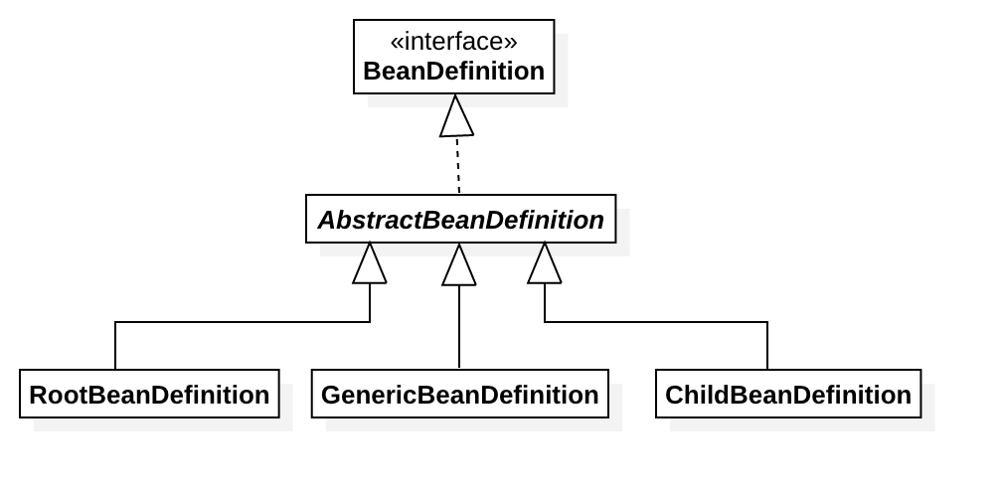

<!-- @import "[TOC]" {cmd="toc" depthFrom=1 depthTo=6 orderedList=false} -->

<!-- code_chunk_output -->

- [2. 默认标签的解析](#2-默认标签的解析)
  - [2.1 bean 标签的解析及注册](#21-bean-标签的解析及注册)
    - [2.1.1 解析BeanDefinition](#211-解析beandefinition)
      - [1 创建用于属性承载的BeanDefinition](#1-创建用于属性承载的beandefinition)
      - [2 解析各种属性](#2-解析各种属性)
      - [3 解析子元素meta](#3-解析子元素meta)
      - [4 解析子元素 lookup-method](#4-解析子元素-lookup-method)
      - [5 解析子元素 replaced-method](#5-解析子元素-replaced-method)
      - [7 解析子元素 property](#7-解析子元素-property)
      - [8 解析子元素 qualifier](#8-解析子元素-qualifier)
    - [2.1.2 AbstractBeanDefinition 属性](#212-abstractbeandefinition-属性)
    - [2.1.3 解析默认标签中的自定义标签元素](#213-解析默认标签中的自定义标签元素)

<!-- /code_chunk_output -->

# 2. 默认标签的解析
&emsp;&emsp;上文中我们提到了 Spring 中的标签包括默认标签和自定义标签两种，而两种标签的用法以及解析方式存在很大的不同，这里我们将详细分析默认标签的解析过程。
&emsp;&emsp;默认标签的解析是在 parseDefaultElement 函数中进行的，函数中的功能逻辑一目了然，分别对4中不同标签(import、 alias、 bean 和 beans)做了不同的处理。
 ```java
 private void parseDefaultElement(Element ele, BeanDefinitionParserDelegate delegate) {
	 	//处理 import 标签
		if (delegate.nodeNameEquals(ele, IMPORT_ELEMENT)) {
			importBeanDefinitionResource(ele);
		}
		//处理 alias 标签
		else if (delegate.nodeNameEquals(ele, ALIAS_ELEMENT)) {
			processAliasRegistration(ele);
		}
		//处理 bean 标签
		else if (delegate.nodeNameEquals(ele, BEAN_ELEMENT)) {
			processBeanDefinition(ele, delegate);
		}
		//处理 beans 标签
		else if (delegate.nodeNameEquals(ele, NESTED_BEANS_ELEMENT)) {
			// recurse
			doRegisterBeanDefinitions(ele);
		}
	}
 ```

## 2.1 bean 标签的解析及注册
&emsp;&emsp;在4中标签中 bean 标签的解析最为复杂也最为重要，所以我们从此标签开始深入分析，如果能理解此标签的解析过程，其他标签的解析自然会迎刃而解。首先我们进入函数 processBeanDefinition(ele, delegate)。
 ```java
 protected void processBeanDefinition(Element ele, BeanDefinitionParserDelegate delegate) {
		BeanDefinitionHolder bdHolder = delegate.parseBeanDefinitionElement(ele);
		if (bdHolder != null) {
			bdHolder = delegate.decorateBeanDefinitionIfRequired(ele, bdHolder);
			try {
				// Register the final decorated instance.
				BeanDefinitionReaderUtils.registerBeanDefinition(bdHolder, getReaderContext().getRegistry());
			}
			catch (BeanDefinitionStoreException ex) {
				getReaderContext().error("Failed to register bean definition with name '" +
						bdHolder.getBeanName() + "'", ele, ex);
			}
			// Send registration event.
			getReaderContext().fireComponentRegistered(new BeanComponentDefinition(bdHolder));
		}
	}
 ```
&emsp;&emsp;该函数主要做的事情如下：
1. 首先委托 BeanDefinitionParserDelegate 类的 parseBeanDefinitionElement 方法进行解析，返回 BeanDefinitionHolder 类型的实例 bdHolder ，经过这个方法后， bdHolder 实例已经包含了我们配置文件中配置的各种属性了， 例如 class、 name、 id、 alias 之类的属性。
2. 当返回的 bdHolder 不为空的情况下，若存在默认标签的子节点下再有自定义属性，还需要再次对自定义标签进行解析。
3. 解析完成后，需要对解析后的 bdHolder 进行注册，同样的，注册操作委托给了 BeanDefinitionReaderUtils.registerBeanDefinition(bdHolder, getReaderContext().getRegistry()) 方法。
4. 最后发出相应事件，通知相关的监听器，这个 bean 已经加载完成。
&emsp;&emsp;配合时序图我们2-1再来看，可能更能理解：

<center>图2-1 processBeanDefinition执行序列图</center>

### 2.1.1 解析BeanDefinition
&emsp;&emsp;下面我们就针对各个操作具体分析。首先我们从元素解析及信息提取开始，也就是 delegate.parseBeanDefinitionElement(ele), 进入 BeanDefinitionDelegate 类的parseBeanDefinitionElement方法。
>BeanDefinitionDelegate
 ```java
	/**
	 * Parses the supplied {@code <bean>} element. May return {@code null}
	 * if there were errors during parse. Errors are reported to the
	 * {@link org.springframework.beans.factory.parsing.ProblemReporter}.
	 */
	@Nullable
	public BeanDefinitionHolder parseBeanDefinitionElement(Element ele) {
		return parseBeanDefinitionElement(ele, null);
	}

	/**
	 * Parses the supplied {@code <bean>} element. May return {@code null}
	 * if there were errors during parse. Errors are reported to the
	 * {@link org.springframework.beans.factory.parsing.ProblemReporter}.
	 */
	@Nullable
	public BeanDefinitionHolder parseBeanDefinitionElement(Element ele, @Nullable BeanDefinition containingBean) {
		//获取 属性id
		String id = ele.getAttribute(ID_ATTRIBUTE);
		//获取 属性name
		String nameAttr = ele.getAttribute(NAME_ATTRIBUTE);
		//分割name属性（按照,;分割）
		List<String> aliases = new ArrayList<>();
		if (StringUtils.hasLength(nameAttr)) {
			//该相关方法，可自行了解其实现和原理（涉及 java 字符，unioncode等相关知识）
			String[] nameArr = StringUtils.tokenizeToStringArray(nameAttr, MULTI_VALUE_ATTRIBUTE_DELIMITERS);
			aliases.addAll(Arrays.asList(nameArr));
		}

		//判断如果没有 id 属性 或者 并且 name 属性不为空，则将第一个name属性当做beanName处理
		String beanName = id;
		if (!StringUtils.hasText(beanName) && !aliases.isEmpty()) {
			beanName = aliases.remove(0);
			if (logger.isTraceEnabled()) {
				logger.trace("No XML 'id' specified - using '" + beanName +
						"' as bean name and " + aliases + " as aliases");
			}
		}

		if (containingBean == null) {
			checkNameUniqueness(beanName, aliases, ele);
		}

		//解析并返回 beanDefinition
		AbstractBeanDefinition beanDefinition = parseBeanDefinitionElement(ele, beanName, containingBean);
		if (beanDefinition != null) {
			//如果不存在 beanName name根据 Spring 中提供的命名规则为当前 bean 生成对应的beanName
			if (!StringUtils.hasText(beanName)) {
				try {
					//设置默认的规则
					if (containingBean != null) {
						beanName = BeanDefinitionReaderUtils.generateBeanName(
								beanDefinition, this.readerContext.getRegistry(), true);
					}
					else {
						beanName = this.readerContext.generateBeanName(beanDefinition);
						// Register an alias for the plain bean class name, if still possible,
						// if the generator returned the class name plus a suffix.
						// This is expected for Spring 1.2/2.0 backwards compatibility.
						String beanClassName = beanDefinition.getBeanClassName();
						if (beanClassName != null &&
								beanName.startsWith(beanClassName) && beanName.length() > beanClassName.length() &&
								!this.readerContext.getRegistry().isBeanNameInUse(beanClassName)) {
							aliases.add(beanClassName);
						}
					}
					if (logger.isTraceEnabled()) {
						logger.trace("Neither XML 'id' nor 'name' specified - " +
								"using generated bean name [" + beanName + "]");
					}
				}
				catch (Exception ex) {
					error(ex.getMessage(), ele);
					return null;
				}
			}
			String[] aliasesArray = StringUtils.toStringArray(aliases);
			return new BeanDefinitionHolder(beanDefinition, beanName, aliasesArray);
		}

		return null;
	}
 ```
&emsp;&emsp;以上便是对默认标签解析的全过程了。当然，对 Spring 的解析犹如洋葱剥皮一样，一层一层的进行，尽管现在只能看到对属性 id 以及 name 的解析，但是很庆幸，思路我们已经了解了。在开始对属性展开全面解析前， Spring 在外层又做了一个当前层的功能架构，在当前层完成的主要工作包括如下内容。
1. 提取元素中的 id 以及 name 属性。
2. 进一步解析其他所有属性并统一封装至 GenericBeanDefinition 类型的实例中。
3. 如果检测到 bean 没有指定 beanName， 那么使用默认规则为此 Bean 生成 beanName.
 > 默认的规则为：
 根据 className 如果有父类，则 beaName 命名为 "父类$child",如果有bean工厂，则是"bean工程&created"，然后以内部类区分命名：
 1.不是内部类时， 然后检查 BeanDefinitionRegister 中是否存在相同的 beanName 的数量 counter，当只存在不存在的时候 counter = 0 ，最终命名为 beanName+"#counter"
 2.如果是内部类，则 beanName + “#” + 以十六进制表示的 beanDefinition 的 hashCode。
4. 将获取到的信息封装到 BeanDefinitionHolder 实例中。  
  
&emsp;&emsp;我们再进一步分析一下步骤2中对标签其他属性的解析过程。
 ```java
 /**
	 * Parse the bean definition itself, without regard to name or aliases. May return
	 * {@code null} if problems occurred during the parsing of the bean definition.
	 */
	@Nullable
	public AbstractBeanDefinition parseBeanDefinitionElement(
			Element ele, String beanName, @Nullable BeanDefinition containingBean) {

		this.parseState.push(new BeanEntry(beanName));

		String className = null;
		//解析 class 属性
		if (ele.hasAttribute(CLASS_ATTRIBUTE)) {
			className = ele.getAttribute(CLASS_ATTRIBUTE).trim();
		}
		//解析 parent 属性
		String parent = null;
		if (ele.hasAttribute(PARENT_ATTRIBUTE)) {
			parent = ele.getAttribute(PARENT_ATTRIBUTE);
		}

		try {
			//创建用于承载属性的 AbstractBeanDefinition 类型的 GenericBeanDefinition
			AbstractBeanDefinition bd = createBeanDefinition(className, parent);

			//硬编码解析默认的 bean 的各种属性
			parseBeanDefinitionAttributes(ele, beanName, containingBean, bd);
			//提取description
			bd.setDescription(DomUtils.getChildElementValueByTagName(ele, DESCRIPTION_ELEMENT));

			//解析元数据
			parseMetaElements(ele, bd);
			//解析 lookup-method 属性
			parseLookupOverrideSubElements(ele, bd.getMethodOverrides());
			//解析 replaced-method 属性
			parseReplacedMethodSubElements(ele, bd.getMethodOverrides());

			//解析构造函数参数
			parseConstructorArgElements(ele, bd);
			//解析 property 子元素
			parsePropertyElements(ele, bd);
			//解析 qualifier 子元素
			parseQualifierElements(ele, bd);

			bd.setResource(this.readerContext.getResource());
			bd.setSource(extractSource(ele));

			return bd;
		}
		catch (ClassNotFoundException ex) {
			error("Bean class [" + className + "] not found", ele, ex);
		}
		catch (NoClassDefFoundError err) {
			error("Class that bean class [" + className + "] depends on not found", ele, err);
		}
		catch (Throwable ex) {
			error("Unexpected failure during bean definition parsing", ele, ex);
		}
		finally {
			this.parseState.pop();
		}

		return null;
	}
 ``` 
&emsp;&emsp;终于我们看到了所有的 bean 标签属性解析，后面我们将进一步继续一些复杂的标签属性解析。

#### 1 创建用于属性承载的BeanDefinition
&emsp;&emsp; BeanDefinition 是一个接口，在 Spring 中存在三种实现： RootBeanDefinition 、 ChildBeanDefinition 以及 GenericBeanDefinition 。 三种实现均继承了 AbstractBeanDefinition ，其中 BeanDefinition 是配置文件 \<bean> 标签元素在容器中的内部表示形式。 \<bean> 元素标签拥有 class 、 scope 、 lazy-init 等配置属性， BeanDefinition 则提供了相应的 beanClass 、 scope 、 lazyInit 属性， BeanDefinition 和 \<bean> 中的属性是一一对应的。其中 RootBeanDefinition 是最常用的实现类， 它对应一般性质的\<bean>元素标签， GenericBeanDefinition 是自2.5版本以后新加入的bean文件配置属性定义类，是一站式服务类。
&emsp;&emsp;在配置文件中可以定义父\<bean>和子\<bean>，父\<bean>用 RootBeanDefinition 表示，而子\<bean>用 ChildBeanDefinition 表示，而没有父、<bean>的\<bean>就使用 RootBeanDefinition 表示。 AbstractBeanDefinition 对两则共同的类信息进行抽象。
&emsp;&emsp; Spring 通过BeanDefinition 将配置文件中的\<bean>配置信息转换为容器的内部表示，并将这些 BeanDefinition 注册到 BeanDefinitionRegistry 中。 Spring 容器的 BeanDefinitionRegistry 就像是 Spring 配置信息的内存数据库， 主要以 map 的形式保存，后续操作直接从 BeanDefinitionRegistry 中读取配置信息。它们之间的关系如果图2-2所示。

<center>图2-2 BeanDefinition及其实现类</center>
&emsp;&emsp;由此可知，要解析属性首先要创建用于承载属性的实例，也就是创建 GenericBeanDefinition 类型的实例。而代码 createBeanDefinition(className, parent)的左右就是实现此功能。

 ```java
	protected AbstractBeanDefinition createBeanDefinition(@Nullable String className, @Nullable String parentName)
			throws ClassNotFoundException {

		return BeanDefinitionReaderUtils.createBeanDefinition(
				parentName, className, this.readerContext.getBeanClassLoader());
	}
 ```
>BeanDefinitionReaderUtils
 ```java
 public static AbstractBeanDefinition createBeanDefinition(
			@Nullable String parentName, @Nullable String className, @Nullable ClassLoader classLoader) throws ClassNotFoundException {

		GenericBeanDefinition bd = new GenericBeanDefinition();
		//parentName 可能为空
		bd.setParentName(parentName);
		if (className != null) {
			if (classLoader != null) {
				//如果 classLoader 不为空，则使用传入的 classLoader 同一虚拟机加载类的对象，
				//否则只记录className
				bd.setBeanClass(ClassUtils.forName(className, classLoader));
			}
			else {
				bd.setBeanClassName(className);
			}
		}
		return bd;
	}
 ```
#### 2 解析各种属性
&emsp;&emsp;当我们创建了 bean 信息的承载实例后，便可以进行 bean 信息的各种属性解析了，首先我们进入 parseBeanDefinitionAttributes 方法。 parseBeanDefinitionAttributes 方法是对 element 所有元素属性进行解析：
 ```java
 public AbstractBeanDefinition parseBeanDefinitionAttributes(Element ele, String beanName,
			@Nullable BeanDefinition containingBean, AbstractBeanDefinition bd) {

		//解析 singleton 在 1.x 后 使用 scope 
		if (ele.hasAttribute(SINGLETON_ATTRIBUTE)) {
			error("Old 1.x 'singleton' attribute in use - upgrade to 'scope' declaration", ele);
		}
		//解析 scope 属性
		else if (ele.hasAttribute(SCOPE_ATTRIBUTE)) {
			bd.setScope(ele.getAttribute(SCOPE_ATTRIBUTE));
		}
		//在嵌入 beanDefinition 情况下且没有单独制定 scope 属性，则使用父类默认的属性
		else if (containingBean != null) {
			// Take default from containing bean in case of an inner bean definition.
			bd.setScope(containingBean.getScope());
		}
		//解析 abstract 属性
		if (ele.hasAttribute(ABSTRACT_ATTRIBUTE)) {
			bd.setAbstract(TRUE_VALUE.equals(ele.getAttribute(ABSTRACT_ATTRIBUTE)));
		}

		//解析 lazy-init 属性
		String lazyInit = ele.getAttribute(LAZY_INIT_ATTRIBUTE);
		if (isDefaultValue(lazyInit)) {
			lazyInit = this.defaults.getLazyInit();
		}
		//没有设置或设置成其他字符都会被设置成 false
		bd.setLazyInit(TRUE_VALUE.equals(lazyInit));

		//解析 autowire 属性
		String autowire = ele.getAttribute(AUTOWIRE_ATTRIBUTE);
		bd.setAutowireMode(getAutowireMode(autowire));

		//解析 depends-on 属性
		if (ele.hasAttribute(DEPENDS_ON_ATTRIBUTE)) {
			String dependsOn = ele.getAttribute(DEPENDS_ON_ATTRIBUTE);
			bd.setDependsOn(StringUtils.tokenizeToStringArray(dependsOn, MULTI_VALUE_ATTRIBUTE_DELIMITERS));
		}

		//解析 autowire-candidate 属性
		String autowireCandidate = ele.getAttribute(AUTOWIRE_CANDIDATE_ATTRIBUTE);
		if (isDefaultValue(autowireCandidate)) {
			String candidatePattern = this.defaults.getAutowireCandidates();
			if (candidatePattern != null) {
				String[] patterns = StringUtils.commaDelimitedListToStringArray(candidatePattern);
				bd.setAutowireCandidate(PatternMatchUtils.simpleMatch(patterns, beanName));
			}
		}
		else {
			bd.setAutowireCandidate(TRUE_VALUE.equals(autowireCandidate));
		}

		//解析 primary 属性
		if (ele.hasAttribute(PRIMARY_ATTRIBUTE)) {
			bd.setPrimary(TRUE_VALUE.equals(ele.getAttribute(PRIMARY_ATTRIBUTE)));
		}

		//解析 init-method 属性
		if (ele.hasAttribute(INIT_METHOD_ATTRIBUTE)) {
			String initMethodName = ele.getAttribute(INIT_METHOD_ATTRIBUTE);
			bd.setInitMethodName(initMethodName);
		}
		else if (this.defaults.getInitMethod() != null) {
			bd.setInitMethodName(this.defaults.getInitMethod());
			bd.setEnforceInitMethod(false);
		}

		//解析 destroy-method 属性
		if (ele.hasAttribute(DESTROY_METHOD_ATTRIBUTE)) {
			String destroyMethodName = ele.getAttribute(DESTROY_METHOD_ATTRIBUTE);
			bd.setDestroyMethodName(destroyMethodName);
		}
		else if (this.defaults.getDestroyMethod() != null) {
			bd.setDestroyMethodName(this.defaults.getDestroyMethod());
			bd.setEnforceDestroyMethod(false);
		}

		//解析 factory-method 属性
		if (ele.hasAttribute(FACTORY_METHOD_ATTRIBUTE)) {
			bd.setFactoryMethodName(ele.getAttribute(FACTORY_METHOD_ATTRIBUTE));
		}
		//解析 factory-bean 属性
		if (ele.hasAttribute(FACTORY_BEAN_ATTRIBUTE)) {
			bd.setFactoryBeanName(ele.getAttribute(FACTORY_BEAN_ATTRIBUTE));
		}

		return bd;
	}
 ```
&emsp;&emsp;我们可以清楚地看到 Spring 完成了对所有 bean 属性的解析，这些属性中有很多事我们经常使用的，同时我相信也一定会有或多或少的属性是不熟悉或者没有使用过的，有兴趣的可以查阅相关资料了解每个属性。
#### 3 解析子元素meta
&emsp;&emsp;在解析元数据的分析前，我们先回顾一下元数据 meta 属性的使用。
 ```xml
 <bean id="myTestBean" class="bean.MyTestBean">
	<meta key="testStr" value="aaaa"/>
 </bean>
 ```
&emsp;&emsp;对 meta 属性的解析代码如下：
 ```java
 public void parseMetaElements(Element ele, BeanMetadataAttributeAccessor attributeAccessor) {
	    //获取所有子节点
		NodeList nl = ele.getChildNodes();
		for (int i = 0; i < nl.getLength(); i++) {
			Node node = nl.item(i);
			//提取meta
			if (isCandidateElement(node) && nodeNameEquals(node, META_ELEMENT)) {
				Element metaElement = (Element) node;
				String key = metaElement.getAttribute(KEY_ATTRIBUTE);
				String value = metaElement.getAttribute(VALUE_ATTRIBUTE);
				//使用 key、value 构造 BeanMetadataAttribute
				BeanMetadataAttribute attribute = new BeanMetadataAttribute(key, value);
				attribute.setSource(extractSource(metaElement));
				//记录信息
				attributeAccessor.addMetadataAttribute(attribute);
			}
		}
	}
 ```
#### 4 解析子元素 lookup-method
&emsp;&emsp;同样，子元素 lookup-method 视乎并不是很常用，但是在某些时候它的确是非常有用的属性，通常我们称它为获取器注入。引用 Spring in Action 中的一句话：获取器注入是一种特殊的方法注入，它是把一个方法声明为返回某种类型的 bean ，但实际要返回的 bean 是在配置文件里面配置的， 此方法可用在设计有些可插拔的功能上，解除程序以来。我们看看具体的应用。
我们以 Spring 单元测试的例子来看下。
1. 首先我们看下一下单利测试类
 ```java
	public class LookupMethodTests {

	private DefaultListableBeanFactory beanFactory;

	//初始化 beanFactory
	@Before
	public void setUp() {
		beanFactory = new DefaultListableBeanFactory();
		XmlBeanDefinitionReader reader = new XmlBeanDefinitionReader(beanFactory);
		reader.loadBeanDefinitions(new ClassPathResource("lookupMethodTests.xml", getClass()));
	}

	//获取 abstractBean 执行 get 方法，对比获取到的对象是否是TestBean.class;
	@Test
	public void testWithoutConstructorArg() {
		AbstractBean bean = (AbstractBean) beanFactory.getBean("abstractBean");
		assertNotNull(bean);
		Object expected = bean.get();
		assertEquals(TestBean.class, expected.getClass());
	}

	//执行带参数的方法。
	@Test
	public void testWithOverloadedArg() {
		AbstractBean bean = (AbstractBean) beanFactory.getBean("abstractBean");
		assertNotNull(bean);
		TestBean expected = bean.get("haha");
		assertEquals(TestBean.class, expected.getClass());
		assertEquals("haha", expected.getName());
	}

	@Test
	public void testWithOneConstructorArg() {
		AbstractBean bean = (AbstractBean) beanFactory.getBean("abstractBean");
		assertNotNull(bean);
		TestBean expected = bean.getOneArgument("haha");
		assertEquals(TestBean.class, expected.getClass());
		assertEquals("haha", expected.getName());
	}

	@Test
	public void testWithTwoConstructorArg() {
		AbstractBean bean = (AbstractBean) beanFactory.getBean("abstractBean");
		assertNotNull(bean);
		TestBean expected = bean.getTwoArguments("haha", 72);
		assertEquals(TestBean.class, expected.getClass());
		assertEquals("haha", expected.getName());
		assertEquals(72, expected.getAge());
	}

	@Test
	public void testWithThreeArgsShouldFail() {
		AbstractBean bean = (AbstractBean) beanFactory.getBean("abstractBean");
		assertNotNull(bean);
		try {
			bean.getThreeArguments("name", 1, 2);
			fail("TestBean does not have a three arg constructor so this should not have worked");
		}
		catch (AbstractMethodError ex) {
		}
	}

	@Test
	public void testWithOverriddenLookupMethod() {
		AbstractBean bean = (AbstractBean) beanFactory.getBean("extendedBean");
		assertNotNull(bean);
		TestBean expected = bean.getOneArgument("haha");
		assertEquals(TestBean.class, expected.getClass());
		assertEquals("haha", expected.getName());
		assertTrue(expected.isJedi());
	}

	// 定义一个抽象的类，并创建调用方法。
	public static abstract class AbstractBean {

		public abstract TestBean get();

		public abstract TestBean get(String name);  // overloaded

		public abstract TestBean getOneArgument(String name);

		public abstract TestBean getTwoArguments(String name, int age);

		public abstract TestBean getThreeArguments(String name, int age, int anotherArg);
	}

}
 ```
 
 &emsp;&emsp;上面的单元测试，我们可以看到有多个，这里就简单的说明一下第一个单元测试方法即可。如果对 lookup-mehod 相关更深入的了解，请再去查阅相关资料。

&emsp;&emsp;单元测试 执行结果 testWithoutConstructorArg 通过，整个测试方法就完成了，那么这里的一个疑问就是 AbstractBean 是一个抽象类，它是如何被实现的呢，怎么可以直接调用？答案就是 Spring 为我们提供的获取器中，我们来看看是怎么配置的。
 ```xml
 <?xml version="1.0" encoding="UTF-8"?>
<beans xmlns="http://www.springframework.org/schema/beans"
	xmlns:xsi="http://www.w3.org/2001/XMLSchema-instance"
	xsi:schemaLocation="http://www.springframework.org/schema/beans https://www.springframework.org/schema/beans/spring-beans-4.1.xsd">

	<bean id="abstractBean" class="org.springframework.beans.factory.support.LookupMethodTests$AbstractBean">
		<!-- 等同于 <looup-method name="get" bean="testBean"/> -->
		<lookup-method name="get"/>  <!-- applying to overloaded methods, and based on return type since no bean name is given -->
		<lookup-method name="getOneArgument" bean="testBean"/>
		<lookup-method name="getTwoArguments" bean="testBean"/>
	</bean>

	<bean id="extendedBean" parent="abstractBean">
		<lookup-method name="getOneArgument" bean="jedi"/>
	</bean>

	<bean id="testBean" class="org.springframework.tests.sample.beans.TestBean" scope="prototype"/>

	<bean id="jedi" class="org.springframework.tests.sample.beans.TestBean" scope="prototype" autowire-candidate="false">
		<property name="jedi" value="true"/>
	</bean>

</beans>
 ```
&emsp;&emsp;在配置文件中，我们可以看到 lookup-method 子元素，这个配置动态的将 testBean 作为 get 的返回值，运行测试方法。其中我们可以看到我们这里并没有指定 bean 属性，这里 spring 会自动给我们配置，这里的规则，后续我们再来看看。
>根据测试，我们将 testBean , jedi 这两个 bean 的 scope 属性改为 singleton 时:
>1. get 方法获取到的bean 和 我们定义个 testBean 是相同的。
>1. 如果我们将 testBean 去掉，那么 get 方法获取到的 bean 和 jedi 定义个这个bean 是相同的。

&emsp;&emsp;那么根据这个特性，我们就可以做一些相关的插拔功能了。如定义一个接口，相关的实现，我们就可以通过 lookup-method 来做替换。
&emsp;&emsp; 至此，我们已经初步了解了 lookup-method 标签的基本用法，相信这时再去看她的属性提取源码会觉得更有针对性。
 ```java
 /**
	 * Parse lookup-override sub-elements of the given bean element.
	 */
	public void parseLookupOverrideSubElements(Element beanEle, MethodOverrides overrides) {
		NodeList nl = beanEle.getChildNodes();
		for (int i = 0; i < nl.getLength(); i++) {
			Node node = nl.item(i);
			//仅当是 spring 默认的 bean 子元素下（及xml的命名空间，xmlns） 且为 lookup-method  标签时有效
			if (isCandidateElement(node) && nodeNameEquals(node, LOOKUP_METHOD_ELEMENT)) {
				Element ele = (Element) node;
				//获取 lookup-method 的name 及需要修饰的方法名称
				String methodName = ele.getAttribute(NAME_ATTRIBUTE);
				//获取配置返回的bean
				String beanRef = ele.getAttribute(BEAN_ELEMENT);
				LookupOverride override = new LookupOverride(methodName, beanRef);
				override.setSource(extractSource(ele));
				overrides.addOverride(override);
			}
		}
	}
 ```
&emsp;&emsp;可以看到的是这段代码和 parseMetaElements 的代码大同小异，最大的区别就是在if判断这里改为了 LOOKUP_METHOD_ELEMENT。还有，在数据的存储上使用了 LookUpOverride 类型来记录并记录在 AbstractBeanDefinition 的 MethodOverrides 属性中。

#### 5 解析子元素 replaced-method
&emsp;&emsp;这个方法主要是对 bean 中 replaced-method 子元素的提取，在开始提取分析之前我们还是预先介绍下这个元素的用法。
&emsp;&emsp;方法替换：可以在运行时使用新的方法替换现在的方法。在之前的 look-up 不同的是， replaced-method 不但可以动态地替换返回实体 bean ，而且还能动态地更改原有方法的逻辑。我们来看看使用示例。
1. 在 changeMe 中完成某个业务逻辑。
 ```java
 public class TestChangeMethod{
	 
	 public void changeMe(){
		 System.out.println("changeMe");
	 }
 }
 ```
2. 在运营一段时间后需要改变原有的业务逻辑。
 ```java
 public class TestMethodReplacer implements MethodReplacer{

	 @Override
	 public Object reimplement(Object obj, Method method, Object[] args) throws Throwable {
		 System.out.println("我替换了原有的方法");
		 return null;
	 }
 }
 ```
3. 使替换后的类婶那生效。
 ```xml
 <?xml version="1.0" encoding="UTF-8"?>
<beans xmlns="http://www.springframework.org/schema/beans"
	xmlns:xsi="http://www.w3.org/2001/XMLSchema-instance"
	xsi:schemaLocation="http://www.springframework.org/schema/beans https://www.springframework.org/schema/beans/spring-beans-4.1.xsd">


	<bean id="testChangeMethod" class="test.replacemethod.TestChangeMethod">
		<replaced-method name="changeMe" replacer="replacer" />
	</bean>

	<bean id="replacer" class="test.replacemethod.TestMethodReplacer"/>
 ```
4. 测试。
 ```java
 public static void main(String[] args) {
	 ApplicationContext bf = new ClassPathXmlApplicationContext("test/replacemethod/replaceMethodTest.xml");
	 TestChangeMethod = (TestChangeMethod) bf.getBean("testChangeMethod");
	 test.changeMe();
 }
 ```
&emsp;&emsp;好了，运行测试类就可以看到预期的结果了，控制台成功打印出“我替换了原有的方法”，也就是说我们做到了动态替换原有方法，知道了这个元素的用法，我们再来看元素的提取过程：
 ```java
	public void parseReplacedMethodSubElements(Element beanEle, MethodOverrides overrides) {
		NodeList nl = beanEle.getChildNodes();
		for (int i = 0; i < nl.getLength(); i++) {
			Node node = nl.item(i);
			//仅在 spring 默认标签下 且是 replaced-method 标签时有效
			if (isCandidateElement(node) && nodeNameEquals(node, REPLACED_METHOD_ELEMENT)) {
				Element replacedMethodEle = (Element) node;
				//提取 被替换的 旧方法
				String name = replacedMethodEle.getAttribute(NAME_ATTRIBUTE);
				//提取对应的 替换 新方法
				String callback = replacedMethodEle.getAttribute(REPLACER_ATTRIBUTE);
				ReplaceOverride replaceOverride = new ReplaceOverride(name, callback);
				// Look for arg-type match elements.
				List<Element> argTypeEles = DomUtils.getChildElementsByTagName(replacedMethodEle, ARG_TYPE_ELEMENT);
				for (Element argTypeEle : argTypeEles) {
					//记录参数
					String match = argTypeEle.getAttribute(ARG_TYPE_MATCH_ATTRIBUTE);
					match = (StringUtils.hasText(match) ? match : DomUtils.getTextValue(argTypeEle));
					if (StringUtils.hasText(match)) {
						replaceOverride.addTypeIdentifier(match);
					}
				}
				replaceOverride.setSource(extractSource(replacedMethodEle));
				overrides.addOverride(replaceOverride);
			}
		}
	}
 ```
&emsp;&emsp;我们可以看到无论是 lookup-method 还是 replaced-method 都是构造了一个 MethodOverrides， 区别在于 lookup-method 向 MethodOverrides 的 override 属性 添加的是一个 LookUpOverride ，而 replaced-method 添加的是一个 ReplaceOverride， LookUpOverride 和ReplaceOverride 都继承 MethodOverride 。  并最终记录在 AbstractBeanDefinition 中的 methodOverrides 属性中。 而这个属性如何使用以及完成它所提供的功能后续再详细介绍。

#### 6 解析子元素 constructor-arg
&emsp;&emsp;对构造函数的解析是非常有用的，同时也是非常复杂的，也相信大家对构造函数的配置都不陌生，举个简单的小例子：
 ```xml
 <beans>
	<bean id="helloBean" class="com.HelloBean">
		<constructor-arg index="0">
			<value>李</value>
		</constructor-arg>
		<constructor-arg index="1">
			<value>你好</value>
		</constructor-arg>
	</bean>
 </beans>
 ```
&emsp;&emsp;在上面的配置是 Spring 构造函数配置中最基础的配置，实现的功能就是对 HelloBean 自动寻找对应的构造函数，并在初始化的时候将设置的参数传递进去。那么让我们来看看具体的 XML 解析过程。
&emsp;&emsp;对于 constructor-arg 子元素的解析， Spring 是通过 parseConstructorArgElements(ele, bd) 函数来实现的，具体的代码如下：
 ```java
 public void parseConstructorArgElements(Element beanEle, BeanDefinition bd) {
		NodeList nl = beanEle.getChildNodes();
		for (int i = 0; i < nl.getLength(); i++) {
			Node node = nl.item(i);
			if (isCandidateElement(node) && nodeNameEquals(node, CONSTRUCTOR_ARG_ELEMENT)) {
				//解析 construct-arg
				parseConstructorArgElement((Element) node, bd);
			}
		}
	}
 ```
&emsp;&emsp;这个结构视乎我们可以想象得到，遍历所有的子元素，也就是提取所有的 constructor-arg，然后进行解析，但是具体的解析确保放在另一个函数 parseConstructorArgElement 中，具体代码如下：
 ```java
 public void parseConstructorArgElement(Element ele, BeanDefinition bd) {
	 	//获取 index 属性
		String indexAttr = ele.getAttribute(INDEX_ATTRIBUTE);
		//获取 type 属性
		String typeAttr = ele.getAttribute(TYPE_ATTRIBUTE);
		//获取 name 属性
		String nameAttr = ele.getAttribute(NAME_ATTRIBUTE);
		if (StringUtils.hasLength(indexAttr)) {
			try {
				int index = Integer.parseInt(indexAttr);
				if (index < 0) {
					error("'index' cannot be lower than 0", ele);
				}
				else {
					try {
						this.parseState.push(new ConstructorArgumentEntry(index));
						//解析 ele 对应的元素
						Object value = parsePropertyValue(ele, bd, null);
						ConstructorArgumentValues.ValueHolder valueHolder = new ConstructorArgumentValues.ValueHolder(value);
						if (StringUtils.hasLength(typeAttr)) {
							valueHolder.setType(typeAttr);
						}
						if (StringUtils.hasLength(nameAttr)) {
							valueHolder.setName(nameAttr);
						}
						valueHolder.setSource(extractSource(ele));
						//不允许重复指定相同下标的参数
						if (bd.getConstructorArgumentValues().hasIndexedArgumentValue(index)) {
							error("Ambiguous constructor-arg entries for index " + index, ele);
						}
						else {
							//将获取到的参数添加到 constructorArgumentValues 中
							bd.getConstructorArgumentValues().addIndexedArgumentValue(index, valueHolder);
						}
					}
					finally {
						this.parseState.pop();
					}
				}
			}
			catch (NumberFormatException ex) {
				error("Attribute 'index' of tag 'constructor-arg' must be an integer", ele);
			}
		}
		else {
			//没有 index 属性则忽略，自动寻找
			try {
				this.parseState.push(new ConstructorArgumentEntry());
				Object value = parsePropertyValue(ele, bd, null);
				ConstructorArgumentValues.ValueHolder valueHolder = new ConstructorArgumentValues.ValueHolder(value);
				if (StringUtils.hasLength(typeAttr)) {
					valueHolder.setType(typeAttr);
				}
				if (StringUtils.hasLength(nameAttr)) {
					valueHolder.setName(nameAttr);
				}
				valueHolder.setSource(extractSource(ele));
				//将获取到的参数添加到 constructorArgumentValues 中 并根据顺序自动添加index属性
				bd.getConstructorArgumentValues().addGenericArgumentValue(valueHolder);
			}
			finally {
				this.parseState.pop();
			}
		}
	}
 ```
&emsp;&emsp;我们来整理一下，代码逻辑：
* 操作步骤如下：
	1. 解析 constructor-arg 子元素
	1. 使用 ConstructorArgumentValues.ValueHolder 类型来封装解析出来的元素 （具体的参数值，引用之类）
	1. 将 type 、 name 和 index 属性一并封装到 ConstructorArgumentValues.ValueHolder 类型中，并添加至当前的 BeanDefinition 的 constructorArgumentValues 的 indexedArgumentValues 或 genericArgumentValues 属性中，区别在于：
		* 指定了 index 属性， 添加到 indexedArgumentValues 属性中。
		* 未指定 index 属性， 添加到 genericArgumentValues 属性中。

&emsp;&emsp;那么了解了整个流程后，我们舱室进一步了解解析构造函数配置中子元素的过程，进入 parsePropertyValue ：
 ```java
 	/**
	 * Get the value of a property element. May be a list etc.
	 * Also used for constructor arguments, "propertyName" being null in this case.
	 */
	@Nullable
	public Object parsePropertyValue(Element ele, BeanDefinition bd, @Nullable String propertyName) {
		String elementName = (propertyName != null ?
				"<property> element for property '" + propertyName + "'" :
				"<constructor-arg> element");

		// Should only have one child element: ref, value, list, etc.
		NodeList nl = ele.getChildNodes();
		Element subElement = null;
		for (int i = 0; i < nl.getLength(); i++) {
			Node node = nl.item(i);
			// description 和 meta 标签不处理。
			if (node instanceof Element && !nodeNameEquals(node, DESCRIPTION_ELEMENT) &&
					!nodeNameEquals(node, META_ELEMENT)) {
				// Child element is what we're looking for.
				if (subElement != null) {
					error(elementName + " must not contain more than one sub-element", ele);
				}
				else {
					subElement = (Element) node;
				}
			}
		}
		//解析 constructor-arg 上的 ref 属性
		boolean hasRefAttribute = ele.hasAttribute(REF_ATTRIBUTE);
		//解析 constructor-arg 上的 value 属性
		boolean hasValueAttribute = ele.hasAttribute(VALUE_ATTRIBUTE);
		if ((hasRefAttribute && hasValueAttribute) ||
				((hasRefAttribute || hasValueAttribute) && subElement != null)) {
			/*
			 * 在 constructor-args 上不存在
			 *   1. 同时存在 ref 属性 又有 value 属性
			 *   2. 存在 ref 属性 或者 value 属性 又有子元素
			 */
			error(elementName +
					" is only allowed to contain either 'ref' attribute OR 'value' attribute OR sub-element", ele);
		}

		if (hasRefAttribute) {
			// ref 属性的处理， 使用 RuntimeBeanReference 封装对应的 ref 名称 
			String refName = ele.getAttribute(REF_ATTRIBUTE);
			if (!StringUtils.hasText(refName)) {
				error(elementName + " contains empty 'ref' attribute", ele);
			}
			RuntimeBeanReference ref = new RuntimeBeanReference(refName);
			ref.setSource(extractSource(ele));
			return ref;
		}
		else if (hasValueAttribute) {
			// value 属性的处理， 使用 TypedStringValue 封装
			TypedStringValue valueHolder = new TypedStringValue(ele.getAttribute(VALUE_ATTRIBUTE));
			valueHolder.setSource(extractSource(ele));
			return valueHolder;
		}
		else if (subElement != null) {
			//解析子元素
			return parsePropertySubElement(subElement, bd);
		}
		else {
			// Neither child element nor "ref" or "value" attribute found.
			error(elementName + " must specify a ref or value", ele);
			return null;
		}
	}
 ```
&emsp;&emsp;从代码上来看，对构造函数中的属性元素的解析，经历了以下几个过程。
1. 忽略 description 和 meta。
2. 提取 constructor-arg 上的 ref 和 value 属性， 以便于根据规则验证正确性，其规则为在 constructor-args 上不存在以下情况。
	* 同时存在 ref 属性 又有 value 属性
	* 存在 ref 属性 或者 value 属性 又有子元素
3. ref 属性的处理。使用 RuntimeBeanReference 封装对应的 ref 名称， 如：
 ```xml
 <constructor-args ref="a"/>
 ```
4. value 属性的处理。使用 TypedStringValue 封装，如：
```xml
 <constructor-args ref="a"/>
 ```
5. 子元素的处理，如：
```xml
 <constructor-args>
	<map>
		<entry key="key" value="value" />
	</map>
 </constructor-args>
 ```
&emsp;&emsp;而对于子元素的处理，例如这里提到的在构造函数中又嵌入了子元素 map 是怎么实现的呢？ parsePropertySubElement 中实现了对各种子元素的分类处理。
 ```java
 	@Nullable
	public Object parsePropertySubElement(Element ele, @Nullable BeanDefinition bd) {
		return parsePropertySubElement(ele, bd, null);
	}
	/**
	 * Parse a value, ref or collection sub-element of a property or
	 * constructor-arg element.
	 * @param ele subelement of property element; we don't know which yet
	 * @param defaultValueType the default type (class name) for any
	 * {@code <value>} tag that might be created
	 */
	/**
	 * Parse a value, ref or collection sub-element of a property or
	 * constructor-arg element.
	 * @param ele subelement of property element; we don't know which yet
	 * @param defaultValueType the default type (class name) for any
	 * {@code <value>} tag that might be created
	 */
	@Nullable
	public Object parsePropertySubElement(Element ele, @Nullable BeanDefinition bd, @Nullable String defaultValueType) {
		if (!isDefaultNamespace(ele)) {
			return parseNestedCustomElement(ele, bd);
		}
		else if (nodeNameEquals(ele, BEAN_ELEMENT)) {
			BeanDefinitionHolder nestedBd = parseBeanDefinitionElement(ele, bd);
			if (nestedBd != null) {
				nestedBd = decorateBeanDefinitionIfRequired(ele, nestedBd, bd);
			}
			return nestedBd;
		}
		else if (nodeNameEquals(ele, REF_ELEMENT)) {
			// A generic reference to any name of any bean.
			String refName = ele.getAttribute(BEAN_REF_ATTRIBUTE);
			boolean toParent = false;
			if (!StringUtils.hasLength(refName)) {
				// A reference to the id of another bean in a parent context.
				// 解析 parent
				refName = ele.getAttribute(PARENT_REF_ATTRIBUTE);
				toParent = true;
				if (!StringUtils.hasLength(refName)) {
					error("'bean' or 'parent' is required for <ref> element", ele);
					return null;
				}
			}
			if (!StringUtils.hasText(refName)) {
				error("<ref> element contains empty target attribute", ele);
				return null;
			}
			RuntimeBeanReference ref = new RuntimeBeanReference(refName, toParent);
			ref.setSource(extractSource(ele));
			return ref;
		}
		//对 idref 子元素的解析
		else if (nodeNameEquals(ele, IDREF_ELEMENT)) {
			return parseIdRefElement(ele);
		}
		// 对 value 子元素的解析
		else if (nodeNameEquals(ele, VALUE_ELEMENT)) {
			return parseValueElement(ele, defaultValueType);
		}
		//对 null 子元素的解析
		else if (nodeNameEquals(ele, NULL_ELEMENT)) {
			// It's a distinguished null value. Let's wrap it in a TypedStringValue
			// object in order to preserve the source location.
			TypedStringValue nullHolder = new TypedStringValue(null);
			nullHolder.setSource(extractSource(ele));
			return nullHolder;
		}
		//对 array 子元素的解析
		else if (nodeNameEquals(ele, ARRAY_ELEMENT)) {
			return parseArrayElement(ele, bd);
		}
		//对 list 子元素的解析
		else if (nodeNameEquals(ele, LIST_ELEMENT)) {
			return parseListElement(ele, bd);
		}
		//对 set 子元素的解析
		else if (nodeNameEquals(ele, SET_ELEMENT)) {
			return parseSetElement(ele, bd);
		}
		//对 map 子元素的解析
		else if (nodeNameEquals(ele, MAP_ELEMENT)) {
			return parseMapElement(ele, bd);
		}
		//对 props 子元素的解析
		else if (nodeNameEquals(ele, PROPS_ELEMENT)) {
			return parsePropsElement(ele);
		}
		else {
			error("Unknown property sub-element: [" + ele.getNodeName() + "]", ele);
			return null;
		}
	}
 ```
&emsp;&emsp;上面的函数实现了所有可支持的子类的分类处理，到这里，我们已经大致理清了构造函数的解析流程，至于更深入的解析可以自己探索。

#### 7 解析子元素 property
&emsp;&emsp; parsePropertyElements 函数完成了对 property 属性的提取， property 使用烦那个是如下：
 ```xml
	<bean id="test" class="test.TestClass">
		<property name="testStr" value="aaa"/>
	</bean>
 ```
或者
 ```xml
	<bean ="id">
		<property name="p">
			<list>
				<value>aa</value>
				<value>bb</value>
			</list>
		</property>
	</bean>
 ```
&emsp;&emsp;而具体的解析过程如下：
 ```java
 	/**
	 * Parse property sub-elements of the given bean element.
	 */
	public void parsePropertyElements(Element beanEle, BeanDefinition bd) {
		NodeList nl = beanEle.getChildNodes();
		for (int i = 0; i < nl.getLength(); i++) {
			Node node = nl.item(i);
			if (isCandidateElement(node) && nodeNameEquals(node, PROPERTY_ELEMENT)) {
				parsePropertyElement((Element) node, bd);
			}
		}
	}
 ```
 &emsp;&emsp;提取所有的 property 子元素，然后调用 parsePropertyElement 处理， parsePropertyElement 代码如下：
  ```java
  /**
	 * Parse a property element.
	 */
	public void parsePropertyElement(Element ele, BeanDefinition bd) {
		String propertyName = ele.getAttribute(NAME_ATTRIBUTE);
		if (!StringUtils.hasLength(propertyName)) {
			error("Tag 'property' must have a 'name' attribute", ele);
			return;
		}
		this.parseState.push(new PropertyEntry(propertyName));
		try {
			if (bd.getPropertyValues().contains(propertyName)) {
				error("Multiple 'property' definitions for property '" + propertyName + "'", ele);
				return;
			}
			Object val = parsePropertyValue(ele, bd, propertyName);
			PropertyValue pv = new PropertyValue(propertyName, val);
			parseMetaElements(ele, pv);
			pv.setSource(extractSource(ele));
			bd.getPropertyValues().addPropertyValue(pv);
		}
		finally {
			this.parseState.pop();
		}
	}
  ```
&emsp;&emsp;可以看到上面的函数与构造函数的注入方式不同的是返回值使用 PropertyValue 进行封装，并记录在 BeanDefinition 的 propertyValues 属性中。
#### 8 解析子元素 qualifier
&emsp;&emsp;对于 qualifier 元素的选取，我们接触更多的是注解的形式，在使用 Spring 框架中进行自动注入时， Spring 容器中匹配的候选 Bean 数目必须有且仅有一个。 当找不到一个匹配的 Bean 时， Spring 容器将抛出 BeanCreateException 异常，并指出必须至少拥有一个匹配的 Bean。
&emsp;&emsp; Spring 允许我们通过 qualifier 指定注入的 Bean 的名称，这样歧义就消除了，而对于配置方式的使用如下：
 ```xml
 <bean id="myTestBean" class="bean.MyTestBean"> 
	<qualifier type="org.Springframework.beans.factory.anatation.Qualifier" value="qf"/>
 </bean>
 ```
&emsp;&emsp;其解析的过程大同小异。将对应的 qualifier 元素封装为 AutowireCandidateQualifier 并记录在 BeanDefinition 的 qualifiers 属性中。

### 2.1.2 AbstractBeanDefinition 属性
&emsp;&emsp;至此我们便完成了 XML 文档到 GenericBeanDefinition 的转换，也就是说到这里，XML中所有的配置都可以在 GenericBeanDefinition 的实例类中找到对应的配置。
&emsp;&emsp;GenericBeanDefinition 只是子类实现，而大部分的通用属性都保存在了 AbstractBeanDefinition 的属性来回顾一下我们都解析了哪些对应的配置
 ```java
 public abstract class AbstractBeanDefinition extends BeanMetadataAttributeAccessor
		implements BeanDefinition, Cloneable {

	//省略静态变量以及 final 常量

	/**
	 * bean 的 class 对象
	 */
	@Nullable
	private volatile Object beanClass;

	/**
	 * bean 的作用范围，对应 bean 属性的scope
	 */
	@Nullable
	private String scope = SCOPE_DEFAULT;

	/**
	 * 是否是抽象，对应bean属性的abstract
	 */
	private boolean abstractFlag = false;

	/**
	 * 是否延迟加载，对应 bean 属性的 lazy-init
	 */
	private boolean lazyInit = false;

	/**
	 * 自动注入模式，对应 bean 属性autowire
	 */
	private int autowireMode = AUTOWIRE_NO;

	/**
	 * 以来检查， Spring 3.0 后弃用这个属性
	 */
	private int dependencyCheck = DEPENDENCY_CHECK_NONE;

	/**
	 * 用来表示一个 bean 的实例化依靠另外一个 bean 先实例化，对应 bean 属性 depend-on
	 */
	@Nullable
	private String[] dependsOn;

	/**
	 * autowire-candidate 属性设置为false，这样容器在查找自动装配对象时，
	 * 将不会考虑该 bean 即它不会被考虑作为其他 bean 自动装配的候选者，但是该 bean 本身还是可以使用自动装配类注入其他 bean 的
	 * 对应bean属性 autowire-candidate
	 */
	private boolean autowireCandidate = true;

	/**
	 * 自动装配时当出现多个 bean 候选者时，将作为首选者，对应 bean 属性 primary
	 */
	private boolean primary = false;

	/**
	 * 用于记录 Qualifier，对应子元素 qualifier
	 */
	private final Map<String, AutowireCandidateQualifier> qualifiers = new LinkedHashMap<>();

	/**
	 *
	 */
	@Nullable
	private Supplier<?> instanceSupplier;

	/**
	 * 允许访问非公开的构造器和方法，程序设置
	 */
	private boolean nonPublicAccessAllowed = true;

	/**
	 * 是否以一种宽松的模式解析构造函数，默认为true，
	 * 如果为 false ，则在如下情况
	 *
	 *interface ITest(){
	 *     class ITestImpl implements ITest{};
	 *     class Main{
	 *         Main(ITest i){}
	 *         Main(ITestImpl i){}
	 *     }
	 *}
	 * 抛出异常，因为 Spring 无法准确定位哪个构造函数
	 * 程序设置
	 */
	private boolean lenientConstructorResolution = true;

	/**
	 * 对应 bean 属性 factory-bean， 用法：
	 * <bean id="default" class="org.springframework.beans.factory.xml.FactoryMethods"
	 * 			factory-method="defaultInstance">
	 * 		<!-- No constructor-arg elements -->
	 * 		<property name="stringValue"><value>setterString</value></property>
	 * 	</bean>
	 *
	 * 	<bean id="defaultTestBean" factory-bean="default" factory-method="getTestBean"
	 * 			init-method="haveBirthday" destroy-method="destroy"/>
	 */
	@Nullable
	private String factoryBeanName;

	/**
	 * 对应 bean 属性 factory-method
	 */
	@Nullable
	private String factoryMethodName;

	/**
	 * 记录构造函数注入属性，对应 bean 属性 constructor-args
	 */
	@Nullable
	private ConstructorArgumentValues constructorArgumentValues;

	/**
	 * 普通属性集合，对应 bean 属性 property
	 */
	@Nullable
	private MutablePropertyValues propertyValues;

	/**
	 * 方法重写的持有者，记录 lookup-method 、replaced-method 元素
	 */
	@Nullable
	private MethodOverrides methodOverrides;

	/**
	 * 初始化方法，对应 bean 属性 init-method
	 */
	@Nullable
	private String initMethodName;

	/**
	 * 销毁方法，对应 bean 属性 destroy-method
	 */
	@Nullable
	private String destroyMethodName;

	/**
	 * 是否执行 init-method，程序设置
	 */
	private boolean enforceInitMethod = true;

	/**
	 * 是否执行 destroy-method， 程序设置
	 */
	private boolean enforceDestroyMethod = true;

	/**
	 * 是否是用户定义的而不是应用程序本身定义的，创建 AOP 时候为true，程序设置
	 */
	private boolean synthetic = false;

	/**
	 * 定义这个 bean 的应用， APPLICATION ：用户， INFRASTRUCTURE ：完全内部使用，与用户无关，SUPPORT 某些复杂配置的一部分
	 * 程序设置
	 */
	private int role = BeanDefinition.ROLE_APPLICATION;

	/**
	 * bean 描述信息
	 */
	@Nullable
	private String description;

	/**
	 * 这个 bean 的资源
	 */
	@Nullable
	private Resource resource;

	//省略构造函数和 get/set 方法
}
 ```
### 2.1.3 解析默认标签中的自定义标签元素
&emsp;&emsp;我们已经完成了分析默认标签的解析与提取过程，或许涉及内容太多，我们已经忘记从哪个函数开始的了，我们再次回顾一下默认标签解析函数的起始函数：
 ```java
 protected void processBeanDefinition(Element ele, BeanDefinitionParserDelegate delegate) {
		BeanDefinitionHolder bdHolder = delegate.parseBeanDefinitionElement(ele);
		if (bdHolder != null) {
			bdHolder = delegate.decorateBeanDefinitionIfRequired(ele, bdHolder);
			try {
				// Register the final decorated instance.
				BeanDefinitionReaderUtils.registerBeanDefinition(bdHolder, getReaderContext().getRegistry());
			}
			catch (BeanDefinitionStoreException ex) {
				getReaderContext().error("Failed to register bean definition with name '" +
						bdHolder.getBeanName() + "'", ele, ex);
			}
			// Send registration event.
			getReaderContext().fireComponentRegistered(new BeanComponentDefinition(bdHolder));
		}
	}
 ```
&emsp;&emsp;这个函数的调用，是由 parseDefaultElement 函数调用。从 parseDefaultElement 这个函数可以看出我们解析的是 spring 的默认标签。
&emsp;&emsp;之前的大量篇幅都是讲解的 BeanDefinitionHolder bdHolder = delegate.parseBeanDefinitionElement(ele) 这句代码，接下来我们要进行分析的就是 bdHolder = delegate.decorateBeanDefinitionIfRequired(ele, bdHolder) 这段代码。首先我们大致了解下这句代码的作用，其实我们可以从语义上分析：如果需要的化就对 beanDefinition 进行装饰，那这句代码到底是什么功能呢？其实这句代码适用于这样的场景，如：
 ```xml
 <bean id="test" class="test.TestClass">
    <mybean:user username="aaa"/>
 </bean>
 ```
&emsp;&emsp;当 Spring 中的 bean 使用的是默认的标签配置，但是子元素却使用了自定义的配置时，这句代码便会起作用了。可能有人会有疑问，之前讲过，对 bean 的解析分为两种类型，一种是默认类型的解析，另一种是自定义类型的解析，这不正是自定义类型的解析么？为什么会在默认类型解析中单独添加一个方法的处理呢？确实，这个问题的确让人疑惑，但是注意看，我们不难发现，这个自定义类型，并不是以 bean 的形式出现的，也就是说这个自定义类型，并不是解析 bean 的。我们之前大概提到了以下，两种类型的不同处理是针对 Bean的，这里我们看到的自定义确实 bean 的属性。好了，我们继续分析下面这段代码的逻辑。
 ```java
  public BeanDefinitionHolder decorateBeanDefinitionIfRequired(Element ele, BeanDefinitionHolder definitionHolder) {
		return decorateBeanDefinitionIfRequired(ele, definitionHolder, null);
	}
 ```
&emsp;&emsp;这里将函数的第三个参数设置为空，name第三个参数是做什么用的呢？什么情况下部位空呢？这里其实第三个参数是父类 bean ，当对某个嵌套配置进行分析时，这里需要传递父类 beanDefinition。分析源码得知这里传递的参数其实是为了使用 父类 [^1] 的 scope 属性，以备子类没有设置 scope 时默认使用父类的属性，这里分析的顶层配置，所以传递 null。
> 其实我们可以看到在解析的相关方法时，我们很多调用的函数方法，在内部调用的时候，都有传递 null 的情况存在，如： 
我们再解析默认 bean 标签时，调用 parseBeanDefinitionElement(Element ele) 其实内部的调用方法是parseBeanDefinitionElement(Element ele, @Nullable BeanDefinition containingBean) 这个 BeanDefinition 参数，我们在之前讲解 bean 解析的时候提到过，是在解析该 bean 的时候，是属于另外一个bean的子元素。而我们 parseBeanDefinitionElement 入口，只可能是顶级 bean 标签，因此不存在内部内的情况。

[^1]: 个人感觉这里不应该使用父类来描述，应该是用包含的 bean 也就是说 这里的 bean 定义的是嵌套在一个父 bean 里面的子元素。例如:
    \<bean class="org.springframework.beans.factory.xml.GeneratedNameBean">
		\<property name="child">
			\<bean class="org.springframework.beans.factory.xml.GeneratedNameBean"/>
		\</property>
	\</bean>


&emsp;&emsp;将第三个函数设置为空后进一步跟踪函数：
 ```java
 public BeanDefinitionHolder decorateBeanDefinitionIfRequired(
			Element ele, BeanDefinitionHolder definitionHolder, @Nullable BeanDefinition containingBd) {

		BeanDefinitionHolder finalDefinition = definitionHolder;

		// Decorate based on custom attributes first.
		NamedNodeMap attributes = ele.getAttributes();
		for (int i = 0; i < attributes.getLength(); i++) {
			Node node = attributes.item(i);
			finalDefinition = decorateIfRequired(node, finalDefinition, containingBd);
		}

		// Decorate based on custom nested elements.
		NodeList children = ele.getChildNodes();
		for (int i = 0; i < children.getLength(); i++) {
			Node node = children.item(i);
			if (node.getNodeType() == Node.ELEMENT_NODE) {
				finalDefinition = decorateIfRequired(node, finalDefinition, containingBd);
			}
		}
		return finalDefinition;
	}
 ```
