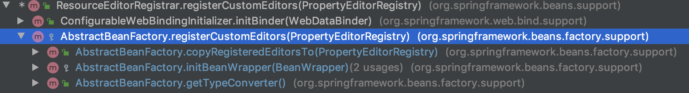

# 5 容器的功能扩展

<!-- @import "[TOC]" {cmd="toc" depthFrom=1 depthTo=6 orderedList=false} -->

<!-- code_chunk_output -->

- [5 容器的功能扩展](#5-容器的功能扩展)
  - [5.1 设置配置路径](#51-设置配置路径)
  - [5.2 扩展功能](#52-扩展功能)
  - [5.3 环境准备](#53-环境准备)
  - [5.4 加载 BeanFactory](#54-加载-beanfactory)
    - [5.4.1 定制 BeanFactory](#541-定制-beanfactory)
    - [6.4.2 加载BeanDefinition](#642-加载beandefinition)
  - [5.5 功能扩展](#55-功能扩展)
    - [5.5.1 增加SpEL语言的支持](#551-增加spel语言的支持)
    - [5.5.2 增加属性注册编辑器](#552-增加属性注册编辑器)
      - [1. 使用自定义属性编辑器](#1-使用自定义属性编辑器)
      - [2. 注入 Spring 自带的属性编辑器 CustomDateEditor](#2-注入-spring-自带的属性编辑器-customdateeditor)
    - [5.5.3 添加 ApplicationContextAwareProcessor 处理器](#553-添加-applicationcontextawareprocessor-处理器)
    - [5.5.4 设置忽略依赖](#554-设置忽略依赖)
    - [5.5.5 注册依赖](#555-注册依赖)
  - [5.6 BeanFactory 的后处理](#56-beanfactory-的后处理)
    - [5.6.1 激活注册的 BeanFactoryPostProcessor](#561-激活注册的-beanfactorypostprocessor)

<!-- /code_chunk_output -->

&emsp;&emsp;经过前面的分析，相信大家对Spring中的容器功能有了简单的理解，之前我们一直以 BeanFactory 接口以及它的默认实现类 XmlBeanFactory 为例进行分析，但是 Spring 中还提供了另一个接口 ApplicationContext , 用于扩展 BeanFactory 中现有的功能。
&emsp;&emsp;ApplicationContext 和 BeanFacotry 两者都是用于加载 Bean 的，但是相比之下， ApplicationContext 提供了更多的扩展功能，简单一点说：ApplicationContext 包含 BeanFactory 的所有功能。通常建议比 BeanFactory 优先，除非在一些限制的场合，比如字节长度对内存有很大的影响时(Applet)。绝大多数“典型的”企业应用系统， ApplicationContext 就是你需要使用的。
&emsp;&emsp;那么究竟 ApplicationContext 比 BeanFactory 多出了哪些功能呢？还需要我们进一步的探索。首先我们来看看两个不同的类去加载配置文件的写法上的不同。
* 使用 BeanFactory 方式加载 XML
> BeanFactory bf = new XmlBeanFacotry(new ClassPathResource("beanFactoryTest.xml"));
* 使用 ApplicationContext 方式加载 XML
> ApplicationContext bf = new ClassPathXmlApplicationContext("beanFactoryTest.xml");
&emsp;&emsp;同样，我们还是以ClassPathXmlApplicationContext作为切入点，开始对整体功能进行分析。
 ```java
 public ClassPathXmlApplicationContext(String configLocation) throws BeansException {
		this(new String[] {configLocation}, true, null);
 }
 public ClassPathXmlApplicationContext(
			String[] configLocations, boolean refresh, @Nullable ApplicationContext parent)
			throws BeansException {

		super(parent);
		setConfigLocations(configLocations);
		if (refresh) {
			refresh();
		}
 }
 ```
&emsp;&emsp;设置路径是必不可少的步骤，ClassPathXmlApplicationContext 中可以将配置文件路径以数组的方式传入， ClassPathXmlApplicationContext 可以对数组进行解析并进行加载。而对于解析及功能实现都在 refresh() 中实现。

## 5.1 设置配置路径
&emsp;&emsp;在 ClassPathXmlApplicationContext 中支持多个配置文件以数组方式同时传入：
 ```java
 public void setConfigLocations(@Nullable String... locations) {
		if (locations != null) {
			Assert.noNullElements(locations, "Config locations must not be null");
			this.configLocations = new String[locations.length];
			for (int i = 0; i < locations.length; i++) {
				//解析给定路径
				this.configLocations[i] = resolvePath(locations[i]).trim();
			}
		}
		else {
			this.configLocations = null;
		}
	}
 ```
 &emsp;&emsp;此解析函数主要用于解析给定的路径数组，当然，如果数组中包含特殊符号，那么如${var},那么在resolvePath中会搜寻匹配的系统变量并替换。

## 5.2 扩展功能
&emsp;&emsp;设置路径之后，便可以根据路径做配置文件的解析以及各种功能的实现了。可以说 refresh 函数中包含了几乎 ApplicationContext 中提供的全部功能，而且此函数中逻辑非常清晰明了，使我们很容易分析对应的层次及逻辑。
 ```java
    @Override
    public void refresh() throws BeansException, IllegalStateException {
        synchronized (this.startupShutdownMonitor) {
            // Prepare this context for refreshing.
            //准备刷新的上下文环境
            prepareRefresh();

            // Tell the subclass to refresh the internal bean factory.
            // 初始化 BeanFactory ， 并进行 XML 文件读取
            ConfigurableListableBeanFactory beanFactory = obtainFreshBeanFactory();

            // Prepare the bean factory for use in this context.
            // 对 beanFactory 进行各种功能填充
            prepareBeanFactory(beanFactory);

            try {
                // Allows post-processing of the bean factory in context subclasses.
                // 之类覆盖方法做额外的处理
                postProcessBeanFactory(beanFactory);

                // Invoke factory processors registered as beans in the context.
                // 激活各种 BeanFactory 处理器
                invokeBeanFactoryPostProcessors(beanFactory);

                // Register bean processors that intercept bean creation.
                // 注册拦截Bean创建的 Bean 处理器，这里只是注册，真正的调用是在 getBean 的时候
                registerBeanPostProcessors(beanFactory);

                // Initialize message source for this context.
                // 为上下文初始化 Message 源， 即不同语言的消息体，国际化处理
                initMessageSource();

                // Initialize event multicaster for this context.
                // 初始化应用信息广播，并放入 "applicationEventMulticaster" bean 中
                initApplicationEventMulticaster();

                // Initialize other special beans in specific context subclasses.
                // 留给之类来初始化其他的bean
                onRefresh();

                // Check for listener beans and register them.
                // 在所有注册的 bean 中查找 Listener bean， 注册到消息广播器中
                registerListeners();

                // Instantiate all remaining (non-lazy-init) singletons.
                // 初始化剩下的单例(非惰性的)
                finishBeanFactoryInitialization(beanFactory);

                // Last step: publish corresponding event.
                // 完成刷新过程，通知声明周期处理器 lifecycleProcessor 刷新过程，同时发出 ContextRefreshEvent 通知别人
                finishRefresh();
            }

            catch (BeansException ex) {
                if (logger.isWarnEnabled()) {
                    logger.warn("Exception encountered during context initialization - " +
                            "cancelling refresh attempt: " + ex);
                }

                // Destroy already created singletons to avoid dangling resources.
                destroyBeans();

                // Reset 'active' flag.
                cancelRefresh(ex);

                // Propagate exception to caller.
                throw ex;
            }

            finally {
                // Reset common introspection caches in Spring's core, since we
                // might not ever need metadata for singleton beans anymore...
                resetCommonCaches();
            }
        }
    }
  ```
&emsp;&emsp;下面概括一下 ClassPathXmlApplicationContext 初始化的步骤，并从中解释一下它为我们提供的功能。
1. 初始化前的准备工作，例如对系统属性或者环境变量进行准备及验证。 prepareRefresh()
&emsp;&emsp;在某种情况下项目的使用需要读取某些系统变量，而这个变量的设置很有可能会影响这系统的正确性，那么 ClassPathXmlApplicationContext 为我们提供的这个准备函数就显得非常必要，它可以在 Spring 启动的时候提前对必须的变量进行存在性验证。
2. 初始化BeanFactory，并进行XML文件读取。  obtainFreshBeanFactory()
&emsp;&emsp;之前有提到 ClassPathXmlApplicationContext 包含着 BeanFactory 所提供的一切特征，那么在这一步骤中将会复用 BeanFactory 中的配置文件读取解析及其他功能，这一步之后， ClassPathXmlApplicationContext 实际上就已经包含了 BeanFactory 说提供的功能，也就是可以进行bean的提取等基础操作了。
3. 对 BeanFacotry 进行各种功能填充。 prepareBeanFactory()
&emsp;&emsp; @Qualifier 与 @Autowired 应该是大家非常熟悉的注解，那么这两个解析正式在这一步骤中增加的支持。
4. 之类覆盖方法做额外的处理 postProcessBeanFactory()
&emsp;&emsp;Spring 之所以强大，为世人说推崇, 除了它功能上为大家提供了便利外，还有一方面是它完美架构，开放式的架构让使用它的程序员很容易根据业务需要扩展已经存在的功能。这种开放式的设计在 Spring 中随处可见。
5. 激活各种 BeanFactory 处理器。invokeBeanFactoryPostProcessors
6. 注册拦截 bean 创建的 bean 处理器，这里只是注册，真正的调用是在 getBean 时候。  registerBeanPostProcessors
7. 为上下文初始化 Message 源，即对不同语言的消息体进行国际化处理。 initMessageSource
8. 初始化应用消息广播器，并放入 "applicationEventMulticaster" bean 中。 initApplicationEventMulticaster
9. 留给之类来初始化其他 bean。 onRefresh
10. 在注册所有的 bean 中查找 listener bean， 注册到消息广播器中。 registerListeners
11. 初始化剩下的单示例(非惰性)。 finishBeanFactoryInitialization
12. 完成刷新过程，通知生命周期处理器 lifecycleProcessor 刷新过程，同时发出 ContextRefreshEven 通知别人。 finishRefresh

## 5.3 环境准备
&emsp;&emsp; prepareRefresh 函数主要是做些准备工作，例如对系统属性及环境变量的初始化及验证。
 ```java
    protected void prepareRefresh() {
		// Switch to active.
		this.startupDate = System.currentTimeMillis();
		this.closed.set(false);
		this.active.set(true);

		if (logger.isDebugEnabled()) {
			if (logger.isTraceEnabled()) {
				logger.trace("Refreshing " + this);
			}
			else {
				logger.debug("Refreshing " + getDisplayName());
			}
		}

		// Initialize any placeholder property sources in the context environment.
		// 留给子类覆盖，初始化上下文环境的 占位符资源
		initPropertySources();

		// Validate that all properties marked as required are resolvable:
		// see ConfigurablePropertyResolver#setRequiredProperties
		// 验证需要的属性文件是否都已经放入环境中
		getEnvironment().validateRequiredProperties();

		// Store pre-refresh ApplicationListeners...
		if (this.earlyApplicationListeners == null) {
			this.earlyApplicationListeners = new LinkedHashSet<>(this.applicationListeners);
		}
		else {
			// Reset local application listeners to pre-refresh state.
			this.applicationListeners.clear();
			this.applicationListeners.addAll(this.earlyApplicationListeners);
		}

		// Allow for the collection of early ApplicationEvents,
		// to be published once the multicaster is available...
		this.earlyApplicationEvents = new LinkedHashSet<>();
	}
 ```
&emsp;&emsp;乍看之下这个函数没什么用，因为 initPropertySources(),getEnvironment().validateRequiredProperties() 这两段代码才是关键，但是却没有什么逻辑处理，initPropertySources是空的没有任何逻辑，而 getEnvironment().validateRequiredProperties() 也因为没有需要验证的属性而没做任何处理。其实这都是因为没有彻底理解才这么说，这个函数如果用好了作用还是挺大的。那么，该怎么用呢？我们先探索一下各个函数的作用。
&emsp;&emsp;1. initPropertySources 正符合 Spring 的开放式设计，给用户最大扩展 Spring 的能力。用户可以根据自身的需要重写 initPropertySources 方法，并在方法中进行个性化的属性处理及设置。
&emsp;&emsp;2. validateRequiredProperties 这是对属性进行验证，那么如何验证呢？我们举个小例子。
&emsp;&emsp;假如现在有这样一个需求，工程在运行过程中用到了某个设置(例如VAR)是从系统环境变量中取得，而如果用户没有在系统环境变量中配置这个参数，那么工程可能不会工作。这一要求可能会有各种各样的解决办法，当然，在Spring中可以这样做，你可以直接修改Spring的源码，例如修改ClassPathApplicationContext。当然，最好的办法还是对源码进行扩展，我可以自定义类：
 ```java
 public class MyClassPathXmlApplicationContext extends ClassPathXmlApplicationContext{
     public MyClassPathXmlApplicationContext(String... configLocations){
         super(configLocations);
     }

     protected void initPropertySources(){
         //添加验证要求
         getEnvironment().setRequiredProperties("VAR");
     }
 }
 ```
&emsp;&emsp;我们自定义了继承自 ClassPathXmlApplicationContext 的 MyClassPathXmlApplicationContext, 并重写了 initPropertySources 方法，在方法中添加了我们的个性化需求，那么在验证的时候也就是程序走到 getEnvironment().validateRequiredProperties()代码的时候， 如果系统并没有检测到对应VAR的环境变量 ，那么将抛出异常 。 当然我们还需要在使用的时候替换掉原有的ClassPathXmlApplicationContext。

## 5.4 加载 BeanFactory
&emsp;&emsp;obtainFreshBeanFactory 方法从字面理解是获取 BeanFactory。 之前有说是， ApplicationContext 是对 BeanFactory 的功能上的扩展，不但包括了 BeanFactory 的全部功能跟在其基础上添加了大量的扩展应用，那么 obatainFreshBeanFactory 正是实现 BeanFactory 的地方，也就是经过这个函数后 ApplicationContext 就已经拥有了 BeanFactory 的全部功能。
 ```java
 	protected ConfigurableListableBeanFactory obtainFreshBeanFactory() {
		refreshBeanFactory();
        //返回当前 BeanFactory
		return getBeanFactory();
	}
 ```
&emsp;&emsp;方法中将核心实现委托给了 refreshBeanFactory 
 ```java
 	@Override
	protected final void refreshBeanFactory() throws BeansException {
		if (hasBeanFactory()) {
			destroyBeans();
			closeBeanFactory();
		}
		try {
			//创建 DefaultListableBeanFactory
			DefaultListableBeanFactory beanFactory = createBeanFactory();

			//为序列化指定id，如果需要的话，让这个 BeanFactory 从 id 反序列化到BeanFactory对象
			beanFactory.setSerializationId(getId());
			//定制 beanFactory，设置相关属性，包括是否允许覆盖同名称和不同定义的对象以及循环依赖
			//以及设置@Autowired 和 @Qualifier 注解解析器 QualifierAnnotationAutowireCandidateResolver
			customizeBeanFactory(beanFactory);
			//初始化 DocumentReader，并进行 XML文件读取及解析
			loadBeanDefinitions(beanFactory);
			synchronized (this.beanFactoryMonitor) {
				this.beanFactory = beanFactory;
			}
		}
		catch (IOException ex) {
			throw new ApplicationContextException("I/O error parsing bean definition source for " + getDisplayName(), ex);
		}
	}
 ```
&emsp;&emsp;我们详细分析上面的每个步骤。
1. 创建 DefaultListableBeanFactory。
&emsp;&emsp;在介绍 BeanFactory 的时候，声明方式为：BeanFacotry bf = new XmlBeanFactory("beanFactoryTest.xml"),其中 XmlBeanFactory 继承自 DefaultListableBeanFactory， 并提供了 XmlBeanDefinitionReader 类型的 reader，也就是所 DefaultListableBeanFactory 是容器的基础。必须首先要实例化，那么在这里就是实例化 DefaultListableBeanFactory 的步骤。
2. 指定序列化ID
3. 定制 BeanFactory
4. 加载 BeanDefinition
5. 使用全局变量记录 BeanFactory 类实例
&emsp;&emsp;因为 DefaultListableBeanFactory 类型的变量 beanFactory 是函数内的局部变量，所以要使用全局变量记录解析结果。

### 5.4.1 定制 BeanFactory
 ```java
 	protected void customizeBeanFactory(DefaultListableBeanFactory beanFactory) {
		//如果属性allowBeanDefinitionOverriding不为空，设置给 beanFactory 对象相应属性，
		//此属性的含义：是否允许覆盖同名称的不同定义的对象
		if (this.allowBeanDefinitionOverriding != null) {
			beanFactory.setAllowBeanDefinitionOverriding(this.allowBeanDefinitionOverriding);
		}
		//如果属性 allowCircularReference 不为空，设置 beanFactory 对象相应的属性。
		//此属性的含义：是否允许bean之间存在循环依赖, 在创建 bean 实例的时候又一个判断，判断是否允许循环依赖
		/**
		 * @see org.springframework.beans.factory.support.AbstractAutowireCapableBeanFactory#doCreateBean
		 */
		if (this.allowCircularReferences != null) {
			beanFactory.setAllowCircularReferences(this.allowCircularReferences);
		}
	}
 ```
&emsp;&emsp;对于允许覆盖和允许依赖设置这里只是判断是否为空，如果不为空要进行设置，但是并没有看到在哪里设置，究竟这个设置是在哪里进行设置的呢？还是那句话，使用之类覆盖方法，或者创建 ApplicationContext 调用对应的set方法。
> &emsp;&emsp;在5.1版本之前，这里定制BeanFactory，Spring还提供了另外一个重要的扩展，就是设置 AutowireCandidateResolver，在bean加载部分中讲解创建Bean时，如果采用autowireByType方式入住，那么会默认使用Spring提供的SimpleAutowiredandidateResolver，而对于默认的实现并没有过多的逻辑处理。在这里，Spring 使用了QualifierAnnotationAutowireCandidateResolver， 设置了这个解析器后 Spring 就可以支持注解方式的注入了。

### 6.4.2 加载BeanDefinition
&emsp;&emsp;在第一步中提到了将 ClassPathXmlApplicationContext 与 XmlBeanFactory 创建的对比，在实现配置文件的加载功能中除了我们第一步已经初始化的 DefaultListableBeanFactory 外，还需要 XmlBeanDefinitionReader 来读取 XML，那么在这个步骤中首先要做的就是初始化 XmlBeanDefinitionReader。这里就不多将了，就是创建一个 XmlBeanDefinitionReader 然后在调用其 loadBeanDefinitions 方法。 这样就把解析后的 BeanDefinitionHolder 都会注册到 DefaultListableBeanFactory 中。

## 5.5 功能扩展
&emsp;&emsp;进入函数 prepareBeanFactory 前， Spring 已经完成了对配置的解析， 而 ApplicationContext 在功能上的扩展也由此展开 。
 ```java
 	protected void prepareBeanFactory(ConfigurableListableBeanFactory beanFactory) {
		// Tell the internal bean factory to use the context's class loader etc.
		//设置beanFactory 的classLoader 为当前 context 的 classLoader
		beanFactory.setBeanClassLoader(getClassLoader());
		//设置beanFactory的表达式语言处理器，Spring 3 增加了表达式语言的支持，默认可是用用 #{bean.xxx}的形式来调用相关属性值。
		beanFactory.setBeanExpressionResolver(new StandardBeanExpressionResolver(beanFactory.getBeanClassLoader()));
		//为 beanFactory 增加了一个默认的 propertyEditor，这个主要是对bean的属性等设置管理的一个工具
		beanFactory.addPropertyEditorRegistrar(new ResourceEditorRegistrar(this, getEnvironment()));

		// Configure the bean factory with context callbacks.
		// 添加 BeanPostProcessor
		beanFactory.addBeanPostProcessor(new ApplicationContextAwareProcessor(this));
		//设置了几个忽略自动装配的接口
		beanFactory.ignoreDependencyInterface(EnvironmentAware.class);
		beanFactory.ignoreDependencyInterface(EmbeddedValueResolverAware.class);
		beanFactory.ignoreDependencyInterface(ResourceLoaderAware.class);
		beanFactory.ignoreDependencyInterface(ApplicationEventPublisherAware.class);
		beanFactory.ignoreDependencyInterface(MessageSourceAware.class);
		beanFactory.ignoreDependencyInterface(ApplicationContextAware.class);

		// BeanFactory interface not registered as resolvable type in a plain factory.
		// MessageSource registered (and found for autowiring) as a bean.
		//设置了几个自动装配的特殊规则
		beanFactory.registerResolvableDependency(BeanFactory.class, beanFactory);
		beanFactory.registerResolvableDependency(ResourceLoader.class, this);
		beanFactory.registerResolvableDependency(ApplicationEventPublisher.class, this);
		beanFactory.registerResolvableDependency(ApplicationContext.class, this);

		// Register early post-processor for detecting inner beans as ApplicationListeners.
		beanFactory.addBeanPostProcessor(new ApplicationListenerDetector(this));

		// Detect a LoadTimeWeaver and prepare for weaving, if found.
		// 增加对AspectJ的支持
		if (beanFactory.containsBean(LOAD_TIME_WEAVER_BEAN_NAME)) {
			beanFactory.addBeanPostProcessor(new LoadTimeWeaverAwareProcessor(beanFactory));
			// Set a temporary ClassLoader for type matching.
			beanFactory.setTempClassLoader(new ContextTypeMatchClassLoader(beanFactory.getBeanClassLoader()));
		}

		// Register default environment beans.
		// 添加默认的系统环境bean
		if (!beanFactory.containsLocalBean(ENVIRONMENT_BEAN_NAME)) {
			beanFactory.registerSingleton(ENVIRONMENT_BEAN_NAME, getEnvironment());
		}
		if (!beanFactory.containsLocalBean(SYSTEM_PROPERTIES_BEAN_NAME)) {
			beanFactory.registerSingleton(SYSTEM_PROPERTIES_BEAN_NAME, getEnvironment().getSystemProperties());
		}
		if (!beanFactory.containsLocalBean(SYSTEM_ENVIRONMENT_BEAN_NAME)) {
			beanFactory.registerSingleton(SYSTEM_ENVIRONMENT_BEAN_NAME, getEnvironment().getSystemEnvironment());
		}
	}
 ```
&emsp;&emsp;上面的函数主要进行了几个方面的扩展
* 增加对SpEL语言的支持
* 增加对属性编辑器的支持
* 增加对一些内置类，例如 EnvironmentAware、MessageSourceAware 的信息注入。
* 设置了依赖功能可忽略的接口。
* 注册一些固定依赖的属性。
* 增加AspectJ的支持
* 将相关环境变量及属性注册以及单例模式注册。

### 5.5.1 增加SpEL语言的支持
&emsp;&emsp;Spring表达式语言全称为 Spring Expression Language， 缩写 SpEL，类似与 Struts 2x 中使用的 OGNL 表达式语言，能在运行时构造复杂表达式、存取对象图属性、对象方法调用等，并且能够与 Spring 功能完美整合，比如能用来配置 bean 定义。 SpEL 是单独模块，只依赖于core模块，不依赖于其他模块，可以单独使用。
&emsp;&emsp;SpEL使用 #{...}作为定界符，所有在大括号中的字符都将被认为是SpEL，使用格式如下：
 ```xml
 <bean id="saxophone" value="com.xx.xx.Xx"/>
 <bean>
	<property name="instrument" value="#{saxophone}">
 </bean>

 <!-- 相当于 -->
 <bean id="saxophone" value="com.xx.xx.Xx"/>
 <bean>
	<property name="instrument" ref="saxophone">
 </bean>
 ```
&emsp;&emsp;当然，上面只是列举了其中最简单的使用方式，SpEL 功能非常强大，使用好可以大大提高开发效率，这里只为唤起读者的记忆来帮助我们理解源码，有兴趣的读者可以进一步深入研究。
&emsp;&emsp;在源码中通过代码 beanFactory.setBeanExpressionResolver(new StandardBeanExpressionResolver(beanFactory.getBeanClassLoader())) 注册语言解析器，就可以对SpEL进行解析了，那么在注册解析器后 Spring 又是在什么时候调用这个解析器进行解析呢？
&emsp;&emsp;之前我们讲解过 Spring 在bean进行初始化的时候会有填充属性的异步，而这一步中 Spring 会调用 AbstractAutowireCapableBeanFactory 类的 applyPropertyValues 函数来完成功能。 就在这个函数中，会通过构造 BeanDefinitionValueResolver 类型实例 valueResolver 来进行属性值的解析。同时，也是这个步骤中一般通过 AbstractBeanFactory 中的 evaluateBeanDefinitionString 方法去完成 SpEL 的解析。
 ```java
 	@Nullable
	protected Object evaluateBeanDefinitionString(@Nullable String value, @Nullable BeanDefinition beanDefinition) {
		if (this.beanExpressionResolver == null) {
			return value;
		}

		Scope scope = null;
		if (beanDefinition != null) {
			String scopeName = beanDefinition.getScope();
			if (scopeName != null) {
				scope = getRegisteredScope(scopeName);
			}
		}
		return this.beanExpressionResolver.evaluate(value, new BeanExpressionContext(this, scope));
	}
 ```

### 5.5.2 增加属性注册编辑器
&emsp;&emsp;在 Spring DI 注入的时候可以把普通属性注入进来，但是像 Date 类型就无法识别。例如：
 ```java
 public class UserManager{
	 private Date dateValue;
	 public void setDateValue(Date dateValue){
		 this.dateValue = dateValue;
	 }
	 public Date getDateValue(){
		 return dateValue;
	 }
 }
 ```
&emsp;&emsp;上面的代码，需要对日期型属性进行注入：
 ```xml
 <bean id="userManager" class="com.test.UserManager">
 	<property name="dateValue">
	 	<value>2019-09-15</value>
	</property>
 </bean>
 ```
&emsp;&emsp;测试代码：
 ```java
 @Test
 public void testDate(){
	 ApplicationContext ctx = new ClassPathXmlApplicationContext("beans.xml");
	 UserManager userManager = (UserManager)ctx.getBean("userManager");
	 System.out.println(userManager);
 }
 ```
&emsp;&emsp;如果直接这样使用，程序这会报异常，类型转换不成功。因为在Usermanager中的dateValue属性是Date类型，而在XML中配置的确实String类型的，所以当然会报异常。Spring针对此问题提供了两种解决办法。

#### 1. 使用自定义属性编辑器
&emsp;&emsp;使用自定义属性编辑器，通过继承 PropertyEditorSupport ，重写 setAsText 方法，具体步骤如下。
1. 编写自定义属性编辑器。
 ```java
	public class DatePropertyEditor extends PropertyEditorSupport {
		private String format = "yyyy-MM-dd";
		public void setFormat(String format){
			this.format = format;
		}
		public void setAsText(String arg0) throws IllegalArgumentException {
			System.out.println("arg0:" + arg0);
			SimpleDateFormat sdf = new SimpleDateFormate(format);
			try{
				Date d = sdf.parse(arg0);
				thi.setValue(d);
			} catch (ParseException e){
				e.printlnStackTrace();
			}
		}
	}
 ```
2. 将自定义属性编辑器注册到 Spring 中。
 ```xml
 <bean class="org.springframework.beans.factory.config.CustomEditorConfigurer">
	<property name="customEditors">
		<map>
			<entry key="java.util.Date">
				<bean class="com.test.DatePropertyEditor">
					<property name="format" value="yyyy-MM-dd"/>
				</bean>
			</entry>
		</map>
	</property>
 </bean>
 ```
&emsp;&emsp;在配置文件中引入类型为 org.springframework.beans.factory.config.CustomEditorConfigurer 的bean， 并在属性 customEditors 中加入自定义的属性编辑器，其中 key 为属性编辑器所对应的类型。通过这样的配置，当 Spring 在注入 bean 的属性是一旦遇到 java.util.Date 类型的属性会自动调用自定义的 DatePropertyEditor 解析器进行解析， 并用解析结果代替配置属性进行注入。

#### 2. 注入 Spring 自带的属性编辑器 CustomDateEditor
&emsp;&emsp;通过注册Spring自带的属性编辑器 CustomDateEditor， 具体步骤如下。
1. 定义属性编辑器
 ```java
 public class DatePropertyEditorRegistrar implements PropertyEditorRegistrar{
	 public void registerCustomEditors(PropertyEditorRegistry registry){
		 registry.registerCustomEditor(Date.clas, new CustomDateEditor(new SimpleDateFormat("yyyy-MM-dd"),true));
	 }
 }
 ```
2. 注册到 Spring 中。
 ```xml
  <bean class="org.springframework.beans.factory.config.CustomEditorConfigurer">
	<property name="propertyEditorRegistrars">
		<list>
			<bean class="com.test.DatePropertyEditorRegistrar"/>
		</list>
	</property>
  </bean>
 ```
&emsp;&emsp;通过在配置文件中将自定义的 DatePropertyEditorRegistrar 注册进入 org.springframework.beans.factory.config.CustomEditorConfigurer 的propertyEditorRegistrars 属性中，可以具有于方法1同样的效果。
&emsp;&emsp;讲解了这么多自定义解析器的功能，但是，似乎与 beanFactory.addPropertyEditorRegistrar(new ResourceEditorRegistrar(this, getEnvironment())); 并无关联，因为在注册自定义属性编辑器的时候使用的是 PropertyEditorRegistry 的registerCustomEditor 方法，而这里使用的是ConfigurableListableBeanFactory 的 addPropertyEditorRegistrar 方法。下面我们就来探索一下 ResourceEditorRegistrar 的内部实现，在 ResourceEditorRegistrar 中，我们最关心的方法是registerCustomEditors。
 ```java
 	@Override
	public void registerCustomEditors(PropertyEditorRegistry registry) {
		ResourceEditor baseEditor = new ResourceEditor(this.resourceLoader, this.propertyResolver);
		doRegisterEditor(registry, Resource.class, baseEditor);
		doRegisterEditor(registry, ContextResource.class, baseEditor);
		doRegisterEditor(registry, InputStream.class, new InputStreamEditor(baseEditor));
		doRegisterEditor(registry, InputSource.class, new InputSourceEditor(baseEditor));
		doRegisterEditor(registry, File.class, new FileEditor(baseEditor));
		doRegisterEditor(registry, Path.class, new PathEditor(baseEditor));
		doRegisterEditor(registry, Reader.class, new ReaderEditor(baseEditor));
		doRegisterEditor(registry, URL.class, new URLEditor(baseEditor));

		ClassLoader classLoader = this.resourceLoader.getClassLoader();
		doRegisterEditor(registry, URI.class, new URIEditor(classLoader));
		doRegisterEditor(registry, Class.class, new ClassEditor(classLoader));
		doRegisterEditor(registry, Class[].class, new ClassArrayEditor(classLoader));

		if (this.resourceLoader instanceof ResourcePatternResolver) {
			doRegisterEditor(registry, Resource[].class,
					new ResourceArrayPropertyEditor((ResourcePatternResolver) this.resourceLoader, this.propertyResolver));
		}
	}
	
	private void doRegisterEditor(PropertyEditorRegistry registry, Class<?> requiredType, PropertyEditor editor) {
		if (registry instanceof PropertyEditorRegistrySupport) {
			((PropertyEditorRegistrySupport) registry).overrideDefaultEditor(requiredType, editor);
		}
		else {
			registry.registerCustomEditor(requiredType, editor);
		}
	}
 ```
&emsp;&emsp;在 registry.registerCustomEditor(requiredType, editor)，回过头来看 ResourceEditorRegistrar 类 的 registerCustomEditors 方法的核心功能，其实无非是注册了一系列的常用类型的属性编辑器， 例如，代码 doRegisterEditor(registry, Class.class, new ClassEditor(classLoader)) 实现的功能就是注册 Class 类对应的属性编辑器。那么注册后，一旦某个实体 bean 中存在一些 Class 类型的属性 ， 那么 Spring 会调用 ClassEditor 将配置中定义的 String 类型转换为 Class 类型并进行赋值。
分析到这里，我们不禁有个疑问，虽说 ResourceEditorRegistrar 类的 registerCustomEditors 方法实现了批量注册的功能 ，但是 
beanFactory.addPropertyEditorRegistrar(new ResourceEditorRegistrar(this, getEnvironment()) 仅仅是注册了 ResourceEditorRegistrar 实例，却并没有调用 ResourceEditorRegistrar 的 registerCustomEditors 方法进行注册， 那么到底是在什么时候进行注册的呢?看下 ResourceEditorRegistrar 的 registerCustomEditors 方法调用层次结构,如图:

&emsp;&emsp;可以看到在 AbstractBeanFactory 中的 registerCustomEditors 方法中被调用过,继续查看 AbstractFactory 中的 registerCustomEditors 的方法又是被 initBeanWrapper 方法调用,这是在 bean 初始化时使用的一个方法,主要是在将 BeanDefinition 转化为 BeanWrapper 后对其属性的填充。在 bean 的初始化后会调用 ResourceEditorRegistrar 的 registerCustomerEditors 方法进行批量的通用属性编辑器注册。注册后, 在填充属性的环境变可以直接让 Spring 使用这些编辑器进行属性的解析了。
&emsp;&emsp;既然提到 BeanWrapper，这里也必要强调下，Spring 中用于封装 bean 的是 BeanWrapper 类型，而它又间接的继承了 PropertyEditorRegistry 类型，也就是我们之前反复看到的方法参数 PropertyEditorRegistry registry， 其实大部分情况下都是用 BeanWrapper，对于 BeanWrapper 在 Spring 中默认实现是 BeanWrapperImpl ，而 BeanWrapperImpl 除了实现 BeanWrapper 接口外还继承了 PropertyEditorRegistrySupport ，在 PropertyEditorRegistrySupport 中有这样一个方法：
 ```java
 	/**
	 * Actually register the default editors for this registry instance.
	 */
	private void createDefaultEditors() {
		this.defaultEditors = new HashMap<>(64);

		// Simple editors, without parameterization capabilities.
		// The JDK does not contain a default editor for any of these target types.
		this.defaultEditors.put(Charset.class, new CharsetEditor());
		this.defaultEditors.put(Class.class, new ClassEditor());
		this.defaultEditors.put(Class[].class, new ClassArrayEditor());
		this.defaultEditors.put(Currency.class, new CurrencyEditor());
		this.defaultEditors.put(File.class, new FileEditor());
		this.defaultEditors.put(InputStream.class, new InputStreamEditor());
		this.defaultEditors.put(InputSource.class, new InputSourceEditor());
		this.defaultEditors.put(Locale.class, new LocaleEditor());
		this.defaultEditors.put(Path.class, new PathEditor());
		this.defaultEditors.put(Pattern.class, new PatternEditor());
		this.defaultEditors.put(Properties.class, new PropertiesEditor());
		this.defaultEditors.put(Reader.class, new ReaderEditor());
		this.defaultEditors.put(Resource[].class, new ResourceArrayPropertyEditor());
		this.defaultEditors.put(TimeZone.class, new TimeZoneEditor());
		this.defaultEditors.put(URI.class, new URIEditor());
		this.defaultEditors.put(URL.class, new URLEditor());
		this.defaultEditors.put(UUID.class, new UUIDEditor());
		this.defaultEditors.put(ZoneId.class, new ZoneIdEditor());

		// Default instances of collection editors.
		// Can be overridden by registering custom instances of those as custom editors.
		this.defaultEditors.put(Collection.class, new CustomCollectionEditor(Collection.class));
		this.defaultEditors.put(Set.class, new CustomCollectionEditor(Set.class));
		this.defaultEditors.put(SortedSet.class, new CustomCollectionEditor(SortedSet.class));
		this.defaultEditors.put(List.class, new CustomCollectionEditor(List.class));
		this.defaultEditors.put(SortedMap.class, new CustomMapEditor(SortedMap.class));

		// Default editors for primitive arrays.
		this.defaultEditors.put(byte[].class, new ByteArrayPropertyEditor());
		this.defaultEditors.put(char[].class, new CharArrayPropertyEditor());

		// The JDK does not contain a default editor for char!
		this.defaultEditors.put(char.class, new CharacterEditor(false));
		this.defaultEditors.put(Character.class, new CharacterEditor(true));

		// Spring's CustomBooleanEditor accepts more flag values than the JDK's default editor.
		this.defaultEditors.put(boolean.class, new CustomBooleanEditor(false));
		this.defaultEditors.put(Boolean.class, new CustomBooleanEditor(true));

		// The JDK does not contain default editors for number wrapper types!
		// Override JDK primitive number editors with our own CustomNumberEditor.
		this.defaultEditors.put(byte.class, new CustomNumberEditor(Byte.class, false));
		this.defaultEditors.put(Byte.class, new CustomNumberEditor(Byte.class, true));
		this.defaultEditors.put(short.class, new CustomNumberEditor(Short.class, false));
		this.defaultEditors.put(Short.class, new CustomNumberEditor(Short.class, true));
		this.defaultEditors.put(int.class, new CustomNumberEditor(Integer.class, false));
		this.defaultEditors.put(Integer.class, new CustomNumberEditor(Integer.class, true));
		this.defaultEditors.put(long.class, new CustomNumberEditor(Long.class, false));
		this.defaultEditors.put(Long.class, new CustomNumberEditor(Long.class, true));
		this.defaultEditors.put(float.class, new CustomNumberEditor(Float.class, false));
		this.defaultEditors.put(Float.class, new CustomNumberEditor(Float.class, true));
		this.defaultEditors.put(double.class, new CustomNumberEditor(Double.class, false));
		this.defaultEditors.put(Double.class, new CustomNumberEditor(Double.class, true));
		this.defaultEditors.put(BigDecimal.class, new CustomNumberEditor(BigDecimal.class, true));
		this.defaultEditors.put(BigInteger.class, new CustomNumberEditor(BigInteger.class, true));

		// Only register config value editors if explicitly requested.
		if (this.configValueEditorsActive) {
			StringArrayPropertyEditor sae = new StringArrayPropertyEditor();
			this.defaultEditors.put(String[].class, sae);
			this.defaultEditors.put(short[].class, sae);
			this.defaultEditors.put(int[].class, sae);
			this.defaultEditors.put(long[].class, sae);
		}
	}
 ```
&emsp;&emsp;具体的调用方法我们就不取详细解读了，但是至少通过这个方法我们已经知道了在 Spring 中定义了上面一系列常用的属性编辑器使我们可以方便地进行配置。如果我们定义了的 bean 中的某个属性的类型不再上面的常用配置中的话，才需要我们进行个性化属性编辑器的注册。

### 5.5.3 添加 ApplicationContextAwareProcessor 处理器
&emsp;&emsp;接下来我们对 beanFactory.addBeanPostProcessor(new ApplicationContextAwareProcessor(this)) 主要目的就是注册一个 BeanPostProcessor ，而真正的逻辑还是在 ApplicationContextAwareProcessor 中。
&emsp;&emsp;ApplicationContextAwareProcessor 实现 BeanPostProcessor 接口，我们回顾一下之前讲过的内容，在 bean 实例化的时候，也就是 Spring 激活 bean 的 init-method 的前后,会调用 BeanPostProcessor 的 postProcessBeforeInitialization 方法和 postProcessAfterInitialization 方法。同样，对于 ApplicationContextAwareProcessor 我们也关心这两个方法。
&emsp;&emsp;对于 postProcessAfterInitialization 方法，在 ApplicatonContextAwareProcessor 中并没有做过多的逻辑处理。
 ```java
	@Nullable
	default Object postProcessAfterInitialization(Object bean, String beanName) throws BeansException {
		return bean;
	}
 ```
&emsp;&emsp;那么，我们重点看一下 postProcessbeforeInitialization 方法。
 ```java
 @Override
	@Nullable
	public Object postProcessBeforeInitialization(Object bean, String beanName) throws BeansException {
		if (!(bean instanceof EnvironmentAware || bean instanceof EmbeddedValueResolverAware ||
				bean instanceof ResourceLoaderAware || bean instanceof ApplicationEventPublisherAware ||
				bean instanceof MessageSourceAware || bean instanceof ApplicationContextAware)){
			return bean;
		}

		AccessControlContext acc = null;

		if (System.getSecurityManager() != null) {
			acc = this.applicationContext.getBeanFactory().getAccessControlContext();
		}

		if (acc != null) {
			AccessController.doPrivileged((PrivilegedAction<Object>) () -> {
				invokeAwareInterfaces(bean);
				return null;
			}, acc);
		}
		else {
			invokeAwareInterfaces(bean);
		}

		return bean;
	}

	private void invokeAwareInterfaces(Object bean) {
		if (bean instanceof EnvironmentAware) {
			((EnvironmentAware) bean).setEnvironment(this.applicationContext.getEnvironment());
		}
		if (bean instanceof EmbeddedValueResolverAware) {
			((EmbeddedValueResolverAware) bean).setEmbeddedValueResolver(this.embeddedValueResolver);
		}
		if (bean instanceof ResourceLoaderAware) {
			((ResourceLoaderAware) bean).setResourceLoader(this.applicationContext);
		}
		if (bean instanceof ApplicationEventPublisherAware) {
			((ApplicationEventPublisherAware) bean).setApplicationEventPublisher(this.applicationContext);
		}
		if (bean instanceof MessageSourceAware) {
			((MessageSourceAware) bean).setMessageSource(this.applicationContext);
		}
		if (bean instanceof ApplicationContextAware) {
			((ApplicationContextAware) bean).setApplicationContext(this.applicationContext);
		}
	}
 ```
&emsp;&emsp;postProcessBeforeinitialization 方法中调用了 invokeAwareInterfaces 。 从 invokeAwareInterfaces 方法中，我们或许已经或多或少了解了 Spring 的用意，实现这些 Aware 接口的 bean 在被初始化之后，可以取得一些对应的资源。

### 5.5.4 设置忽略依赖
&emsp;&emsp;当 Spring 将 ApplicationContextAwareProcessor 注册后，那么在invokeAwareInterfaces 方法中间接调用的 Aware 类已经不是普通的 bean 了，如 ResourceLoaderAware、ApplicationEventPublisherAware 等，那么当然需要在 Spring 做 bean 的依赖注入的时候忽略它们。而 ignoreDependencyinterface 的作用正式再次。
 ```java
	beanFactory.ignoreDependencyInterface(EnvironmentAware.class);
	beanFactory.ignoreDependencyInterface(EmbeddedValueResolverAware.class);
	beanFactory.ignoreDependencyInterface(ResourceLoaderAware.class);
	beanFactory.ignoreDependencyInterface(ApplicationEventPublisherAware.class);
	beanFactory.ignoreDependencyInterface(MessageSourceAware.class);
	beanFactory.ignoreDependencyInterface(ApplicationContextAware.class);
 ```
### 5.5.5 注册依赖
 ```java
	beanFactory.registerResolvableDependency(BeanFactory.class, beanFactory);
	beanFactory.registerResolvableDependency(ResourceLoader.class, this);
	beanFactory.registerResolvableDependency(ApplicationEventPublisher.class, this);
	beanFactory.registerResolvableDependency(ApplicationContext.class, this);
 ```

## 5.6 BeanFactory 的后处理
&emsp;&emsp;BeanFactory 作为 Spring 中容器功能的基础，用于存放所有已经加载的bean，为了保证程序上的高可扩展性，Spring 针对 BeanFactory 做了大量的扩展，比如我们熟悉的 PostProcessor 等都是在这里实现的。
### 5.6.1 激活注册的 BeanFactoryPostProcessor
&emsp;&emsp;正式开始介绍之前我们先了解下 BeanFactoryPostProcessor 的用法。
&emsp;&emsp;BeanFactoryPostProcessor 接口跟 BeanPostProcessor 类似，可以对 bean 的定义(配置元数据)进行处理。也就是说，Spring IoC 容器允许BeanFactoryPostProcessor 在容器实际实例化任何其他的 bean 之前读取配置元数据，并有可能修改它。如果你愿意，你可以配置多个 BeanFactoryPostProcessor。 你还能通过设置 “order” 属性来控制 BeanFactoryPostProcessor 的执行持续(仅当 BeanFactoryPostProcessor 实现了 Ordered 接口)。请参考 BeanFactoryPostProcessor 和 Ordered 接口的 JavaDoc 以获取更详细的信息。
&emsp;&emsp;如果你想改变的 bean 实例(例如从配置元数据创建的对象)，那么你最好是用 BeanPostProcessor。同样地， BeanFactoryPostProcessor 的作用域范围是容器级的。它只和你说使用的容器有关。如果你在容器中定义了一个 BeanFactoryPostProcessor ，它仅仅对此容器的 bean 进行后置处理。BeanFactoryPostProcessor 不会对定义在另一个容器中的bean进行后置处理，即使这两个容器都在同一层次上。在Spring中存在对于 BeanFactoryPostProcessor 的典型应用，比如 PropertyPlaceholderConfigurer。
1. BeanFactoryPostProcessor 的典型应用：PropertyPlaceholderConfigurer 
&emsp;&emsp;有时候，阅读Spring的Bean描述文件时，你也许会遇到类似如下的一些配置：
 ```xml
 <bean id="message" class="distConfig.HelloMessage">
	<property name="mes">
		<value>${bean.message}</value>
	</property>
 </bean>
 ```
&emsp;&emsp;其中竟然传了变量应用：${bean.message}。这就是Spring的分散配置，可以在另外的配置文件中位 bean.message 指定值。如在bean.property 配置如下定义：
bean.message=Hi，can you find me？