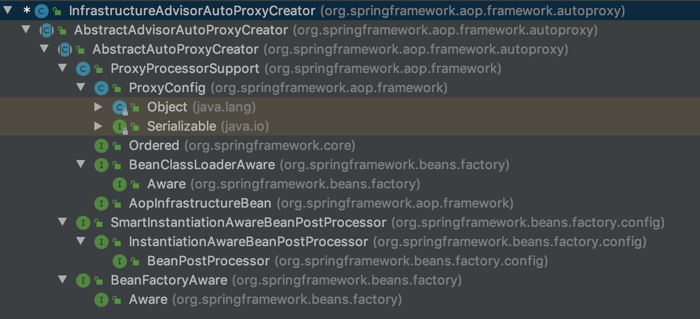

<!-- @import "[TOC]" {cmd="toc" depthFrom=1 depthTo=6 orderedList=false} -->

<!-- code_chunk_output -->

- [10 事务](#10-事务)
  - [10.1 JDBC 方式下使用示例](#101-jdbc-方式下使用示例)
- [10.2 事务自定义标签](#102-事务自定义标签)
    - [10.2.1 注册 InfrastructureAdvisorAutoProxyCreator](#1021-注册-infrastructureadvisorautoproxycreator)
    - [10.2.2 获取对应 class/method 的增强器](#1022-获取对应-classmethod-的增强器)
      - [1. 寻找候选增强器](#1-寻找候选增强器)
      - [2. 候选增强器中寻找到匹配项](#2-候选增强器中寻找到匹配项)
      - [3. 提取事务标签](#3-提取事务标签)

<!-- /code_chunk_output -->

# 10 事务
&emsp;&emsp;Spring声明式事务让我们从复杂的事务处理中得到解脱，使我们再也不需要去处理获得连接、 关闭连接 、 事务提交和回滚等操作，再也不需要在与事务相关的方法中处理大量的try...catch...finaly代码。 Spring 中事务的使用虽然已经相对简单得多，但是，还是有很多的使用及配置规则， 有兴趣的读者可以自己查阅相关资料进行深入研究，这里只列举出最常用的使用方法。

## 10.1 JDBC 方式下使用示例
&emsp;&emsp;前面的创建实体类，Mapper封装就不赘述了。字节看下如何开启事务吧。
 ```java
 @Transactional(propagation=Propagation.REQUIRED)
 public interface UserService{
     public void save(User user) throws Exception;
 }
 ```
 ```xml
<?xml version="1.0" encoding="UTF-8"?>
<beans xmlns="http://www.springframework.org/schema/beans"
       xmlns:xsi="http://www.w3.org/2001/XMLSchema-instance"
       xmlns:tx="http://www.springframework.org/schema/tx"
       xsi:schemaLocation="http://www.springframework.org/schema/beans http://www.springframework.org/schema/beans/spring-beans.xsd
                            http://www.springframework.org/schema/tx http://www.springframework.org/schema/tx/spring-tx-2.5.xsd">
    <!-- 其他配置省略 -->
    <tx:annotation-driven transaction-manager="transactionManager" />
    <bean id="transactionManager" class="org.springframework.jdbc.datasource.DataSourceTransactionManager">
        <property name="dataSource" ref="dataSource"/>
    </bean>
</beans>
 ```
&emsp;&emsp;**默认情况下Spring中的事务支只对RuntimeException方法进行回滚，所以，如果默认情况下将 Runtime Exception 替换成很普通的Exception不会产生回滚效果**

# 10.2 事务自定义标签
&emsp;&emsp;对于 Spring 中事务功能的代码分析，我们首先从配置文件开始入手，在配置文件中由这么一个配置:<tx:annotation-driven />。可以说此配置是事务的开关，如果没有此处配置，那么 Spring 中将不会存在事务的功能。那么我们就从这个配置开始分析。
&emsp;&emsp;根据之前的分析，我们可以判读啊，这是一个自定义标签，而在自定义标签的解析过程中一定是做了一些辅助操作，于是我们从自定义标签入手进行分析。
&emsp;&emsp;找到 TxNamespaceHandler 中的 init 方法中：
 ```java
    @Override
	public void init() {
		registerBeanDefinitionParser("advice", new TxAdviceBeanDefinitionParser());
		registerBeanDefinitionParser("annotation-driven", new AnnotationDrivenBeanDefinitionParser());
		registerBeanDefinitionParser("jta-transaction-manager", new JtaTransactionManagerBeanDefinitionParser());
	}
 ```
&emsp;&emsp;根据自定义标签的使用规则以及上面的代码，可以知道，在遇到诸如<tx:annotation-driven/> 为开头的配置，Spring 都会使用 AnnotationDrivenBeanDefinitionParser 类的 parse 方法进行解析。
 ```java
    @Override
	@Nullable
	public BeanDefinition parse(Element element, ParserContext parserContext) {
		registerTransactionalEventListenerFactory(parserContext);
		String mode = element.getAttribute("mode");
		if ("aspectj".equals(mode)) {
			// mode="aspectj"
			registerTransactionAspect(element, parserContext);
			if (ClassUtils.isPresent("javax.transaction.Transactional", getClass().getClassLoader())) {
				registerJtaTransactionAspect(element, parserContext);
			}
		}
		else {
			// mode="proxy"
			AopAutoProxyConfigurer.configureAutoProxyCreator(element, parserContext);
		}
		return null;
	}
 ```
&emsp;&emsp;在解析中存在对 mode 属性的判断，根据代码，如果我们需要使用 AspectJ 的方式进行事务切入 （Spring 中的事务是以 AOP 为基础），那么可以使用这样的配置：
 ```xml
 <tx:annotation-driven transaction-manager="transactionManager" mode="aspectj">
 ```
### 10.2.1 注册 InfrastructureAdvisorAutoProxyCreator
&emsp;&emsp;我们以默认配置为例子进行分析，进入 AopAutoProxyConfigurer 类的 configureAutoProxyCreator：
 ```java
    public static void configureAutoProxyCreator(Element element, ParserContext parserContext) {
        AopNamespaceUtils.registerAutoProxyCreatorIfNecessary(parserContext, element);

        String txAdvisorBeanName = TransactionManagementConfigUtils.TRANSACTION_ADVISOR_BEAN_NAME;
        if (!parserContext.getRegistry().containsBeanDefinition(txAdvisorBeanName)) {
            Object eleSource = parserContext.extractSource(element);

            // Create the TransactionAttributeSource definition.
            // 创建 TransactionAttributeSource 的 bean
            RootBeanDefinition sourceDef = new RootBeanDefinition(
                    "org.springframework.transaction.annotation.AnnotationTransactionAttributeSource");
            sourceDef.setSource(eleSource);
            sourceDef.setRole(BeanDefinition.ROLE_INFRASTRUCTURE);
            // 注册 bean，并使用 Spring 中的定义规则生成 beanname
            String sourceName = parserContext.getReaderContext().registerWithGeneratedName(sourceDef);

            // Create the TransactionInterceptor definition.
            // 创建 TransactionInterceptor 的 bean 定义
            RootBeanDefinition interceptorDef = new RootBeanDefinition(TransactionInterceptor.class);
            interceptorDef.setSource(eleSource);
            interceptorDef.setRole(BeanDefinition.ROLE_INFRASTRUCTURE);
            registerTransactionManager(element, interceptorDef);
            interceptorDef.getPropertyValues().add("transactionAttributeSource", new RuntimeBeanReference(sourceName));
            // 注册 bean，并使用 spring 中的定义规则生成 beanname
            String interceptorName = parserContext.getReaderContext().registerWithGeneratedName(interceptorDef);

            // Create the TransactionAttributeSourceAdvisor definition.
            // 创建 TransactionAttributeSourceAdvisor 的 bean
            RootBeanDefinition advisorDef = new RootBeanDefinition(BeanFactoryTransactionAttributeSourceAdvisor.class);
            advisorDef.setSource(eleSource);
            advisorDef.setRole(BeanDefinition.ROLE_INFRASTRUCTURE);
            //将 sourceName 的 bean 注入到 advisorDef 的 transactionAttributeSource 属性中
            advisorDef.getPropertyValues().add("transactionAttributeSource", new RuntimeBeanReference(sourceName));
            //将 interceptorName 的 bean 注入 advisorDef 的 adviceBeanName 属性中
            advisorDef.getPropertyValues().add("adviceBeanName", interceptorName);
            if (element.hasAttribute("order")) {
                advisorDef.getPropertyValues().add("order", element.getAttribute("order"));
            }
            parserContext.getRegistry().registerBeanDefinition(txAdvisorBeanName, advisorDef);

            //创建 CompositeComponentDefinition
            CompositeComponentDefinition compositeDef = new CompositeComponentDefinition(element.getTagName(), eleSource);
            compositeDef.addNestedComponent(new BeanComponentDefinition(sourceDef, sourceName));
            compositeDef.addNestedComponent(new BeanComponentDefinition(interceptorDef, interceptorName));
            compositeDef.addNestedComponent(new BeanComponentDefinition(advisorDef, txAdvisorBeanName));
            parserContext.registerComponent(compositeDef);
        }
    }
 ```
&emsp;&emsp;上面的代码注册了代理类以及3个bean，这3个ben支撑了整个的事务功能，那么这3个bean是怎么组织起来的呢？
&emsp;&emsp;首先，其中的两个bean被注册到了一个名为 advisorDef 的 bean 中， advisorDef 使用 BeanFactoryTransactionAttributeSourceAdvisor 作为其 class 属性。也就是收 BeanFactoryTransactionAttributeSourceAdvisor 代表着当前bean。
&emsp;&emsp;我们先来看configureAutoProxyCreator中一句很简单却很重要的代码：
 ```java
    AopNamespaceUtils.registerAutoProxyCreatorIfNecessary(parserContext, element);

    public static void registerAutoProxyCreatorIfNecessary(
        ParserContext parserContext, Element sourceElement) {

        BeanDefinition beanDefinition = AopConfigUtils.registerAutoProxyCreatorIfNecessary(
                parserContext.getRegistry(), parserContext.extractSource(sourceElement));
        useClassProxyingIfNecessary(parserContext.getRegistry(), sourceElement);
        registerComponentIfNecessary(beanDefinition, parserContext);
    }

    @Nullable
    public static BeanDefinition registerAutoProxyCreatorIfNecessary(
            BeanDefinitionRegistry registry, @Nullable Object source) {

        return registerOrEscalateApcAsRequired(InfrastructureAdvisorAutoProxyCreator.class, registry, source);
    }
 ```
&emsp;&emsp;对于解析来的代码流程 AOP 中已经有说分析，上面的两个函数主要目的是注册了 InfrastructureAdvisorAutoProxyCreator 类型的bean，那么注册这个类的目的是什么呢？

&emsp;&emsp;从上面的层次结构中可以看到，InfrastructureAdvisorAutoProxyCreator 间接实现了 SmartInstantiationAwareBeanPostProcessor ， 而 SmartInstantiationAwareBeanPostProcessor 又继承自 InstantiationAwareBeanPostProcessor ， 也就是说在 Spring 中，所有bean 实例化时Spring都会保证调用其 postProcessAfterInitialization 方法，其实现时在弗雷 AbstractAutoProxyCreator 类中实现。
&emsp;&emsp;当实例化一个bean时，便会调用此方法：
 ```java
    /**
	 * Create a proxy with the configured interceptors if the bean is
	 * identified as one to proxy by the subclass.
	 * @see #getAdvicesAndAdvisorsForBean
	 */
	@Override
	public Object postProcessAfterInitialization(@Nullable Object bean, String beanName) {
		if (bean != null) {
			//根据给定的bean的class 和name 构建出一个key，格式：beanClassName_beanName
			Object cacheKey = getCacheKey(bean.getClass(), beanName);
			if (this.earlyProxyReferences.remove(cacheKey) != bean) {
				//如果它适合被代理，这需要封装状指定bean
				return wrapIfNecessary(bean, beanName, cacheKey);
			}
		}
		return bean;
	}
 ```
&emsp;&emsp;这里的实现的主要目的是对指定 bean 进行封装，当然首先要确定是否需要封装，检测及封装工作都委托给了 wrapIfNeccessary 函数进行。
 ```java
 /**
	 * Wrap the given bean if necessary, i.e. if it is eligible for being proxied.
	 * @param bean the raw bean instance
	 * @param beanName the name of the bean
	 * @param cacheKey the cache key for metadata access
	 * @return a proxy wrapping the bean, or the raw bean instance as-is
	 */
	protected Object wrapIfNecessary(Object bean, String beanName, Object cacheKey) {
		//判断该beanName是否已经处理过
		if (StringUtils.hasLength(beanName) && this.targetSourcedBeans.contains(beanName)) {
			return bean;
		}
		//无需增强
		if (Boolean.FALSE.equals(this.advisedBeans.get(cacheKey))) {
			return bean;
		}
		//判断bean类是否代表一个基础设施，或者配置了bean不需要自动代理
		if (isInfrastructureClass(bean.getClass()) || shouldSkip(bean.getClass(), beanName)) {
			this.advisedBeans.put(cacheKey, Boolean.FALSE);
			return bean;
		}

		// Create proxy if we have advice.
		// 获取增强的方法
		Object[] specificInterceptors = getAdvicesAndAdvisorsForBean(bean.getClass(), beanName, null);
		if (specificInterceptors != DO_NOT_PROXY) {
			this.advisedBeans.put(cacheKey, Boolean.TRUE);
			//创建代理
			Object proxy = createProxy(
					bean.getClass(), beanName, specificInterceptors, new SingletonTargetSource(bean));
			this.proxyTypes.put(cacheKey, proxy.getClass());
			return proxy;
		}

		this.advisedBeans.put(cacheKey, Boolean.FALSE);
		return bean;
	}
 ```
&emsp;&emsp;wrapIfNecessary 函数功能实现起来很复杂，但逻辑上理解起来还是相对简单的，在 wrapIfNecessary 函数中主要的工作如下。
* 找出指定 bean 对应的增强器。
* 根据找出的增强器创建代理。
&emsp;&emsp;听起来似乎简单的逻辑，Spring中有做了哪些复杂的工作呢？ 对于创建代理的部分。

### 10.2.2 获取对应 class/method 的增强器
&emsp;&emsp;获取指定 bean 对应的增强器，其中包含两个关键字：增强器与对应。也就是说在 getAdvicesAndAdvisorsForBean 函数中，不但要找出增强器，而且还要判断增强器是否满足要求。
 ```java
    @Override
	@Nullable
	protected Object[] getAdvicesAndAdvisorsForBean(
			Class<?> beanClass, String beanName, @Nullable TargetSource targetSource) {

		List<Advisor> advisors = findEligibleAdvisors(beanClass, beanName);
		if (advisors.isEmpty()) {
			return DO_NOT_PROXY;
		}
		return advisors.toArray();
	}
    protected List<Advisor> findEligibleAdvisors(Class<?> beanClass, String beanName) {
		List<Advisor> candidateAdvisors = findCandidateAdvisors();
		List<Advisor> eligibleAdvisors = findAdvisorsThatCanApply(candidateAdvisors, beanClass, beanName);
		extendAdvisors(eligibleAdvisors);
		if (!eligibleAdvisors.isEmpty()) {
			eligibleAdvisors = sortAdvisors(eligibleAdvisors);
		}
		return eligibleAdvisors;
	}
 ```
&emsp;&emsp;上面的函数，Spring 又将任务进行了拆分，分成了获取所有增强器与增强器是否匹配两个功能点。
#### 1. 寻找候选增强器
&emsp;&emsp;在 findCandidateAdvisors 函数中完成的就是获取增强器的功能。
 ```java
    /**
	 * Find all candidate Advisors to use in auto-proxying.
	 * @return the List of candidate Advisors
	 */
	protected List<Advisor> findCandidateAdvisors() {
		Assert.state(this.advisorRetrievalHelper != null, "No BeanFactoryAdvisorRetrievalHelper available");
		return this.advisorRetrievalHelper.findAdvisorBeans();
	}

    public List<Advisor> findAdvisorBeans() {
		// Determine list of advisor bean names, if not cached already.
		String[] advisorNames = this.cachedAdvisorBeanNames;
		if (advisorNames == null) {
			// Do not initialize FactoryBeans here: We need to leave all regular beans
			// uninitialized to let the auto-proxy creator apply to them!
			advisorNames = BeanFactoryUtils.beanNamesForTypeIncludingAncestors(
					this.beanFactory, Advisor.class, true, false);
			this.cachedAdvisorBeanNames = advisorNames;
		}
		if (advisorNames.length == 0) {
			return new ArrayList<>();
		}

		List<Advisor> advisors = new ArrayList<>();
		for (String name : advisorNames) {
			if (isEligibleBean(name)) {
				if (this.beanFactory.isCurrentlyInCreation(name)) {
					if (logger.isTraceEnabled()) {
						logger.trace("Skipping currently created advisor '" + name + "'");
					}
				}
				else {
					try {
						advisors.add(this.beanFactory.getBean(name, Advisor.class));
					}
					catch (BeanCreationException ex) {
						Throwable rootCause = ex.getMostSpecificCause();
						if (rootCause instanceof BeanCurrentlyInCreationException) {
							BeanCreationException bce = (BeanCreationException) rootCause;
							String bceBeanName = bce.getBeanName();
							if (bceBeanName != null && this.beanFactory.isCurrentlyInCreation(bceBeanName)) {
								if (logger.isTraceEnabled()) {
									logger.trace("Skipping advisor '" + name +
											"' with dependency on currently created bean: " + ex.getMessage());
								}
								// Ignore: indicates a reference back to the bean we're trying to advise.
								// We want to find advisors other than the currently created bean itself.
								continue;
							}
						}
						throw ex;
					}
				}
			}
		}
		return advisors;
	}
 ```
&emsp;&emsp;上面的函数，通过 BeanFactoryUtils 类提供的工具方法获取所有对应 Advisor.class 的类，获取办法无非是使用 ListableBeanFactory 中提供的方法,当我们知道增强器在容器中的beanName时，获取增强器已经不是问题了，在 BeanFactory中提供了这样的方法，可以帮我们快速定位到对应的bean实例。
 ```java
 <T> T getBean(String name, Class<T> requiredType) throws BeanExcetpion;
 ```
&emsp;&emsp;我们再来看看之前在解析自定义标签时，曾注册了一个类型为 BeanFactoryTransactionAttributeSourceAdvisor 的 bean，而在此 bean 中我们又注入了另外两个 Bean， 那么此时这个 Bean 就会被开始被使用了。因为 BeanFactorytransactionAttributeSourceAdvisor 同样实现了 Advisor 接口，那么在获取所有增强器时自然也会将此bean提取出来，并随着其他增强器一起在后续的步骤中被织入代理。
#### 2. 候选增强器中寻找到匹配项
&emsp;&emsp;当找出对应的增强器后，接下来的任务就是看这些增强器是否与对应的 class 匹配了，当然不只是 class， class 内部的方法如果匹配也可以通过验证。
 ```java
    public static List<Advisor> findAdvisorsThatCanApply(List<Advisor> candidateAdvisors, Class<?> clazz) {
		if (candidateAdvisors.isEmpty()) {
			return candidateAdvisors;
		}
		List<Advisor> eligibleAdvisors = new ArrayList<>();
		//首先处理 引介 增强
		for (Advisor candidate : candidateAdvisors) {
			if (candidate instanceof IntroductionAdvisor && canApply(candidate, clazz)) {
				eligibleAdvisors.add(candidate);
			}
		}
		boolean hasIntroductions = !eligibleAdvisors.isEmpty();
		for (Advisor candidate : candidateAdvisors) {
			//引介增强已处理
			if (candidate instanceof IntroductionAdvisor) {
				// already processed
				continue;
			}
			//对于普通bean的处理
			if (canApply(candidate, clazz, hasIntroductions)) {
				eligibleAdvisors.add(candidate);
			}
		}
		return eligibleAdvisors;
	}

    public static boolean canApply(Advisor advisor, Class<?> targetClass, boolean hasIntroductions) {
		if (advisor instanceof IntroductionAdvisor) {
			return ((IntroductionAdvisor) advisor).getClassFilter().matches(targetClass);
		}
		else if (advisor instanceof PointcutAdvisor) {
			PointcutAdvisor pca = (PointcutAdvisor) advisor;
			return canApply(pca.getPointcut(), targetClass, hasIntroductions);
		}
		else {
			// It doesn't have a pointcut so we assume it applies.
			return true;
		}
	}
 ```
&emsp;&emsp;我们之前查找出来的类型 为 BeanFactoryTransactionAttributeSourceAdvisor 的bean实例，而通过类的层次结构，我们又知道 BeanFactoryTransactionAttributeSourceAdvisor 间接实现了 PointcutAdvisor。因此，在 canApply 函数中的第二个if判断时就会通过判断，会将 BeanFactoryTransactionAttributeSourceAdvisor 中的 getPointcut() 返回值作为参数继续调用 canApply 方法，而 getPoint() 方法返回的就是  TransactionAttributeSourcePointcut 类型的实例。对于 transactionAttributeSource 这个属性，同样是在自定义标签时注入进去的。
> BeanFactoryTransactionAttributeSourceAdvisor
 ```java
    private final TransactionAttributeSourcePointcut pointcut = new TransactionAttributeSourcePointcut() {
		@Override
		@Nullable
		protected TransactionAttributeSource getTransactionAttributeSource() {
			return transactionAttributeSource;
		}
	};

    @Override
	public Pointcut getPointcut() {
		return this.pointcut;
	}
 ```
&emsp;&emsp;那么,使用 TransactionAttributeSourcePointcut 类型的实例作为函数参数继续跟踪 canApply。
 ```java
    public static boolean canApply(Pointcut pc, Class<?> targetClass, boolean hasIntroductions) {
		Assert.notNull(pc, "Pointcut must not be null");
		//首先还是通过 classFilter 匹配 当前切点是否 目标类代理目标类
		if (!pc.getClassFilter().matches(targetClass)) {
			return false;
		}

		// 返回 Pointcut 的 methodMatcher
		MethodMatcher methodMatcher = pc.getMethodMatcher();
		//如果methodMatcher 如果是 TrueMethodMatcher
		//就代表我们需要匹配所有方法不需要迭代方法
		if (methodMatcher == MethodMatcher.TRUE) {
			// No need to iterate the methods if we're matching any method anyway...
			return true;
		}

		IntroductionAwareMethodMatcher introductionAwareMethodMatcher = null;
		if (methodMatcher instanceof IntroductionAwareMethodMatcher) {
			introductionAwareMethodMatcher = (IntroductionAwareMethodMatcher) methodMatcher;
		}

		Set<Class<?>> classes = new LinkedHashSet<>();
		if (!Proxy.isProxyClass(targetClass)) {
			classes.add(ClassUtils.getUserClass(targetClass));
		}
		classes.addAll(ClassUtils.getAllInterfacesForClassAsSet(targetClass));

		for (Class<?> clazz : classes) {
			Method[] methods = ReflectionUtils.getAllDeclaredMethods(clazz);
			for (Method method : methods) {
				if (introductionAwareMethodMatcher != null ?
						introductionAwareMethodMatcher.matches(method, targetClass, hasIntroductions) :
						methodMatcher.matches(method, targetClass)) {
					return true;
				}
			}
		}

		return false;
	}
 ```
&emsp;&emsp;通过上面函数大致可以理清大体脉络，首先获取对应类的所有接口并连同类本身一起遍历，遍历过程中又对类中的方法再次遍历，一旦匹配成功便认为这个类适合当前增强器。
&emsp;&emsp;对于事务的配置不仅仅局限于函数上配置，我们都知道，在类或接口上的配置可以延续到类中的每个函数，那么，如果针对每个函数进行检测，在类本身上配置的事务属性岂不是检测不到了吗？带着这个疑问，我们继续探求 matcher 方法。
&emsp;&emsp;做匹配的时候 methodMatcher.matches(method,targetClass)会使用 TransactionAttributeSourcePointcut 类的 matches 方法。
> TransactionAttributeSourcePointcut
 ```java
    @Override
	public boolean matches(Method method, Class<?> targetClass) {
		TransactionAttributeSource tas = getTransactionAttributeSource();
		return (tas == null || tas.getTransactionAttribute(method, targetClass) != null);
	}
 ```
&emsp;&emsp;此时的tas 表示的是 AnnotationTransactionAttributeSource 类型，而 AnnotationTransactionAttributeSource 类型的 getTransactionAttribute 方法如下：
 ```java
    public TransactionAttribute getTransactionAttribute(Method method, @Nullable Class<?> targetClass) {
		if (method.getDeclaringClass() == Object.class) {
			return null;
		}

		// First, see if we have a cached value.
		Object cacheKey = getCacheKey(method, targetClass);
		TransactionAttribute cached = this.attributeCache.get(cacheKey);
		if (cached != null) {
			// Value will either be canonical value indicating there is no transaction attribute,
			// or an actual transaction attribute.
			if (cached == NULL_TRANSACTION_ATTRIBUTE) {
				return null;
			}
			else {
				return cached;
			}
		}
		else {
			// We need to work it out.
			// 提取事务标签
			TransactionAttribute txAttr = computeTransactionAttribute(method, targetClass);
			// Put it in the cache.
			if (txAttr == null) {
				this.attributeCache.put(cacheKey, NULL_TRANSACTION_ATTRIBUTE);
			}
			else {
				//获取方法的全限定名  class.method
				String methodIdentification = ClassUtils.getQualifiedMethodName(method, targetClass);
				if (txAttr instanceof DefaultTransactionAttribute) {
					((DefaultTransactionAttribute) txAttr).setDescriptor(methodIdentification);
				}
				if (logger.isTraceEnabled()) {
					logger.trace("Adding transactional method '" + methodIdentification + "' with attribute: " + txAttr);
				}
				this.attributeCache.put(cacheKey, txAttr);
			}
			return txAttr;
		}
	}
 ```
&emsp;&emsp;在 getTransactionAttribute 函数中并没有早到我们想要的代码，这里是指常规的一贯的套路，尝试从缓存加载，如果对应信息没有被缓存的话，工作又委托给了 computeTransactionAttribute 函数，在 computeTransactionAttribute 函数中我们就可以看到事务标签的提取过程。
#### 3. 提取事务标签
 ```java
    @Nullable
	protected TransactionAttribute computeTransactionAttribute(Method method, @Nullable Class<?> targetClass) {
		// Don't allow no-public methods as required.
		if (allowPublicMethodsOnly() && !Modifier.isPublic(method.getModifiers())) {
			return null;
		}

		// The method may be on an interface, but we need attributes from the target class.
		// If the target class is null, the method will be unchanged.
		// 获取目标类上的方法，specificMethod 实现类上的方法。如果targetClass已经被aspectj创建了代理类，那么取被代理类
		Method specificMethod = AopUtils.getMostSpecificMethod(method, targetClass);

		// First try is the method in the target class.
		// 第一步，现在目标类上获取 指定的方法上的事务声明
		TransactionAttribute txAttr = findTransactionAttribute(specificMethod);
		if (txAttr != null) {
			return txAttr;
		}

		// Second try is the transaction attribute on the target class.
		// 第二步获取所在类中是否存在事务声明
		txAttr = findTransactionAttribute(specificMethod.getDeclaringClass());
		if (txAttr != null && ClassUtils.isUserLevelMethod(method)) {
			return txAttr;
		}

		// 如果存在接口，这到接口中去寻找
		if (specificMethod != method) {
			// Fallback is to look at the original method.
			//查找接口方法
			txAttr = findTransactionAttribute(method);
			if (txAttr != null) {
				return txAttr;
			}
			// Last fallback is the class of the original method.
			//查找接口
			txAttr = findTransactionAttribute(method.getDeclaringClass());
			if (txAttr != null && ClassUtils.isUserLevelMethod(method)) {
				return txAttr;
			}
		}

		return null;
	}
 ```
&emsp;&emsp;对于事务属性的获取规则相信大家都已经很清楚，如果方法中存在事务属性，则使用方法上的属性，否则使用方法所在的类上的属性，如果方法所在类的属性上还是没有搜寻到对应的事务属性，那么再搜寻接口中的方法，再没有的话，最后尝试搜寻接口的类上面的声明。对于函数 computeTransactionAttribute 中的逻辑与我们所认识的规则并无差别，但是上面函数中并没有真正的去做搜寻事务属性的逻辑，而是搭建了个执行框架，将搜寻事务属性的任务委托给了 findTransactionAttribute 方法去执行。
 ```java
    @Override
	@Nullable
	protected TransactionAttribute findTransactionAttribute(Class<?> clazz) {
		return determineTransactionAttribute(clazz);
	}

    @Nullable
	protected TransactionAttribute determineTransactionAttribute(AnnotatedElement element) {
		for (TransactionAnnotationParser parser : this.annotationParsers) {
			TransactionAttribute attr = parser.parseTransactionAnnotation(element);
			if (attr != null) {
				return attr;
			}
		}
		return null;
	}
 ```
&emsp;&emsp;this.annotationParsers 是 AnnotationTransactionAttributeSource 初始化的时候初始化的，其中的值被加入了 SpringTransactionAnnotationParser ，也即是当前进行属性获取时候其实使用 SpringTransactionAnnotationParser 类的 parseTransactionAnnotation 方法进行解析的。同时还根据环境加入了 JtaTransactionAnnotationParser 和 Ejb3TransactionAnnotationParser 的支持，分别是jdk支持的transaction注解和ejb支持的transaction注解。
&emsp;&emsp;后面的解析，就不详细讲解了，可以分别看看几个实现 TransactionAnnotationParser 的实现类的属性解析。
&emsp;&emsp;现在我们终于完成了事务标签的解析。到现在可能很多人已经晕了，忘记了我们最初到底是要看什么的。
