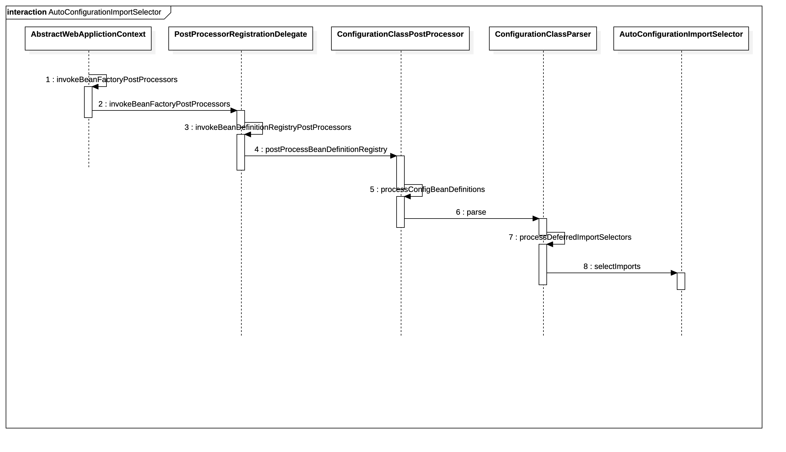
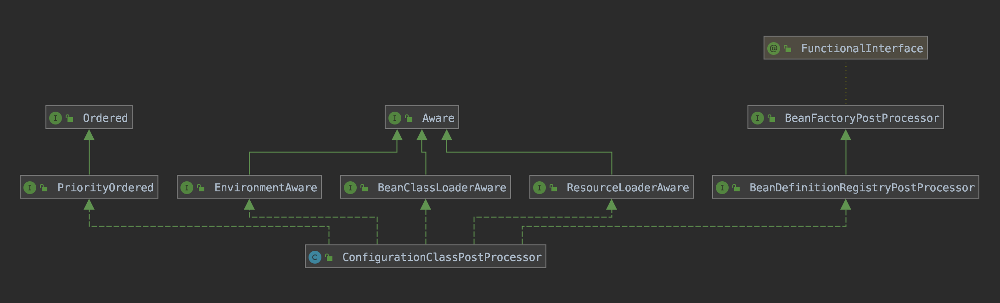

# 14 Spring Boot 体系原理

<!-- @import "[TOC]" {cmd="toc" depthFrom=1 depthTo=6 orderedList=false} -->

<!-- code_chunk_output -->

- [14 Spring Boot 体系原理](#14-spring-boot-体系原理)
  - [14.1 Spring Boot 源码安装](#141-spring-boot-源码安装)
  - [14.2 第一个 Starter](#142-第一个-starter)
  - [14.3 探索 SpringApplication 启动 Spring](#143-探索-springapplication-启动-spring)
    - [14.3.1 SpringContext 创建](#1431-springcontext-创建)
    - [14.3.2 bean 的加载](#1432-bean-的加载)
    - [14.3.3 Spring 扩展属性的加载](#1433-spring-扩展属性的加载)
    - [14.3.4 总结](#1434-总结)
  - [14.4 Starter 自动化配置原理](#144-starter-自动化配置原理)
    - [14.4.1 spring.factories 的加载](#1441-springfactories-的加载)

<!-- /code_chunk_output -->

&emsp;&emsp;Spring Boot 是由 Pivotal 团队提供的全新框架，其设计目的是用来简化新 Spring 应用的初始搭建以及开发过程。该框架使用了特定的方式来进行配置，从而使开发人员不再需要定义样板化的配置。通过这种方式，Spring Boot 将致力于在蓬勃发展的快速应用开发领域(Rapid Application Developmenet)成为领导者。
&emsp;&emsp;Spring Boot 特点如下：
* 创建独立的Spring应用程序；
* 嵌入的Tomcat，无需部署WAR文件；
* 简化 Maven 配置；
* 自动配置 Spring；
* 提供生产就绪行功能，如指标、健康检查和外部配置；
* 绝对没有代码生成，以及对XML没有配置要求。
&emsp;&emsp;当然，这样的介绍似乎太官方化，好像并没有帮助我们理解Spring Boot 到底做了什么，我们不妨通过一个小例子来快速了解 Spring Boot。
&emsp;&emsp;首先我们搭建一个maven工程，pom 如下：
 ```xml
 <?xml version="1.0" encoding="UTF-8"?>
<project xmlns="http://maven.apache.org/POM/4.0.0"
         xmlns:xsi="http://www.w3.org/2001/XMLSchema-instance"
         xsi:schemaLocation="http://maven.apache.org/POM/4.0.0 http://maven.apache.org/xsd/maven-4.0.0.xsd">
    <parent>
        <artifactId>spring-boot-starter-parent</artifactId>
        <groupId>org.springframework.boot</groupId>
        <version>2.0.1.RELEASE</version>
    </parent>
    <modelVersion>4.0.0</modelVersion>

    <artifactId>spring-boot</artifactId>

    <dependencies>
        <dependency>
            <groupId>org.springframework.boot</groupId>
            <artifactId>spring-boot-starter-web</artifactId>
        </dependency>
    </dependencies>
    <build>
        <plugins>
            <plugin>
                <groupId>org.springframework.boot</groupId>
                <artifactId>spring-boot-maven-plugin</artifactId>
            </plugin>
        </plugins>
    </build>
</project>
 ```
&emsp;&emsp;建立一个controller类：
 ```java
package info.tonylee.studio.spring.boot;

import org.springframework.web.bind.annotation.RequestMapping;
import org.springframework.web.bind.annotation.RestController;

@RestController
public class TestController {
    @RequestMapping("/")
    String home(){
        return "Hello Spring Boot";
    }
}
 ```
&emsp;&emsp;最后我们再加入启动整个项目的main函数：
 ```java
package info.tonylee.studio.spring.boot;

import org.springframework.boot.SpringApplication;
import org.springframework.boot.autoconfigure.SpringBootApplication;

@SpringBootApplication
public class SpringBootDemoApplication {
    public static void main(String[] args) {
        SpringApplication.run(SpringBootDemoApplication.class);
    }
}
 ```
&emsp;&emsp;以上就是我们要准备的示例内容，尝试启动main函数，并在浏览器中输入localhost:8080。
&emsp;&emsp;一切都非常方便与简洁，与之前的经验，如果要构建这样一套MVC体系是非常繁琐的。需要引入大堆pom依赖，同时，配置web.xml，编写spring配置xml。启动需要依赖Tomca同等容器。
&emsp;&emsp;在我们正式进入 Spring Boot 原理探索之前，我们首先还是尝试去下载已经安装其源码。
## 14.1 Spring Boot 源码安装
&emsp;&emsp;同样 Spring Boot 通过 Github 维护。相关代码可以直接在Github上下载。
## 14.2 第一个 Starter
&emsp;&emsp;Spring Boot 之所以流行，是因为 spring starter 模式的提出。spring starter 的出现，可以让模块开发更加独立化，相互间依赖更加松散以及可以更加方便地集成。
&emsp;&emsp;我们定义一个接口，可以认为它是当前独立业务开发模块对外暴露的可以直接调用的接口，一个实现，如下：
 ```java
package info.tonylee.studio.spring.boot.starter;

public interface HelloService {
    public String sayHello();
}
 ```
 ```java
package info.tonylee.studio.spring.boot.starter;

import org.springframework.stereotype.Component;

@Component
public class HelloServiceImpl implements HelloService {
    @Override
    public String sayHello() {
        return "say hello spring boot!";
    }
}
 ```
&emsp;&emsp;然后再添加一个自动配置项：
 ```java
package info.tonylee.studio.spring.boot.starter;

import org.springframework.context.annotation.ComponentScan;
import org.springframework.context.annotation.Configuration;

@Configuration
@ComponentScan("info.tonylee.studio.spring.boot.starter")
public class HelloServiceAutoConfiguration {
}
 ```
&emsp;&emsp;可以看到 HelloServiceAutoConfiguration 并没有逻辑实现，它存在的目的仅仅是通过注解进行配置的声明，我们可以在ComponentScan 中加入这个模块的容器扫描路径。
&emsp;&emsp;当然，如果仅仅是到此，Starter 还是没有完成开发，还需要最后一步，那就是声明这个配置文件的路径，在Spring的根路径下建立META-INF/spring.factories文件，并声明配置项路径。
 ```properties
 org.springframework.boot.autoconfigure.EnableAutoConfiguration=\
  info.tonylee.studio.spring.boot.starter.HelloServiceAutoConfiguration
 ```
&emsp;&emsp;到此，一个标准的Starter就完成开发了，它有什么用或者说它怎么使用呢？我们来看一下它的使用方式。
&emsp;&emsp;在我们之前的Web项目中，加入它的maven依赖，同时更改Controller的逻辑，将模块的逻辑引入：
 ```java
@RestController
public class TestController {
    @Autowired
    private HelloService helloService;
    @RequestMapping("/")
    String home(){
//        return "Hello Spring Boot";
        return helloService.sayHello();
    }
}
 ```
&emsp;&emsp;可以发现我们只需要引入了模块的依赖，那么就可以直接通过接口注入，这样给模块开发带来了非常大的方便，同时为后续的模块拆分提供了遍历。
## 14.3 探索 SpringApplication 启动 Spring
&emsp;&emsp;我们找到主函数入口 SpringBootDemoApplication，发现这个入口的启动爱是比较奇怪的，这也是Spring Boot启动的必要做法，那么，这也可以作为我们分析Spring Boot的入口：
 ```java
@SpringBootApplication
public class SpringBootDemoApplication {
    public static void main(String[] args) {
        SpringApplication.run(SpringBootDemoApplication.class);
    }
}
 ```
&emsp;&emsp;当顺着SpringApplication.run方法进入的时候我们找到了SpringApplication的一个看似核心逻辑的方法：
 ```java
    public ConfigurableApplicationContext run(String... args) {
		StopWatch stopWatch = new StopWatch();
		stopWatch.start();
		ConfigurableApplicationContext context = null;
		Collection<SpringBootExceptionReporter> exceptionReporters = new ArrayList<>();
		//设置 java.awt.headless 为true Headless模式是系统的一种配置模式。在系统可能缺少显示设备、键盘或鼠标这些外设的情况下可以使用该模式。
		configureHeadlessProperty();
		//创建SpringApplicationRunListener
		SpringApplicationRunListeners listeners = getRunListeners(args);
		//发送 ApplicationStartingEvent 事件
		listeners.starting();
		try {
			//创建一个默认的应用参数
			ApplicationArguments applicationArguments = new DefaultApplicationArguments(args);
			//准备环境
			ConfigurableEnvironment environment = prepareEnvironment(listeners, applicationArguments);
			//设置忽略的 spring.beaninfo.ignore beaninfo
			configureIgnoreBeanInfo(environment);
			//控制台打印banner
			Banner printedBanner = printBanner(environment);
			//创建 ApplicationContext 应用程序上下文
			context = createApplicationContext();
			//获取异常报告
			exceptionReporters = getSpringFactoriesInstances(SpringBootExceptionReporter.class,
					new Class[] { ConfigurableApplicationContext.class }, context);
			//准备 ApplicationContext 应用程序上下文
			prepareContext(context, environment, listeners, applicationArguments, printedBanner);
			//刷新 ApplicationContext 应用程序上下文
			refreshContext(context);
			//刷新后 ApplicationContext 应用程序上下文
			afterRefresh(context, applicationArguments);
			stopWatch.stop();
			if (this.logStartupInfo) {
				new StartupInfoLogger(this.mainApplicationClass).logStarted(getApplicationLog(), stopWatch);
			}
			//发送 ApplicationStartedEvent 事件
			listeners.started(context);
			//回调的runner
			callRunners(context, applicationArguments);
		}
		catch (Throwable ex) {
			handleRunFailure(context, ex, exceptionReporters, listeners);
			throw new IllegalStateException(ex);
		}

		try {
			//发送 ApplicationReadyEvent 事件
			listeners.running(context);
		}
		catch (Throwable ex) {
			handleRunFailure(context, ex, exceptionReporters, null);
			throw new IllegalStateException(ex);
		}
		return context;
	}
 ```
&emsp;&emsp;在这里，我们发现了几个关键字眼：
 ```java
    context = createApplicationContext();
    //刷新 ApplicationContext 应用程序上下文
    refreshContext(context);
    //刷新后 ApplicationContext 应用程序上下文
    afterRefresh(context, applicationArguments);
 ```
&emsp;&emsp;我们知道Spring完成的初始化方案，其中最为核心的就是 SpringContext 的创建、初始化、刷新等。那么我们可以直接查看其中的逻辑，同时Spring作为一个全球都在使用的框架，会有非常多需要考虑的问题，我们在阅读源码的过程中，只需要关心核心的主流程，了解其工作原理，并在阅读的过程中感受它的代码风格以及设计理念就好了。
### 14.3.1 SpringContext 创建
 ```java
    protected ConfigurableApplicationContext createApplicationContext() {
		Class<?> contextClass = this.applicationContextClass;
		if (contextClass == null) {
			try {
				switch (this.webApplicationType) {
				case SERVLET:
					contextClass = Class.forName(DEFAULT_SERVLET_WEB_CONTEXT_CLASS);
					break;
				case REACTIVE:
					contextClass = Class.forName(DEFAULT_REACTIVE_WEB_CONTEXT_CLASS);
					break;
				default:
					contextClass = Class.forName(DEFAULT_CONTEXT_CLASS);
				}
			}
			catch (ClassNotFoundException ex) {
				throw new IllegalStateException(
						"Unable create a default ApplicationContext, please specify an ApplicationContextClass", ex);
			}
		}
		return (ConfigurableApplicationContext) BeanUtils.instantiateClass(contextClass);
	}
 ```
&emsp;&emsp;这个函数的作用，就是判断当前应该初始化哪个Spring Context；

### 14.3.2 bean 的加载
&emsp;&emsp;继续看prepareContext
 ```java
    private void prepareContext(ConfigurableApplicationContext context, ConfigurableEnvironment environment,
			SpringApplicationRunListeners listeners, ApplicationArguments applicationArguments, Banner printedBanner) {
		context.setEnvironment(environment);
		postProcessApplicationContext(context);
		applyInitializers(context);
		listeners.contextPrepared(context);
		if (this.logStartupInfo) {
			logStartupInfo(context.getParent() == null);
			logStartupProfileInfo(context);
		}
		// Add boot specific singleton beans
		ConfigurableListableBeanFactory beanFactory = context.getBeanFactory();
		beanFactory.registerSingleton("springApplicationArguments", applicationArguments);
		if (printedBanner != null) {
			beanFactory.registerSingleton("springBootBanner", printedBanner);
		}
		if (beanFactory instanceof DefaultListableBeanFactory) {
			((DefaultListableBeanFactory) beanFactory)
					.setAllowBeanDefinitionOverriding(this.allowBeanDefinitionOverriding);
		}
		if (this.lazyInitialization) {
			context.addBeanFactoryPostProcessor(new LazyInitializationBeanFactoryPostProcessor());
		}
		// Load the sources
		Set<Object> sources = getAllSources();
		Assert.notEmpty(sources, "Sources must not be empty");
		load(context, sources.toArray(new Object[0]));
		listeners.contextLoaded(context);
	}
 ```
&emsp;&emsp;我们先看看load函数。
 ```java
 /**
	 * Load beans into the application context.
	 * @param context the context to load beans into
	 * @param sources the sources to load
	 */
	protected void load(ApplicationContext context, Object[] sources) {
		if (logger.isDebugEnabled()) {
			logger.debug("Loading source " + StringUtils.arrayToCommaDelimitedString(sources));
		}
		BeanDefinitionLoader loader = createBeanDefinitionLoader(getBeanDefinitionRegistry(context), sources);
		if (this.beanNameGenerator != null) {
			loader.setBeanNameGenerator(this.beanNameGenerator);
		}
		if (this.resourceLoader != null) {
			loader.setResourceLoader(this.resourceLoader);
		}
		if (this.environment != null) {
			loader.setEnvironment(this.environment);
		}
		loader.load();
	}
 ```
&emsp;&emsp;这里主要就是创建了一个 BeanDefinitionLoader 然后调用 load ，我们先来看看 BeanDefinitionLoader 是个什么东西。
 ```java
 class BeanDefinitionLoader {

	private final Object[] sources;

	private final AnnotatedBeanDefinitionReader annotatedReader;

	private final XmlBeanDefinitionReader xmlReader;

	private BeanDefinitionReader groovyReader;

	private final ClassPathBeanDefinitionScanner scanner;

	private ResourceLoader resourceLoader;
    BeanDefinitionLoader(BeanDefinitionRegistry registry, Object... sources) {
		Assert.notNull(registry, "Registry must not be null");
		Assert.notEmpty(sources, "Sources must not be empty");
		this.sources = sources;
		this.annotatedReader = new AnnotatedBeanDefinitionReader(registry);
		this.xmlReader = new XmlBeanDefinitionReader(registry);
		if (isGroovyPresent()) {
			this.groovyReader = new GroovyBeanDefinitionReader(registry);
		}
		this.scanner = new ClassPathBeanDefinitionScanner(registry);
		this.scanner.addExcludeFilter(new ClassExcludeFilter(sources));
	}
    //...省略其他代码
 }
 ```
&emsp;&emsp;看到 BeanDefinitionLoader 这个类的时候，相信其实就可以猜到了，这是bean的加载逻辑了。它封装了 Spring 常见的几种bean加载方式。
### 14.3.3 Spring 扩展属性的加载
 ```java
    protected void refresh(ApplicationContext applicationContext) {
		Assert.isInstanceOf(AbstractApplicationContext.class, applicationContext);
		((AbstractApplicationContext) applicationContext).refresh();
	}
 ```
&emsp;&emsp;对于Spring的扩展属性加载则更为简单，因为这些都是 Spring 本身原有的东西，Spring Boot 仅仅是使用refersh激活一下而已。
### 14.3.4 总结
&emsp;&emsp;分析下来，Spring Boot 的启动并不是我们相像的那么神秘，按照约定大于配置的原则，内置了Spring原有的启动类，并在启动的时候启动及刷新，仅此而已。


## 14.4 Starter 自动化配置原理
&emsp;&emsp;我们已经知道了Spring Boot如何启动Spring，但是目前为止我们并没有揭开Spring Boot的面纱，究竟Starter是如何生效的呢？这些逻辑现在看来只能体现在注解SpringBootApplication本身了。
&emsp;&emsp;继续查看代码，看下SpringBootApplication注解内容：
 ```java
 @Target(ElementType.TYPE)
@Retention(RetentionPolicy.RUNTIME)
@Documented
@Inherited
@SpringBootConfiguration
@EnableAutoConfiguration
@ComponentScan(excludeFilters = { @Filter(type = FilterType.CUSTOM, classes = TypeExcludeFilter.class),
		@Filter(type = FilterType.CUSTOM, classes = AutoConfigurationExcludeFilter.class) })
public @interface SpringBootApplication {
    //忽略其他代码
}
 ```
&emsp;&emsp;这里我们更关注 SpringBootApplication 上的注解内容，因为注解具有传递性，EnableAutoConfiguration 是一个非常特别的注解，它是 Spring Boot 的全局开关，如果把这个注解去掉，则一切Starter都会失效，这就是约定大于配置的潜规则，那么，Spring Boot 的核心很可能就隐藏在这个注解里面：
 ```java
@Target(ElementType.TYPE)
@Retention(RetentionPolicy.RUNTIME)
@Documented
@Inherited
@AutoConfigurationPackage
@Import(AutoConfigurationImportSelector.class)
public @interface EnableAutoConfiguration {

	String ENABLED_OVERRIDE_PROPERTY = "spring.boot.enableautoconfiguration";

	/**
	 * Exclude specific auto-configuration classes such that they will never be applied.
	 * @return the classes to exclude
	 */
	Class<?>[] exclude() default {};

	/**
	 * Exclude specific auto-configuration class names such that they will never be
	 * applied.
	 * @return the class names to exclude
	 * @since 1.3.0
	 */
	String[] excludeName() default {};

}
 ```

### 14.4.1 spring.factories 的加载
&emsp;&emsp;顺着思路，我们可以看到 AutoConfigurationImportSelector 实现的是 ImportSelector。ImportSelector 只定义了一个方法 selectImports 。接下来我们就来看看 AutoConfigurationImportSelector 类的selectImports方法：
 ```java
    @Override
	public String[] selectImports(AnnotationMetadata annotationMetadata) {
		if (!isEnabled(annotationMetadata)) {
			return NO_IMPORTS;
		}
		AutoConfigurationMetadata autoConfigurationMetadata = AutoConfigurationMetadataLoader
				.loadMetadata(this.beanClassLoader);
		AutoConfigurationEntry autoConfigurationEntry = getAutoConfigurationEntry(autoConfigurationMetadata,
				annotationMetadata);
		return StringUtils.toStringArray(autoConfigurationEntry.getConfigurations());
	}

    /**
	 * Return the {@link AutoConfigurationEntry} based on the {@link AnnotationMetadata}
	 * of the importing {@link Configuration @Configuration} class.
	 * @param autoConfigurationMetadata the auto-configuration metadata
	 * @param annotationMetadata the annotation metadata of the configuration class
	 * @return the auto-configurations that should be imported
	 */
	protected AutoConfigurationEntry getAutoConfigurationEntry(AutoConfigurationMetadata autoConfigurationMetadata,
			AnnotationMetadata annotationMetadata) {
		if (!isEnabled(annotationMetadata)) {
			return EMPTY_ENTRY;
		}
		AnnotationAttributes attributes = getAttributes(annotationMetadata);
		List<String> configurations = getCandidateConfigurations(annotationMetadata, attributes);
		configurations = removeDuplicates(configurations);
		Set<String> exclusions = getExclusions(annotationMetadata, attributes);
		checkExcludedClasses(configurations, exclusions);
		configurations.removeAll(exclusions);
		configurations = filter(configurations, autoConfigurationMetadata);
		fireAutoConfigurationImportEvents(configurations, exclusions);
		return new AutoConfigurationEntry(configurations, exclusions);
	}
 ```
&emsp;&emsp;上面是一段核心代码，可以帮我们解释很多问题。在上面的函数中，有一个是我们比较关注的 getCandidateConfigurations 函数：
 ```java
    protected List<String> getCandidateConfigurations(AnnotationMetadata metadata, AnnotationAttributes attributes) {
		List<String> configurations = SpringFactoriesLoader.loadFactoryNames(getSpringFactoriesLoaderFactoryClass(),
				getBeanClassLoader());
		Assert.notEmpty(configurations, "No auto configuration classes found in META-INF/spring.factories. If you "
				+ "are using a custom packaging, make sure that file is correct.");
		return configurations;
	}
 ```
&emsp;&emsp;从上面的函数中我们看到了 META-INF/spring.factories,在我们之前的演示环节中，按照约定大于配置的原则，Starter 如果要生效必须要在 META-INF文件下建立 spring.factories 文件，并把相关的配置类声明在里面，虽然这仅仅是一个报错异常，但是其实我们已经可以推断出这一定的逻辑处理之处了，继续进入 SpringFactiresLoader 类：
 ```java
 
    public static final String FACTORIES_RESOURCE_LOCATION = "META-INF/spring.factories";

    public static List<String> loadFactoryNames(Class<?> factoryType, @Nullable ClassLoader classLoader) {
		String factoryTypeName = factoryType.getName();
		return loadSpringFactories(classLoader).getOrDefault(factoryTypeName, Collections.emptyList());
	}

	private static Map<String, List<String>> loadSpringFactories(@Nullable ClassLoader classLoader) {
		MultiValueMap<String, String> result = cache.get(classLoader);
		if (result != null) {
			return result;
		}

		try {
			Enumeration<URL> urls = (classLoader != null ?
					classLoader.getResources(FACTORIES_RESOURCE_LOCATION) :
					ClassLoader.getSystemResources(FACTORIES_RESOURCE_LOCATION));
			result = new LinkedMultiValueMap<>();
			while (urls.hasMoreElements()) {
				URL url = urls.nextElement();
				UrlResource resource = new UrlResource(url);
				Properties properties = PropertiesLoaderUtils.loadProperties(resource);
				for (Map.Entry<?, ?> entry : properties.entrySet()) {
					String factoryTypeName = ((String) entry.getKey()).trim();
					for (String factoryImplementationName : StringUtils.commaDelimitedListToStringArray((String) entry.getValue())) {
						result.add(factoryTypeName, factoryImplementationName.trim());
					}
				}
			}
			cache.put(classLoader, result);
			return result;
		}
		catch (IOException ex) {
			throw new IllegalArgumentException("Unable to load factories from location [" +
					FACTORIES_RESOURCE_LOCATION + "]", ex);
		}
	}
 ```
&emsp;&emsp;至此，我们终于明白了为什么 Starter 的生效必须要依赖于配置 META-INF/spring.factories 文件，因为在启动过程中有一个硬编码的逻辑就是会扫描各个包中的对应文件，并把配置捞取出去，但是，捞取出来后又是怎么跟 Spring 整合的呢？或者说 AutoConfigurationImportSelector.selectImports 方法后把加载的类又委托给谁继续处理呢呢？

&emsp;&emsp;上图中梳理了 ApplicationContext 到 AutoConfigurationImportSelector 的调用链路，当然这个链路还有很多的额外分支被忽略。但至少我们可以看到 AutoConfigurationImportSelector 与 Spring 的整合过程，在这个调用链中最核心的就是 Spring Boot 使用了 Spring 提供 BeanDefinitionRegistryPostProcessor 扩展点并实现了 ConfigurationClassPostProcessor 类，从而实现了 Spring 之上的一系列逻辑扩展，让我们看一下 ConfigurationClassPostProcessor 的继承关系，如下图：


### 14.4.3 配置类的解析
&emsp;&emsp;截止到目前我们知道了 Starter 为什么邀请默认将自身入口配置写在 META-INF 文件下的 spring.factories 文件中，以及 AutoConfigurationImportSelector 的上下文调用链路，但是通过 AutoConfigurationImportSelector.selectImports 方法返回后的配置类又是如何进一步处理的呢？我们抽出 ConfigurationClassParser 的 processDeferredImportSelectors 方法代码查看：
