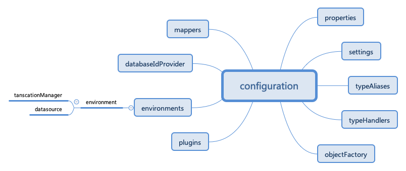
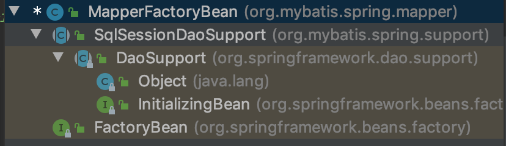
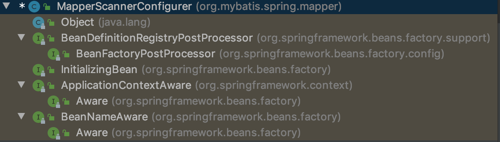

<!-- @import "[TOC]" {cmd="toc" depthFrom=1 depthTo=6 orderedList=false} -->

<!-- code_chunk_output -->

- [9 整合 Mybatis](#9-整合-mybatis)
  - [9.1 Mybatis 独立使用](#91-mybatis-独立使用)
  - [9.2 Spring 整合 Mybatis](#92-spring-整合-mybatis)
  - [9.3 源码分析](#93-源码分析)
    - [9.3.1 SqlSessionFactory 创建](#931-sqlsessionfactory-创建)
    - [9.3.2 MapperFactoryBan 的创建](#932-mapperfactoryban-的创建)
    - [9.3.3 MapperScannerConfigurer](#933-mapperscannerconfigurer)
      - [1. processPropertyPlaceHolders 属性的处理](#1-processpropertyplaceholders-属性的处理)
      - [2. 根据配置属性生成过滤器](#2-根据配置属性生成过滤器)
      - [3. 扫描 Java 文件](#3-扫描-java-文件)

<!-- /code_chunk_output -->

# 9 整合 Mybatis
&emsp;&emsp;Mybatis 本是 Apache 的一个开源项目 iBatis， 2010 年这个项目由Apache Software Foundation 迁移到了 Google Code，并且改名为 MyBatis。
&emsp;&emsp;Mybatis 是支持普通 SQL 查询、存储过程和高级映射的邮箱持久层架构。Mybatis消除了几乎所有的JDBC代码和参数的手工设置以及结果集的健硕。Mybatis 使用简单的XML或注解用于配置和原始映射，将接口和Java的POJOs(Plain Old Java Objects，普通的Java对象)映射成数据库中的记录。

## 9.1 Mybatis 独立使用
1. 建立PO
2. 建立Mapper
3. 建立配置文件
&emsp;&emsp;配置文件主要用于配置程序中科变性的设置，一个偏大的程序一定会存在一些经常会变化的变量，如果每次变化都需要改变源码那会是非常糟糕的设计，所以我们看到各种各样的框架或者引用的时候都免不了要配置文件，Mybatis 中的配置文件主要封装的 configuration 中，配置文件的基本结构：

* configuration: 根元素。
* properties：定义配置外在化
* settings:一些全局性的配置
* typAliases:为一些类定义别名。
* typeHandlers：定义类型处理，也就是定义Java类型与数据库中的数据类型之间的转换关系。
* objectFactory：用于指定结果集对象的实例是如何创建的。
* plugins:Mybatis的插件，插件可以修改Mybatis内部的运行规则。
* environments：环境。
* environment：配置Mybatis的环境。
* transactionManager：事务管理器。
* dataSource：数据源
* mapper：指定映射文件或映射类。
&emsp;&emsp;读者如果对上面的配置具体使用方法感兴趣，可以进一步查阅相关资料，这里只举出最简单的实例以方便读者快速回顾Mybatis。
 ```xml
<?xml version="1.0" encoding="UTF-8"?>
<!DOCTYPE configuration
        PUBLIC "-//mybatis.org//DTD Config 3.0//EN"
        "http://mybatis.org/dtd/mybatis-3-config.dtd">
<configuration>
    <settings>
        <setting name="cacheEnabled" value="false"/>
        <setting name="useGeneratedKeys" value="true"/>
        <setting name="defaultExecutorType" value="REUSE" />
    </settings>
    <typeAliases>
        <typeAlias alias="User" type="info.tonylee.studio.spring.jdbc.User"/>
    </typeAliases>
    <environments default="development">
        <environment id="development">
            <transactionManager type="jdbc"/>
            <dataSource type="POOLED">
                <property name="driver" value="com.mysql.jdbc.Driver"/>
                <property name="url" value="jdbc:mysql://localhost:3306/forum?useUnicode=true&amp;characterEncoding=utf-8"/>
                <property name="username" value="root"/>
                <property name="password" value="12345678"/>
            </dataSource>
        </environment>
    </environments>
    <mappers>
        <mapper resource="META-INF/mybatis/UserMapper.xml"/>
    </mappers>
</configuration>
 ```
4. 建立映射文件
 ```xml
<?xml version="1.0" encoding="UTF-8"?>
<!DOCTYPE mapper
        PUBLIC "-//mybatis.org//DTD Mapper 3.0//EN"
        "http://mybatis.org/dtd/mybatis-3-mapper.dtd">
<!--这里的 namespace 必须是 UserMapper 接口的路径，不然运行的时候要报错  "is not know to MapperRegistry"-->
<mapper namespace="info.tonylee.studio.spring.mybatis.UserMapper">
    <!-- 这里的id必须和UserMapper接口中的接口方法名相同，不然运行的时候也要报错 -->
    <insert id="insertUser" parameterType="User">
        insert into user(name,age) values(#{name},#{age})
    </insert>
    <select id="getUser" resultType="User" parameterType="java.lang.Integer">
        select * from user where id = #{id}
    </select>
</mapper>
 ```
5. 建立测试类
 ```java
 public class MybatisUtil {
    private final static SqlSessionFactory sqlSessionFactory;
    static {
        System.out.println(MybatisUtil.class.getResource(""));
        System.out.println(MybatisUtil.class.getClassLoader().getResource("META-INF/mybatis/mybatis-config.xml"));
        String resource = "META-INF/mybatis/mybatis-config.xml";
        Reader reader = null;
        try {
            reader = Resources.getResourceAsReader(resource);
        } catch (IOException e) {
            e.printStackTrace();
        }
        sqlSessionFactory = new SqlSessionFactoryBuilder().build(reader);
    }
    public static SqlSessionFactory getSqlSessionFactory() {
        return sqlSessionFactory;
    }
}

public class TestMapper{
    static SqlSessionFactory sqlSessionFactory = null;
    static{
        sqlSessionFactory = MybatisUtil.getSqlSessionFactory();
    }

    public void testAdd(){
        SqlSession sqlSession = sqlSessionFactory.openSession();
        try{
            UserMapper userMapper = sqlSession.getMapper(UserMapper.class);
            User user = new User("tony",new Integer(10));
            userMapper.insertUser(user);
            sqlSession.commit();
        }finally {
            sqlSession.close();
        }
    }

    public void getUser(){
        SqlSession sqlSession = sqlSessionFactory.openSession();
        try{
            UserMapper userMapper = sqlSession.getMapper(UserMapper.class);
            System.out.println(userMapper.getUser(1));
        }finally {
            sqlSession.close();
        }
    }

    public static void main(String[] args) {
        TestMapper testMapper = new TestMapper();
        testMapper.testAdd();
        testMapper.getUser();
    }
}
 ```
## 9.2 Spring 整合 Mybatis
&emsp;&emsp;了解了Mybatis的独立使用过程后，我们再看看它与Spring整合的使用方式，对比之前的示例来找出 Spring 究竟为我们做了哪些操作来简化程序员的业务开发。由于在上面的示例基础上做更改，所以，User与UserMapper保持不变。
1. Spring 配置文件
&emsp;&emsp;配置文件是 Spring 的核心，Spring 的所有操作也都是由配置文件开始的，所以，我们的示例也先从配置文件开始。
 ```xml
<?xml version="1.0" encoding="UTF-8"?>
<beans xmlns="http://www.springframework.org/schema/beans"
       xmlns:xsi="http://www.w3.org/2001/XMLSchema-instance"
       xsi:schemaLocation="http://www.springframework.org/schema/beans http://www.springframework.org/schema/beans/spring-beans.xsd">

    <bean id="dataSource" class="com.zaxxer.hikari.HikariDataSource" destroy-method="close">
        <property name="driverClassName" value="com.mysql.jdbc.Driver"/>
        <property name="jdbcUrl" value="jdbc:mysql://localhost:3306/forum?useUnicode=true&amp;characterEncoding=utf-8"/>
        <property name="username" value="root"/>
        <property name="password" value="12345678"/>
    </bean>

   <bean id="sqlSessionFactory" class="org.mybatis.spring.SqlSessionFactoryBean">
        <property name="configLocation" value="classpath:META-INF/mybatis/spring/spring-mybatis-config.xml"/>
        <property name="dataSource" ref="dataSource"/>
    </bean>

    <bean id="userMapper" class="org.mybatis.spring.mapper.MapperFactoryBean">
        <property name="mapperInterface" value="info.tonylee.studio.spring.mybatis.UserMapper"/>
        <property name="sqlSessionFactory" ref="sqlSessionFactory"/>
    </bean>
</beans>
 ```
&emsp;&emsp;对比之前独立使用 Mybatis 的配置文件，我们发现，之前在 environments 中设置的 dataSource 被转移到了 Spring 的核心配置文件中管理。而且，针对 Mybatis，注册了 org.mybatis.spring.SqlSessionFactoryBean 类型 bean，以及用于映射接口的 org.mybatis.spring.mapper.MapperFactoryBean，这两个bean的作用我们会稍后分析。
&emsp;&emsp;之前我们了解到，Mybatis的配置文件包含了诸多属性，虽然大多数情况我们都会保持 Mybatis 原有的风格，将Mybatis提供的配置文件包含了诸多属性，虽然大多数情况我们都会保持Mybatis原有风格，将Mybatis的配置文件独立出来，并在Spring中的org.mybatis.spring.SqlSessionFactoryBean类型的ban中通过configLocation属性引入，但是，这并不代表Spring 不支持直接配置。以上面的示例为例，你完全可以省去 spring-mybatis-config.xml ,而将其中的配置以属性的方式注入到 SqlSessionFactoryBean 中，至于每个属性名称以及用法，后续在分析。
2. Mybatis配置文件
&emsp;&emsp;对比独立使用Mybatis时的配置，当前的配置文件除了移除environements 配置外并没有太多的额变化。
 ```xml
 <?xml version="1.0" encoding="UTF-8"?>
<!DOCTYPE configuration
        PUBLIC "-//mybatis.org//DTD Config 3.0//EN"
        "http://mybatis.org/dtd/mybatis-3-config.dtd">
<configuration>
    <settings>
        <setting name="cacheEnabled" value="false"/>
        <setting name="useGeneratedKeys" value="true"/>
        <setting name="defaultExecutorType" value="REUSE" />
    </settings>
    <typeAliases>
        <typeAlias alias="User" type="info.tonylee.studio.spring.jdbc.User"/>
    </typeAliases>
    <mappers>
        <mapper resource="META-INF/mybatis/UserMapper.xml"/>
    </mappers>
</configuration>
 ```
3. 映射文件，保持不变
4. 测试
 ```java
public class SpringMybatisTest {
    public static void main(String[] args) {
        ApplicationContext applicationContext = new ClassPathXmlApplicationContext("META-INF/mybatis/spring/spring-datasource.xml");
        UserMapper userMapper = (UserMapper) applicationContext.getBean("userMapper");
        System.out.println(userMapper.getUser(1));
    }
}
 ```

## 9.3 源码分析
&emsp;&emsp;通过 Spring 整合 Mybatis 示例，我们感受到了 Spring 为用户更加快捷地开发所做的努力。那么 Spring 是如何实现的呢？ 通过分析整个示例的配置文件，我们可以知道配置的 bean 其实是成树形状结构的，而在树形的最顶层是类型为 org.mybatis.spring.SqlSessionFactoryBean 的 bean ，它将其他相关 bean 组装在了一起，那么我们就从 SqlSessionFactoryBean此类开始分析。
### 9.3.1 SqlSessionFactory 创建
&emsp;&emsp;通过配置文件我们分析，对于配置文件的读取解析，Spring 应该通过 org.mybatis.spring.SqlSessionFactoryBean 封装了 Mybatis 中的实现。我们进入这个类，首先查看这个类的层次结，如图：

&emsp;&emsp;根据这个类的层次结构找出我们感兴趣的两个接口，FactoryBean 和 InitializingBean 。
* InitializingBean : 实现此接口的bean会在初始化时调用其 afterPropertiesSet 方法来进行 bean 的逻辑初始化。
* FactoryBean : 一旦某个bean实现了此接口，那么通过 getBean 方法来获取 bean 时其实是获取此类的 getObject() 返回的实例
&emsp;&emsp;我们首先以 InitializingBean 接口的 afterPropertiesSet() 方法来看，SqlSessionFactoryBean 初始化时都做了哪些逻辑实现。
 ```java
  @Override
  public void afterPropertiesSet() throws Exception {
    notNull(dataSource, "Property 'dataSource' is required");
    notNull(sqlSessionFactoryBuilder, "Property 'sqlSessionFactoryBuilder' is required");
    state((configuration == null && configLocation == null) || !(configuration != null && configLocation != null),
        "Property 'configuration' and 'configLocation' can not specified with together");

    this.sqlSessionFactory = buildSqlSessionFactory();
  }
 ```
&emsp;&emsp;很显然，此函数主要目的就是对 sqlSessionFactory 的初始化，通过之前展示的独立使用 Mybatis 的示例，我们了解到 SqlSessionFactory 是所有 MyBatis 功能的基础。在 buildSqlSessionFactory 可以看到，尽管我们还是习惯于将 Mybatis 的配置与 Spring 的配置独立出来，但是这并不代表 Spring 中的配置不支持直接配置。也就是说，在上面的示例中，你完全可以取消 configLocation 属性，而把其中的属性直接写在 SqlSessionFactory 中。
&emsp;&emsp;从这个函数中可以得知，配置文件还支持其他多种属性的配置，如 configLocation、objectFactory、objectWrapperFactory、typeAliasesPackage、typeAliases、typeHandlersPackage、
typeHandlers、transactionFactory、databaseIdProvider、mapperLocations。
&emsp;&emsp;其实，如果按照常用配置，我们只需要在函数最开始按照如下方式处理 configuration:
 ```java
      xmlConfigBuilder = new XMLConfigBuilder(this.configLocation.getInputStream(), null, this.configurationProperties);
      targetConfiguration = xmlConfigBuilder.getConfiguration();
 ```
&emsp;&emsp;根据 configLocation 构造 XMLConfigBuilder 并进行解析，但是，为了体现Spring更强大的兼容性，Spring还整合了Mybatis中其他属性的注入，并通过实例 configuration来承载每一步说获取的信息并最终使用 sqlSessionFactoryBuilder 实例根据解析到的 configuration 创建 SqlSessionFactory 实例。

2. 获取 SqlSessionFactoryBean 实例
&emsp;&emsp;由于 SqlSessionFactoryBean 实现了 FactoryBean 接口，所以当通过 getBean 方法获取对应实例时，其实是获取该类的 getObject() 函数返回的实例，也就是获取初始化后的 sqlSessionFactory 属性。
 ```java
  @Override
  public SqlSessionFactory getObject() throws Exception {
    if (this.sqlSessionFactory == null) {
      afterPropertiesSet();
    }

    return this.sqlSessionFactory;
  }
 ```
### 9.3.2 MapperFactoryBan 的创建
&emsp;&emsp;为了使用 Mybatis 功能，示例中的 Spring 配置文件提供了两个 bean ，除了之前分析的 SqlSessionFactoryBean 类型的 bean 以外，还有一个是 MapperFactoryBean 类型的 bean。
&emsp;&emsp;结合两个测试用例综合分析，对于单独使用 Mybatis 的时候调用数据库接口的方式是：
 ```java
 UserMapper userMapper = sqlSession.getMapper(UserMapper.class);
 ```
&emsp;&emsp;而在这一过程中，其实是 Mybatis 在获取映射的过程中根据配置信息为 UserMapper 类型动态创建了代理类。而对于 Spring 的创建方式：
 ```java
 UserMapper userMapper = (UserMapper)context.getBean("userMapper");
 ```
&emsp;&emsp;Spring 中获取的名为 userMapper 的 bean，其实是单独使用 Mybatis 完成了一样的功能，那么我们可以推断，在 bean 的创建过程中一定是使用了 Mybatis 中原生方法 sqlSession.getMapper(UserMapper.class) 进行了再一次封装。结合配置文件，我们把分析目标转向 org.mybatis.spring.mapper.MapperFactoryBean，初步推测其中的逻辑应该在此类中实现。同样，还是首先查看类层次结构图 MapperFactoryBean,如图：

1. MapperFactoryBean 的初始化
&emsp;&emsp;因为实现了 InitializingBean 接口，Spring 会保证在 bean 初始化时首先调用 afterPropertiesSet 方法来完成其初始化逻辑。追踪父类，发现 afterPropertiesSet 方法是在 DaoSupport 类中实现，代码如下：
>org.springframework.dao.support.DaoSupport
 ```java
    public final void afterPropertiesSet() throws IllegalArgumentException, BeanInitializationException {
        this.checkDaoConfig();

        try {
            this.initDao();
        } catch (Exception var2) {
            throw new BeanInitializationException("Initialization of DAO failed", var2);
        }
    }
 ```
&emsp;&emsp;但从函数名称来看我们大体推测，MapperFactoryBean 的初始化包括对DAO配置的验证以及对DAO的初始工作，其中 initDao() 方法是模板方法，设计为留给子类做进一步逻辑处理。而checkDaoConfig()才是我们分析的重点。
 ```java
  @Override
  protected void checkDaoConfig() {
    super.checkDaoConfig();

    notNull(this.mapperInterface, "Property 'mapperInterface' is required");

    Configuration configuration = getSqlSession().getConfiguration();
    if (this.addToConfig && !configuration.hasMapper(this.mapperInterface)) {
      try {
        configuration.addMapper(this.mapperInterface);
      } catch (Exception e) {
        logger.error("Error while adding the mapper '" + this.mapperInterface + "' to configuration.", e);
        throw new IllegalArgumentException(e);
      } finally {
        ErrorContext.instance().reset();
      }
    }
  }
 ```
&emsp;&emsp;super.checkDaoConfig();在 SqlSessionDaoSupport 类中实现，代码如下：
 ```java
  @Override
  protected void checkDaoConfig() {
    notNull(this.sqlSessionTemplate, "Property 'sqlSessionFactory' or 'sqlSessionTemplate' are required");
  }
 ```
&emsp;&emsp;结合代码我们了解到对于DAO配置的验证，Spring 做了一下几个方面的工作。
* 父类中对于 sqlSession 不为空的验证。
&emsp;&emsp;sqlSession作为根据接口创建映射器代理的接触类一定不可以为空，而 sqlSession 的初始化工作是在设定其 sqlSessionFactory 属性时完成的。
 ```java
  public void setSqlSessionFactory(SqlSessionFactory sqlSessionFactory) {
    if (this.sqlSessionTemplate == null || sqlSessionFactory != this.sqlSessionTemplate.getSqlSessionFactory()) {
      this.sqlSessionTemplate = createSqlSessionTemplate(sqlSessionFactory);
    }
  }
 ```
&emsp;&emsp;也就是说，对于下面的配置如果忽略了对于 sqlSessionFactory 属性的设置，那么在此时会被检测出来。
 ```xml
    <bean id="userMapper" class="org.mybatis.spring.mapper.MapperFactoryBean">
        <property name="mapperInterface" value="info.tonylee.studio.spring.mybatis.UserMapper"/>
        <property name="sqlSessionFactory" ref="sqlSessionFactory"/>
    </bean>
 ```
* 映射接口的验证。
&emsp;&emsp;接口是映射器的基础，sqlSession 会根据接口动态创建响应的代理类，所以接口必不可少。
* 映射文件存在性验证。
&emsp;&emsp;对于函数前半部分的验证我们都很容易理解，无非是对配置文件中的属性是否存在做验证，但是后面部分是完成了什么方面的验证？如果读过 Mybatis 源码，你就会知道， 在Mybatis实现过程中并没有手动调用 configuration.addMapper 方法，而是在映射文件读取过程中一旦解析到如<mapper:namespace="xx.xxx">,便会自动进行类型映射的注册。那么，Spring 中为什么把这个功能单独拿出来放在验证里呢？这是不是多此一举呢？
&emsp;&emsp;在上面的函数中，configuration.addMapper(this.mapperInterface)其实就是将 UserMapper 注入到映射类型中，如果你可以保证这个接口一定存在对应的映射文件，那么其实这个验证并没有必要。但是，由于这个是我们自行决定的配置，无法保证这里配置的接口一定存在对应的映射文件，所以这里非常有必要进行验证。在执行此代码的时候，Mybatis 会检查嵌入的映射接口时候存在对应的映射文件，如果没有会抛出异常，Spring正式用这种方式来完成接口对应的映射文件存在性验证。

2. 获取 MapperFactoryBean 的实例
&emsp;&emsp;由于 MapperFactoryBean 实现了 FactoryBean 接口，所以当通过 getBean 方法获取对应实例的时候其实是获取该类的 getObject() 函数返回的实例。
 ```java
  @Override
  public T getObject() throws Exception {
    return getSqlSession().getMapper(this.mapperInterface);
  }
 ```
&emsp;&emsp;这段代码正是我们在提供 Mybatis 独立使用的时候的一个代码调用。 Spring 通过 FactoryBean 进行了封装。
### 9.3.3 MapperScannerConfigurer
&emsp;&emsp;我们在 applicationContext.xml 中配置了 userMapper 供需要时使用。但如果需要用到的映射器较多的话，采用这种配置方式就显得很抵消。为了解决这个问题，我们可以使用 MapperScannerConfigurer，让它扫描特定的包，自动帮我们成批地创建映射器。这样一来，就能大大减少配置的工作量，比如我们将 applicationContext.xml 文件中的配置改成如下：
 ```xml
    <!-- 其他配置省略 -->
    <!--
    <bean id="userMapper" class="org.mybatis.spring.mapper.MapperFactoryBean">
        <property name="mapperInterface" value="info.tonylee.studio.spring.mybatis.UserMapper"/>
        <property name="sqlSessionFactory" ref="sqlSessionFactory"/>
    </bean>
    -->
    <bean class="org.mybatis.spring.mapper.MapperScannerConfigurer">
        <property name="basePackage" value="info.tonylee.studio.spring.mybatis"/>
    </bean>
 ```
&emsp;&emsp;在上面的配置中，我们屏蔽掉了原始的代码(userMapper的创建)而增加了 MapperScannerConfigurer 的配置， basePackage 属性是让你为映射器文件设置基本的包路径。你可以使用分号或逗号作为分隔符设置多于一个的包路径。每个映射器将会在指定的包路径中递归地被搜索到。被发现的映射器将会使用Spring对自动侦测组件默认的命名策略来命名。也就是说，如果没有发现注解，它就会使用映射器的非大写的非完全限定类名。但是如果发现了 @Component 或 JSR-330@Name注解，他就会获取名称。
&emsp;&emsp;通过上面的配置，Spring 就会帮助我们对 nfo.tonylee.studio.spring.mybatis 下面的所有接口进行自动的注入，而不需要为每个接口重复在 Spring 配置文件中进行声明了。那么这个功能又是如何做到的呢？MapperScanner Configurer 中又有哪些核心操作呢？ 同样，首先查看类的层次结构图，如图：

&emsp;&emsp;我们又看到了 InitalizingBean，马上查找类的 afterPropertiesSet 方法来看看类的初始化逻辑。
 ```java
  @Override
  public void afterPropertiesSet() throws Exception {
    notNull(this.basePackage, "Property 'basePackage' is required");
  }
 ```
&emsp;&emsp;没有任何逻辑实现，只能说我们找错了地方，继续找，查看 MapperScannerConfigurer 类中对于 BeanDefinitionRegistryPostProcessor 接口的实现。
 ```java
  @Override
  public void postProcessBeanDefinitionRegistry(BeanDefinitionRegistry registry) {
    if (this.processPropertyPlaceHolders) {
      processPropertyPlaceHolders();
    }

    ClassPathMapperScanner scanner = new ClassPathMapperScanner(registry);
    scanner.setAddToConfig(this.addToConfig);
    scanner.setAnnotationClass(this.annotationClass);
    scanner.setMarkerInterface(this.markerInterface);
    scanner.setSqlSessionFactory(this.sqlSessionFactory);
    scanner.setSqlSessionTemplate(this.sqlSessionTemplate);
    scanner.setSqlSessionFactoryBeanName(this.sqlSessionFactoryBeanName);
    scanner.setSqlSessionTemplateBeanName(this.sqlSessionTemplateBeanName);
    scanner.setResourceLoader(this.applicationContext);
    scanner.setBeanNameGenerator(this.nameGenerator);
    scanner.setMapperFactoryBeanClass(this.mapperFactoryBeanClass);
    if (StringUtils.hasText(lazyInitialization)) {
      scanner.setLazyInitialization(Boolean.valueOf(lazyInitialization));
    }
    if (StringUtils.hasText(defaultScope)) {
      scanner.setDefaultScope(defaultScope);
    }
    scanner.registerFilters();
    scanner.scan(
        StringUtils.tokenizeToStringArray(this.basePackage, ConfigurableApplicationContext.CONFIG_LOCATION_DELIMITERS));
  }
 ```
&emsp;&emsp;大致看一下代码实现，正式完成了对指定目录扫描的逻辑。那么我们就以此为入口，详细的分析 MapperScannerConfigurer 说提供的逻辑实现。

#### 1. processPropertyPlaceHolders 属性的处理
&emsp;&emsp;首先，难题就是 processPropertyPlaceHolders 属性的处理。或许读者并未过多接触此属性，我们只能查看 processPropertyPlaceHolders() 函数来反推此属性所代表的的功能。
 ```java
  /*
   * BeanDefinitionRegistries are called early in application startup, before BeanFactoryPostProcessors. This means that
   * PropertyResourceConfigurers will not have been loaded and any property substitution of this class' properties will
   * fail. To avoid this, find any PropertyResourceConfigurers defined in the context and run them on this class' bean
   * definition. Then update the values.
   */
  private void processPropertyPlaceHolders() {
    Map<String, PropertyResourceConfigurer> prcs = applicationContext.getBeansOfType(PropertyResourceConfigurer.class,
        false, false);

    if (!prcs.isEmpty() && applicationContext instanceof ConfigurableApplicationContext) {
      BeanDefinition mapperScannerBean = ((ConfigurableApplicationContext) applicationContext).getBeanFactory()
          .getBeanDefinition(beanName);

      // PropertyResourceConfigurer does not expose any methods to explicitly perform
      // property placeholder substitution. Instead, create a BeanFactory that just
      // contains this mapper scanner and post process the factory.
      DefaultListableBeanFactory factory = new DefaultListableBeanFactory();
      factory.registerBeanDefinition(beanName, mapperScannerBean);

      for (PropertyResourceConfigurer prc : prcs.values()) {
        prc.postProcessBeanFactory(factory);
      }

      PropertyValues values = mapperScannerBean.getPropertyValues();

      this.basePackage = getPropertyValue("basePackage", values);
      this.sqlSessionFactoryBeanName = getPropertyValue("sqlSessionFactoryBeanName", values);
      this.sqlSessionTemplateBeanName = getPropertyValue("sqlSessionTemplateBeanName", values);
      this.lazyInitialization = getPropertyValue("lazyInitialization", values);
      this.defaultScope = getPropertyValue("defaultScope", values);
    }
    this.basePackage = Optional.ofNullable(this.basePackage).map(getEnvironment()::resolvePlaceholders).orElse(null);
    this.sqlSessionFactoryBeanName = Optional.ofNullable(this.sqlSessionFactoryBeanName)
        .map(getEnvironment()::resolvePlaceholders).orElse(null);
    this.sqlSessionTemplateBeanName = Optional.ofNullable(this.sqlSessionTemplateBeanName)
        .map(getEnvironment()::resolvePlaceholders).orElse(null);
    this.lazyInitialization = Optional.ofNullable(this.lazyInitialization).map(getEnvironment()::resolvePlaceholders)
        .orElse(null);
    this.defaultScope = Optional.ofNullable(this.defaultScope).map(getEnvironment()::resolvePlaceholders).orElse(null);
  }
 ```
&emsp;&emsp;BeanDefinitionRegistries 会在应用启动的时候调用，并且会早于 BeanFactoryPostProcessor 的调用，这就意味着 PropertyResourceConfigurers 还没有被加载所有对属性文件的引用将会失效。为了避免此情况发生，此方法手动的找出定义的 PropertyResourceConfigurers 并进行提前调用以保证对属性的引用可以正常工作。
&emsp;&emsp;结合之前讲过的 PropertyResourceConfigurers 的用法，举例说明一下，如果要创建配置文件 如 test.properties ，并添加属性对，并在配置文件中加入文件解析器，修改 MapperScannerConfigurer 类型的 bean 的定义，value 通过配置文件读取 value=${basePackages}。此时，你会发现，这个配置并没有达到预期的效果，因为在解析 ${basePackage}的时候 PropertyPlaceholderConfigurer 还没有被调用，也就是属性文件中的属性还没有加载至内存中，Spring 还不能字节使用它。为了解决这个问题，Spring 提供了 processPropertyPlaceHolders属性设置为 true。

&emsp;&emsp;现在我们我们可以再来看这个函数说做的事情。
1. 找到所有已经注册的 PropertyResourceConfigurer 类型的bean。
2. 模拟 Spring 中的环境来处理器。这里通过使用 new DefaultListableBeanFactory() 来模拟 Spring 中的环境(完成处理器的调用后便实效)，将银色的 bean， 也就是 MapperScannerConfigurer 类型 bean 主导到环境中来进行后置处理器的调用，处理器 PropertyPlaceholderConfigurer 调用完成的功能，即找出所有 bean 中应用属性文件的变量并替换。也就是说，在处理器调用后，模拟环境中模拟的 MapperScannerConfigurer 类型的 bean 如果引入属性文件中的属性都已经被替换了，这是，再将模拟 bean 中相关的属性提取出来应用在真实的bean中。

#### 2. 根据配置属性生成过滤器
&emsp;&emsp;在 postProcessBeanDefinitionRegistry 方法中可以看到，配置中支持很多属性的设定，但是我们感兴趣的或者说影响扫描结果的并不多，属性设置后通过在 scanner.registerFilters() 代码中生成对应的过滤器来控制扫描结果。
 ```java
 public void registerFilters() {
    boolean acceptAllInterfaces = true;

    // if specified, use the given annotation and / or marker interface
    // 对给定的 annotationClass 属性做处理
    if (this.annotationClass != null) {
      addIncludeFilter(new AnnotationTypeFilter(this.annotationClass));
      acceptAllInterfaces = false;
    }

    // override AssignableTypeFilter to ignore matches on the actual marker interface
    // 对于 markerInterface 属性的处理
    if (this.markerInterface != null) {
      addIncludeFilter(new AssignableTypeFilter(this.markerInterface) {
        @Override
        protected boolean matchClassName(String className) {
          return false;
        }
      });
      acceptAllInterfaces = false;
    }

    if (acceptAllInterfaces) {
      // default include filter that accepts all classes
      addIncludeFilter((metadataReader, metadataReaderFactory) -> true);
    }

    // exclude package-info.java
    // 不扫描 package-info.java
    addExcludeFilter((metadataReader, metadataReaderFactory) -> {
      String className = metadataReader.getClassMetadata().getClassName();
      return className.endsWith("package-info");
    });
  }
 ```
&emsp;&emsp;代码中得知，根据之前属性配置生成了对应的过滤器。
1. annotationClass 属性处理。
如果annotationClass不为空，表示用户设置了此属性，表示用户设置了此属性，那么就要根据此属性生成了过滤器以保证达到用户想要的结果，而封装此属性的过滤器就是 AnnotationTypeFilter。 AnnotationTypeFilter 保证在扫描对应 Java 文件时只接受标记有注解为 annotationClass 的接口。
2. markerInterface 属性处理。
&emsp;&emsp;如果 markerInterface 不为空，表示用户设置了此属性，那么就要根据此属性生成过滤器以保证达到用户想要的效果，而封装此属性的过滤器就是实现 AssignableTypeFilter 接口的局部类。表示扫描过程中只有实现 markerInterface 接口才会被接受。
3. 全局默认处理。
&emsp;&emsp;在上面两个属性中如果存在其中任何属性，acceptAllInterface 的值将会被改变，但是如果用户没有设定以上两个值，那么，Spring 会为我们增加一个默认的过滤器实现 TypeFilter 接口的局部类，旨在接受所有接口文件。
4. package-info.java处理。
&emsp;&emsp;对于命名为 package-info 的Java文件，默认不做逻辑实现接口，将其排除，使用TypeFilter接口的局部类实现match方法。
&emsp;&emsp;从上面的函数我们看出，控制扫描文件 Spring 通过不同的过滤器完成，这次定义的过滤器记录在了 includeFilters 和 excludeFilters 属性中。
 ```java
    public void addIncludeFilter(TypeFilter includeFilter) {
        this.includeFilters.add(includeFilter);
    }

    public void addExcludeFilter(TypeFilter excludeFilter) {
        this.excludeFilters.add(0, excludeFilter);
    }
 ```
&emsp;&emsp;至于过滤器为什么会早扫描过程中起作用，我们在讲解扫描实现时再继续深入研究。

#### 3. 扫描 Java 文件
&emsp;&emsp;设置了相关属性以及生成了对应的过滤器后便可以进行文件的扫描了，扫描工作是由 ClassPathMapperScanner 类型的实例 scanner 中的 scan 方法完成。
 ```java
    public int scan(String... basePackages) {
		int beanCountAtScanStart = this.registry.getBeanDefinitionCount();

		doScan(basePackages);

		// Register annotation config processors, if necessary.
		// 如果配置了 includeAnnotationConfig， 则注册对应注解的处理器以保证注解功能的正常使用。
		if (this.includeAnnotationConfig) {
			AnnotationConfigUtils.registerAnnotationConfigProcessors(this.registry);
		}

		return (this.registry.getBeanDefinitionCount() - beanCountAtScanStart);
	}
 ```
&emsp;&emsp;scan 是个全局方法，扫描工作通过 doScan(basePackages)委托给了doScan方法，同时，还包括了 includeAnnotationConfig 属性的处理， AnnotationConfigUtils.registerAnnotationConfigProcessors(this.registry);代码主要是完成对于注解处理器的简单注册，比如 AutowiredAnnotationBeanPostProcessor、 RequiredAnnotationBeanPostProcessor 等。由于 ClassPathMapperScanner 继承 ClassPathBeanDefinitionScanner doScan 由 ClassPathMapperScanner 重写了。因此 真正的扫描工作是由 ClassPathMapperScanner 完成的。
> ClassPathMapperScanner.java
 ```java
 @Override
  public Set<BeanDefinitionHolder> doScan(String... basePackages) {
    Set<BeanDefinitionHolder> beanDefinitions = super.doScan(basePackages);

    if (beanDefinitions.isEmpty()) {
      LOGGER.warn(() -> "No MyBatis mapper was found in '" + Arrays.toString(basePackages)
          + "' package. Please check your configuration.");
    } else {
      processBeanDefinitions(beanDefinitions);
    }

    return beanDefinitions;
  }

  private void processBeanDefinitions(Set<BeanDefinitionHolder> beanDefinitions) {
    AbstractBeanDefinition definition;
    BeanDefinitionRegistry registry = getRegistry();
    for (BeanDefinitionHolder holder : beanDefinitions) {
      definition = (AbstractBeanDefinition) holder.getBeanDefinition();
      boolean scopedProxy = false;
      if (ScopedProxyFactoryBean.class.getName().equals(definition.getBeanClassName())) {
        definition = (AbstractBeanDefinition) Optional
            .ofNullable(((RootBeanDefinition) definition).getDecoratedDefinition())
            .map(BeanDefinitionHolder::getBeanDefinition).orElseThrow(() -> new IllegalStateException(
                "The target bean definition of scoped proxy bean not found. Root bean definition[" + holder + "]"));
        scopedProxy = true;
      }
      String beanClassName = definition.getBeanClassName();
      LOGGER.debug(() -> "Creating MapperFactoryBean with name '" + holder.getBeanName() + "' and '" + beanClassName
          + "' mapperInterface");

      // the mapper interface is the original class of the bean
      // but, the actual class of the bean is MapperFactoryBean
      definition.getConstructorArgumentValues().addGenericArgumentValue(beanClassName); // issue #59
      definition.setBeanClass(this.mapperFactoryBeanClass);

      definition.getPropertyValues().add("addToConfig", this.addToConfig);

      // Attribute for MockitoPostProcessor
      // https://github.com/mybatis/spring-boot-starter/issues/475
      definition.setAttribute(FACTORY_BEAN_OBJECT_TYPE, beanClassName);

      boolean explicitFactoryUsed = false;
      if (StringUtils.hasText(this.sqlSessionFactoryBeanName)) {
        definition.getPropertyValues().add("sqlSessionFactory",
            new RuntimeBeanReference(this.sqlSessionFactoryBeanName));
        explicitFactoryUsed = true;
      } else if (this.sqlSessionFactory != null) {
        definition.getPropertyValues().add("sqlSessionFactory", this.sqlSessionFactory);
        explicitFactoryUsed = true;
      }

      if (StringUtils.hasText(this.sqlSessionTemplateBeanName)) {
        if (explicitFactoryUsed) {
          LOGGER.warn(
              () -> "Cannot use both: sqlSessionTemplate and sqlSessionFactory together. sqlSessionFactory is ignored.");
        }
        definition.getPropertyValues().add("sqlSessionTemplate",
            new RuntimeBeanReference(this.sqlSessionTemplateBeanName));
        explicitFactoryUsed = true;
      } else if (this.sqlSessionTemplate != null) {
        if (explicitFactoryUsed) {
          LOGGER.warn(
              () -> "Cannot use both: sqlSessionTemplate and sqlSessionFactory together. sqlSessionFactory is ignored.");
        }
        definition.getPropertyValues().add("sqlSessionTemplate", this.sqlSessionTemplate);
        explicitFactoryUsed = true;
      }

      if (!explicitFactoryUsed) {
        LOGGER.debug(() -> "Enabling autowire by type for MapperFactoryBean with name '" + holder.getBeanName() + "'.");
        definition.setAutowireMode(AbstractBeanDefinition.AUTOWIRE_BY_TYPE);
      }

      definition.setLazyInit(lazyInitialization);

      if (scopedProxy) {
        continue;
      }

      if (ConfigurableBeanFactory.SCOPE_SINGLETON.equals(definition.getScope()) && defaultScope != null) {
        definition.setScope(defaultScope);
      }

      if (!definition.isSingleton()) {
        BeanDefinitionHolder proxyHolder = ScopedProxyUtils.createScopedProxy(holder, registry, true);
        if (registry.containsBeanDefinition(proxyHolder.getBeanName())) {
          registry.removeBeanDefinition(proxyHolder.getBeanName());
        }
        registry.registerBeanDefinition(proxyHolder.getBeanName(), proxyHolder.getBeanDefinition());
      }

    }
  }
 ```
&emsp;&emsp;声明  MapperScannerConfigurer 类型的 bean 目的是不需要我们对每个接口都注册一个 MapperFactoryBean 类型对应的 bean ，但是， 不再配置文件中注册并不代表这个 bean 不存在，而是在扫描的过程中通过编码的方式动态注册。实现过程我们在上面的函数中可以看得非常清楚。
> ClassPathBeanDefinitionScanner.java
 ```java
    protected Set<BeanDefinitionHolder> doScan(String... basePackages) {
		Assert.notEmpty(basePackages, "At least one base package must be specified");
		Set<BeanDefinitionHolder> beanDefinitions = new LinkedHashSet<>();
		for (String basePackage : basePackages) {
			//扫描 basePackage 路径下java 文件
			Set<BeanDefinition> candidates = findCandidateComponents(basePackage);
			for (BeanDefinition candidate : candidates) {
				// 解析 scope 属性
				ScopeMetadata scopeMetadata = this.scopeMetadataResolver.resolveScopeMetadata(candidate);
				candidate.setScope(scopeMetadata.getScopeName());
				String beanName = this.beanNameGenerator.generateBeanName(candidate, this.registry);
				if (candidate instanceof AbstractBeanDefinition) {
					postProcessBeanDefinition((AbstractBeanDefinition) candidate, beanName);
				}
				if (candidate instanceof AnnotatedBeanDefinition) {
					//如果是 AnnotatedBeanDefinition 类型的 bean， 需要检查下常用注解 如：Primary、Lazy 等
					AnnotationConfigUtils.processCommonDefinitionAnnotations((AnnotatedBeanDefinition) candidate);
				}
				// 检查当前bean是否已经注册
				if (checkCandidate(beanName, candidate)) {
					BeanDefinitionHolder definitionHolder = new BeanDefinitionHolder(candidate, beanName);
					// 如果当前bean是用于生成代理的 bean 那么需要进一步处理
					definitionHolder =
							AnnotationConfigUtils.applyScopedProxyMode(scopeMetadata, definitionHolder, this.registry);
					beanDefinitions.add(definitionHolder);
					registerBeanDefinition(definitionHolder, this.registry);
				}
			}
		}
		return beanDefinitions;
	}
    public Set<BeanDefinition> findCandidateComponents(String basePackage) {
		if (this.componentsIndex != null && indexSupportsIncludeFilters()) {
			return addCandidateComponentsFromIndex(this.componentsIndex, basePackage);
		}
		else {
			return scanCandidateComponents(basePackage);
		}
	}
 ```
&emsp;&emsp;findCandidateComponents 方法根据传人的包路径信息并结合类文件路径拼接成文件的绝对路径，同时完成了文件的扫描过程并且根据对应的文件生成了对应的 bean ，使用 ScannedGenericBeanDefinition 类型的 bean 承载信息， bean 中只记录了 resource 和 source 信息。 这里，我们更感兴趣的是 isCandidateComponent(metadataReader)，此句代码用于判断当前扫描
的文件是否符合要求，而我们之前注册的一些过滤器信息也正是在此时派上用场的 。

 ```java
    protected boolean isCandidateComponent(MetadataReader metadataReader) throws IOException {
		for (TypeFilter tf : this.excludeFilters) {
			if (tf.match(metadataReader, getMetadataReaderFactory())) {
				return false;
			}
		}
		for (TypeFilter tf : this.includeFilters) {
			if (tf.match(metadataReader, getMetadataReaderFactory())) {
				return isConditionMatch(metadataReader);
			}
		}
		return false;
	}
 ```
&emsp;&emsp;我们看到了之前加入过滤器的两个属性 excludeFilters、 includeFilters，井且知道对应的文件是否符合要求是根据过滤器中的 match 方法所返回的信息来判断的，当然用户可以实现并注册满足自己业务逻辑的过滤器来控制扫描的结果， metadataReader 中有你过滤所需要的全部文件信息。 至此，我们完成了文件的扫描过程的分析 。