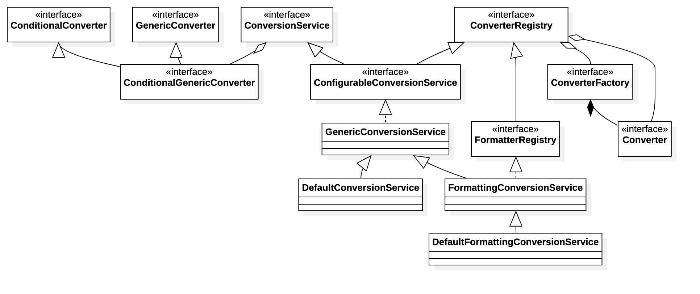

<!-- @import "[TOC]" {cmd="toc" depthFrom=1 depthTo=6 orderedList=false} -->

<!-- code_chunk_output -->

- [Spring 的配置资源](#spring-的配置资源)
  - [1. PropertySource](#1-propertysource)
    - [EnumerablePropertySource](#enumerablepropertysource)
  - [2. PropertySources](#2-propertysources)
    - [MutablePropertySources](#mutablepropertysources)
  - [3. PropertyResolver](#3-propertyresolver)
    - [ConfigurablePropertyResolver](#configurablepropertyresolver)
    - [PropertySourcesPropertyResolver](#propertysourcespropertyresolver)
    - [PropertyPlaceholderHelper](#propertyplaceholderhelper)
    - [ConversionService](#conversionservice)

<!-- /code_chunk_output -->

# Spring 的配置资源
&emsp;&emsp;先看下 spring `PropertySource` 相关的类图

&emsp;&emsp;从类图上，我们可以看到三个根接口或抽象类：

1. **PropertySource**
&emsp;&emsp;`PropertySource` 抽象类，定了一个 name/value 的配置类，但是一般不单独使用，而是通过 `PropertySources` 和 PropertyResolver 来处理。我们来看下它的源码：
1. **PropertySources**
&emsp;&emsp;`PropertySources` 是一个接口，包含一个或多个`PropertySource`的持有。其实就是一个 `PropertySource` 的集合接口。
1. **PropertyResolver**
&emsp;&emsp;`PropertyResolver` 也是一个接口，主要是针对任何潜来源，解析 properties 属性。

## 1. PropertySource
&emsp;&emsp;我们先看看 `PropertySource` 的定义：
 ```java
 public abstract class PropertySource<T> {

	protected final Log logger = LogFactory.getLog(getClass());

	protected final String name;

	protected final T source;


	/**
	 * Create a new {@code PropertySource} with the given name and source object.
	 * 创建一个资源
	 */
	public PropertySource(String name, T source) {
		Assert.hasText(name, "Property source name must contain at least one character");
		Assert.notNull(source, "Property source must not be null");
		this.name = name;
		this.source = source;
	}

	/**
	 * Create a new {@code PropertySource} with the given name and with a new
	 * {@code Object} instance as the underlying source.
	 * <p>Often useful in testing scenarios when creating anonymous implementations
	 * that never query an actual source but rather return hard-coded values.
	 */
	@SuppressWarnings("unchecked")
	public PropertySource(String name) {
		this(name, (T) new Object());
	}


	/**
	 * Return the name of this {@code PropertySource}.
	 */
	public String getName() {
		return this.name;
	}

	/**
	 * Return the underlying source object for this {@code PropertySource}.
	 */
	public T getSource() {
		return this.source;
	}

	/**
	 * Return whether this {@code PropertySource} contains the given name.
	 * <p>This implementation simply checks for a {@code null} return value
	 * from {@link #getProperty(String)}. Subclasses may wish to implement
	 * a more efficient algorithm if possible.
	 * @param name the property name to find
	 */
	public boolean containsProperty(String name) {
		return (getProperty(name) != null);
	}

	/**
	 * Return the value associated with the given name,
	 * or {@code null} if not found.
	 * @param name the property to find
	 * @see PropertyResolver#getRequiredProperty(String)
	 */
	@Nullable
	public abstract Object getProperty(String name);


	/**
	 * This {@code PropertySource} object is equal to the given object if:
	 * <ul>
	 * <li>they are the same instance
	 * <li>the {@code name} properties for both objects are equal
	 * </ul>
	 * <p>No properties other than {@code name} are evaluated.
	 */
	@Override
	public boolean equals(@Nullable Object other) {
		return (this == other || (other instanceof PropertySource &&
				ObjectUtils.nullSafeEquals(this.name, ((PropertySource<?>) other).name)));
	}

	/**
	 * Return a hash code derived from the {@code name} property
	 * of this {@code PropertySource} object.
	 */
	@Override
	public int hashCode() {
		return ObjectUtils.nullSafeHashCode(this.name);
	}

	/**
	 * Produce concise output (type and name) if the current log level does not include
	 * debug. If debug is enabled, produce verbose output including the hash code of the
	 * PropertySource instance and every name/value property pair.
	 * <p>This variable verbosity is useful as a property source such as system properties
	 * or environment variables may contain an arbitrary number of property pairs,
	 * potentially leading to difficult to read exception and log messages.
	 * @see Log#isDebugEnabled()
	 */
	@Override
	public String toString() {
		if (logger.isDebugEnabled()) {
			return getClass().getSimpleName() + "@" + System.identityHashCode(this) +
					" {name='" + this.name + "', properties=" + this.source + "}";
		}
		else {
			return getClass().getSimpleName() + " {name='" + this.name + "'}";
		}
	}


	/**
	 * Return a {@code PropertySource} implementation intended for collection comparison purposes only.
	 * <p>Primarily for internal use, but given a collection of {@code PropertySource} objects, may be
	 * used as follows:
	 * <pre class="code">
	 * {@code List<PropertySource<?>> sources = new ArrayList<PropertySource<?>>();
	 * sources.add(new MapPropertySource("sourceA", mapA));
	 * sources.add(new MapPropertySource("sourceB", mapB));
	 * assert sources.contains(PropertySource.named("sourceA"));
	 * assert sources.contains(PropertySource.named("sourceB"));
	 * assert !sources.contains(PropertySource.named("sourceC"));
	 * }</pre>
	 * The returned {@code PropertySource} will throw {@code UnsupportedOperationException}
	 * if any methods other than {@code equals(Object)}, {@code hashCode()}, and {@code toString()}
	 * are called.
	 * @param name the name of the comparison {@code PropertySource} to be created and returned.
	 */
	public static PropertySource<?> named(String name) {
		return new ComparisonPropertySource(name);
	}


	/**
	 * {@code PropertySource} to be used as a placeholder in cases where an actual
	 * property source cannot be eagerly initialized at application context
	 * creation time.  For example, a {@code ServletContext}-based property source
	 * must wait until the {@code ServletContext} object is available to its enclosing
	 * {@code ApplicationContext}.  In such cases, a stub should be used to hold the
	 * intended default position/order of the property source, then be replaced
	 * during context refresh.
	 * @see org.springframework.context.support.AbstractApplicationContext#initPropertySources()
	 * @see org.springframework.web.context.support.StandardServletEnvironment
	 * @see org.springframework.web.context.support.ServletContextPropertySource
	 */
	public static class StubPropertySource extends PropertySource<Object> {

		public StubPropertySource(String name) {
			super(name, new Object());
		}

		/**
		 * Always returns {@code null}.
		 */
		@Override
		@Nullable
		public String getProperty(String name) {
			return null;
		}
	}


	/**
	 * A {@code PropertySource} implementation intended for collection comparison
	 * purposes.
	 *
	 * @see PropertySource#named(String)
	 */
	static class ComparisonPropertySource extends StubPropertySource {

		private static final String USAGE_ERROR =
				"ComparisonPropertySource instances are for use with collection comparison only";

		public ComparisonPropertySource(String name) {
			super(name);
		}

		@Override
		public Object getSource() {
			throw new UnsupportedOperationException(USAGE_ERROR);
		}

		@Override
		public boolean containsProperty(String name) {
			throw new UnsupportedOperationException(USAGE_ERROR);
		}

		@Override
		@Nullable
		public String getProperty(String name) {
			throw new UnsupportedOperationException(USAGE_ERROR);
		}
	}

 }
 ```
&emsp;&emsp;这里我们主要讲一下 `containsProperty` 和 `named` 方法
&emsp;&emsp;`named`方法为了创建一个 `ComparisonPropertySource`，与`eqauls`配合，判断 `PropertySource` 集合，否存在 `name` 的的配置 `PropertySource`,通过注释我们我们可以看到相关的说明。通过`equals`方法的重写，判断两个 `PropertySource` 是否相同。
&emsp;&emsp;`containsProperty`方法是直接调用 `getProperty` 也就是说，具体的实现是由子类来处理的。
&emsp;&emsp;接下来我们在看看他的实现类。

### EnumerablePropertySource
&emsp;&emsp;看过类图我们应该都已经知道了 `EnumerablePropertySource` 实现了`PropertySource`，其他所有的相关子类，都是继承至它。
&emsp;&emsp;从命名 `Enumerable` 可以看出，该 `PropertySource` 是一个可列举 `PropertySource`;我们来看看它的源码：
 ```java
 public abstract class EnumerablePropertySource<T> extends PropertySource<T> {

	public EnumerablePropertySource(String name, T source) {
		super(name, source);
	}

	protected EnumerablePropertySource(String name) {
		super(name);
	}


	/**
	 * Return whether this {@code PropertySource} contains a property with the given name.
	 * <p>This implementation checks for the presence of the given name within the
	 * {@link #getPropertyNames()} array.
	 * @param name the name of the property to find
	 */
	@Override
	public boolean containsProperty(String name) {
		return ObjectUtils.containsElement(getPropertyNames(), name);
	}

	/**
	 * Return the names of all properties contained by the
	 * {@linkplain #getSource() source} object (never {@code null}).
	 */
	public abstract String[] getPropertyNames();

 }
 ```
&emsp;&emsp;可以看到只多增加了一个 getPropertyNames 的方法，实现了 containsProperty 方法。主要是为了询问基础源对象，以枚举所有可能的 name/value。
下面我们就来看看下面的主要几个子类实现：
1. **MapPropertySource**
&emsp;&emsp;通过这个定义，就能明白，是一个以`map`为 `PropertySource` 的`source`的 name/value 对象。其源码很简单就不解释了。
1. **CommandLinePropertySource**
&emsp;&emsp;命令行的 propertySource 主要用于 一些 JOpt 和 spring 启动参数的命令行的配置。

## 2. PropertySources
&emsp;&emsp;先看下 `PropertySources` 的定义
 ```java
public interface PropertySources extends Iterable<PropertySource<?>> 
 ```
一个以 `PropertySource` 为对象的可迭代的对象，也就是可以用 获取`Iterator` 迭代器，用于迭代或通过foreach遍历所有的 `PropertySource`；
主要看两个方法
 ```java
 //判断name的PropertySource是否存在
 boolean contains(String name);
 //根据name获取PropertySource
 PropertySource<?> get(String name);
 ```
### MutablePropertySources
 ```java
 public class MutablePropertySources implements PropertySources {
	private final List<PropertySource<?>> propertySourceList = new CopyOnWriteArrayList<>();
	...
	@Override
	public boolean contains(String name) {
		return this.propertySourceList.contains(PropertySource.named(name));
	}

	@Override
	@Nullable
	public PropertySource<?> get(String name) {
		int index = this.propertySourceList.indexOf(PropertySource.named(name));
		return (index != -1 ? this.propertySourceList.get(index) : null);
	}
	...
 }
 ```
&emsp;&emsp;可以看到 `MutablePropertySources` 中其实就使用到 `CopyOnWriteArrayList` 来管理多个`PropertySource`;
&emsp;&emsp;这里的`contains`和`get`方法，就可以看到 `PropertySource` 中的`named`的用途了。其中的判断，都是通过获取一个`PropertySource`然后来对比，是否存在或去获取。

## 3. PropertyResolver
&emsp;&emsp; `PropertyResolver` 是一个用于解析所有基础源资源的属性的接口；
&emsp;&emsp;我们前面讲到的 PropertySource、PropertySources 都是属于资源。PropertySource 中`source`的属性才是 PropertyResolver 解析的对象。
其中的很多方法定义:
 ```java
 public interface PropertyResolver {

	//该key的property是否存在
	boolean containsProperty(String key);

	//获取该key 的property 
	@Nullable
	String getProperty(String key);

	//获取该 key 的property，默认值
	String getProperty(String key, String defaultValue);

	//获取该 key 的 property 返回指定类型
	@Nullable
	<T> T getProperty(String key, Class<T> targetType);

	//同上，加个默认值
	<T> T getProperty(String key, Class<T> targetType, T defaultValue);

	//获取必需的property
	String getRequiredProperty(String key) throws IllegalStateException;

	//获取必需的property,返回指定类型
	<T> T getRequiredProperty(String key, Class<T> targetType) throws IllegalStateException;

	//通过 getProperty 替换占位符
	String resolvePlaceholders(String text);

	//同上，并且如果未能解析占位符且没有默认值，则抛出 IllegalArgumentException 异常
	String resolveRequiredPlaceholders(String text) throws IllegalArgumentException;

 }
 ```
可以看到 `PropertyResolver` 就是提供获取配置的一些相关基础功能，比如获取、判断、替换占位符。

### ConfigurablePropertyResolver
&emsp;&emsp;`ConfigurablePropertyResolver`也是个接口，通过名字我们大概可以看出，可配置的解析接口。我们来看下相关的方法定义
 ```java
 public interface ConfigurablePropertyResolver extends PropertyResolver {

	//获取 ConfigurableConversionService
	ConfigurableConversionService getConversionService();

	//设置 ConfigurableConversionService
	void setConversionService(ConfigurableConversionService conversionService);

	//设置占位符前缀
	void setPlaceholderPrefix(String placeholderPrefix);

	//设置占位符后缀
	void setPlaceholderSuffix(String placeholderSuffix);

	//设置占位符和默认值之间的分隔符
	void setValueSeparator(@Nullable String valueSeparator);

    //设置配置中的占位符，如果不能解析，是否抛出异常
	void setIgnoreUnresolvableNestedPlaceholders(boolean ignoreUnresolvableNestedPlaceholders);

	//设置必需配置名
	void setRequiredProperties(String... requiredProperties);

	//根据 #setRequiredProperties 验证
	void validateRequiredProperties() throws MissingRequiredPropertiesException;

 }
 ```
可以看出 `ConfigurablePropertyResolver` 提供了额外的一些扩展功能，例如设置设置占位符的前后缀、设置占位符解析的情况，设置必需的配置。另外我们需要讲一下 `ConfigurableConversionService`
 ```java
 public interface ConfigurableConversionService extends ConversionService, ConverterRegistry {
 }
 ```
继承于`ConversionService`、`ConverterRegistry` 主要做相关的类型转换。这里就不详细介绍相关的设计和逻辑了。

### PropertySourcesPropertyResolver
&emsp;&emsp;`PropertySourcesPropertyResolver`继承至`AbstractPropertyResolver`,`AbstractPropertyResolver`是一个抽象类实现ConfigurablePropertyResolver的相关接口。并且实现了很多基础功能；。
&emsp;&emsp;下面我们主要看一下`AbstractPropertyResolver`几个主要的方法：
>AbstractPropertyResolver
 ```java
 	/**
	 * 获取指定一个property
	 * @param key the property name to resolve
	 * @return
	 */
	@Override
	@Nullable
	public String getProperty(String key) {
		//<T> T getProperty(String key, Class<T> targetType);这个方法由子类自行实现
		return getProperty(key, String.class);
	}
	/**
	 * 解析占位符的方法
	 * @param text the String to resolve
	 * @return
	 */
	@Override
	public String resolvePlaceholders(String text) {
		if (this.nonStrictHelper == null) {
			this.nonStrictHelper = createPlaceholderHelper(true);
		}
		return doResolvePlaceholders(text, this.nonStrictHelper);
	}

	@Override
	public String resolveRequiredPlaceholders(String text) throws IllegalArgumentException {
		if (this.strictHelper == null) {
			this.strictHelper = createPlaceholderHelper(false);
		}
		return doResolvePlaceholders(text, this.strictHelper);
	}
	/**
	 * 真正解析占位符的方法，是委托给helper处理的
	 * @param text
	 * @param helper
	 * @return
	 */
	private String doResolvePlaceholders(String text, PropertyPlaceholderHelper helper) {
		return helper.replacePlaceholders(text, this::getPropertyAsRawString);
	}
 ```
 接下来我们再来看看`PropertySourcesPropertyResolver`
  ```java
	@Nullable
	protected <T> T getProperty(String key, Class<T> targetValueType, boolean resolveNestedPlaceholders) {
		//判断propertySources存在不
		if (this.propertySources != null) {
			//循环 propertySources
			for (PropertySource<?> propertySource : this.propertySources) {
				if (logger.isTraceEnabled()) {
					logger.trace("Searching for key '" + key + "' in PropertySource '" +
							propertySource.getName() + "'");
				}
				//通过 propertySource 查找key，由于每个propertySource自己都实现了自己的getProperty方法
				Object value = propertySource.getProperty(key);
				if (value != null) {
					//一般情况下都是 resolveNestedPlaceholders = true 并且value 是 String 的情况下解析占位符
					if (resolveNestedPlaceholders && value instanceof String) {
						value = resolveNestedPlaceholders((String) value);
					}
					//日志记录
					logKeyFound(key, propertySource, value);
					//有需要的话转换为需要的数据类型
					return convertValueIfNecessary(value, targetValueType);
				}
			}
		}
		if (logger.isTraceEnabled()) {
			logger.trace("Could not find key '" + key + "' in any property source");
		}
		return null;
	}
  ```
上面的代码其实挺简单，就是轮训 `propertySources` 获取 `propertSource` 中的值,并解析占位符，有需要还可以做类型的转换。这里看到我们在做占位符解析和类型转换时，其实都是委托给其他类完成。接下来我们就来看看`PropertyPlaceholderHelper` 和 实现接口`ConversionService`的类。

### PropertyPlaceholderHelper
我们先来看看它的构造方法
 ```java
 public PropertyPlaceholderHelper(String placeholderPrefix, String placeholderSuffix) {
		this(placeholderPrefix, placeholderSuffix, null, true);
	}

 public PropertyPlaceholderHelper(String placeholderPrefix, String placeholderSuffix,
			@Nullable String valueSeparator, boolean ignoreUnresolvablePlaceholders) {

		Assert.notNull(placeholderPrefix, "'placeholderPrefix' must not be null");
		Assert.notNull(placeholderSuffix, "'placeholderSuffix' must not be null");
		//设置占位符前缀、后缀
		this.placeholderPrefix = placeholderPrefix;
		this.placeholderSuffix = placeholderSuffix;
		//获取一个简单的前缀
		String simplePrefixForSuffix = wellKnownSimplePrefixes.get(this.placeholderSuffix);
		if (simplePrefixForSuffix != null && this.placeholderPrefix.endsWith(simplePrefixForSuffix)) {
			this.simplePrefix = simplePrefixForSuffix;
		}
		else {
			this.simplePrefix = this.placeholderPrefix;
		}
		//设置值分隔符
		this.valueSeparator = valueSeparator;
		//是否忽略解析占位符失败
		this.ignoreUnresolvablePlaceholders = ignoreUnresolvablePlaceholders;
	}
 ```
接下来，我们就需要看看，如何将占位符替换成真正的 property 
 ```java
	public String replacePlaceholders(String value, PlaceholderResolver placeholderResolver) {
		Assert.notNull(value, "'value' must not be null");
		return parseStringValue(value, placeholderResolver, null);
	}

	protected String parseStringValue(
			String value, PlaceholderResolver placeholderResolver, @Nullable Set<String> visitedPlaceholders) {
		//查看当前值，是否有占位符前缀，有代表为站位符，无是真正的配置数据
		int startIndex = value.indexOf(this.placeholderPrefix);
		if (startIndex == -1) {
			return value;
		}

		StringBuilder result = new StringBuilder(value);
		while (startIndex != -1) {
			//查找占位符后缀的下标，这里会默认找到对应的一个例如 ${${xx.xx}},那么首先获取到的应该是最后一个'}'下标
			int endIndex = findPlaceholderEndIndex(result, startIndex);
			if (endIndex != -1) {
				//获取到占位符
				String placeholder = result.substring(startIndex + this.placeholderPrefix.length(), endIndex);
				//赋值给 originalPlaceholder
				String originalPlaceholder = placeholder;
				//创建一个第一次集合，放置访问过的站位符，避免循环依赖
				if (visitedPlaceholders == null) {
					visitedPlaceholders = new HashSet<>(4);
				}
				//如果添加占位符不成功，说明已经本次解析使用过该占位符，同一个占位符解析中，不同相同名字的占位符，这里是避免循环依赖的情况，例如 : a = ${b} b = ${a}
				if (!visitedPlaceholders.add(originalPlaceholder)) {
					throw new IllegalArgumentException(
							"Circular placeholder reference '" + originalPlaceholder + "' in property definitions");
				}
				// Recursive invocation, parsing placeholders contained in the placeholder key.
				//根据获取到的占位符进行递归解析 类似于 a = ${${c}} 这种情况
				placeholder = parseStringValue(placeholder, placeholderResolver, visitedPlaceholders);
				// Now obtain the value for the fully resolved key...
				//传递一个 placeholderResolver 获取占位符的值。
				String propVal = placeholderResolver.resolvePlaceholder(placeholder);
				if (propVal == null && this.valueSeparator != null) {
					//判断是否有 property-value 的分隔符 如果有，则设置默认值
					int separatorIndex = placeholder.indexOf(this.valueSeparator);
					if (separatorIndex != -1) {
						String actualPlaceholder = placeholder.substring(0, separatorIndex);
						String defaultValue = placeholder.substring(separatorIndex + this.valueSeparator.length());
						//获取真正的 property value
						propVal = placeholderResolver.resolvePlaceholder(actualPlaceholder);
						if (propVal == null) {
							propVal = defaultValue;
						}
					}
				}
				if (propVal != null) {
					// Recursive invocation, parsing placeholders contained in the
					// previously resolved placeholder value.
					// 再次递归解析，如果解析出来的 property-value 中包含的占位符 如 a = ${b},b = ${c},c = c
					propVal = parseStringValue(propVal, placeholderResolver, visitedPlaceholders);
					// 将最终的占位符的值进行替换
					result.replace(startIndex, endIndex + this.placeholderSuffix.length(), propVal);
					if (logger.isTraceEnabled()) {
						logger.trace("Resolved placeholder '" + placeholder + "'");
					}
					startIndex = result.indexOf(this.placeholderPrefix, startIndex + propVal.length());
				}
				else if (this.ignoreUnresolvablePlaceholders) {
					// Proceed with unprocessed value.
					startIndex = result.indexOf(this.placeholderPrefix, endIndex + this.placeholderSuffix.length());
				}
				else {
					throw new IllegalArgumentException("Could not resolve placeholder '" +
							placeholder + "'" + " in value \"" + value + "\"");
				}
				visitedPlaceholders.remove(originalPlaceholder);
			}
			else {
				//未找到后缀下标 则将开始下标也置为-1，跳出循环
				startIndex = -1;
			}
		}
		return result.toString();
	}
 ```
&emsp;&emsp;可以看到解析站位符的方法，其实逻辑上并不复杂，使用递归，解析对应的嵌套占位符。同时使用一个set类型的变量`visitedPlaceholders`存储当前解析的占位符，判断循环依赖的问题。

### ConversionService
&emsp;&emsp;`ConversionService`用于类型转换的服务接口。这是转换系统的入口点。调用{@link #convert(Object, Class)}来使用这个系统执行线程安全类型转换。
先看看它的类图：

来说明一下具体几个接口的主要定义：
* **Converter**:
&emsp;&emsp;转换器将一个类型转换的数据为另外一个类型。同时由于其加了`@FunctionalInterface`注解，因此它是安全的，同时也需要共享。实现它的同时，一般需要实现 `GenericConverter`
* **GenericConverter**:
&emsp;&emsp;一个用于一个或多个类型之间转换的通用转换器。
```java
 public interface GenericConverter {

	//返回一个可转换的列表
	@Nullable
	Set<ConvertiblePair> getConvertibleTypes();

	//将 source Object 转换成 TypeDescriptor 为 targetType；
	@Nullable
	Object convert(@Nullable Object source, TypeDescriptor sourceType, TypeDescriptor targetType);

	/**
	 * Holder for a source-to-target class pair.
	 */
	final class ConvertiblePair {

		private final Class<?> sourceType;

		private final Class<?> targetType;

		//
		public ConvertiblePair(Class<?> sourceType, Class<?> targetType) {
			Assert.notNull(sourceType, "Source type must not be null");
			Assert.notNull(targetType, "Target type must not be null");
			this.sourceType = sourceType;
			this.targetType = targetType;
		}
		...
	}

 }
 ```
&emsp;&emsp;可以看到通用转换器中有个 `ConvertiblePair` ,它的作用就是可以转换的类型。通过方法 getConvertibleTypes 可以知道这个通用转换器 支持哪些类型转换
* **ConditionalConverter**:
&emsp;&emsp;一个条件转换接口，允许 Converter,GenericConverter,ConverterFactory 根据 sourceType 和 targetType 的属性 条件转换。 例如 String 转为 Date 当目标使用了 @DateTimeFormat 注释，则实现可能返回true;或者是一个 String 转换成 一个 Account 如果目标 Account 类定义了公共的静态方法 findAccount(String arg),则实现可能会返回true。
&emsp;&emsp;`ConditionalConverter`的定义很简单，就一个方法,用于判断可以将 sourceType 转换成 targetType
 ```java
 boolean matches(TypeDescriptor sourceType, TypeDescriptor targetType);
 ```
* **ConverterFactory**:
&emsp;&emsp;转换器的工厂。其定义也很简单，就是一个获取对应的 `Converter` 的方法
* ConverterRegistry:
&emsp;&emsp;类型转换系统中转换器的注册器。注册器，就提供一些注册方法和注销方法，主要是一些add和remove 方法，这里就不贴源码了。不过需要注意的一点是， `ConverterRegistry` 同时支持注册 `ConverterFactory`
* **ConversionService**:
&emsp;&emsp;用于类型转换服务的接口，整个spring convert系统中的入口，调用 convert(Object,Class)时此系统执行线程安全的类型转换。
我们来看看它的相关方法定义。
 ```java
 public interface ConversionService {

	//判断 souceType 能够转换成 targetType
	boolean canConvert(@Nullable Class<?> sourceType, Class<?> targetType);

	//判断 sourceType 能否转换成 targetType
	boolean canConvert(@Nullable TypeDescriptor sourceType, TypeDescriptor targetType);

	//将 source 转换为 targetType 类型
	@Nullable
	<T> T convert(@Nullable Object source, Class<T> targetType);

	//将类型为 sourceType 的 source 转换为 targetType
	@Nullable
	Object convert(@Nullable Object source, @Nullable TypeDescriptor sourceType, TypeDescriptor targetType);

}
 ```
&emsp;&emsp;整个转换系统的入口是 ConversionService 那么我们就来看看，其相关的实现类吧。
>GenericConversionService
 ```java
 
 ```
