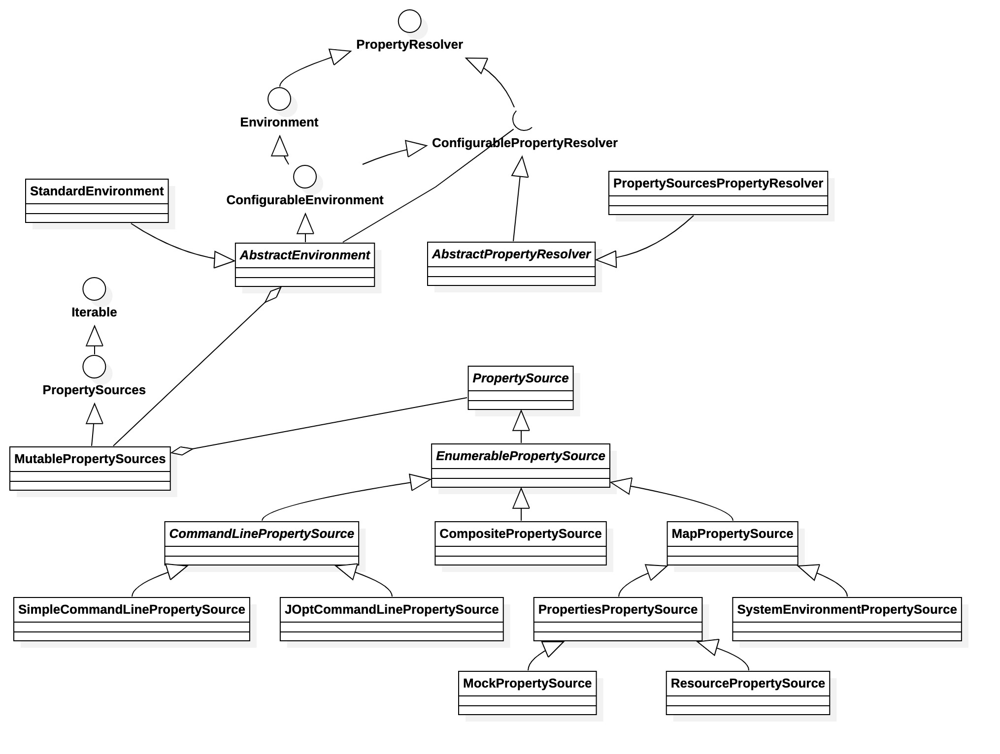

<!-- @import "[TOC]" {cmd="toc" depthFrom=1 depthTo=6 orderedList=false} -->

<!-- code_chunk_output -->

- [Spring 的配置资源](#spring-的配置资源)
  - [1. PropertySource](#1-propertysource)
    - [EnumerablePropertySource](#enumerablepropertysource)
  - [2. PropertySources](#2-propertysources)
    - [MutablePropertySources](#mutablepropertysources)
  - [3. PropertyResolver](#3-propertyresolver)
    - [ConfigurablePropertyResolver](#configurablepropertyresolver)

<!-- /code_chunk_output -->

# Spring 的配置资源
&emsp;&emsp;先看下 spring `PropertySource` 相关的类图

&emsp;&emsp;从类图上，我们可以看到三个根接口或抽象类：

1. **PropertySource**
&emsp;&emsp;`PropertySource` 抽象类，定了一个 name/value 的配置类，但是一般不单独使用，而是通过 `PropertySources` 和 PropertyResolver 来处理。我们来看下它的源码：
1. **PropertySources**
&emsp;&emsp;`PropertySources` 是一个接口，包含一个或多个`PropertySource`的持有。其实就是一个 `PropertySource` 的集合接口。
1. **PropertyResolver**
&emsp;&emsp;`PropertyResolver` 也是一个接口，主要是针对任何潜来源，解析 properties 属性。

## 1. PropertySource
&emsp;&emsp;我们先看看 `PropertySource` 的定义：
 ```java
 public abstract class PropertySource<T> {

	protected final Log logger = LogFactory.getLog(getClass());

	protected final String name;

	protected final T source;


	/**
	 * Create a new {@code PropertySource} with the given name and source object.
	 * 创建一个资源
	 */
	public PropertySource(String name, T source) {
		Assert.hasText(name, "Property source name must contain at least one character");
		Assert.notNull(source, "Property source must not be null");
		this.name = name;
		this.source = source;
	}

	/**
	 * Create a new {@code PropertySource} with the given name and with a new
	 * {@code Object} instance as the underlying source.
	 * <p>Often useful in testing scenarios when creating anonymous implementations
	 * that never query an actual source but rather return hard-coded values.
	 */
	@SuppressWarnings("unchecked")
	public PropertySource(String name) {
		this(name, (T) new Object());
	}


	/**
	 * Return the name of this {@code PropertySource}.
	 */
	public String getName() {
		return this.name;
	}

	/**
	 * Return the underlying source object for this {@code PropertySource}.
	 */
	public T getSource() {
		return this.source;
	}

	/**
	 * Return whether this {@code PropertySource} contains the given name.
	 * <p>This implementation simply checks for a {@code null} return value
	 * from {@link #getProperty(String)}. Subclasses may wish to implement
	 * a more efficient algorithm if possible.
	 * @param name the property name to find
	 */
	public boolean containsProperty(String name) {
		return (getProperty(name) != null);
	}

	/**
	 * Return the value associated with the given name,
	 * or {@code null} if not found.
	 * @param name the property to find
	 * @see PropertyResolver#getRequiredProperty(String)
	 */
	@Nullable
	public abstract Object getProperty(String name);


	/**
	 * This {@code PropertySource} object is equal to the given object if:
	 * <ul>
	 * <li>they are the same instance
	 * <li>the {@code name} properties for both objects are equal
	 * </ul>
	 * <p>No properties other than {@code name} are evaluated.
	 */
	@Override
	public boolean equals(@Nullable Object other) {
		return (this == other || (other instanceof PropertySource &&
				ObjectUtils.nullSafeEquals(this.name, ((PropertySource<?>) other).name)));
	}

	/**
	 * Return a hash code derived from the {@code name} property
	 * of this {@code PropertySource} object.
	 */
	@Override
	public int hashCode() {
		return ObjectUtils.nullSafeHashCode(this.name);
	}

	/**
	 * Produce concise output (type and name) if the current log level does not include
	 * debug. If debug is enabled, produce verbose output including the hash code of the
	 * PropertySource instance and every name/value property pair.
	 * <p>This variable verbosity is useful as a property source such as system properties
	 * or environment variables may contain an arbitrary number of property pairs,
	 * potentially leading to difficult to read exception and log messages.
	 * @see Log#isDebugEnabled()
	 */
	@Override
	public String toString() {
		if (logger.isDebugEnabled()) {
			return getClass().getSimpleName() + "@" + System.identityHashCode(this) +
					" {name='" + this.name + "', properties=" + this.source + "}";
		}
		else {
			return getClass().getSimpleName() + " {name='" + this.name + "'}";
		}
	}


	/**
	 * Return a {@code PropertySource} implementation intended for collection comparison purposes only.
	 * <p>Primarily for internal use, but given a collection of {@code PropertySource} objects, may be
	 * used as follows:
	 * <pre class="code">
	 * {@code List<PropertySource<?>> sources = new ArrayList<PropertySource<?>>();
	 * sources.add(new MapPropertySource("sourceA", mapA));
	 * sources.add(new MapPropertySource("sourceB", mapB));
	 * assert sources.contains(PropertySource.named("sourceA"));
	 * assert sources.contains(PropertySource.named("sourceB"));
	 * assert !sources.contains(PropertySource.named("sourceC"));
	 * }</pre>
	 * The returned {@code PropertySource} will throw {@code UnsupportedOperationException}
	 * if any methods other than {@code equals(Object)}, {@code hashCode()}, and {@code toString()}
	 * are called.
	 * @param name the name of the comparison {@code PropertySource} to be created and returned.
	 */
	public static PropertySource<?> named(String name) {
		return new ComparisonPropertySource(name);
	}


	/**
	 * {@code PropertySource} to be used as a placeholder in cases where an actual
	 * property source cannot be eagerly initialized at application context
	 * creation time.  For example, a {@code ServletContext}-based property source
	 * must wait until the {@code ServletContext} object is available to its enclosing
	 * {@code ApplicationContext}.  In such cases, a stub should be used to hold the
	 * intended default position/order of the property source, then be replaced
	 * during context refresh.
	 * @see org.springframework.context.support.AbstractApplicationContext#initPropertySources()
	 * @see org.springframework.web.context.support.StandardServletEnvironment
	 * @see org.springframework.web.context.support.ServletContextPropertySource
	 */
	public static class StubPropertySource extends PropertySource<Object> {

		public StubPropertySource(String name) {
			super(name, new Object());
		}

		/**
		 * Always returns {@code null}.
		 */
		@Override
		@Nullable
		public String getProperty(String name) {
			return null;
		}
	}


	/**
	 * A {@code PropertySource} implementation intended for collection comparison
	 * purposes.
	 *
	 * @see PropertySource#named(String)
	 */
	static class ComparisonPropertySource extends StubPropertySource {

		private static final String USAGE_ERROR =
				"ComparisonPropertySource instances are for use with collection comparison only";

		public ComparisonPropertySource(String name) {
			super(name);
		}

		@Override
		public Object getSource() {
			throw new UnsupportedOperationException(USAGE_ERROR);
		}

		@Override
		public boolean containsProperty(String name) {
			throw new UnsupportedOperationException(USAGE_ERROR);
		}

		@Override
		@Nullable
		public String getProperty(String name) {
			throw new UnsupportedOperationException(USAGE_ERROR);
		}
	}

 }
 ```
&emsp;&emsp;这里我们主要讲一下 `containsProperty` 和 `named` 方法
&emsp;&emsp;`named`方法为了创建一个 `ComparisonPropertySource`，与`eqauls`配合，判断 `PropertySource` 集合，否存在 `name` 的的配置 `PropertySource`,通过注释我们我们可以看到相关的说明。通过`equals`方法的重写，判断两个 `PropertySource` 是否相同。
&emsp;&emsp;`containsProperty`方法是直接调用 `getProperty` 也就是说，具体的实现是由子类来处理的。
&emsp;&emsp;接下来我们在看看他的实现类。

### EnumerablePropertySource
&emsp;&emsp;看过类图我们应该都已经知道了 `EnumerablePropertySource` 实现了`PropertySource`，其他所有的相关子类，都是继承至它。
&emsp;&emsp;从命名 `Enumerable` 可以看出，该 `PropertySource` 是一个可列举 `PropertySource`;我们来看看它的源码：
 ```java
 public abstract class EnumerablePropertySource<T> extends PropertySource<T> {

	public EnumerablePropertySource(String name, T source) {
		super(name, source);
	}

	protected EnumerablePropertySource(String name) {
		super(name);
	}


	/**
	 * Return whether this {@code PropertySource} contains a property with the given name.
	 * <p>This implementation checks for the presence of the given name within the
	 * {@link #getPropertyNames()} array.
	 * @param name the name of the property to find
	 */
	@Override
	public boolean containsProperty(String name) {
		return ObjectUtils.containsElement(getPropertyNames(), name);
	}

	/**
	 * Return the names of all properties contained by the
	 * {@linkplain #getSource() source} object (never {@code null}).
	 */
	public abstract String[] getPropertyNames();

 }
 ```
&emsp;&emsp;可以看到只多增加了一个 getPropertyNames 的方法，实现了 containsProperty 方法。主要是为了询问基础源对象，以枚举所有可能的 name/value。
下面我们就来看看下面的主要几个子类实现：
1. **MapPropertySource**
&emsp;&emsp;通过这个定义，就能明白，是一个以`map`为 `PropertySource` 的`source`的 name/value 对象。其源码很简单就不解释了。
1. **CommandLinePropertySource**
&emsp;&emsp;命令行的 propertySource 主要用于 一些 JOpt 和 spring 启动参数的命令行的配置。

## 2. PropertySources
&emsp;&emsp;先看下 `PropertySources` 的定义
 ```java
public interface PropertySources extends Iterable<PropertySource<?>> 
 ```
一个以 `PropertySource` 为对象的可迭代的对象，也就是可以用 获取`Iterator` 迭代器，用于迭代或通过foreach遍历所有的 `PropertySource`；
主要看两个方法
 ```java
 //判断name的PropertySource是否存在
 boolean contains(String name);
 //根据name获取PropertySource
 PropertySource<?> get(String name);
 ```
### MutablePropertySources
 ```java
 public class MutablePropertySources implements PropertySources {
	private final List<PropertySource<?>> propertySourceList = new CopyOnWriteArrayList<>();
	...
	@Override
	public boolean contains(String name) {
		return this.propertySourceList.contains(PropertySource.named(name));
	}

	@Override
	@Nullable
	public PropertySource<?> get(String name) {
		int index = this.propertySourceList.indexOf(PropertySource.named(name));
		return (index != -1 ? this.propertySourceList.get(index) : null);
	}
	...
 }
 ```
&emsp;&emsp;可以看到 `MutablePropertySources` 中其实就使用到 `CopyOnWriteArrayList` 来管理多个`PropertySource`;
&emsp;&emsp;这里的`contains`和`get`方法，就可以看到 `PropertySource` 中的`named`的用途了。其中的判断，都是通过获取一个`PropertySource`然后来对比，是否存在或去获取。

## 3. PropertyResolver
&emsp;&emsp; `PropertyResolver` 是一个用于解析所有基础源资源的属性的接口；
&emsp;&emsp;我们前面讲到的 PropertySource、PropertySources 都是属于资源。PropertySource 中`source`的属性才是 PropertyResolver 解析的对象。
其中的很多方法定义:
 ```java
 public interface PropertyResolver {

	//该key的property是否存在
	boolean containsProperty(String key);

	//获取该key 的property 
	@Nullable
	String getProperty(String key);

	//获取该 key 的property，默认值
	String getProperty(String key, String defaultValue);

	//获取该 key 的 property 返回指定类型
	@Nullable
	<T> T getProperty(String key, Class<T> targetType);

	//同上，加个默认值
	<T> T getProperty(String key, Class<T> targetType, T defaultValue);

	//获取必需的property
	String getRequiredProperty(String key) throws IllegalStateException;

	//获取必需的property,返回指定类型
	<T> T getRequiredProperty(String key, Class<T> targetType) throws IllegalStateException;

	//通过 getProperty 替换占位符
	String resolvePlaceholders(String text);

	//同上，必需限制
	String resolveRequiredPlaceholders(String text) throws IllegalArgumentException;

 }
 ```
可以看到 `PropertyResolver` 就是提供解析配置的相关方法。

### ConfigurablePropertyResolver
&emsp;&emsp;`ConfigurablePropertyResolver`也是个接口，通过名字我们大概可以看出，可配置的解析接口。我们来看下相关的方法定义
 ```java
 public interface ConfigurablePropertyResolver extends PropertyResolver {

	//获取 ConfigurableConversionService
	ConfigurableConversionService getConversionService();

	//设置 ConfigurableConversionService
	void setConversionService(ConfigurableConversionService conversionService);

	//设置占位符前缀
	void setPlaceholderPrefix(String placeholderPrefix);

	//设置占位符后缀
	void setPlaceholderSuffix(String placeholderSuffix);

	//设置占位符和默认值之间的分隔符
	void setValueSeparator(@Nullable String valueSeparator);

    //设置配置中的占位符，如果不能解析，是否抛出异常
	void setIgnoreUnresolvableNestedPlaceholders(boolean ignoreUnresolvableNestedPlaceholders);

	//设置必需配置名
	void setRequiredProperties(String... requiredProperties);

	//根据 #setRequiredProperties 验证
	void validateRequiredProperties() throws MissingRequiredPropertiesException;

 }
 ```
