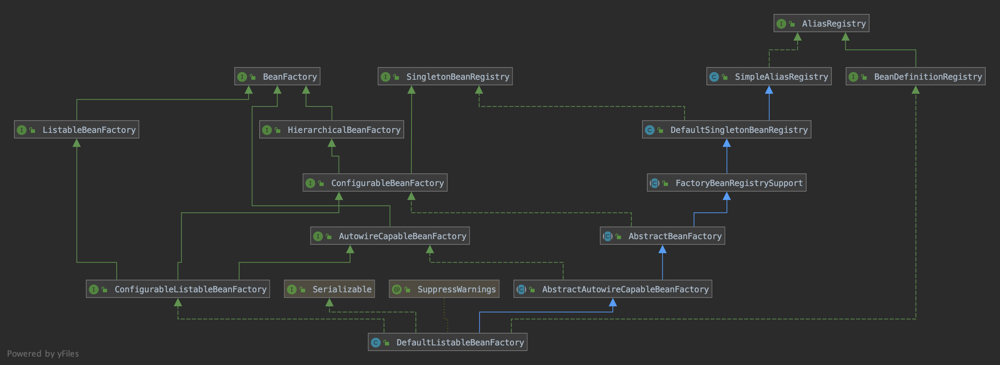
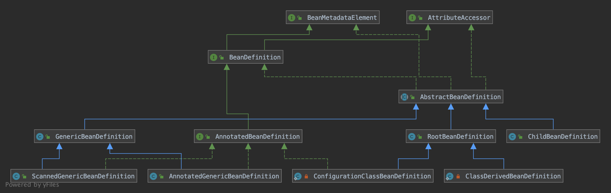

# Spring 源码阅读总结
&emsp;&emsp;Spring源码的阅读，可以让大家了解Spring的核心能力是如何实现的。
## Spring 核心
&emsp;&emsp;Core Container 核心容器，包含了 Core 、 Bean 、 Context 和 Expression Language 模块。
&emsp;&emsp;Core和Bean模块是框架的基础部分，提供了IoC(控制反转)和DI(依赖注入特性)。
&emsp;&emsp;既然主要的功能是IoC和DI，那么我们可以想想，如果我们自己想要实现IoC和DI。那么我们需要怎么处理呢？我们就来简单的分析下：

1. 首先我们得知道哪些对象需要被容器托管。
1. 我们需要将什么对象注入到什么对象中。通过什么方式匹配注入的对象。
1. 容器如何来创建对象。创建的对象的作用域(单例，property等)；
1. 通过什么方式来进行依赖注入。
1. 通过容器来获取对象。

&emsp;&emsp;当然这里的描述不一定准确，我们只是为大概的描述一下。接下来我们就来分析如何实现根据上面的逻辑。

1. 首先我们通过xml来声明哪些对象需要被容器托管。
1. 我们需要一个Reader或者Loader来加载读取xml文件的和Parser来解析我们的xml，并用一个Register来保存我们解析的声明对象。
1. 需要有一个创建对象的Factory类，来根据Register中保存的对象信息，并且创建对应的作用域对象。
1. 需要检测当前的对象，能否通过构造函数注入，如果不能，通过set注入。那么是否考虑循环依赖的问题？
1. 通过我们创建对象的Factory来获取对应的对象。

&emsp;&emsp;以上就是我们可能需要涉及到的相关类或者方法。上面主要涉及的几个组件，读取XML的Reader或者Loader，解析XML的Parser，一个保存类信息的Register，一个既可以创建对象也可以获取对象的Factory。其实这就是一个非常简陋的一个IoC框架了，那么Spring又是如何实现的呢，其实大体的逻辑上是一样的，但是Spring的设计和实现不可能这么简单，其实现的功能也更加强大，同时增加了强大的扩展性。
&emsp;&emsp;既然说Spring的实现和我们刚才分析的差不多，那么它到底是如何实现的呢。既然IoC中，所有的对象都委托给了容器来处理。那么我们就从Spring的核心容器开始分析。DefaultListableBeanFactory 就是 Spring 的一个核心容器。它提供了远远超过我们上面所提到的`Register` 和 `Factory` 的功能。
&emsp;&emsp;我们先来看看 DefaultListableBeanFactory 相关类图

&emsp;&emsp;从上面的类图，我们先来简单的了解下各个类的作用。
* `AliasRegistry` : 定义alias(别名)的简单增删改等操作。
* `SimpleAliasRegistry` : 主要使用map作为alias的缓存， 并对接口 AliasRegistry 进行实现。
* `SingletonBeanRegistry` : 定义对单例的注册及实现。通过 `BeanFactory` 实现单例，以便统一的公开它们的单例管理功能。
* `BeanFactory` : 用于访问 spring bean 容器的根接口，定义获取 bean 及 判断 bean 的各种属性。
* `DefaultSingletonBeanRegistry` : 针对接口 SingletonBeanRegistry 的实现，同时继承 SimpleAliasRegistry。
* `BeanDefinitionRegistry` : 继承 AliasRegistry ,定义对 *BeanDefinition* 的各种增删改操作。
* `HierarchicalBeanFactory` : 继承 `BeanFactory`,也就是在 BeanFactory 定义的功能的基础上增加了对 *parentFactory* 的支持。
* `FactoryBeanRegistrySupport` : 在 DefaultSingletonBeanRegistry 基础上增加了对 *FactoryBean* 的特殊处理。
* `ConfigurableBeanFactory` : 继承 HierarchicalBeanFactory 和  SingletonBeanRegistry, 提供配置BeanFactory方法。Spring的一些扩展功能就是通过这个接口定义的一些方法进行配置的。
* `ListableBeanFactory` : 根据各种条件获取 bean 的配置清单。
* `AbstractBeanFactory` : 抽象类， 综合 FactoryBeanRegistrySupport 和 FactoryBeanRegistrySupport 的功能
* `AutowireCapableBeanFactory` : 提供创建 bean 、自动注入、初始化以及应用bean的后处理器。
* `AbstractAutowireCapableBeanFactory` : 综合 AbstractBeanFactory 并对接口 AutowireCapableBeanFactory 进行实现
* `ConfigurableListableBeanFactory` : BeanFacotry 配置清单，让BeanFactory配置：制定忽略类型及接口。
* `DefaultListableBeanFactory` : 综合上面所有功能，主要是对 bean 注册后的处理。

&emsp;&emsp;我们看到了对应的 `Register` 和 `Factory` 接下来就是 Reader 又是如何处理的呢？其实Spring默认提供的方式就是XML的配置。 我们看个例子：
 ```java
    BeanFactory bf = new XmlBeanFactory(new ClassPathResource("beanFactoryTest.xml"));
    Test test = (Test)bf.getBean("test");
 ```
 ```java
 public class XmlBeanFactory extends DefaultListableBeanFactory {

	private final XmlBeanDefinitionReader reader = new XmlBeanDefinitionReader(this);

	public XmlBeanFactory(Resource resource) throws BeansException {
		this(resource, null);
	}

	public XmlBeanFactory(Resource resource, BeanFactory parentBeanFactory) throws BeansException {
		super(parentBeanFactory);
		this.reader.loadBeanDefinitions(resource);
	}

}
 ```
&emsp;&emsp;XmlBeanFactory 继承了 DefaultListableBeanFactory 并且在其内部定义了一个 XmlBeanDefinitionReader 并将自己传递给了它。
&emsp;&emsp;下面的解析逻辑咱们就不详细讲解了，就是通过 XmlBeanDefinitionReader 解析了过后，然后注入到 DefaultListableBeanFactory 中。
&emsp;&emsp;BeanDefinitionReader 也就是我们之前提到的 `Reader` 了，其定义了如何读取加载资源文件的方法，也就是加载我们之前提到的声明配置。
&emsp;&emsp;那么准备工作阶段，我们之前说过，Register 需要存储加载声明对象的定义。Spring 是通过 BeanDefinition 接口来表示。
&emsp;&emsp;我们看下 BeanDefinition 的类图：

&emsp;&emsp;咱们主要看以下几个实现：
1. GenericBeanDefinition 
GenericBeanDefinition 标准的bean定义，像任何bean定义


