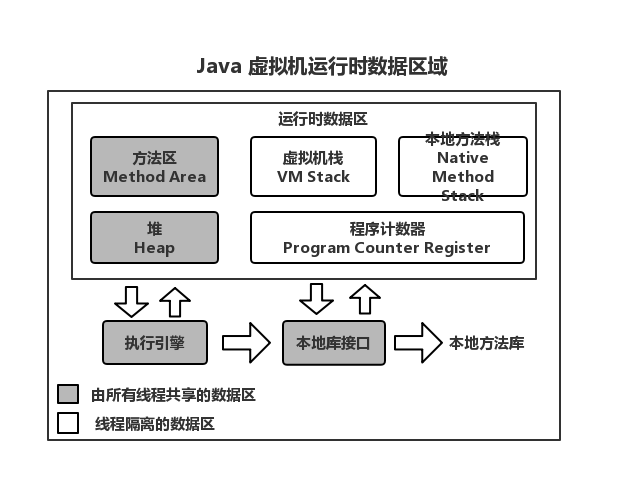
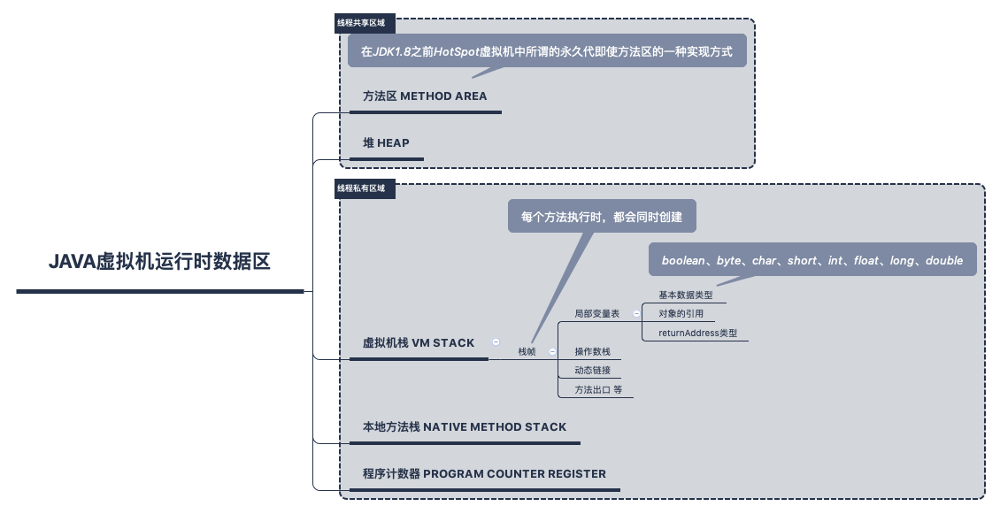
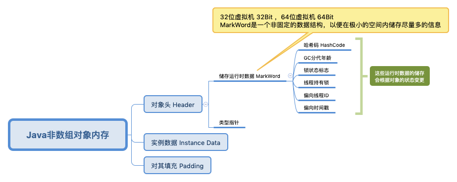
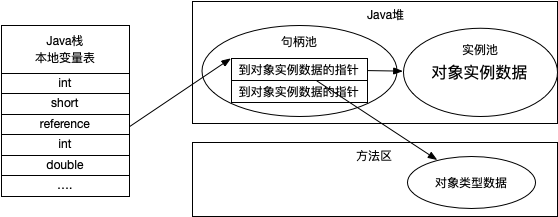
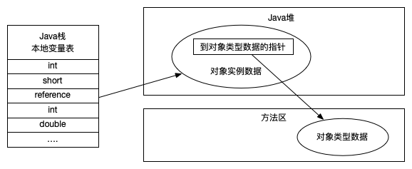

<!-- @import "[TOC]" {cmd="toc" depthFrom=1 depthTo=6 orderedList=false} -->


# 1 Java内存区域与内存溢出异常
&emsp;&emsp; Java 与 C++ 之间有一堵由内存动态分配和垃圾收集技术所围成的“高墙”，墙外面的人想进去，墙里面的人却想出来。
## 1.1 概述
&emsp;&emsp;对于从事C、C++程序开发的开发人员来说，在内存管理领域，他们既是拥有最高权力的“皇帝”又是从事最基础工作的“劳动人民”——既拥有每一个对象的“所有权”，又担负着每一个对象生命开始到终结的维护责任。
&emsp;&emsp;对于Java程序员来说，在虚拟机自动内存管理机制的已经可能产生的问题，这是翻越虚拟机内存管理这堵墙的第一步。
## 1.2 运行时数据区域
&emsp;&emsp; Java 虚拟机在执行 Java 程序的过程中会把它管理的内存划分为若干个不同的数据区域。这些区域都有各自的用途，以及创建和销毁的时间，有的区域随着虚拟机进程的启动而存在，有些区域则依赖用户线程的启动和结束而建立和销毁。根据 《Java虚拟机规范》的规定，Java虚拟机所管理的内存将会包括以下几个运行时数据区域，如图1-1所示。

### 1.2.1 程序计数器 Program Counter Register
&emsp;&emsp;程序计数器（Program Counter Register）是一块比较小的内存空间，它可以看做是当前线程所执行的字节码的行号指示器。在虚拟机的概念里（仅是概念模型，各种虚拟机可能通过一些高效的方式去实现），**字节码解释器的工作就是通过改变这个计数器的值来选取下一条需要执行的字节码，分支、循环、跳转、异常处理、线程恢复等基础功能都需要依赖这个计数器来完成**。
&emsp;&emsp;由于Java虚拟机的多线程是通过线程轮流切换并分配处理器执行时间的方式来实现，在任何一个确定的时刻，一个处理器（对于多核处理器来说是一个内核）都会执行一条线程中的指令。因此，为了线程切换后能够恢复到正确的执行位置，每条线程都需要一个独立的程序计数器，各条线程之间计数器互不影响，独立储存，我们称这类内存区域为“线程私有”的内存。
&emsp;&emsp;如果线程正在执行一个Java方法，这个计数器记录的是正在执行的虚拟机字节码指令的地址；如果正在执行的是Native方法，这个计数器为空（Undefined）。此内存区域是唯一一个在Java虚拟机规范中没有规定任何OutOfMemoryError情况的区域。
### 1.2.2 Java虚拟机栈 Java Virtual Machine Stacks
&emsp;&emsp;**Java虚拟机栈(Java Virtual Machine Stacks)与程序计数器一样也是线程私有的，它的生命周期与线程相同**。虚拟机栈描述的是Java方法执行的内存模型：每个方法在执行的同时都会创建一个栈帧(Stack Frame[^1])，用于存储 **局部变量表、操作数栈、动态链接、方法出口**等信息。**每一个方法从调用直至执行完成的过程，就对应着栈帧在虚拟机栈从入栈到出栈的过程。**
&emsp;&emsp;经常有人把Java的内存区分为堆内存(Heap)和栈内存(Stack)，这种区分比较粗糙，Java内存区域的划分实际上远比这复杂。这种划分方式的流程只能说明这两块区域是大部分程序员最关注的、与对象内存分配关系最密切的。
&emsp;&emsp;**局部变量**存放了编译期可知的各种**基础数据类型**(boolean、byte、char、short、int、float、long、double)、**对象的引用**（reference类型，它不等同于对象本身，可能是一个指向对象起始位置的引用指针、也可能是指向一个对象的句柄或其他与此对象相关的位置）和 **returnAddress 类型**（指向一条字节码指令的地址）。
&emsp;&emsp;其中64位长度的 long 和 double 会占用2个局部变量空间(Slot)，其余数据类型只占用1个。局部变量表所需要的内存空间在编译期间完成分配，当进入一个方法时，这个方法需要在帧中分配多大的局部变量空间是完全确认的，在方法运行期间不会改变局部变量表的大小。
&emsp;&emsp;在Java虚拟机规范中，对这个区域规定了两种异常状态：
1. 如果线程线程请求的栈的深度大于虚拟机所允许的深度，将抛出StackOverflowError异常;
1. 如果虚拟机栈可以动态扩展(当前大部分的Java虚拟机都可动态扩展，只不过Java虚拟机规范中也允许固定长度的虚拟机栈)，如果扩展时无法申请到足够的内存，就会抛出OutofMemoryError异常

### 1.2.3 本地方法栈 Native Method Stack
&emsp;&emsp;本地方法栈(Native Method Stack)与虚拟机栈所发挥的作用是非常相似的，它们之间的区别不过是虚拟机栈执行Java方法(也就是字节码)服务，而本地方法栈则为虚拟机使用到的Native方法服务。在虚拟机规范中对本地方法栈中方法使用的语言、使用方式与数据结构并没有强制规定，因此具体的虚拟机可以自由实现它。甚至有的虚拟机(譬如Sun HotSpot虚拟机)直接就把本地方法栈和虚拟机合二为一。与虚拟机一样，本地方法栈区域也会抛出 StackOverflowError 和 OutOfMemoryError 异常。

### 1.2.4 Java堆 Java Heap
&emsp;&emsp;对于大多数应用来说，Java堆(Java Heap)是Java虚拟机所管理的内存最大的一块。Java堆是被所有线程共享的一块区域，在虚拟机启动时创建。此内存区域唯一目的就是存放对象实例，几乎所有的对象实例都在这里分配内存。这一点在Java虚拟机规范中的描述是：**所有的对象实例以及数组都要在堆上分配[^2],但随着JIT编译器的发展与逃逸分析技术逐渐成熟，栈上分配、标量替换[^3]优化技术将会导致一些微妙的变化发生，所有的对象都分配在堆上也渐渐变得不是那么“绝对”了**.
&emsp;&emsp;Java堆是垃圾收集器管理的主要区域，因此很多时候也被称为“GC堆”( Garbage Collected Heap , 幸好国内没有翻译成“垃圾堆”)。从内存回收的角度来看，由于现在收集器基本都采用分带收集算法，所以Java堆中还可以细分为：新生代和老年代；再细致一点的有 Eden 空间、From Survivor 空间、 To Survivor 空间等。从内存分配的角度来看，线程共享的Java堆中可能划分出多个线程私有的分配缓冲区( Thread Local Allocation Buffer, TLAB)。不过无论如何划分，都与存放内容无关，无论哪个区域，储存的都仍然是对象实例，进一步划分的目的是为了更好地回收内存，或者更快地分配内存。
&emsp;&emsp;根据Java虚拟机规范的规定，Java堆可以处于物理上不连续的内存空间中，只要逻辑上是连续的即可，就像我们的磁盘空间一样。在实现时，既可以实现固定大小的，也可以是可扩展的，不过当前主流的虚拟机都是按照可扩展来实现的(通过-Xmx和-Xms控制)。如果在堆中没有内存完成实例分配，并且堆也无法再扩展时，将会抛出 OutOfMemoryError 异常。

### 1.2.5 方法区 Method Area
&emsp;&emsp;**方法区( Method Area )与Java堆一样，是各个线程共享的内存区域，它用于存储已被虚拟机加载的类信息、常量、静态变量、即使编译器编译后的代码等数据**。虽然Java虚拟机规范把方法区描述为堆的一个逻辑部分，但是它却有一个别名叫做 No-Heap (非堆)，目的应该是与Java堆区分开来。
&emsp;&emsp;对于习惯在HostSpot虚拟机上开发、部署程序的开发者来说，很多人都更愿意把方法区称为“永久代”(Permanent Generation),本质上两者并不等价，仅仅是因为HotSpot虚拟机设计团队选择把GC分代收集扩展至方法区，或者说使用永久代来实现方法区而已，这样HotSpot的垃圾收集器可以像管理Java堆一样管理这部分内存，能够省去专门为方法区编写内存管理代码的工作。对于其他虚拟机(如 BEA JRockit、 IBM J9 等)来说是不存在永久代的概念的 （HotSpot 在JDK 1.8 中也去掉了永久代的概念）。原则上，如何实现方法区属于虚拟机实现细节，不收虚拟机规范约束，但使用永久代来实现方法区，现在看来并不是一个好主意，因为这样更容易遇到内存溢出问题(永久代有 -XX： MaxPerSize 的上限,J9和JRockit只要没有触碰到进程可用内存的上限，例如32位系统中的4GB，就不会出现问题),而且极少数方法(例如:String.intern()))会因为这个原因导致不同虚拟机下有不同的表现。**因此对于HotSpot虚拟机，在JDK升级到1.8版本时，已经由MetaSpace代替，相关知识需要补充**，且把原本放在永久代的字符串常量移出。
&emsp;&emsp;Java虚拟机规范对方法区的限制非常宽松，除了和Java堆一样不需要连续的内存和可以选择固定大小或者可扩展外，还可以选择实现不同的垃圾收集。相对而言，垃圾收集行为在这个区域是比较少出现的，但并非数据进入了方法区就如永久代的名字一样“永久”存在了。这区域的内存回收目标主要是针对常量池的回收和对类类型的卸载，一般来说，这个区域的回收“成绩”比较难以令人满意，尤其是类型的卸载，条件相当苛刻，但是这部分区域的回收确实是必要的。在Sun公司的BUG列表中，曾出现过的若干个严重的BUG就是由于低版本的HotSpot虚拟机对此区域位完全回收而导致内存泄漏。
&emsp;&emsp;**根据Java虚拟机规范的规定，当方法区无法满足内存分配需求时，将抛出 OutOfMemoryError 异常。**

#### 1.2.5.1 运行时常量池 Runtime Constant Pool
&emsp;&emsp;**运行时常量池 ( Runtime Constant Pool )是方法区的一部分。 Class 文件中除了有类的版本、字段、方法、接口等描述信息外，还有一项信息是常量池( Constant Pool Table ),用于存放编译期生成的各种字面量和符号引用，这部分将在类加载后进入方法区的运行时常量池中存放**。
&emsp;&emsp;Java虚拟机对Class文件每一部分(自然也包括常量池)的格式都有严格规定，每一个字节用于存放哪种数据都必须符合规范上的要求才会被虚拟机认可、装载和执行，但对于运行时常量池，Java虚拟机规范没有做任何细节的要求，不同的提供商实现的虚拟机可以按照自己的需求来实现这个内存区域。不过，一般来说，除了保存Class文件中描述的符号引用外，还会把翻译出来的直接引用也存储在运行时常量池中。
&emsp;&emsp;运行时常量池相对于Class文件常量池的另外一个重要特征是具备动态性，Java语言并不要求常量一定只有编译期才能产生，也就是冰粉预置入CLass文件中的常量池的内容才能进入方法区运行时常量池，运行期间也可以将新的常量放入池中，这种特性被开发人员利用得比较多的便是String类的initern()方法。
&emsp;&emsp;既然运行时常量池也是方法区的一部分，自然受到方法区内存的限制，当常量池无法再申请到内存时会抛出OutOfMemoryError异常。

### 1.2.6 直接内存 Direct Memory
&emsp;&emsp;直接内存( Direct Memory) 并不是虚拟机运行时数据区的一部分，也不是Java虚拟机规范中定义的内存区域。但这部分内存也被频繁地使用，而且也可能导致OutOfMemoryError异常出现，所以我们放在这里一起讲解。
&emsp;&emsp;在JDK1.4中新加入了NIO(New Input/Output)类，引入了一种通道(Channel)和缓冲区(Buffer)的I/O方式，它可以使用Native函数库直接分配对外内存，然后通过一个储存在Java堆中的 DirectByteBuffer 对象作为这块内存的引用进行操作。这样能在一些场景中显著提高性能，因此避免了在Java堆和Native堆中来回复制数据。
&emsp;&emsp;显然，本机直接内存的分配不会受到Java堆大小的限制，但是，既然是内存，肯定还是会受到本机总内存(包括RAM以及SWAP区或者分页文件)大小以及处理器寻址空间的限制。服务器管理员在配置虚拟机参数时，会根据实际内存设置-Xmx等参数信息，但经常忽略直接内存，使得各个内存区域总和大于物理内存的限制(包括物理的和操作系统等级的限制)，从而导致动态扩展时出现 OutOfMemoryError 异常。



## 1.3 HotSpot虚拟机对象探秘
&emsp;&emsp;介绍完Java虚拟机运行时数据区之后，我们大概知道了虚拟机内存的概况，咱们常用的是HotSpot虚拟机，那么就以HotSpot和常用的内存区域Java堆为例，深入探讨HotSpot虚拟机在Java堆中对象分配、布局和访问的全过程。
### 1.3.1 对象的创建
&emsp;&emsp;Java是一门面向对象的变成语言，在Java程序运行过程中无时无刻都有对象被创建出来。在语言层面上，创建对象(例如：克隆，反序列化)通常仅仅是一个new关键字而已，而在虚拟机中，对象(文中讨论的对象限于普通的Java对象，不包括数组和Class对象等)的创建又是怎样一个过程呢？
&emsp;&emsp;虚拟机在遇到一个new的指令时，首先将去检查这个指令的参数是否能在常量池中定位到一个类的符号的引用，并且检查这个符号引用代表的类是否已被加载、解析和初始化过。如果没有，那么必须先执行相关的类加载过程。
&emsp;&emsp;在类加载检查通过后，接下来虚拟机将为新生对象分配内存。**对象所需的内存的大小在类加载完成后便可完全确认，为对象分配空间的任务等同于把一块确定大小的内存，从Java堆中划分出来**。这里介绍两个分配方式：
1. 假设Java堆中的内存时绝对规整的，所有用过的内存都存放在一边，空闲内存在另一边，中间放一个指针作为分界点的指示器，那所分配内存就仅仅是把那个指针向空闲空间那边挪动一段与对象大小相等的距离，这种分配方式叫做"指针碰撞"(Bump The Pointer)。
1. 如果Java堆中的内存并不是规整的，已使用的内存和空闲的内存相互交错，那么久没有办法简单的进行指针碰撞了，虚拟机久必须维护一个列表，记录上哪些内存块是可用的，在分配的时候从列表中找到一块足够大的空间划分给对象实例，并更新列表上的记录，这种分配方式称为”空闲列表“(Free List)
> 选择哪种分配方式由Java堆是否规整决定，而Java堆是否规整又由所采用的垃圾收集器是否带有压缩整理功能决定。因此，在使用Serial、ParNew等带Compact过程的收集器时，系统采用的分配算法是指针碰撞，而使用CMS这种基于Mark-Sweep算法的收集器时，通常采用空闲列表。
&emsp;&emsp;除了如何划分可用空间外，另外一个还需要考虑的问题就是对象创建在虚拟机中是非常频繁的行为，即使仅仅是修改一个指针位置，在并发情况下也并不是线程安全的，可能出现正在给对象A分配内存，指针还没来得及修改，对象B又同时使用了原来的指针来分配内存的情况。解决这个问题有两种方案：
1. 一种是对分配内存空间的动作进行同步处理——实际上虚拟机采用**CAS**配上失败重试的方式保证更新操作的原子性；
2. 另一种是把内存分配的动作按照线程划分在不同的空间之中进行，即每个线程在Java堆中预先分配一小块内存，称为**本地线程分配缓冲（Thread Local Allocation Buffer,TLAB）**。哪个线程要分配内存，就在哪个线程的TLAB上分配，只有TLAB用完并分配新的TLAB时，才需要同步锁定。虚拟机是否使用TLAB，可以通过-XX：+/-UseTLAB参数来设定。

&emsp;&emsp;内存分配完成后，虚拟机需要将分配到的内存空间都初始化为零值（不包括对象头），如果使用TLAB，这一工作过程也可以提前至TLAB分配时进行。这一步操作保证了对象的实例字段在Java代码中可以不赋初始值就直接使用，程序能访问到这些字段的数据类型所对应的零值。
&emsp;&emsp;接下来，虚拟机要对对象进行必要的设置，例如这个**对象是哪个类的实例、如何才能找到类的元数据信息、对象的哈希码、对象的GC分代年龄等信息。这些信息存放在对象的对象头（Object Header）之中**。根据虚拟机当前的运行状态的不同，如是否启用偏向锁等，对象头会有不同的设置方式。关于对象头的具体内容，稍后再做详细介绍。
&emsp;&emsp;在上面工作都完成之后，从虚拟机的视角来看，一个新的对象已经产生了，但从Java程序的视角来看，对象创建才刚刚开始——＜init＞方法还没有执行，所有的字段都还为零。所以，一般来说(由字节码中是否跟随invokespecial指令所决定)，执行new指令之后会接着执行＜init＞方法，把对象按照程序员的意愿进行初始化，这样一个真正可用的对象才算完全产生出来。

### 1.3.2 对象的内存布局
&emsp;&emsp;在HotSpot虚拟机中，对象在内存中存储的布局可以分为3块区域：对象头(Header)、实例数据(Instance Data)和对象填充(Padding)。
#### 1 对象头
##### 1.1 Mark Word
&emsp;&emsp;HotSpot虚拟机的对象头包括两部分信息，第一部分**用于储存对象自身运行时数据，如哈希码(HashCode)、GC分代年龄、锁状态标志、线程持有的锁、偏向线程ID、偏向时间戳**等，这部分数据长度在32位和64位的虚拟机(未开启压缩指针)分为别32bit和64bit，官方称它为"**Mark Word**"。对象需要存储的运行时数据很多，其实已经超过了32位、64位BitMap结构所能记录的限度，但对象头信息与对象自身定义的数据无关的额外储存成本，考虑到虚拟机的空间效率，Mark Word 被设计成一个非固定的数据结构以便在极小的空间内存储尽量多的信息，它会根据对象的状态复用自己的储存空间。例如，在32位的HotSpot虚拟机中，如果对象处于未被锁定的状态下，那么Mark Word的32bit空间中的25bit用于存储对象哈希码，4bit用于存储对象分代年龄，2bit用于存储锁标志位，1bit固定为0，而在其他状态（轻量级锁定、重量级锁定、GC标记、可偏向）下对象的存储内容见表1-1所示。
<style id="32位_17313_Styles">
<!--table
	{mso-displayed-decimal-separator:"\.";
	mso-displayed-thousand-separator:"\,";}
@page
	{margin:.75in .7in .75in .7in;
	mso-header-margin:.3in;
	mso-footer-margin:.3in;}
.font5
	{color:windowtext;
	font-size:9.0pt;
	font-weight:400;
	font-style:normal;
	text-decoration:none;
	font-family:等线;
	mso-generic-font-family:auto;
	mso-font-charset:134;}
tr
	{mso-height-source:auto;
	mso-ruby-visibility:none;}
col
	{mso-width-source:auto;
	mso-ruby-visibility:none;}
br
	{mso-data-placement:same-cell;}
.style0
	{mso-number-format:General;
	text-align:general;
	vertical-align:middle;
	white-space:nowrap;
	mso-rotate:0;
	mso-background-source:auto;
	mso-pattern:auto;
	color:black;
	font-size:12.0pt;
	font-weight:400;
	font-style:normal;
	text-decoration:none;
	font-family:等线;
	mso-generic-font-family:auto;
	mso-font-charset:134;
	border:none;
	mso-protection:locked visible;
	mso-style-name:常规;
	mso-style-id:0;}
td
	{mso-style-parent:style0;
	padding-top:1px;
	padding-right:1px;
	padding-left:1px;
	mso-ignore:padding;
	color:black;
	font-size:12.0pt;
	font-weight:400;
	font-style:normal;
	text-decoration:none;
	font-family:等线;
	mso-generic-font-family:auto;
	mso-font-charset:134;
	mso-number-format:General;
	text-align:general;
	vertical-align:middle;
	border:none;
	mso-background-source:auto;
	mso-pattern:auto;
	mso-protection:locked visible;
	white-space:nowrap;
	mso-rotate:0;}
.xl65
	{mso-style-parent:style0;
	font-size:14.0pt;
	mso-number-format:"\@";
	text-align:center;
	border:.5pt solid windowtext;
	background:#00B0F0;
	mso-pattern:black none;}
.xl66
	{mso-style-parent:style0;
	font-size:14.0pt;
	mso-number-format:"\@";
	text-align:center;
	border:.5pt solid windowtext;
	background:#00B050;
	mso-pattern:black none;}
.xl67
	{mso-style-parent:style0;
	font-size:14.0pt;
	mso-number-format:"\@";
	text-align:center;
	border:.5pt solid windowtext;}
.xl68
	{mso-style-parent:style0;
	font-size:18.0pt;
	font-weight:700;
	mso-number-format:"\@";
	text-align:center;}
ruby
	{ruby-align:left;}
rt
	{color:windowtext;
	font-size:9.0pt;
	font-weight:400;
	font-style:normal;
	text-decoration:none;
	font-family:等线;
	mso-generic-font-family:auto;
	mso-font-charset:134;
	mso-char-type:none;
	display:none;}
-->
</style>
</head>

<body link="#0563C1" vlink="#954F72">
<!--[if !excel]>　　<![endif]-->
<!--下列信息由 Microsoft Excel 的发布为网页向导生成。-->
<!--如果同一条目从 Excel 中重新发布，则所有位于 DIV 标记之间的信息均将被替换。-->
<!----------------------------->
<!--“从 EXCEL 发布网页”向导开始-->
<!----------------------------->

<div id="32位_17313" align=center x:publishsource="Excel">

<table border=0 cellpadding=0 cellspacing=0 width=685 style='border-collapse:
 collapse;table-layout:fixed;width:514pt'>
 <col width=145 style='mso-width-source:userset;mso-width-alt:4650;width:109pt'>
 <col width=93 span=2 style='mso-width-source:userset;mso-width-alt:2986;
 width:70pt'>
 <col width=119 span=2 style='mso-width-source:userset;mso-width-alt:3797;
 width:89pt'>
 <col width=116 style='mso-width-source:userset;mso-width-alt:3712;width:87pt'>
 <tr height=31 style='height:23.0pt'>
  <td colspan=6 height=31 class=xl68 width=685 style='height:23.0pt;width:514pt'>32位HotSpot虚拟机对象头
  MarkWord</td>
 </tr>
 <tr height=24 style='height:18.0pt'>
  <td rowspan=2 height=48 class=xl65 style='height:36.0pt'>锁状态</td>
  <td colspan=2 class=xl65 style='border-left:none'>25bit</td>
  <td rowspan=2 class=xl65>4bit</td>
  <td class=xl65 style='border-left:none'>1bit</td>
  <td class=xl65 style='border-left:none'>2bit</td>
 </tr>
 <tr height=24 style='height:18.0pt'>
  <td height=24 class=xl65 style='height:18.0pt;border-top:none;border-left:
  none'>23bit</td>
  <td class=xl65 style='border-top:none;border-left:none'>2bit</td>
  <td class=xl66 style='border-top:none;border-left:none'>是否可偏向</td>
  <td class=xl66 style='border-top:none;border-left:none'>锁标志位</td>
 </tr>
 <tr height=24 style='height:18.0pt'>
  <td height=24 class=xl67 style='height:18.0pt;border-top:none'>未锁定</td>
  <td colspan=2 class=xl67 style='border-left:none'>对象HashCode</td>
  <td class=xl67 style='border-top:none;border-left:none'>分代年龄</td>
  <td class=xl67 style='border-top:none;border-left:none'>0</td>
  <td class=xl67 style='border-top:none;border-left:none'>01</td>
 </tr>
 <tr height=24 style='height:18.0pt'>
  <td height=24 class=xl67 style='height:18.0pt;border-top:none'>轻量级锁定</td>
  <td colspan=4 class=xl67 style='border-left:none'>指向栈中锁记录的指针</td>
  <td class=xl67 style='border-top:none;border-left:none'>00</td>
 </tr>
 <tr height=24 style='height:18.0pt'>
  <td height=24 class=xl67 style='height:18.0pt;border-top:none'>重量级锁定</td>
  <td colspan=4 class=xl67 style='border-left:none'>指向互斥锁(重量级锁)记录的指针</td>
  <td class=xl67 style='border-top:none;border-left:none'>10</td>
 </tr>
 <tr height=24 style='height:18.0pt'>
  <td height=24 class=xl67 style='height:18.0pt;border-top:none'>GC标标记</td>
  <td colspan=4 class=xl67 style='border-left:none'>空</td>
  <td class=xl67 style='border-top:none;border-left:none'>11</td>
 </tr>
 <tr height=24 style='height:18.0pt'>
  <td height=24 class=xl67 style='height:18.0pt;border-top:none'>偏向锁</td>
  <td class=xl67 style='border-top:none;border-left:none'>线程ID</td>
  <td class=xl67 style='border-top:none;border-left:none'>Epoch</td>
  <td class=xl67 style='border-top:none;border-left:none'>分代年龄</td>
  <td class=xl67 style='border-top:none;border-left:none'>1</td>
  <td class=xl67 style='border-top:none;border-left:none'>01</td>
 </tr>
 <![if supportMisalignedColumns]>
 <tr height=0 style='display:none'>
  <td width=145 style='width:109pt'></td>
  <td width=93 style='width:70pt'></td>
  <td width=93 style='width:70pt'></td>
  <td width=119 style='width:89pt'></td>
  <td width=119 style='width:89pt'></td>
  <td width=116 style='width:87pt'></td>
 </tr>
 <![endif]>
</table>

</div>
<!----------------------------->
<!--“从 EXCEL 发布网页”向导结束-->
<!----------------------------->
</body>
<center>表1-1</center>

##### 1.2 类型指针
&emsp;&emsp;**对象头的另一部分是类型指针，即对象指向它的类元素的指针，虚拟机通过该指针来确定这个对象是哪个类的实例**。并不是所有虚拟机实现都必须在对象数据上保留类型指针，换句话说，查找对象的元数据信息并不一定经过对象本身。另外，如果对象时个Java数组，那在对象头中还必须有一块用于记录数组长度的数据，因为虚拟机可以通过普通Java的元数据信息确定Java对象的大小，但是从数组的元数据中却无法确定数组的大小。

#### 2 实例数据
&emsp;&emsp;实例数据部分才是对象真正存储的有效信息，也是程序代码中所定义各种类型的字段内容。无论是从父类继承下来的，还是子类中定义的，都需要记录起来。这部分的储存顺序会受到虚拟机分配策略参数(FieldsAllocationStyle)和字段在Java源代码中定义顺序的影响。HotSpot虚拟机默认的分配策略为 long/double、flot、int、short/char、byte/boolean、oops(Ordinary Object Points)，从分配策略中可以看出，相同宽度的字段总是分配到一起。在满足这个前提条件的情况下，在父类中定义的变量会出现在之类之前。如果 CompactFields 参数值为 true (默认为 true)，那么子类之中较窄的变量可能会插入到父类变量的空隙当中。

#### 3 对齐填充
&emsp;&emsp;第三部分对齐填充并不是必然存在的，也没有特别的含义，它仅仅起着占位符的作用。由于HotSpot VM的自动内存管理系统要求对象起始地址必须是8字节的整数倍，换句话说，就是对象的大小必须是8字节的整数倍。而对象头部分正好是8字节的倍数（1倍或者2倍），因此，当对象实例数据部分没有对齐时，就需要通过对齐填充来补全。



### 1.3.3 对象的访问定位
&emsp;&emsp;建立对象时为了访问对象，我们的Java程序需要通过栈上的 reference 数据来操作堆中的具体对象。由于 reference 类型在Java虚拟机规范中只规定了一个指向对象的引用，并没有定义具这个引用应该通过何种方式去定位、访问堆中的对象的具体位置，所以对象的访问方式也是取决于虚拟机实现而定的。**目前的主流方式有句柄和直接指针两种**。
&emsp;&emsp;如果是句柄方式访问的话，那么Java堆中会划分出一块内存作为句柄池，reference 中储存的就是对象的句柄地址，而句柄中包含了对象实例数据与类型数据各自的具体地址信息，如图 1-4 所示。

<center>图 1-4 通过句柄访问对象</center>

&emsp;&emsp;如果使用直接指针访问，那么Java堆对对象的布局就必须考虑如何放置访问类型数据的相关信息，而 reference 类型中存储的直接就是对象地址，如图 1-5 所示。

<center>图 1-5 直接指针访问对象</center>

&emsp;&emsp;这两种对象访问方式各有优势，使用句柄来访问的最大的好处就是 reference 中储存的是稳定的句柄地址，在对被移动(垃圾收集时移动对象时非常普遍的行为)时只会改变句柄中的实例数据指针，而 reference 本身不需要修改。
&emsp;&emsp;使用直接指针访问的最大好处就是速度更快，它节省了一次指针定位的时间开销，由于对象在访问Java中非常频繁，因此这类开销积少成多后也是一种非常可观的执行成本。而咱们常用的 HotSpot 采用的是第二种方式(直接指针访问)，但从整个软件开发的范围来看，各种语言和框架使用句柄来访问的情况也十分常见。

## 1.4 实战 OutOfMemoryError 异常
&emsp;&emsp;在Java虚拟机规范的描述中，除了程序计数器外，虚拟机内存的其他几个运行时数据区域都有可能发成 OutOfMemoryError (简称OOM)异常的可能。我们将通过若干实现来验证异常发生的场景，并初步介绍几个与内存相关的最基本的虚拟机参数。

### 1.4.1 Java堆溢出
&emsp;&emsp;Java堆用于储存对象实例，只要不断的创建对象，并且保证 GC Roots 到对象之间有可达路径来避免垃圾回收机制清楚这些对象，那么在对象数量达到最大堆容量限制后就会产生内存溢出异常。代码清单 1-1 中代码限制了Java堆的大小为20MB，不可扩展(将堆的最小值-Xms参数与-Xmx参数设置为一样即可避免自动扩展)，通过参数 -XX:HeapDumpOnOutOfMemoryError 可以让虚拟机出现内存溢出时 Dump 出当前的内存堆转储快照以便事后进行分析。
> 代码清单 1-1 
 ```java
import java.util.ArrayList;
import java.util.List;

/**
 * @ClassName HeapOOM
 * @Description 测试 堆内存溢出
 * @Author tonylee
 * @Date 2019-09-11 17:45
 * @Version 1.0
 *
 *
 * VM Args：-Xms20m-Xmx20m -XX:+HeapDumpOnOutOfMemoryError
 *
 *
 **/
public class HeapOOM {

    static class OOMObject{}

    public static void main(String[] args) {

        List<OOMObject> list = new ArrayList<>();
        while(true){
            list.add(new OOMObject());
        }

    }

}
 ```
&emsp;&emsp;Java堆内存的OOM异常是实际应用中常见的内存溢出异常情况。当出现Java堆出现内存溢出时，异常堆栈信息"java.lang.OutOfMemoryError" 会更进一步提示 "Java heap space"。
&emsp;&emsp;要解决这个区域的异常，一般的手段是先通过内存内存映像分析工具(如：Eclipse Memory Analyzer)对Dump出来的堆转储快照进行分析，重点是确认内存中的对象是否是必要的，也就是要先分清楚到底是内存泄漏(Memory Leak)还是内存溢出(Memory Overflow)。

### 1.4.2 虚拟机栈和本地方法栈溢出
&emsp;&emsp;由于HotSpot虚拟机中并不区分虚拟机栈和本地方法栈，因此，对于HotSpot来说，虽然 -Xoss 参数(设置本地方法栈大小)存在，但实际上无效的，栈容量只有 -Xss参数设定。关于虚拟机栈和本地方法栈，在Java虚拟机规范中描述了两种异常：
1. 如果线程请求的栈的深度大于虚拟机栈允许的最大深处，将抛出 StackOverflowError 异常。
1. 如果虚拟机在扩展时无法申请到足够的内存空间，则抛出 OutOfMemoryError 异常。
> 这里把异常分成两种情况，看似更加严谨，但却存在着一些重叠的地方：当栈空间无法分配时，到底是内存太小，还是已使用的栈空间太大，其本质上只是对同一件事情的两种描述而已。

&emsp;&emsp;在以下实验中，将实验范围限制在单线程中的操作，尝试了下面两种方法均无法让虚拟机产生 OutOfMemoryError 异常，尝试的结果都是获得 StackOverflowError 异常，测试代码如代码清单 1-2 所示
* 使用 -Xss 参数减少栈容量。结果：抛出 StackOverflowError 异常，异常出现时输出的堆栈深度相应缩小。
* 定义了大量的本地变量，增大此方法帧中的本地变量表的长度。结果：抛出 StackOverflowError 异常时输出的栈深度相应缩小。
> 代码清单 1-2 仅作为第1点测试程序
 ```java
 /**
 * @ClassName JavaVMStackOF
 * @Description 测试虚拟机栈溢出
 * @Author tonylee
 * @Date 2019-09-11 22:29
 * @Version 1.0
 *
 * VM Args: -Xss160K (JDK 1.8 后 设置了最小栈空间大小 为160)
 *
 **/
public class JavaVMStackOF {

    private int stackLength = 1;

    public void stackLeak(){
        stackLength++ ;
        stackLeak();
    }

    public static void main(String[] args) {

        JavaVMStackOF javaVMStackOF = new JavaVMStackOF();

        try {
            javaVMStackOF.stackLeak();
        }catch (Throwable e){
            System.out.println("stack length: " + javaVMStackOF.stackLength);
            throw e;
        }

    }

}
 ```
**输出结果：**
___
stack length: 772
Exception in thread "main" java.lang.StackOverflowError
	at info.tonylee.jvm.sof.JavaVMStackOF.stackLeak(JavaVMStackOF.java:18)
	at info.tonylee.jvm.sof.JavaVMStackOF.stackLeak(JavaVMStackOF.java:19)
	at info.tonylee.jvm.sof.JavaVMStackOF.stackLeak(JavaVMStackOF.java:19)
	...省略后续堆栈信息
___

&emsp;&emsp;实验结果表明：在单个线程下，无论是由于栈帧太大还是虚拟机栈容量小，当内存无法分配的时候，虚拟机抛出的都是 StackOverflow 异常。
&emsp;&emsp;如果测试时不限于但线程，通过不断创建线程的方式到时可以产生内存溢出异常，如代码清单1-3所示。但是这样产生的内存溢出异常与栈空间是否足够大并不存在任何联系，或者准确地说，为每个线程的栈分配的内存越大，反而越容易产生内存溢出异常。
&emsp;&emsp;其原因不难理解，操作系统分配给每个进程的内存时有限的，譬如32位的Windows限制为2G。虚拟机提供了参数来控制Java堆和方法区的这两部分内存的最大值。剩余的内存为2G(操作系统限制)减去 Xmx (最大堆容量)，再减去 MaxPermSize (最大方法区容量)[^4]，程序计数器的消耗的内存很小，可以忽略不计，剩下的内存就是由虚拟机栈和本地方法栈“瓜分”了。每个线程分配到的栈容量越大，可以建立的线程数量自然就越小，建立线程时，就越容易把剩下的内存耗尽。
&emsp;&emsp;这一点在开发多线程的应用时特别注意，出现 StackOverflow 异常时有错误堆可以阅读，相对来说，比较容易找到问题所在。而且，如果使用虚拟机默认参数，栈深度在大多数情况下(因为每个方法压入栈的帧大小不一样，所以只能说大多数情况下)达到1000~2000完全没有问题，对于正常的方法调用(包括递归)，这个深度应该完全够用了。但是，如果是建立过多线程的内存溢出，在不能减少线程数或者不能更换为64位虚拟机的情况下，就只能通过减少最大堆和减少栈容量来换取更多的线程。如果没有这方面的处理经验，这种通过“减少内存"的手段来解决内存溢出的方式会比较难以想到。
> 代码清单 1-3 
 ```java
 /**
 * @ClassName JavaVMStackOOM
 * @Description 测试 虚拟机栈 申请内存 出现内存溢出的情况
 * @Author tonylee
 * @Date 2019-09-11 22:53
 * @Version 1.0
 *
 * 注意，请不要在windows/mac 上测试，在 linux 还未实验。。
 *
 * VM Args : -Xss2M （不妨设置大点）
 *
 **/
public class JavaVMStackOOM {

    private void dontStop(){
        while(true){}
    }

    public void stackLeakByThread(){
        long i = 0;
        while(true){
            new Thread(new Runnable() {
                @Override
                public void run() {
                    dontStop();
                }
            }).start();
            System.out.println("当前创建线程数： " + (++i));
        }
    }

    public static void main(String[] args) {
        JavaVMStackOOM javaVMStackOOM = new JavaVMStackOOM();
        javaVMStackOOM.stackLeakByThread();
    }
}
 ```
运行结果：
___
Exception in thread"main"java.lang.OutOfMemoryError：unable to create new native thread
___

### 1.4.3 方法区和运行时常量池溢出
&emsp;&emsp;由于运行时常量池也是方法区的一部分，因此这两个区域的溢出测试就放在一起。前面提到 JDK 1.7 开始逐步”去永久代“，在 JDK 1.8 中已经去掉了，在此就以测试代码观察一下这件事情对程序的影响。
&emsp;&emsp; String.intern() 是一个 native 方法，它的作用是：如果字符串常量池中已经包含一个等于此 String 对象的字符串，则返回代码池中这个字符串的 String 对象；否则，将此 String 对象包含的字符串添加到常量池中，并且返回此 String 对象的引用。在 JDK 1.6 及之前的版本中，由于常量池分配在永久代内，我们可以通过 -XX:PermSize 和 -XX:MaxPerSize 限制方法区的大小，从而间接限制其中常量池的容量，如代码清单 1-4 所示：
>代码清单 1-4
 ```java
 import java.util.ArrayList;
import java.util.List;

/**
 * @ClassName RuntimeConstantPoolOOM
 * @Description TODO
 * @Author tonylee
 * @Date 2019-09-11 23:21
 * @Version 1.0
 *
 * VM Args : -XX:PermSize=10M -XX:MaxPermSize=10M
 *
 **/
public class RuntimeConstantPoolOOM {

    public static void main(String[] args) {
        List<String> list = new ArrayList<>();
        int i = 0;
        while(true){
            list.add(String.valueOf(i++).intern());
        }
    }

}
 ```
> 运行结果：
Exception in thread"main"java.lang.OutOfMemoryError：PermGen space
at java.lang.String.intern（Native Method）
at org.fenixsoft.oom.RuntimeConstantPoolOOM.main（RuntimeConstantPoolOOM.java：18）

&emsp;&emsp;从运行结果中可以看出，运行时常量池溢出，在OutOfMemoryError后面跟随的提示信息 "PermGen space"，说明运行时常量池属于方法区(HotSpot虚拟机中的永久代)的一部分。
&emsp;&emsp;而使用JDK1.7运行这段代码程序就不会得到相同的结果，while循环会一直进行下去。关于这个字符串常量池的实现问题，还可以引申出一个更有意思的影响，如代码清代1-5所示。
> 代码清单1-5
 ```java
 public class RuntimeConstantPoolOOM {

    public static void main(String[] args){
        String str1 = new StringBuilder("计算机").append("软件").toString();
        System.out.println(str1.intern() == str1);
        String str2 = new StringBuilder("ja").append("va").toString();
        System.out.println(str2.intern() == str2);
    }
 }
 ```
这段代码在JDK1.6中运行，会得到两个false，而在JDK1.7中运行，会得到一个true和一个false。产生的差异的原因：
* 在JDK1.6中，intern()方法会把首次遇到的字符串复制到永久代中，返回的也是永久代中这个字符串实例的引用，而由StringBuilder创建的字符串实例实在Java堆中的，所以必然不是同一个引用，将返回false
* 而在JDK1.7中及以上(以及部分其他虚拟机，例如JRockit)的intern()实现不会在复制实例，只是在常量池中记录首次出现的实例引用，因此intern()返回的引用和由StringBuilder创建的那个字符串实例是同一个。对比str2比较返回false是因为”java“这个字符串在执行 StringBuilder.toString() 之前已经出现过了，字符串常量池中已经有它的引用了不符合”首次出现“的原则，而”计算机软件“这个字符串是首次出现，因此返回的true。

&emsp;&emsp;方法区用于存放Class的相关信息，如类名、访问修饰符、常量池、字段描述、方法描述等。对于这些区域的测试，基本的思路是运行时产生大量的类区填满方法区，直到溢出。虽然直接使用 Java SE API 也可以动态产生类）(如反射时的 GeneratedConstructorAccessor 和动态代理等)，但在本次实验中操作比较麻烦。在代码清单1-6中，我们使用CGLib[^5]直接操作字节码运行时产生大量的动态类。
&emsp;&emsp;特别值得注意的是，我们在这个例子中模拟的场景并非纯粹是一个实验，这样的应用经常会出现在实际引用当中：当前很多主流的框架，如Spring、Hibernate，在对类增强时，都会使用到CGLib这类字节码技术，增强的类越多，就需要越大的方法区用来保证生成的Class可以加载入内存。另外，JVM上的动态语言(如Groovy等)通常都会持续创建类实现语言的动态性，随着这类语言的流行，也越来越容易遇到与代码清单1-6相似的溢出场景。
>代码清单 1-6 借助CGLib使方法区内存溢出异常
 ```java

 ```
> 运行结果
Caused by：java.lang.OutOfMemoryError：PermGen space
at java.lang.ClassLoader.defineClass1（Native Method）
at java.lang.ClassLoader.defineClassCond（ClassLoader.java：632）
at java.lang.ClassLoader.defineClass（ClassLoader.java：616）
……8 more

&emsp;&emsp;方法区溢出也是一种常见的内存溢出异常，一个类要被垃圾收集器回收掉，判定条件是比较苛刻的。在经常动态生成大量Class的应用中，需要特别注意类的回收状况。这类场景除了上面提到的程序使用了CGLib字节码增强和动态语言之外，常见的还有：大量JSP或动态产生JSP文件的应用（JSP第一次运行时需要编译为Java类）、基于OSGi的应用（即使是同一个类文件，被不同的加载器加载也会视为不同的类）等。

### 1.4.4 本地直接内存溢出
&emsp;&emsp;DirectMemory容量可通过-XX：MaxDirectMemorySize指定，如果不指定，则默认与Java堆最大值（-Xmx指定）一样，代码清单2-9越过了DirectByteBuffer类，直接通过反射获取Unsafe实例进行内存分配（Unsafe类的getUnsafe（）方法限制了只有引导类加载器才会返回实例，也就是设计者希望只有rt.jar中的类才能使用Unsafe的功能）。因为，虽然使用DirectByteBuffer分配内存也会抛出内存溢出异常，但它抛出异常时并没有真正向操作系统申请分配内存，而是通过计算得知内存无法分配，于是手动抛出异常，真正申请分配内存的方法是unsafe.allocateMemory（）。
 ```java

import sun.misc.Unsafe;

import java.lang.reflect.Field;

/**
 * @ClassName DirectMemoryOOM
 * @Description 使用 unsafe 分配内存
 * @Author tonylee
 * @Date 2019-09-12 00:58
 * @Version 1.0
 *
 * VM args : -Xmx20M -XX:MaxDirectMemorySize=10M
 **/
public class DirectMemoryOOM {

    private static final int _1MB = 1024*1024;

    public static void main(String[] args) throws Exception {
        Field unsafeField = Unsafe.class.getDeclaredFields()[0];
        unsafeField.setAccessible(true);
        Unsafe unsafe = (Unsafe)unsafeField.get(null);
        while(true){
            unsafe.allocateMemory(_1MB);
        }
    }
}
 ```
>运行结果
Exception in thread"main"java.lang.OutOfMemoryError
at sun.misc.Unsafe.allocateMemory（Native Method）
at org.fenixsoft.oom.DMOOM.main（DMOOM.java：20）

由DirectMemory导致的内存溢出，一个明显的特征是在Heap Dump文件中不会看见明显的异常，如果读者发现OOM之后Dump文件很小，而程序中又直接或间接使用了NIO，那就可以考虑检查一下是不是这方面的原因。


[^1]:栈帧是方法运行时的基础数据结构
[^2]:Java虚拟机规范中的原文：The heap is the runtime data area from which memory for all class instances and arrays is allocated.
[^3]:逃逸分析与标量替换的相关内容，请详细查阅相关资料
[^4]:在JDK 1.8 中 MaxPerSize 已失效 更换为 MaxMetaSize ？？带验证
[^5]:CGLib开源项目：http://cglib.sourceforge.net/