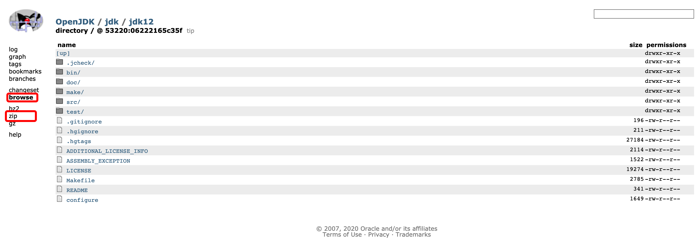

# 编译OpenJDK
## 获取OpenJDK 源码
### 1. 获取OpenJDK源码
&emsp;&emsp;获取OpenJDK的源码，直接访问OpenJDK版本的仓库页面 https://hg.openjdk.java.net/jdk/jdk12/ ,然后点击左边菜单中的"Browse",将显示如图的源码跟目录页面，此时在点击 "zip" 链接即可下载当前版本打包好的源码。

&emsp;&emsp;在编译前，都应该认证阅读一遍源码中的doc/building.html文档，编译过程中需要注意的细节较多，如果是第一次编译OpenJDK，哪有可能会在一些小问题上耗费许多时间。本次编译采用的是64位操作系统，默认参数下编译出来的也是64位的OpenJDK，如果需要编译32位版本，同样可以在64位操作系统上进行，理由是编译过程可以使用更大的内存（32位系统受4G内存限制），通过编译参数(--with-target-bits=32)来指定需要生成32位编译记过即可。在官方文档上要求编译OpenJDK至少需要2～4GB的内存空间（CPU核心数越多，需要的内存越大），而且至少要6～8GB的空闲磁盘空间，不要看OpenJDK源码的大小只有不到600MB，要完成编译，过程中会产生大量的中间文件，并且编译出不同优化级别（Product、FastDebug、SlowDebug）的HotSpot虚拟机可能要重复生成这些中间文件，这都会占用大量磁盘空间。
&emsp;&emsp;对系统环境的最后一点建议是，所有的文件，包括源码和依赖项目，都不要放在包含中文的目录里面，这样做不是一定会产生不可解决的问题，只是没有必要给自己找麻烦。
&emsp;&emsp;
### 2. 